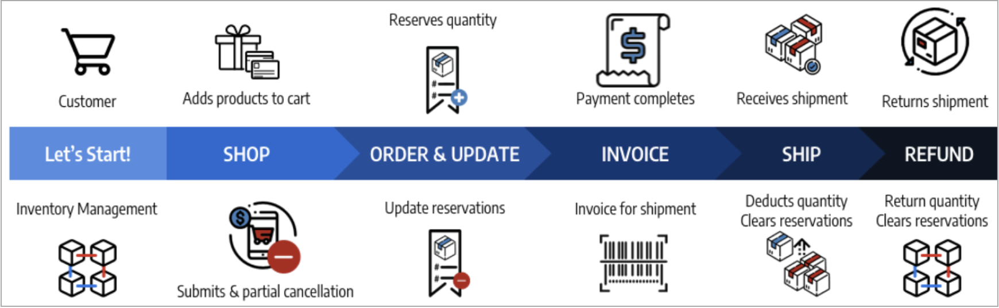
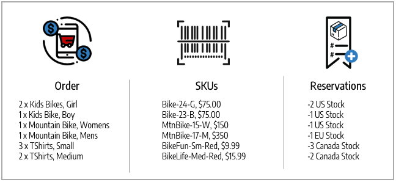

# 注文ステータスと予約

[!DNL Inventory Management] 注文ごとの部分請求、全額請求、支払い、出荷、キャンセルをサポートします。 処理、請求、出荷および払い戻しを通じてオーダーを管理する場合、 [!DNL Commerce] 在庫（または販売チャネル）の販売可能数量およびソースごとの手持在庫数量を更新するために、予約を自動的に入力または変更します。 積極的に予約にアクセスしたり、予約を入力したりする必要はありません。 注文を履行、キャンセル、または払い戻すためのアクションを完了すると、注文は自動的に実行されます。

これらの予約では、常に販売可能数量が調整され、数量の増減に対してプラスまたはマイナスの金額が使用されます。 その結果、手持在庫と販売可能数量が更新され、最新の製品可用性が得られます。

注文と配送について詳しくは、以下を参照してください。 [受注と出荷の管理](shipments.md).

## 注文管理オプション

在庫ステータスおよび顧客の要求に応じて、部分支払および一部取消、複数ソースからの部分出荷またはバックオーダーの部分出荷、または返品された製品の払い戻しのためのクレジット・メモを使用して受注を更新できます。

### 出荷

注文を請求した後、注文全体を履行するまで、一部または全部の出荷を送信します。 各出荷は、ソースごとの製品数量から金額を差し引いて予約を変換します。 予約報酬を入力して、在庫の販売可能数量を更新します。 部分出荷を送付すると、各出荷は製品数量と予約からその金額を控除します。 未出荷の製品予約は、同時に出荷されるまで有効です。これにより、販売可能金額が最新の状態になり、製品在庫を管理し、複数のソース出荷およびバックオーダーをサポートできます。

### キャンセル済み注文

顧客が出荷前（一部または全部）に受注を取り消した場合は、在庫金額を販売可能数量に戻すために、新規予約が入力されます。 予約は実質的に互いにキャンセルし、ソースから数量を控除しません。 他の顧客は、関連する在庫および販売チャネルを通じて、これらの製品数量を積極的に購入できます。

### 返金された注文

顧客が払戻を要求する場合は、一部または全品金額のクレジット・メモを発行します。 返品された製品を受け取ったら、クレジット・メモを入力して資金を提供し、製品金額を更新します。 「在庫に戻る」オプションを選択する場合、 [!DNL Commerce] 受注および予約報酬が出荷された製品およびソースに数量を戻して追加し、関連する在庫の販売可能数量を更新します。

## 注文タイプ

シンプルな注文は、買い物かごから始まり、支払いを続け、満足のいく配信で終わります。 次の順序で実行します。 [!DNL Inventory Management] 買い物かごやチェックアウトの空き時間（または販売可能な数量）に対する予約を簡単に処理し、出荷時に手持在庫から控除します。

{width="600" zoomable="yes"}

より複雑な受注では、一部取消、一部出荷および払戻が発生する場合があります。 このような状況では、予約は有効在庫に影響を与え、取消および払戻の数量を追加し、受注および出荷時に数量を減少させます。

{width="600" zoomable="yes"}

在庫引当および在庫変更は、注文ステータスに基づいて発生します。

## ステータスと予約

次の表は、予約変更が入力された受注およびクレジット・メモの詳細ステータスを示しています。 [!DNL Commerce] をクリックして在庫を管理します。

| 注文ステータス | 説明 | 販売可能数量の予約 |
|--|--|--|
| [!UICONTROL Open] | 新規および最近送信されたもの、処理なし | 予約は、在庫の注文が送信されると保存されます。 |
| [!UICONTROL Canceled] | 支払い前に一部または全部でキャンセル | 予約報酬が入力され、一部または全数量が在庫販売可能数量に戻されます。 |
| [!UICONTROL On Hold] | 支払および送料が処理または請求されていない | 予約は有効です。 |
| [!UICONTROL Suspected Fraud] | 不正のため処理されていません | 承認またはレビュー中の場合、予約は維持されます。 拒否された場合、マーチャントが承認またはキャンセルを決定するまで予約は維持されます。 キャンセルされた場合、予約報酬が入力され、全数量が在庫販売可能数量に戻されます。 |
| [!UICONTROL Pending] | 支払い待ち | 予約は適切に行われます。 |
| [!UICONTROL Processing] | 支払い処理、未受領 | 予約は適切に行われます。 |
| [!UICONTROL Pending Payment] | 支払が受領されていません | 予約は適切に行われます。 |
| [!UICONTROL Payment Review] | 処理および完了の確認中の支払い | 予約は適切に行われます。 |
| [!UICONTROL Complete] | 全額支払済みおよび全額出荷 | 選択したソースの製品数量から、一部または全額請求時に予約金額が差し引かれます。 予約報酬が入力され、合計販売可能数量が更新されます。 |
| [!UICONTROL Closed] | 返金またはアーカイブ済み | アーカイブする場合、数量に変更はありません。 一部払い戻しまたは全額払い戻しの場合、予約報酬が入力され、ソースごとの製品数量と在庫ごとの販売可能数量を加算するように変換されます。 |

| クレジット メモの状態 | 説明 | 販売可能数量の予約 |
|--|--|--|
| [!UICONTROL Open] | 払い戻しの期日ですが、完了していません | 予約に変更はありません。 |
| [!UICONTROL Refunded] | 完了、資金は戻されました | 一部払い戻しまたは全額払い戻しの場合、予約報酬が入力され、ソースごとの製品数量と在庫ごとの販売可能数量を加算するように変換されます。 |

## 複雑な順序の例

ブレイク・サンダースは、家族の休暇と楽しみのために自転車と衣類を注文します。 彼らは、米国、カナダ、ヨーロッパにまたがる在庫とソースを備えた Biking Adventures ストアで大きな売上を上げています。

彼らは小さな子供のために 2 台の素晴らしいパークバイク、ティーンエイジャーのために BMX バイク、自分のために素敵なマウンテンバイク、そして彼らの配偶者のために現代のドイツのクロスカントリーバイクを購入します。 その店はかわいいシャツのセールを行ったので、家族で一緒に買いました。 以下の休暇購入のリスト、一致する SKU、在庫販売可能な数量に対して入力された予約を参照してください。

{width="600" zoomable="yes"}

彼らは彼らが見つけたものを家族に見せますが、いくつかの変更を加えます。 支払いが完了する前に、彼らは 33-BikeFun SKU のうち 2 つをキャンセルします（子供たちは彼らを好きではありませんでした）。 支払が保留中であるため、これは部分的なキャンセルであるため、クレジット・メモは不要です。 を更新するには、 [!DNL Commerce] カナダの売り上げ可能な数量の在庫に加算します。 注文が支払われ、すべての製品が出荷され、休暇に間に合うように到着します。 [!DNL Commerce] 出荷済製品の出荷倉庫の販売可能数量およびソース数量を更新します。

しかしシャツは彼らの配偶者に合っていませんでした。 ブレークは返金を要求し、彼のシャツを送り返します。 クレジットメモの作成により、カナダの在庫および配送倉庫に 54-BikeLife シャツが 1 枚追加されます。

- **出荷済み製品**  – 購入および出荷済みの製品の場合、 [!DNL Commerce] 在庫を更新します。 予約報酬は、出荷済ソースから手持在庫数量控除に変換されます。 在庫の販売可能数量の更新。

- **キャンセルされた製品** - ストックをキャンセルすると、 [!DNL Commerce] その商品の予約を削除します。 予約報酬は在庫レベルに入力され、2 つのシャツの部分的なキャンセルに対して売り戻し可能な数量を追加します。 これは、ソース・レベルの在庫数量には影響しません。

- **クレジットメモ/払い戻し済み商品**  – 在庫を返すことによって、それは数量に戻されなければなりません。 クレジットメモを発行するときは、在庫に戻るように選択できます。 [!DNL Commerce] 製品の出荷済ソースに在庫数量を加算します。 予約報酬を入力して、残りの予約を消去します。 販売可能数量は、更新済数量に対して再計算されます。

{width="600" zoomable="yes"}
