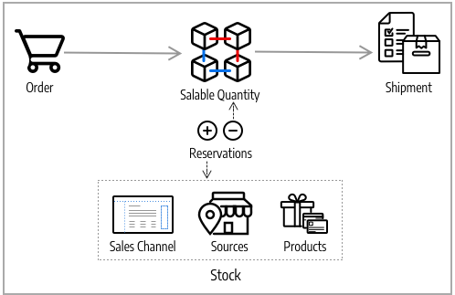
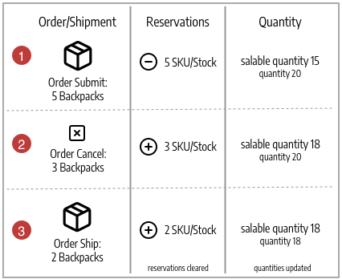

# Sourceのアルゴリズムと予約

[!DNL Inventory Management]の中心は、利用可能なすべての製品を仮想的に追跡し、倉庫や店舗で手元に置いています。 Source Selection AlgorithmとReservations システムはバックグラウンドで実行されるため、販売可能な数量は更新され、チェックアウトでは競合が発生せず、出荷オプションも推奨されます。

>[!NOTE]
>
>プログラムによる[ システムの操作について詳しくは、](https://developer.adobe.com/commerce/php/development/framework/inventory-management/)開発者ドキュメント [!DNL Inventory Management]を参照してください。

## Source Selection Algorithm

SourceのSSA （Selection Algorithm）は、在庫で構成されたソースの優先順位をもとに、ソースと配送に対する最適なマッチングを分析し、判断します。 注文出荷時に、アルゴリズムは、選択したアルゴリズムに従って、ソース、利用可能な数量、および減算する金額の推奨リストを提供します。 [!DNL Inventory Management]は優先度アルゴリズムを提供し、新しいオプションの拡張機能をサポートしています。

複数の調達先、グローバル顧客、様々な配送オプションや手数料を備えた配送業者などでは、利用可能な実際の在庫を把握し、最適な配送オプションを見つけることが難しい場合があります。 SSAは、あらゆる情報源をまたいで販売可能な在庫量を追跡し、出荷時に計算やレコメンデーションを行うまでの作業を支援します。

**在庫を追跡** – 在庫とソースを使用して、SSAは着信製品リクエストの販売チャネルを確認し、使用可能な在庫を決定します。

- 在庫ごとに割り当てられたすべてのソースの集計仮想販売可能数量を計算します。集計数量 – ソースごとの在庫切れしきい値
- 売り上げ可能な数量から在庫切れしきい値を減算して、売り上げ超過から保護します
- 注文処理および出荷時に在庫在庫から差し引いて、注文提出に対して在庫量を確保します
- 負のしきい値のオプションが強化されたバックオーダーをサポート

**出荷管理** - アルゴリズムは、注文を処理して出荷するときに役立ちます。 アルゴリズムを実行して、製品を出荷するための最適なソースに関する推奨事項を取得したり、選択内容を上書きしたりして、次のことをおこなうことができます。

- 部分的な出荷を行い、特定の場所から少数の商品のみを送信し、後でフルオーダーを完了します
- 1つのソースから注文全体を出荷する
- 複数のソースをまたいで異なる量の出荷を分割し、すべての倉庫や店舗でバランスの取れた在庫を維持します

SSAは、費用対効果の高い配送を推奨する、サードパーティのサポートやカスタムアルゴリズム向けに拡張可能です。

>[!NOTE]
>
>SSAの機能は、バーチャル製品とダウンロード可能な製品で異なりますが、送料はかかりません。 このような場合、請求書の作成時にアルゴリズムが暗黙的に実行され、常に提案された結果が使用されます。 これらの結果は、バーチャル製品とダウンロード可能な製品では調整できません。

### Source Priority Algorithm

カスタム在庫には、ストアフロントを通じて利用可能な製品在庫を販売および出荷するために、割り当てられたソースのリストが含まれます。 Source優先アルゴリズムは、在庫に割り当てられたソースの順序を使用して、注文の請求時および発送時に、ソースごとに商品控除を推奨します。

実行すると、アルゴリズムは次のようになります。

- 最上位から始まる在庫レベルで、設定されたソースの順序を使用します
- リスト内の注文、使用可能な数量および注文数量に基づいて、製品ごとに出荷および調達する数量を提案します
- 注文の出荷が完了するまでリストを続行します
- リスト内に無効なソースが見つかった場合はスキップする

カスタム在庫を設定するには、ソースを割り当てて注文します。 [Stockのソースの優先順位付けを参照](stocks-prioritize-sources.md)。

次の例では、マッピングされたソースの順序、使用可能な数量、および差し引いて出荷する推奨ソースと数量について詳しく説明します。 トップのソースは、英国のドロップシッパーで、240の利用可能な量があります。

{width="600" zoomable="yes"}

### 距離優先アルゴリズム

距離優先アルゴリズムは、配送先住所の場所と発送元の場所を比較して、出荷を処理する最も近い発送元を決定します。 距離は、読み込まれたデータベースの場所またはGoogleの方向（運転、ウォーキング、または自転車）を使用して、ある場所から別の場所へ移動するのに費やした物理的な距離または時間によって決まります。

距離と時間を計算して、出荷フルフィルメントに最も近いソースを見つけるには、次の2つのオプションがあります。

- **Google MAP** - [Google Maps Platform](https://cloud.google.com/maps-platform/) サービスを使用して、配送先住所と発信元の場所（住所とGPS座標）の間の距離と時間を計算します。 このオプションは、ソースの緯度と経度を使用します。 [ ジオコーディング API](https://developers.google.com/maps/documentation/geocoding/start)と[Distance Matrix API](https://developers.google.com/maps/documentation/distance-matrix/start)を有効にしたGoogle API キーが必要です。 このオプションにはGoogleの請求計画が必要であり、Googleを通じて請求が発生する場合があります。

- **オフライン計算** - ダウンロードおよびインポートされたジオコードデータを使用して、配送先住所に最も近いソースを判断する距離を計算します。 このオプションは、配送先住所とソースの国コードを使用します。 このオプションを設定するには、最初にコマンドラインを使用してジオコードをダウンロードして読み込むために、開発者支援が必要になる場合があります。

設定するには、「設定」を選択し、Google API キーや配送データのダウンロードなどの追加の手順を実行します。 [距離優先アルゴリズムの設定](distance-priority-algorithm.md)を参照してください。

### カスタムアルゴリズム

[!DNL Commerce]は、ソースの優先順位付けに代替アルゴリズムを追加するカスタム開発と拡張機能をサポートしています。 例えば、地域にもとづく優先アルゴリズムと、在庫のコストや顧客属性にもとづく優先アルゴリズムを設定できます。 在庫コストが変化した場合、アルゴリズムを容易に変更して、最小コストを実現できます。

## 予約

製品の在庫量を即座に差し引いたり、追加したりする代わりに、注文が発送またはキャンセルされるまで在庫量を保持します。 予約はバックエンドですべて機能し、在庫レベルで販売可能な数量を自動的に更新します。

>[!NOTE]
>
>[!BADGE PaaSのみ]{type=Informative url="https://experienceleague.adobe.com/en/docs/commerce/user-guides/product-solutions" tooltip="Adobe Commerce on Cloud プロジェクト（Adobeで管理されるPaaS インフラストラクチャ）とオンプレミス プロジェクトにのみ適用されます。"}予約機能を使用するには、`inventory.reservations.updateSalabilityStatus` メッセージキューコンシューマーを継続的に実行する必要があります。 実行中かどうかを確認するには、`bin/magento queue:consumers:list` コマンドを使用します。 メッセージキューコンシューマーがリストされていない場合は、次の手順で開始します：`bin/magento queue:consumers:start inventory.reservations.updateSalabilityStatus`。

### 注文の予約

予約注文を送信する際に、販売可能な数量から差し引かれた在庫数量に対して保留されます。 予約は在庫レベルで、注文が請求され、発送され、キャンセルされるまで数量に対して数えます。 注文を出荷する際には、SSAの推奨事項を使用するか、ソースごとに数量の控除を手動で入力できます。 出荷されると、予約は自動的にクリアされ、数量は差し引かれます。 販売可能数量は、更新された数量とシステムに残っている予約金額で在庫に対して再計算されます。

次の図は、注文中および出荷までの予約プロセスを定義するのに役立ちます。

{width="600" zoomable="yes"}

顧客が注文を送信します。 [!DNL Commerce]は、現在の在庫販売可能数量を確認します。 在庫レベルで十分な在庫がある場合、予約により商品SKU （その在庫）の一時的な保留が開始され、販売可能な数量が再計算されます。

注文の請求後、商品の金額を決定して、ソースから差し引いて出荷します。 配送は処理され、選択した1つ以上のソースから顧客に送信されます。 数量は、ソース在庫数量と引当明細から自動的に差し引かれます。 詳細と例については、[注文状況と予約について](order-status.md)を参照してください。

## 予約計算

次のイベントが発生すると、システムは各製品の予約を作成します。

- 顧客や加盟店が注文する。
- 顧客や加盟店が、注文の全部または一部をキャンセルします。
- 加盟店は、物理的な商品の出荷を作成します。
- バーチャルまたはダウンロード可能な商品の請求書が作成されます。
- 加盟店はクレジットメモを発行します。

予約は、イベントのログと同様に、追加専用の操作です。 最初の引当には、マイナスの数量値が割り当てられます。 注文の処理中に作成されたすべての後続の予約は正の値です。 注文が完了すると、商品のすべての予約の合計は0になります。

新しい注文に応じて予約を発行する前に、システムは注文を処理するのに十分な販売可能な品目があるかどうかを判断します。 計算に含まれる次の量：

- **StockItem数量**。 StockItem数量は、現在の販売チャネルのすべての物理的なソースからの在庫の集計金額です。 例えば、Baltimoreのソースが20個の商品を持ち、Austinのソースが25個の同じ商品を持ち、Renoのソースが10個の商品を持っているとします。 これらのソースがすべてStock Aにリンクされている場合、この製品のStockItem カウントは55 （20 + 25 + 10）になります。 （商品が発送されると、在庫インデクサーは、各ソースで利用可能な数量を更新します。）

- **未処理の予約**。 システムは、補償されていない最初の予約をすべて集計します。 この数字は常に負です。 顧客Aが10件の予約を行い、顧客Bが5件の予約を行った場合、製品合計–15の予約が未完了となります。

したがって、顧客が40 （55 + -15）ユニット未満の注文を行う限り、加盟店は受注に対応できます。

注文の処理（完了、キャンセル済み、クローズ）を完了すると、その注文の範囲のすべての予約は`0`に解決されます。 これにより、すべての販売可能な数量が保持されます。

>[!NOTE]
>
>バックオーダー（在庫切れしきい値を含む）と数量しきい値以下の通知の設定も販売可能な数量の計算に影響しますが、このトピックの範囲外です。 これらの設定について詳しくは、[設定 [!DNL Inventory Management]](./configuration.md)を参照してください。

## 予約オブジェクト

予約には、次の情報が含まれます。

| パラメーター | データタイプ | 説明 |
| --- | --- | --- |
| `reservation_id` | 整数 | システム生成ID |
| `stock_id` | 整数 | 製品が割り当てられている在庫のID |
| `sku` | 文字列 | 製品のSKU |
| `quantity` | 浮動小数 | この予約の項目数 |
| `metadata` | 文字列 | この予約のイベントタイプ、オブジェクトタイプ、オブジェクト ID。 例：`{"event_type":"order_placed","object_type":"order",\| "object_id":"8"}` |

{style="table-layout:auto"}

メタデータ `event_type`には、次の値を指定できます。

- `order_placed`
- `order_canceled`
- `shipment_created`
- `creditmemo_created`
- `invoice_created`

現在、メタデータオブジェクトタイプは`order`である必要があり、オブジェクト IDは注文IDです。

今後のリリースでは、顧客がショッピングカートに商品を追加した際に、予約を作成することが可能になるかもしれません。 各アイテムは、15分など一定期間予約することができ、顧客は買い物を続けながらアイテムを予約することができます。 このタイプの予約が有効になっている場合、メタデータに追加のタイプの情報が含まれる可能性があります。

## 予約ライフサイクル

次の例は、単純な順序で生成された予約のシーケンスを示しています。

1. お客様は、25個の製品`SKU-1`を発注します。 予約には、次の情報が含まれています。

   ```text
   reservation_id = 1
   stock_id = 1
   sku = SKU-1
   quantity = -25
   event_type = order_placed
   ```

1. 顧客は20品目の請求書を送信し、注文したユニットのうち5つをキャンセルします。

   ```text
   reservation_id = 2
   stock_id = 1
   sku = SKU-1
   quantity = 5
   event_type = order_canceled
   ```

1. 購入した20個のユニットが加盟店から出荷されます。

   ```text
   reservation_id = 3
   stock_id = 1
   sku = `SKU-1`
   quantity = 20
   event_type = shipment_created
   ```

3つの`quantity`値の合計は0 （–25 + 5 + 20）です。 システムは既存の予約を変更しません。

## 処理済み予約の削除

`inventory_cleanup_reservations` cron ジョブは、SQL クエリを実行して予約データベース テーブルをクリアします。 デフォルトでは、毎日午前0時に実行されますが、時間と頻度を設定できます。 cron ジョブは、データベースにクエリを実行して、数量値の合計が0である完全な予約シーケンスを見つけるスクリプトを実行します。 同じ日（またはその他の設定時間）に発生した特定の製品の予約がすべて補償されると、cron ジョブは予約をすべて一度に削除します。

`inventory_reservations_cleanup` cron ジョブは、`inventory.reservations.cleanup` メッセージ キューのコンシューマーと同じではありません。 消費者は、製品が削除された後、製品SKUによって予約を非同期で削除しますが、cron ジョブは予約テーブル全体をクリアします。 ストア設定で「[**カタログと同期**](../configuration-reference/catalog/inventory.md)」ストックオプションを有効にする場合、消費者は必須です。 [設定ガイド ](https://experienceleague.adobe.com/docs/commerce-operations/configuration-guide/message-queues/manage-message-queues.html)の「_メッセージキューの管理_」を参照してください。

多くの場合、1日に発生した最初の予約は、その日に補償されることはありません。 この状況は、顧客がクローンジョブの直前に注文を行ったり、銀行振込などのオフラインの支払い方法で購入を行ったりした場合に発生する可能性があります。 補償された予約シーケンスは、すべて補償されるまでデータベースに残ります。 この方法は、各予約の合計が0であるため、予約計算の妨げにはなりません。

>[!NOTE]
>
>予約の不整合を検出および管理するために使用できるCLI コマンドがあります（[[!DNL Inventory Management] CLI リファレンス ](cli.md)を参照）。

### 予約の更新

注文と商品の金額の変更が完了すると、[!DNL Commerce]は予約報酬を自動的に入力します。 これらの保留を更新またはクリアするために、管理者またはコードを通じて補償を入力する必要はありません。 予約は、数量を保留したり、保留量をクリアしたりするために入力された予約によってのみ影響を受けます（予約の補償）。

その仕組みをご紹介します。

- **送信済み注文** – 複数の製品に対して注文が送信されると、その金額に対して予約が入力されます。 例えば、米国のweb サイトで5つのバックパックを注文すると、そのSKUと在庫に対して`-5`の予約が入ります。 販売可能な数量は5つ減少します。

- **キャンセル済みの注文** – 注文が（全部または一部）キャンセルされた場合、その金額をクリアするために補償予約が入力されます。 たとえば、3つのバックパックをキャンセルすると、そのSKUと在庫の+3の予約が入り、保留が解除されます。 販売可能な数量が3増加します。

- **発送済み注文** – 注文が（全部または一部）発送されると、その金額をクリアするために補償予約が入力されます。 例えば、2つのバックパックを配送すると、そのSKUと在庫の+2の予約が入り、保留が解除されます。 製品数量は出荷のために2によって直接減少します。 計算された販売可能数量も、削減された在庫量に対して更新されますが、予約の影響は受けません。

{width="600" zoomable="yes"}

注文のフルフィルメント完了、商品のキャンセル、クレジットメモの発行などの際には、すべての予約を補償でクリアする必要があります。 補償によって予約が解消されない場合、商品が一定の状態で保管されている可能性があります（販売不可、発送なし）。

>[!NOTE]
>
>予約を確認する場合は、一連のコマンドラインオプションを使用できます。 予約は、コマンドラインインターフェイスを通じてのみ確認できます。 CLI コマンドを使用する場合は、開発者の支援が必要になる場合があります。 [[!DNL Inventory Management] CLI リファレンス ](cli.md)を参照してください。

保留中の注文を含む在庫の商品からすべてのソースを削除すると、予約が停止している可能性があります。

{{$include /help/_includes/unassign-source.md}}


<!-- Last updated from includes: 2022-08-30 15:36:09 -->
