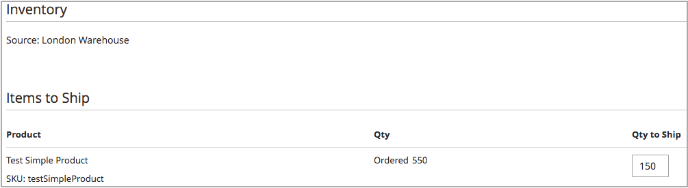

# マルチソース配送の作成

[!DNL Inventory Management]を使用すると、在庫があるときに1つ以上の出荷を送信できます。 必要に応じて追加の出荷を生成するには、推奨または手動で入力した数量とソースを使用して、これらの指示を繰り返します。 この説明では、マルチソースのマーチャントが配送を送信する方法について詳しく説明します。 シングルソースマーチャントは、以下の追加手順を実行せずに出荷を送信します（コアユーザーガイドの[出荷の作成](../stores-purchase/shipments.md#create-a-shipment){target="_blank"}を参照）。

配送を作成する場合は、Source Selection Algorithmを使用して計算されたレコメンデーションを表示します。 以下の推奨事項に従って使用するか、ソースごとの金額を設定して、カスタム出荷を生成します。 注文ごとに出荷される在庫を管理し、差引額を設定し、1つ以上の出荷を送信し、在庫が利用可能になったときに在庫と取り寄せ注文を配送します。 注文の各品目について、ソース数量から差し引く金額を入力します。

以下に部分的な出荷を送信できます。

- 在庫の受注に応じたバックオーダーの処理

- ソース間の在庫控除残高

出荷を入力すると、手持在庫数量によって入力した金額が差し引かれます。 事実上、引当金は実際の数量控除額に変換されます。

## 配送の作成

1. _管理者_ サイドバーで、**[!UICONTROL Sales]** > **[!UICONTROL Orders]**&#x200B;に移動します。

1. 注文を見つけ、表示モードで開きます。

1. 注文が支払われ、請求書が発行され、発送準備が整った場合は、**[!UICONTROL Ship]**&#x200B;をクリックします。

1. ソースごとに商品を送信するためのSourceの選択範囲を設定します。

   - 送料レコメンデーションを表示するには、**[!UICONTROL Source Selection Algorithm]**&#x200B;をクリックしてアルゴリズムを選択します。

     | アルゴリズム | 説明 |
     |--|--|
     | [Source優先度](source-priority-algorithm.md) | 在庫に割り当てられたソースのオーダーに従って、ソースからの出荷を推奨します。 |
     | [距離の優先度](distance-priority-algorithm.md) | 物理的な距離や最短時間の納品にもとづいて、配送先住所に最も近いソースからの出荷をレコメンドします。 |

     >[!IMPORTANT]
     >
     >配送およびルートとデータにDistance Priority アルゴリズムを使用すると、出荷用に選択した[計算モード ](distance-priority-algorithm.md) （運転、自転車、またはウォーキング）に対して返されない場合、SSAはデフォルトでSource Priorityに設定されます。 在庫ごとのソースの[優先度](stocks-prioritize-sources.md)も設定することをお勧めします。

   - **[!UICONTROL Select a Source to Ship from]**&#x200B;の場合、出荷元を選択して出荷を送信します。

   - 各行項目について、推奨金額を保持するか、特定の金額を&#x200B;**[!UICONTROL Qty to Deduct]**&#x200B;に入力してください。 この値は、選択したソースの在庫から差し引かれる金額を指定します。

   - **[!UICONTROL Proceed to Shipment]**&#x200B;をクリックします。

     {width="350" zoomable="yes"}

1. _[!UICONTROL New Shipment]_ページを確認し、必要に応じて追加の変更を入力します。

   _[!UICONTROL Inventory]_セクションには、ソース、製品の出荷、注文合計数量、および出荷する数量が表示されます。

   {width="350" zoomable="yes"}

1. **[!UICONTROL Submit Shipment]**&#x200B;をクリックして完了します。
