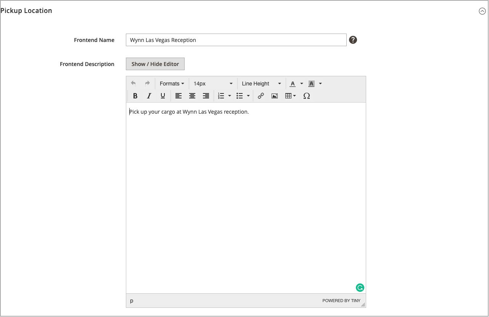

# ソースを追加

カスタムソースを使用して、複数の場所から在庫と注文の達成を管理します。 倉庫、実店舗、流通センター、直送船など、各場所のソースを作成します。 製品ごとのソースの割り当てと更新数量

デフォルトのソースを編集する場合は、名前とコードを除くすべての設定を編集できます。 シングルソースのマーチャントは、場所に合った情報を追加することをお勧めします。

## 在庫ソースを追加

1. 次の日： _管理者_ サイドバー、移動 **[!UICONTROL Stores]** > _[!UICONTROL Inventory]_>**[!UICONTROL Sources]**.

1. クリック **[!UICONTROL Add New Source]**.

   

1. 展開  の **[!UICONTROL General]** 」セクションで次の操作を実行します。

   - 在庫ソースを識別するには、一意の **[!UICONTROL Name]**.

   - 一意の **[!UICONTROL Code]**.

     大文字と小文字、数字、ダッシュ、アンダースコアをサポートしています。 コードは、在庫データに割り当てたり、データの書き出し/読み込みをおこなう際に使用される一意の ID です。

   - この在庫ソースを使用する準備が整っている場合は、 **[!UICONTROL Is Enabled]** から `Yes`.

   - 概要を入力 **[!UICONTROL Description]** を参照してください。

   - の場合 **[!UICONTROL Latitude]** および **[!UICONTROL Longitude]**&#x200B;をクリックし、施設の位置の Global Positioning System (GPS) 座標を入力します。

     GPS 座標を見つけるには [Google Maps][1]」で、検索ボックスにアドレスを入力します。 マップ上のマーカーを右クリックし、「 」を選択します。 **[!UICONTROL What's here?]**. GPS 座標は、番地の下の詳細ボックスに表示されます。

     

   - この在庫ソースがピックアップ場所の場合は、 **[!UICONTROL Use as Pickup Location]** から `Yes`.

     Default Source は、店舗での受取注文の受取場所として使用できません。

1. 展開  の **[!UICONTROL Contact Info]** 」セクションで次の操作を実行します。

   - の場合 **[!UICONTROL Contact Name]**」で、ロケーションにある主要連絡先のフルネームを入力します。

   - を入力します。 **[!UICONTROL Email]** 場所に連絡するための住所。

   - の場合 **[!UICONTROL Phone]**、市外局番と電話番号を入力します。

   - の場合 **[!UICONTROL Fax]**、FAX の市外局番と電話番号を入力します（使用可能な場合）。

     

1. 展開  の **[!UICONTROL Address Data]** 」セクションで次の操作を実行します。

   - を選択します。 **[!UICONTROL Country]**.

   - の場合 **[!UICONTROL State/Province]**、州または都道府県の標準的な省略形を入力します。

   - 次を入力します。 **[!UICONTROL City]**.

   - 物理的な **[!UICONTROL Street]** 住所。

   - の場合 **[!UICONTROL Postcode]**、郵便番号を入力します。

     

1. 前の手順でソースをピックアップの場所として設定した場合は、を展開します。  の **[!UICONTROL Pickup Location]** 「 」セクションに移動し、場所に関する説明を入力します。

   - 次を入力します。 **[!UICONTROL Frontend Name]** の値を指定します。

   - を入力します。 **[!UICONTROL Frontend Description]** の値を指定します。 このテキストボックスを使用して、店舗時間、他の目印に対する位置、または顧客が正しい受け取り位置を選択するのに役立つその他の有用な情報を表示します。

     

   ソースをピックアップの場所として使用する場合の E メール通知の設定方法について詳しくは、 [セールスメール](../configuration-reference/sales/sales-emails.md) （内） _設定リファレンスガイド_.

1. 作業内容を保存するには、次のいずれかの操作を行います。

   - 作業内容を保存して編集を続行するには、 **[!UICONTROL Save & Continue]**.

   - 作業内容を保存してソースを管理ページに戻るには、下向き矢印 () をクリックし、を選択します。 **[!UICONTROL Save & Close]**.

   - 現在のソースレコードの作業内容を保存し、新しいソースを入力するには、 **[!UICONTROL Save & New]**.

## ボタンバー

| ボタン | 説明 |
|--|--|
| [!UICONTROL Back] | ソースの管理ページに戻ります。 |
| [!UICONTROL Reset] | フォーム内のすべてのフィールドを、最後の保存時の値に復元します。 |
| [!UICONTROL Save & Continue] | すべての変更を保存し、フォームを開いたままにして編集を続けます。 下向き矢印をクリックして、その他のオプションを表示します。 **[!UICONTROL Save & Close]**— 現在のレコードに対する変更を保存し、フォームを閉じて、ソースの管理ページに戻ります。 **[!UICONTROL Save & New]**  — 変更を保存し、現在のレコードを閉じて、新しい空白のフォームを開きます。 |

## フィールドの説明

| フィールド | 説明 |
|--|--|
| **[!UICONTROL General]** | |
| [!UICONTROL Name] | （必須）管理者ユーザーの在庫ソースを識別する一意の名前。 |
| [!UICONTROL Code] | （必須）在庫ソースを識別するためにシステムで使用される一意の英数字のコード。 コードは、スペースを含まない、大文字または小文字の文字や数字で入力します。 必要に応じて、スペースの代わりにハイフンやアンダースコアを使用できます。 ソースを作成した後は、コードを編集できません。 これは、ソースを在庫に割り当てたり、製品データを書き出したり、読み込んだりする際に使用される一意の ID です。 |
| [!UICONTROL Is Enabled] | 在庫ソースを使用できるかどうかを指定します。 オプション：はい/いいえ |
| [!UICONTROL Description] | 在庫ソースの場所の簡単な説明。 管理者ユーザーに役立つ詳細を含めます。 |
| [!UICONTROL Latitude] | GPS の在庫ソースの緯度座標を指定します。 必要に応じて、値に数字を入力し、前にプラス記号またはマイナス記号を付けます。 度記号と文字は使用できません。 例： Latitude 32.7555 |
| [!UICONTROL Longitude] | GPS の在庫ソースの経度座標を指定します。 必要に応じて、値に数字を入力し、前にプラス記号またはマイナス記号を付けます。 度記号と文字は使用できません。 例： `-97.3308` |
| **[!UICONTROL Contact Info]** | |
| [!UICONTROL Contact Name] | 在庫ソースの場所にある主要連絡先の名前。 |
| [!UICONTROL Email] | 主要連絡先の E メール。 |
| [!UICONTROL Phone] | 希望する形式を使用して、主要連絡先の市外局番と電話番号。 例： `(123) 456-7890` または `123-456-7890` |
| [!UICONTROL Fax] | 主要連絡先の市外局番と FAX 番号。 |
| **[!UICONTROL Address Data]** | |
| [!UICONTROL Country] | （必須）在庫ソースがある国。 |
| [!UICONTROL State/Province] | 在庫ソースがある都道府県。 |
| [!UICONTROL City] | 在庫ソースが存在する市区町村。 |
| [!UICONTROL Street] | 在庫ソースの住所。 |
| [!UICONTROL Postcode] | （必須）在庫ソースの郵便番号。 |
| **[!UICONTROL Pickup Location]** | |
| [!UICONTROL Frontend Name] | ストアフロントに表示されるソースのピックアップの場所の名前です。 |
| [!UICONTROL Frontend Description] | ストアフロントに表示されるソースのピックアップ場所の説明。 添付画像を含めることができます。 |

[1]: https://www.google.com/maps
