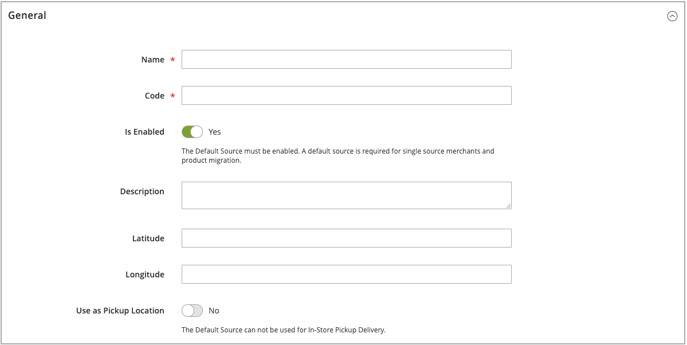
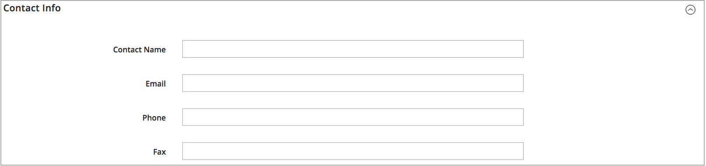
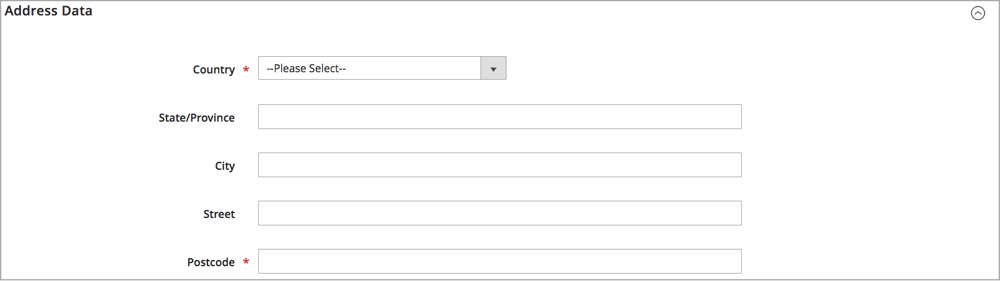
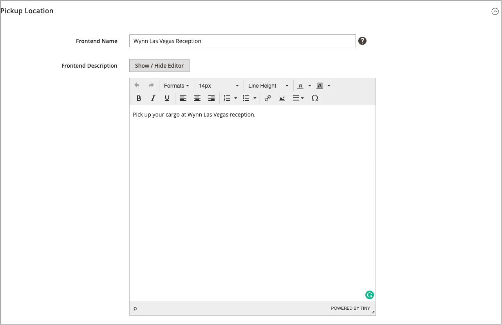

# ソースを追加

カスタムソースを使用して、複数の場所からの在庫と注文のフルフィルメントを管理します。 倉庫、実店舗、流通センター、ドロップシッパーなどの各拠点のソースを作成します。 製品ごとにソースを割り当て、数量を更新します

デフォルトのSourceを編集する場合は、名前とコードを除くすべての設定を編集できます。 シングルソースのマーチャントは、場所に一致する情報を追加することをお勧めします。

## 在庫ソースの追加

1. _管理者_ サイドバーで、**[!UICONTROL Stores]** > _[!UICONTROL Inventory]_>**[!UICONTROL Sources]**に移動します。

1. **[!UICONTROL Add New Source]**&#x200B;をクリックします。

   

1. **[!UICONTROL General]** セクションのを展開し、次の操作を行います。

   - 在庫ソースを特定するには、一意の&#x200B;**[!UICONTROL Name]**&#x200B;を入力します。

   - 一意の&#x200B;**[!UICONTROL Code]**&#x200B;を入力してください。

     このコードでは、大文字と小文字、数字、ダッシュ、アンダースコアがサポートされています。 このコードは、在庫に割り当てたり、データを書き出したり読み込んだりする際に使用される一意のIDです。

   - この在庫ソースを使用する準備ができたら、**[!UICONTROL Is Enabled]**&#x200B;を`Yes`に設定します。

   - クイック参照または追加の詳細を表示するには、この場所の概要&#x200B;**[!UICONTROL Description]**&#x200B;を入力してください。

   - **[!UICONTROL Latitude]**&#x200B;と&#x200B;**[!UICONTROL Longitude]**&#x200B;に対して、施設の場所のグローバル ポジショニング システム （GPS）座標を入力します。

     [Google マップ ](https://www.google.com/maps)のGPS座標を検索するには、検索ボックスにアドレスを入力します。 マップ上のマーカーを右クリックし、**[!UICONTROL What's here?]**&#x200B;を選択します。 GPS座標は、住所の下の詳細ボックスに表示されます。

     

   - この在庫ソースが受け取り場所である場合は、**[!UICONTROL Use as Pickup Location]**&#x200B;を`Yes`に設定します。

     デフォルトのSourceは、実店舗での受け取り注文の受け取り場所として使用することはできません。

1. **[!UICONTROL Contact Info]** セクションのを展開し、次の操作を行います。

   - **[!UICONTROL Contact Name]**&#x200B;の場合、場所にプライマリ連絡先のフルネームを入力します。

   - 場所に連絡するための&#x200B;**[!UICONTROL Email]** アドレスを入力してください。

   - **[!UICONTROL Phone]**&#x200B;に市外局番と電話番号を入力します。

   - **[!UICONTROL Fax]**&#x200B;の場合は、FAXの市外局番と電話番号を入力します（使用可能な場合）。

     

1. **[!UICONTROL Address Data]** セクションのを展開し、次の操作を行います。

   - **[!UICONTROL Country]**&#x200B;を選択します。

   - **[!UICONTROL State/Province]**&#x200B;に、州または都道府県の標準略語を入力します。

   - **[!UICONTROL City]**&#x200B;を入力します。

   - 物理&#x200B;**[!UICONTROL Street]** アドレスを入力してください。

   - **[!UICONTROL Postcode]**&#x200B;に郵便番号または郵便番号を入力します。

     

1. 前の手順でソースを受け取り場所として設定した場合は、、**[!UICONTROL Pickup Location]** セクションを展開し、場所に関する説明情報を提供します。

   - 受け取り場所の&#x200B;**[!UICONTROL Frontend Name]**&#x200B;を入力します。

   - 受け取り場所の&#x200B;**[!UICONTROL Frontend Description]**&#x200B;を入力してください。 このテキストボックスを使用すると、店舗の営業時間、他のランドマークに関連する場所、または顧客が正しい受け取り場所を選択するのに役立つその他の有用な情報を表示できます。

     

   ソースを受け取り場所として使用する場合のメール通知の設定方法について詳しくは、_設定リファレンスガイド_&#x200B;の[Sales Emails](../configuration-reference/sales/sales-emails.md)を参照してください。

1. 作業内容を保存するには、次のいずれかの操作を行います。

   - 作業を保存して編集を続行するには、**[!UICONTROL Save & Continue]**&#x200B;をクリックします。

   - 作業を保存してソースの管理ページに戻るには、下向き矢印（）をクリックし、**[!UICONTROL Save & Close]**&#x200B;を選択します。

   - 現在のソースレコードの作業を保存して新しいソースを入力するには、**[!UICONTROL Save & New]**&#x200B;を選択します。

## ボタンバー

| ボタン | 説明 |
|--|--|
| [!UICONTROL Back] | ソースの管理ページに戻ります。 |
| [!UICONTROL Reset] | フォーム内のすべてのフィールドを、前回の保存時の値に戻します。 |
| [!UICONTROL Save & Continue] | すべての変更を保存し、さらに編集するためにフォームを開いたままにします。 追加オプションの下向き矢印をクリックします。 **[!UICONTROL Save & Close]**– 現在のレコードへの変更を保存し、フォームを閉じて、ソースの管理ページに戻ります。 **[!UICONTROL Save & New]**  – 変更を保存し、現在のレコードを閉じて、新しい空白フォームを開きます。 |

## フィールドの説明

| フィールド | 説明 |
|--|--|
| **[!UICONTROL General]** | |
| [!UICONTROL Name] | （必須）管理者ユーザーのインベントリ ソースを識別する一意の名前。 |
| [!UICONTROL Code] | （必須） システムがインベントリ ソースを識別するために使用する一意の英数字コード。 コードは、スペースなしで大文字または小文字の文字または数字で入力します。 必要に応じて、スペースの代わりにハイフンまたはアンダースコアを使用できます。 ソースの作成後にコードを編集することはできません。 これは、在庫にソースを割り当て、製品データの書き出しや読み込みを行う際に使用される一意のIDです。 |
| [!UICONTROL Is Enabled] | 在庫ソースを使用できるかどうかを指定します。 オプション：はい/いいえ |
| [!UICONTROL Description] | 在庫ソースの場所の簡単な説明。 管理者ユーザーに役立つ詳細を含めます。 |
| [!UICONTROL Latitude] | GPSの在庫源の緯度座標を指定します。 値を数値として入力し、その後に必要に応じてプラス記号またはマイナス記号を入力します。 度記号や文字は使用できません。 例：Latitude 32.7555 |
| [!UICONTROL Longitude] | GPSの在庫源の経度座標を指定します。 値を数値として入力し、その後に必要に応じてプラス記号またはマイナス記号を入力します。 度記号や文字は使用できません。 例：`-97.3308` |
| **[!UICONTROL Contact Info]** | |
| [!UICONTROL Contact Name] | 在庫ソースの場所にあるプライマリ連絡先の名前。 |
| [!UICONTROL Email] | プライマリコンタクトの電子メール。 |
| [!UICONTROL Phone] | お好みの形式を使用して、プライマリコンタクトの市外局番と電話番号を指定します。 例：`(123) 456-7890`または`123-456-7890` |
| [!UICONTROL Fax] | プライマリ連絡先の市外局番とFAX番号。 |
| **[!UICONTROL Address Data]** | |
| [!UICONTROL Country] | （必須）在庫源が配置されている国。 |
| [!UICONTROL State/Province] | 在庫ソースが配置されている州または都道府県。 |
| [!UICONTROL City] | 在庫ソースが配置されている都市。 |
| [!UICONTROL Street] | 在庫ソースの住所。 |
| [!UICONTROL Postcode] | （必須）在庫ソースの郵便番号。 |
| **[!UICONTROL Pickup Location]** | |
| [!UICONTROL Frontend Name] | ストアフロントに表示されるソースのピックアップ場所の名前。 |
| [!UICONTROL Frontend Description] | ストアフロントに表示されるソースの受け取り場所の説明。 添付された画像を含めることができます。 |
