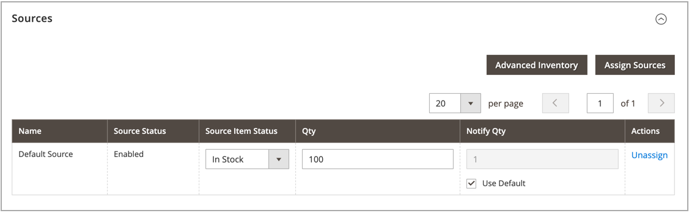

# 製品ごとにソースを割り当てる

数量と設定を変更する前に、製品に[ ソース ](sources-manage.md)を割り当てる必要があります。

{{$include /help/_includes/unassign-source.md}}

## 製品へのソースの割り当て

1. _管理者_ サイドバーで、**[!UICONTROL Catalog]** > **[!UICONTROL Products]**&#x200B;に移動します。

1. _編集_ モードで製品を開きます。

1. **[!UICONTROL Sources]** セクションのを展開します。

   このセクションでは、ソースの変更や在庫量の更新などを行うことができます。

   >[!NOTE]
   >
   >現在、シンプル、設定可能、仮想、ダウンロード可能、およびグループ化された製品のみが複数のソースをサポートしています。 バンドル商品は、デフォルトのSourceとStockでのみ作成および管理できます。

   {width="600" zoomable="yes"}

1. ソースを追加するには、**[!UICONTROL Assign Sources]**&#x200B;をクリックします。

1. _[!UICONTROL Assign Sources]_ページで、製品に割り当てる各ソースの横にあるチェックボックスを選択します。

   {width="600" zoomable="yes"}

1. **[!UICONTROL Done]**&#x200B;をクリックしてソースを追加します。

1. 保存するには、次のいずれかの操作を行います。

   - **[!UICONTROL Save]**&#x200B;をクリックします。
   - _[!UICONTROL Save]_（）メニューで、**[!UICONTROL Save & Close]**を選択します。

ソースを割り当てたら、各製品ソースの[在庫量](quantities-assign-per-product.md)を更新します。

<!-- Last updated from includes: 2022-08-30 15:36:09 -->
