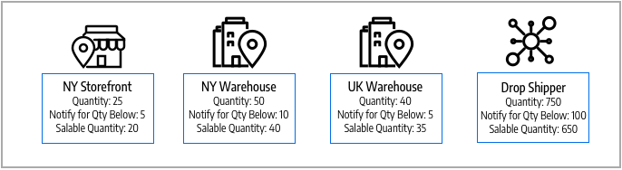

# ソースの管理

ソース：注文フルフィルメントのために商品の在庫を管理、出荷したり、サービスを提供したりできる物理的な場所です。 これらの場所には、倉庫、実店舗、流通センター、受け取り場所、ドロップシッパーなどが含まれます。 これらのソースに在庫量を割り当てて、[!DNL Commerce]は在庫の販売可能な製品合計を自動的に集計します。 大企業の場合は、すべての場所に複数のソースを追加します。国や大陸ごとに異なる地理的な場所、在庫の種類に基づいて都市の場所、サービスにも基づいて。

ソースの作成時に、特定の物理的な地理的位置を指定することをお勧めします。 これにより、_Distance Priority Algorithm_&#x200B;は、出荷先住所の場所と利用可能なソースの場所を比較して、出荷を処理する最も近いソースを決定できます。 ジオコードを使用するGoogle マップまたはオフライン計算を使用できます。 この&#x200B;_距離優先アルゴリズム_&#x200B;について詳しくは、[距離優先アルゴリズムの設定](distance-priority-algorithm.md)を参照してください。

更新できますが、無効にできない&#x200B;_デフォルトのSource_&#x200B;から開始します。 このソースは、シングルソースマーチャントと製品の移行に使用されます。 常にデフォルトソースが必要です。

- **場所情報** – 各情報源には、名前、国、場所の物理的な住所、および連絡先が含まれます。
- **リソースの有効化** – 必要に応じてソースを有効または無効にできます。 注文と取り寄せ注文を受け付けてフルフィルメントする場合にのみ、ソースを有効にします。
- **使用可能な在庫** – 製品ページを通じて、各ソースの在庫数量を割り当てて更新します。 在庫量は計算され、提供され、ソースと在庫のマッピングを通じて予約されます。

次の図は、在庫が利用可能で、出荷のためにSSAがアクセスできるマウンテンバイクを販売するBicycle Shopのマーチャントのソースを示しています。

{width="600" zoomable="yes"}

すべてのストアは、有効のままにする必要があるデフォルトのSourceで始まります。

- [!DNL Commerce]に読み込まれたすべての新製品には、ソースと在庫が必要です。自動的に割り当てられ、[!DNL Inventory Management]にすぐにアクセスできます。
- シングルソースのマーチャントは、在庫の場所と配送を一元管理するために、デフォルトのSourceを使用しています。

## ソースを編集

名前、住所、GPSの場所、連絡先情報を更新できます。 ソースのコードは保護された値であり、ソースと製品の数量および在庫を関連付ける一意のIDとして機能します。

デフォルトのSourceを編集する場合は、名前とコードを除くすべての設定を編集できます。 シングルソースのマーチャントは、場所に一致する情報を追加することをお勧めします。

_[!UICONTROL Manage Sources]_&#x200B;ページには、利用可能なすべての在庫場所とフルフィルメント機能が一覧表示されます。 新しい在庫ソースを追加したり、既存の場所を編集したりすることができます。

1. _管理者_ サイドバーで、**[!UICONTROL Stores]** > _[!UICONTROL Inventory]_>**[!UICONTROL Sources]**&#x200B;に移動します。

1. 在庫場所を追加するには、[新しいSourceの追加](sources-add.md)を参照してください。

1. 在庫ソースを検索し、_編集_ モードで開きます。

1. 情報を更新し、変更を保存します。

   {width="600" zoomable="yes"}

## ボタンバー

| ボタン | 説明 |
|--|--|
| [!UICONTROL Add New Source] | 新しい在庫ソース、フルフィルメント施設、または場所の入力に使用される新しいSource フォームを開きます。 |

## ソースの管理の列の説明

| 列 | 説明 |
|--|--|
| [!UICONTROL Code] | インベントリソースを識別するためにシステムで使用される、一意の英数字コード。 |
| [!UICONTROL Name] | 管理者ユーザーのインベントリ ソースを識別する一意の名前。 |
| [!UICONTROL Is Enabled] | 在庫ソースがアクティブで、使用できるかどうかを示します。 |
| [!UICONTROL Pickup Location] | ソースが[実店舗配信](../stores-purchase/shipping-in-store-delivery.md)の受け取り場所としてアクティブかどうかを示します。 |
| [!UICONTROL Action] | **[!UICONTROL Edit]**&#x200B;をクリックすると、インベントリソースレコードが編集モードで開きます。 |

## その他の列

| 列 | 説明 |
|--- |--- |
| [!UICONTROL Latitude] | GPSの在庫源の緯度座標を指定します。 値を数値として入力し、その後に必要に応じてプラス記号またはマイナス記号を入力します。 度記号や文字は使用できません。 例：`32.7555` |
| [!UICONTROL State/Province] | ソースが配置されている州または都道府県。 |
| [!UICONTROL Postcode] | ソースの郵便番号。 |
| [!UICONTROL Email] | プライマリコンタクトの電子メール。 |
| [!UICONTROL Longitude] | GPSの在庫源の経度座標を指定します。 値を数値として入力し、その後に必要に応じてプラス記号またはマイナス記号を入力します。 度記号や文字は使用できません。 例：経度–97.3308 |
| [!UICONTROL City] | ソースが配置されている都市。 |
| [!UICONTROL Phone] | プライマリ連絡先の電話番号。 |
| [!UICONTROL Country] | ソースが配置されている国。 |
| [!UICONTROL Street] | ソースの住所。 |
| [!UICONTROL Fax] | プライマリ連絡先の市外局番とFAX番号。 |
