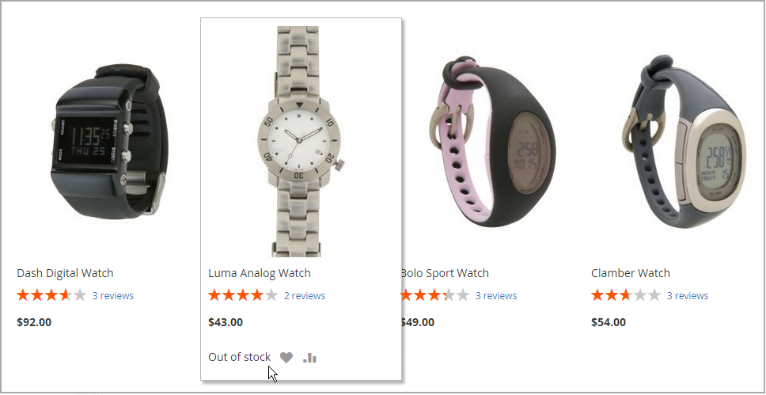

# 在庫メッセージシナリオ

設定を組み合わせて、製品ページおよびカタログページの製品リストで在庫状況メッセージを制御できます。

{width="600" zoomable="yes"}

## 製品ページのストックメッセージ

製品ページで使用できるメッセージには、「在庫を管理」設定と「在庫の可用性」設定の組み合わせに応じて、いくつかのバリエーションがあります。

### 例 1：可用性メッセージを表示する

#### シナリオ 1

この設定の組み合わせにより、各製品の在庫の利用可能状況に応じて、製品ページに可用性メッセージが表示されます。

| 在庫オプション | 設定 | メッセージ |
|--|--|--|
| [!UICONTROL Display product availability in stock in the frontend] | `Yes` | |
| [!UICONTROL Manage Stock] | `Yes` | |
| [!UICONTROL Stock Availability] | `In Stock` | _[!UICONTROL Availability: In Stock]_ |
| | `Out of Stock` | _[!UICONTROL Availability: Out of Stock]_ |

#### シナリオ 2

製品の在庫を管理していない場合、この設定の組み合わせを使用して、製品ページに可用性メッセージを表示できます。

| 在庫オプション | 設定 | メッセージ |
|--|--|--|
| [!UICONTROL Display product availability in stock in the frontend] | `Yes` |  |
| [!UICONTROL Manage Stock] | `No` | _[!UICONTROL Availability: In Stock]_ |

### 例 2：可用性メッセージを非表示にする

#### シナリオ 1

このように構成設定と製品設定を組み合わせることで、可用性メッセージが製品ページに表示されるのを防ぐことができます。

| 在庫オプション | 設定 | メッセージ |
|--|--|--|
| [!UICONTROL Display product availability in stock in the frontend] | `No` |  |
| [!UICONTROL Manage Stock] | `Yes` |  |
| [!UICONTROL Stock Availability] | `In Stock` | なし |
|  | `Out of Stock` | なし |

#### シナリオ 2

製品の在庫を管理していない場合、この設定と製品設定の組み合わせにより、可用性メッセージが製品ページに表示されなくなります。

| 在庫オプション | 設定 | メッセージ |
|--|--|--|
| [!UICONTROL Display product availability in stock in the frontend] | `No` |  |
| [!UICONTROL Manage Stock] | `No` | なし |

## カタログページのストックメッセージ

カテゴリおよび検索結果のリストでは、製品の可用性や設定に応じて、次の表示オプションを使用できます。

{width="600" zoomable="yes"}

### 例 1:「在庫切れ」というメッセージを使用して製品を表示する

この設定の組み合わせには、カテゴリと検索結果のリストに在庫切れの製品が含まれ、「在庫切れ」というメッセージが表示されます。

| 在庫オプション | 設定 | メッセージ |
|--|--|--|
| [!UICONTROL Display Out of Stock Products] | `Yes` |  |
| [!UICONTROL Display product availability in stock in the frontend] | `Yes` | _[!UICONTROL Out of stock]_ |
| [!UICONTROL Display Out of Stock Products] | `Yes` |  |
| [!UICONTROL Display product availability in stock in the frontend] | `No` | なし |

### 例 2:「在庫切れ」メッセージを使用しない製品の表示

この設定の組み合わせには、カテゴリリストと検索結果リストの在庫切れ製品が含まれますが、メッセージは表示されません。

| 在庫オプション | 設定 | メッセージ |
|--|--|--|
| [!UICONTROL Display Out of Stock Products] | `Yes` | なし |
| [!UICONTROL Display product availability in stock in the frontend] | `No` |  |

### 例 3：在庫に戻るまで製品を非表示

この設定では、在庫切れの製品が再入荷するまで、カテゴリリストと検索結果リストから完全に除外されます。

| 在庫オプション | 設定 | メッセージ |
|--|--|--|
| [!UICONTROL Display Out of Stock Products] | `No` | なし |
