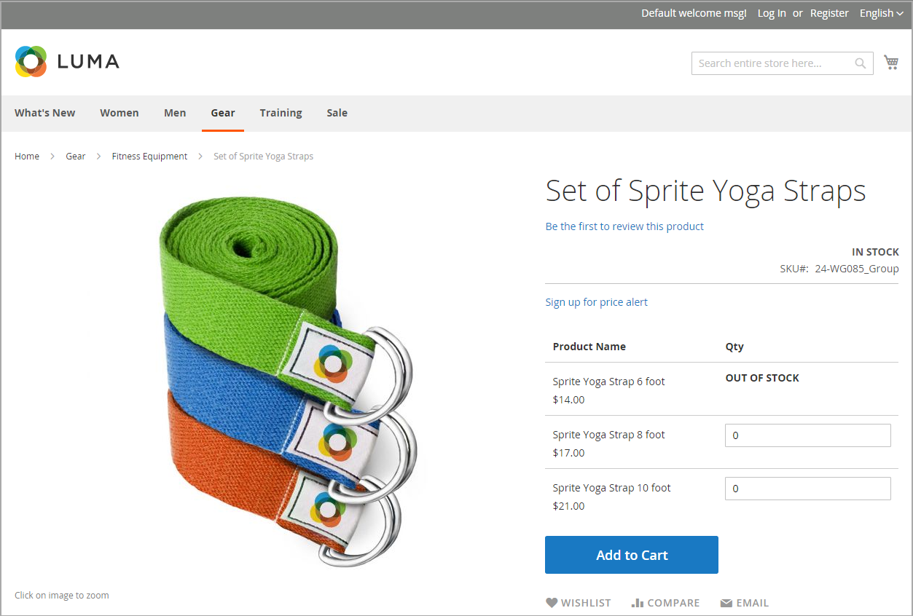
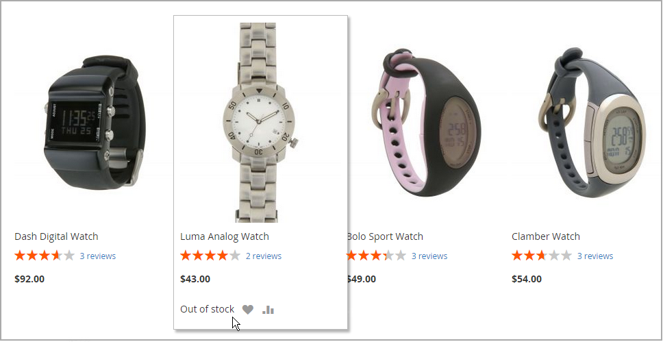

# ストックメッセージのシナリオ

構成設定を組み合わせて使用すると、商品ページおよびカタログページの商品リストの在庫状況メッセージを制御できます。

{width="600" zoomable="yes"}

## 製品ページのストックメッセージ

在庫の管理設定と在庫状況の設定の組み合わせに応じて、商品ページで利用できるメッセージにはいくつかのバリエーションがあります。

### 例1：可用性メッセージの表示

#### シナリオ 1

この設定の組み合わせにより、各製品の在庫状況に応じて、在庫状況メッセージが製品ページに表示されます。

| Stock オプション | 設定 | メッセージ |
|--|--|--|
| [!UICONTROL Display product availability in stock in the frontend] | `Yes` | |
| [!UICONTROL Manage Stock] | `Yes` | |
| [!UICONTROL Stock Availability] | `In Stock` | _[!UICONTROL Availability: In Stock]_ |
| | `Out of Stock` | _[!UICONTROL Availability: Out of Stock]_ |

#### シナリオ 2

商品の在庫が管理されていない場合、この設定の組み合わせを使用して、商品ページに在庫状況メッセージを表示できます。

| Stock オプション | 設定 | メッセージ |
|--|--|--|
| [!UICONTROL Display product availability in stock in the frontend] | `Yes` |  |
| [!UICONTROL Manage Stock] | `No` | _[!UICONTROL Availability: In Stock]_ |

### 例2：可用性メッセージの非表示

#### シナリオ 1

この設定と製品設定の組み合わせにより、製品ページに可用性メッセージが表示されなくなります。

| Stock オプション | 設定 | メッセージ |
|--|--|--|
| [!UICONTROL Display product availability in stock in the frontend] | `No` |  |
| [!UICONTROL Manage Stock] | `Yes` |  |
| [!UICONTROL Stock Availability] | `In Stock` | なし |
|  | `Out of Stock` | なし |

#### シナリオ 2

製品の在庫が管理されていない場合、設定と製品設定を組み合わせることで、製品ページに可用性メッセージが表示されなくなります。

| Stock オプション | 設定 | メッセージ |
|--|--|--|
| [!UICONTROL Display product availability in stock in the frontend] | `No` |  |
| [!UICONTROL Manage Stock] | `No` | なし |

## カタログページのストックメッセージ

製品の可用性と設定に応じて、カテゴリと検索結果リストに対して次の表示オプションを使用できます。

カテゴリーページの{width="600" zoomable="yes"}

### 例1:「在庫切れ」のメッセージを表示する

この設定の組み合わせでは、カテゴリおよび検索結果リストに在庫切れ商品が含まれ、「在庫切れ」メッセージが表示されます。

| Stock オプション | 設定 | メッセージ |
|--|--|--|
| [!UICONTROL Display Out of Stock Products] | `Yes` |  |
| [!UICONTROL Display product availability in stock in the frontend] | `Yes` | _[!UICONTROL Out of stock]_ |
| [!UICONTROL Display Out of Stock Products] | `Yes` |  |
| [!UICONTROL Display product availability in stock in the frontend] | `No` | なし |

### 例2:「在庫切れ」メッセージを含まない商品の表示

この設定の組み合わせでは、カテゴリおよび検索結果リストに在庫切れの商品が含まれますが、メッセージは表示されません。

| Stock オプション | 設定 | メッセージ |
|--|--|--|
| [!UICONTROL Display Out of Stock Products] | `Yes` | なし |
| [!UICONTROL Display product availability in stock in the frontend] | `No` |  |

### 例3：在庫が戻るまで商品を非表示にする

この設定では、在庫が戻るまで、カテゴリと検索結果リストから完全に在庫切れの商品が除外されます。

| Stock オプション | 設定 | メッセージ |
|--|--|--|
| [!UICONTROL Display Out of Stock Products] | `No` | なし |
