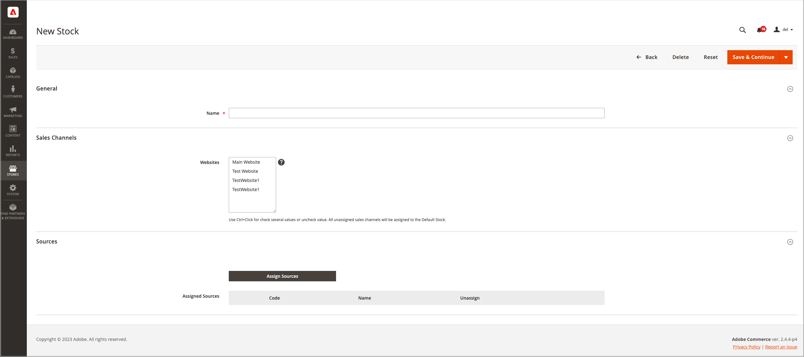

# ストックを追加

ストックマップでは、販売可能な数量や製品在庫への直接リンクを提供し、ソースを販売チャネル（またはweb サイト）にマッピングします。

カスタム在庫を作成する際には、web サイトとソースを割り当てます。 ソースには、有効なソースと無効なソースを含めることができます。 たとえば、在庫に倉庫を追加し、在庫を管理し、出荷を完了するために場所を開く準備をすることができます。

ソースを追加したら、ソースの順序を上（最初）から下（最後）に優先順位付けする必要があります。 この注文は、注文出荷時のレコメンデーションに影響します。

{width="600" zoomable="yes"}

## 在庫在庫の追加

1. _管理者_ サイドバーで、**[!UICONTROL Stores]** > _[!UICONTROL Inventory]_>**[!UICONTROL Stock]**に移動します。

1. **[!UICONTROL Add New Stock]**&#x200B;をクリックします。

1. **[!UICONTROL General]** セクションのを展開し、一意の&#x200B;**[!UICONTROL Name]**&#x200B;を入力して新しい在庫を識別します。

   {width="350" zoomable="yes"}

1. **[!UICONTROL Sales Channels]** セクションのを展開し、この在庫が利用可能な&#x200B;**[!UICONTROL Websites]**&#x200B;を選択します。

   マルチサイトインストールの場合は、Ctrl キー（PC）またはCommand キー（Mac）を押しながら、各Web サイトをクリックします。

   >[!NOTE]
   >
   >別の在庫に割り当てられたweb サイトまたは販売チャネルを選択した場合、その在庫から割り当てられていません。 カスタム在庫に割り当てられていない販売チャネルは、デフォルト在庫に割り当てられます。

   {width="350" zoomable="yes"}

1. **[!UICONTROL Sources]** セクションのを展開し、デフォルト以外の在庫について次の操作を行います。

   - **[!UICONTROL Assign Sources]**&#x200B;をクリックします。

   {width="350" zoomable="yes"}

   - 在庫に割り当てるすべてのソースのチェックボックスを選択します。

   >[!IMPORTANT]
   >
   >同じソースを複数の在庫に割り当てると、そのソースに割り当てられた商品が売り越される可能性があります。

   - **[!UICONTROL Done]**&#x200B;をクリックします。

     追加されたソースは、割り当てられたソースに表示されます。

     {width="600" zoomable="yes"}

1. を使用して、ソースを上（最初）から下（最後）にドラッグ&amp;ドロップします。

   注文を配送する際には、ソース注文が重要になります。

   {width="600" zoomable="yes"}

1. _[!UICONTROL Save]_（）メニューで、**[!UICONTROL Save & Close]**を選択します。

## フィールドの説明

| フィールド | 説明 |
|--|--|
| **[!UICONTROL General]** | |
| [!UICONTROL Name] | 在庫の名前。 例：`UK Stock`、`US Stock` |
| **[!UICONTROL Sales Channels]** | |
| [!UICONTROL Websites] | 特定のweb サイトに&#x200B;_販売チャネル_&#x200B;として在庫を割り当てることで、在庫の[範囲](../getting-started/websites-stores-views.md#scope-settings)を定義します。 在庫ごとに1つ以上のweb サイトを選択します。 各web サイトは1つの在庫にのみ割り当てることができます。 |
| **[!UICONTROL Sources]** | |
| [!UICONTROL Assign Sources] | 在庫ソースをこの在庫に割り当てます。 カスタムソースをデフォルトストックに割り当てることはできません。 |
| [!UICONTROL Assigned Sources] | 割り当てられたソースのリスト。 を使用してソースをドラッグ&amp;ドロップし、注文フルフィルメントと発送の優先順位付け注文に追加します。  **[!UICONTROL Code]**- ソースの一意のコード ID。 **[!UICONTROL Name]** - ソースの名前の説明。 **[!UICONTROL Unassign]**- を使用して、割り当てられたソースを在庫から削除します。 |
