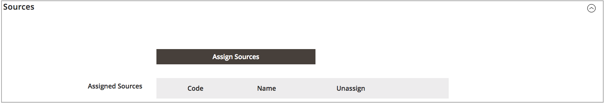

# 在庫を追加

在庫は、ソースを販売チャネル（または web サイト）にマッピングし、販売可能な数量と製品インベントリへの直接リンクを提供します。

カスタムストックを作成する場合は、web サイトとソースを割り当てます。 ソースには、有効なソースと無効なソースを含めることができます。 例えば、在庫に倉庫を追加し、在庫を管理して出荷を完了するための場所を開く準備を行うことができます。

ソースを追加した後、ソースの順序を上（最初）から下（最後）に優先順位付けする必要があります。 この注文は、注文出荷中の推奨事項に影響を与えます。

{width="600" zoomable="yes"}

## 在庫在庫の追加

1. 日 _Admin_ サイドバー、に移動 **[!UICONTROL Stores]** > _[!UICONTROL Inventory]_>**[!UICONTROL Stock]**.

1. クリック **[!UICONTROL Add New Stock]**.

1. を展開  この **[!UICONTROL General]** セクションを選択して一意のを入力 **[!UICONTROL Name]** 新しい在庫を識別します。

   {width="350" zoomable="yes"}

1. を展開  この **[!UICONTROL Sales Channels]** 「」セクションを選択し、 **[!UICONTROL Websites]** この在庫が利用可能な場所。

   マルチサイトインストールの場合は、Ctrl キー（PC）または Command キー（Mac）を押しながら、各 Web サイトをクリックします。

   >[!NOTE]
   >
   >別の在庫に割り当てられている web サイトまたは販売チャネルを選択した場合、その在庫から割り当てられません。 カスタム在庫に割り当てられていないSales Channelは、デフォルト在庫に割り当てられます。

   {width="350" zoomable="yes"}

1. を展開  この **[!UICONTROL Sources]** デフォルト以外の在庫の場合は、を参照し、次の操作を行います。

   - クリック **[!UICONTROL Assign Sources]**.

   {width="350" zoomable="yes"}

   - 在庫に割り当てるすべてのソースのチェックボックスをオンにします。

   >[!IMPORTANT]
   >
   >同じソースを複数の在庫に割り当てると、そのソースに割り当てられた製品が売れ過ぎになる可能性があります。

   - クリック **[!UICONTROL Done]**.

     追加されたソースが「割り当てられたソース」に表示されます。

     {width="600" zoomable="yes"}

1. 使用方法  ソースを上（最初）から下（最後）にドラッグ&amp;ドロップします。

   注文を出荷する際には、ソース注文が重要です。

   {width="600" zoomable="yes"}

1. 日 _[!UICONTROL Save]_（） メニュー、を選択&#x200B;**[!UICONTROL Save & Close]**.

## フィールドの説明

| フィールド | 説明 |
|--|--|
| **[!UICONTROL General]** | |
| [!UICONTROL Name] | 在庫名。 例： `UK Stock`, `US Stock` |
| **[!UICONTROL Sales Channels]** | |
| [!UICONTROL Websites] | は、 [範囲](../getting-started/websites-stores-views.md#scope-settings) 在庫を特定の web サイトに割り当てることにより、在庫を _販売チャネル_. 在庫ごとに 1 つ以上の web サイトを選択します。 各 web サイトは、1 つの在庫にのみ割り当てることができます。 |
| **[!UICONTROL Sources]** | |
| [!UICONTROL Assign Sources] | この在庫に在庫ソースを割り当てます。 カスタムソースをデフォルトの在庫に割り当てることはできません。 |
| [!UICONTROL Assigned Sources] | 割り当てられたソースのリスト。 を使用してソースをドラッグ&amp;ドロップ  注文のフルフィルメントと配送のための優先順位付けされた注文に。  **[!UICONTROL Code]**- ソースの一意のコード ID。 **[!UICONTROL Name]** - ソースの名前の説明。 **[!UICONTROL Unassign]**– を使用して、割り当てられたソースを在庫から削除します . |
