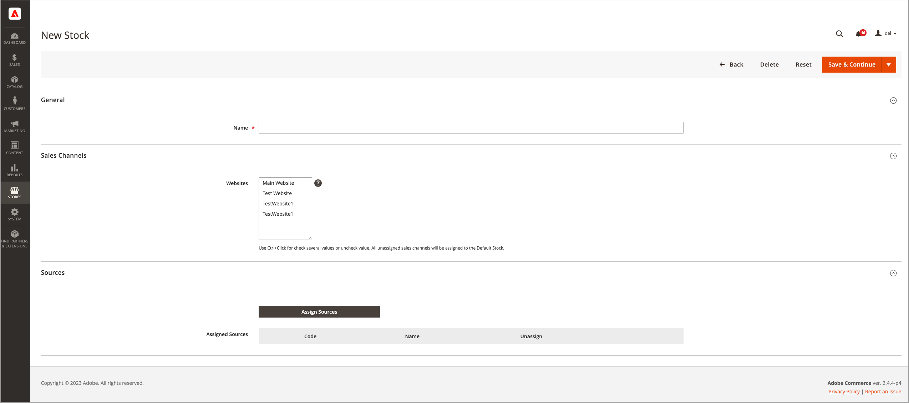

# 在庫を追加

在庫は、ソースを販売チャネル（または web サイト）にマッピングし、販売可能な数量と製品インベントリへの直接リンクを提供します。

カスタムストックを作成する場合は、web サイトとソースを割り当てます。 ソースには、有効なソースと無効なソースを含めることができます。 例えば、在庫に倉庫を追加し、在庫を管理して出荷を完了するための場所を開く準備を行うことができます。

ソースを追加した後、ソースの順序を上（最初）から下（最後）に優先順位付けする必要があります。 この注文は、注文出荷中の推奨事項に影響を与えます。

{width="600" zoomable="yes"}

## 在庫在庫の追加

1. _管理者_ サイドバーで、**[!UICONTROL Stores]**/_[!UICONTROL Inventory]_/**[!UICONTROL Stock]**に移動します。

1. 「**[!UICONTROL Add New Stock]**」をクリックします。

1.  「**[!UICONTROL General]**」セクションを展開し、新しい在庫を識別する一意の **[!UICONTROL Name]** を入力します。

   {width="350" zoomable="yes"}

1.  「**[!UICONTROL Sales Channels]**」セクションを展開し、この在庫が使用可能な **[!UICONTROL Websites]** を選択します。

   マルチサイトインストールの場合は、Ctrl キー（PC）または Command キー（Mac）を押しながら、各 Web サイトをクリックします。

   >[!NOTE]
   >
   >別の在庫に割り当てられている web サイトまたは販売チャネルを選択した場合、その在庫から割り当てられません。 カスタム在庫に割り当てられていないSales Channelは、デフォルト在庫に割り当てられます。

   {width="350" zoomable="yes"}

1. **[!UICONTROL Sources]** のセクションの  を展開し、デフォルト以外のストックに対して次の操作を行います。

   - 「**[!UICONTROL Assign Sources]**」をクリックします。

   {width="350" zoomable="yes"}

   - 在庫に割り当てるすべてのソースのチェックボックスをオンにします。

   >[!IMPORTANT]
   >
   >同じソースを複数の在庫に割り当てると、そのソースに割り当てられた製品が売れ過ぎになる可能性があります。

   - 「**[!UICONTROL Done]**」をクリックします。

     追加されたソースが「割り当てられたソース」に表示されます。

     {width="600" zoomable="yes"}

1.  を使用して、ソースを上（最初）から下（最後）の優先度にドラッグ&amp;ドロップします。

   注文を出荷する際には、ソース注文が重要です。

   {width="600" zoomable="yes"}

1. _[!UICONTROL Save]_（メニュー矢印  で、「**[!UICONTROL Save & Close]**」を選択します。

## フィールドの説明

| フィールド | 説明 |
|--|--|
| **[!UICONTROL General]** | |
| [!UICONTROL Name] | 在庫名。 例：`UK Stock`、`US Stock` |
| **[!UICONTROL Sales Channels]** | |
| [!UICONTROL Websites] | 在庫を [ 販売チャネル ](../getting-started/websites-stores-views.md#scope-settings) として特定の web サイトに割り当てることにより、在庫の _範囲_ を定義します。 在庫ごとに 1 つ以上の web サイトを選択します。 各 web サイトは、1 つの在庫にのみ割り当てることができます。 |
| **[!UICONTROL Sources]** | |
| [!UICONTROL Assign Sources] | この在庫に在庫ソースを割り当てます。 カスタムソースをデフォルトの在庫に割り当てることはできません。 |
| [!UICONTROL Assigned Sources] | 割り当てられたソースのリスト。  を使用して、ソースを優先順位付けされた順序にドラッグ&amp;ドロップし、注文のフルフィルメントと出荷を行います。  **[!UICONTROL Code]**- ソースの一意のコード ID。 **[!UICONTROL Name]** - ソースの名前説明。 **[!UICONTROL Unassign]**-  を使用して、割り当てられたソースを在庫から削除します。 |
