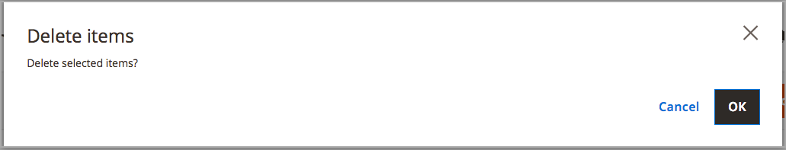

# ストックを削除

在庫を削除すると、割り当てられたすべてのWeb サイトがデフォルトの在庫に割り当てられます。 削除前にweb サイトを他のストックに再割り当てすることをお勧めします。

>[!IMPORTANT]
>
>[在庫](stocks-manage.md)を削除すると、販売チャネルの販売可能な数量と未処理の注文に影響する可能性があります。 販売チャネルを引き続き使用する場合は、その販売チャネルを別の既存または新規在庫に追加します。

1. _管理者_ サイドバーで、**[!UICONTROL Stores]** > _[!UICONTROL Inventory]_>**[!UICONTROL Stocks]**&#x200B;に移動します。

1. 削除する1つ以上の在庫を選択します。

   削除するストックのチェックボックスを参照または検索して選択します。

1. **[!UICONTROL Actions]** メニューから、**[!UICONTROL Delete]**&#x200B;を選択します。

   {width="350" zoomable="yes"}

1. 確認ダイアログで、**[!UICONTROL OK]**&#x200B;をクリックします。

   在庫が削除され、割り当てられた販売チャネルのマッピングが解除されます。

   {width="350" zoomable="yes"}
