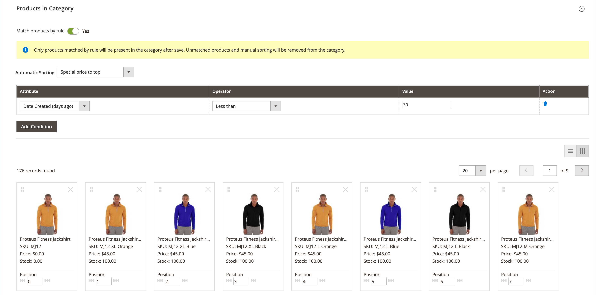
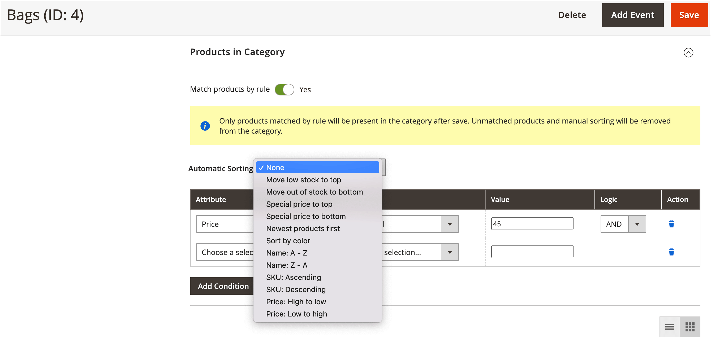

# マーチャンダイジングのカテゴリルール

{{ee-feature}}

カテゴリルールは、一連の条件に従って製品選択を動的に変更します。 各カテゴリには1つのカテゴリルールのみを含めることができますが、1つのルールには複数の条件を含めることができます。 例えば、特定のブランドのカテゴリルールを作成できます。 同じカテゴリに割り当てられていなくても、同じブランドの製品は自動的にリストに追加されます。 式に含める製品を説明するために、必要な数の条件を式に追加できます。

>[!TIP]
>
>カテゴリルールの設定中、このカテゴリを保存すると、そのルール **_のみ_**&#x200B;に従って、製品は&#x200B;_並べ替え_、_一致_、_割り当て_&#x200B;および&#x200B;_未割り当て_&#x200B;になります。 例えば、カタログに商品を追加し、ルールに従って割り当てる場合、ルールで商品に一致するように設定されている各カテゴリ **を**&#x200B;保存する必要があります。 また、商品の在庫状況が`In Stock`または`Out of Stock`に変更され、カテゴリ内の商品が&#x200B;**[!UICONTROL Automatic Sorting]** ルールに従って&#x200B;_並べ替え_&#x200B;される必要がある場合は、**[!UICONTROL Save Category]**&#x200B;をクリックする必要があります。

各条件は、属性、値、論理演算子で構成されます。 _[[!UICONTROL Use in Product Listing]](../catalog/attribute-product-create.md)_プロパティが`Yes`に設定された属性のみが、カテゴリルールで使用できます。 商品リストに含まれていない属性を使用する場合は、このプロパティを属性に設定する必要があります。 日付属性はサポートされていませんが、日付作成属性または日付変更属性を使用して、日付または日付の範囲を定義できます。 例えば、過去1週間に作成された製品のみを含めるには、「作成日」を`<7`の値に設定します。

>[!NOTE]
>
>ルールで使用されている各属性を&#x200B;[_smart_&#x200B;属性](smart-attributes-configure.md)として設定してください。

{width="600" zoomable="yes"}

カテゴリ製品ルールは、カテゴリに表示される製品を決定する条件に基づいて、特定の製品をカテゴリに割り当てるプロセスを迅速化できます。 カテゴリ製品ルールで使用できる「スマート」属性は、[Visual Merchandiser](visual-merchandiser.md)設定で指定されます。

>[!NOTE]
>
>条件を満たさない製品はカテゴリから削除されるため、カテゴリ製品ルールを適用する際は注意が必要です。 例えば、紫色のタンクトップのみを含むルールを作成すると、その他のすべてのタンクトップがカテゴリから削除されます。

## 手順1: _smart_&#x200B;属性の設定

1. ルールで使用する各属性について、[[!UICONTROL Use in Product Listing]](../catalog/product-attributes.md) ストアフロントプロパティが`Yes`に設定されていることを確認します。

   >[!NOTE]
   >
   >選択する属性が複数選択&#x200B;_[!UICONTROL Input Type]_&#x200B;でないことを確認してください。

1. Visual Merchandiserで使用する各&#x200B;_smart_&#x200B;属性を識別するには、[設定](smart-attributes-configure.md)を完了します。

## 手順2：カテゴリルールの作成

1. カテゴリーツリーで、編集するカテゴリを開きます。

1. **[!UICONTROL Products in Category]** セクションで、**[!UICONTROL Match products by rule]**&#x200B;を`Yes`に設定します。

   自動並べ替えと条件オプションが表示されます。

1. **[!UICONTROL Add Condition]**&#x200B;をクリックします。

1. 条件の基となる&#x200B;**[!UICONTROL Attribute]**&#x200B;を選択します。

1. **[!UICONTROL Operator]**&#x200B;を次のいずれかに設定します：

   - `Equal`
   - `Not equal`
   - `Greater than`
   - `Greater than or equal to`
   - `Less than`
   - `Less than or equal to`
   - `Contains`

1. 一致させる&#x200B;**[!UICONTROL Value]**&#x200B;を入力します。

   {width="500"}

1. 満たすべき条件を記述するために必要な各属性について、このプロセスを繰り返します。

   例えば、7日前から30日前に作成された製品を照合するには、次の操作を行います。

   - **[!UICONTROL Date Created]**&#x200B;を`Less than 30`に設定します。

   - **[!UICONTROL Logic]**&#x200B;を`AND`に設定します。

     >[!NOTE]
     >
     >`AND`を選択すると、すべての条件を満たす製品にルールが適用されます。 `OR`を選択すると、少なくとも1つの条件が満たされている製品に適用されます。

   - **[!UICONTROL Date Modified]**&#x200B;を`Greater than 7`に設定します。

1. 動的に生成された製品リストに自動的に並べ替え順序を適用するには、**[!UICONTROL Automatic Sorting]**&#x200B;を設定します。

   {width="600" zoomable="yes"}

   並べ替え順序オプションはグローバルに定義され、現在の状況に基づいて適用されます。 web サイト、ストア、またはストアの表示レベルに異なる並べ替え順序を設定することはできません。

   | ソートオプション | 説明 |
   |-----------| -----------|
   | [!UICONTROL Stock quantity] | 上または下の在庫に基づいて並べ替え：`Move low stock to top`または`Move out of stock to bottom` |
   | [!UICONTROL Special price] | 価格に基づく並べ替え（上または下）: `Special price to top`または`Special price to bottom` |
   | [!UICONTROL New Products] | 最新の製品の一覧：`Newest products first` |
   | [!UICONTROL Color] | アルファベット順に色で並べ替え：`Sort by color` |
   | [!UICONTROL Product Names] | 名前で昇順または降順に並べ替え：`Name A - Z`または`Name Z -A` |
   | [!UICONTROL SKU] | SKUで昇順または降順で並べ替え：`SKU: Ascending`または`SKU: Descending` |
   | [!UICONTROL Price] | 昇順または降順で価格で並べ替え：`Price: High to low`または`Price: Low to high` |

   {style="table-layout:auto"}

1. 完了したら、**[!UICONTROL Save Category]**&#x200B;をクリックします。

>[!NOTE]
>
>カテゴリルールを設定すると、カテゴリの保存時に製品が一致し、ルールに割り当てられます。 カタログに商品を追加し、それをルールに含める場合は、ルールで商品と一致するように設定されている各カテゴリを再保存する必要があります。 これにより、新製品が確実に追加されます。

### メニューオプション

- **[!UICONTROL Match products by rule]** - カテゴリ内の製品のリストがカテゴリ ルールによって動的に生成されるかどうかを決定します。 オプション：`Yes` / `No`

- **[!UICONTROL Automatic Sorting]** - カテゴリ製品のリストに並べ替え順序を自動的に適用します。 オプション：`None`、`Move low stock to top`、`Move low stock to bottom`、`Special price to top`、`Special price to bottom`、`Newest products first`、`Sort by color`、`Name: A - Z`、`Name: Z - A`、`SKU: Ascending`、`SKU: Descending`、`Price: High to Low`、および`Price: Low to High`

  >[!NOTE]
  >
  >子商品を含む設定可能な商品がある場合、親商品の在庫は、子商品の在庫の合計数に基づいて計算されます。 設定可能な商品&#x200B;_Proteus Fitness Shirt_&#x200B;があり、それぞれに異なる在庫量のオレンジ、赤、黄色の子商品がある例を考えてみましょう。 親商品の在庫は、オレンジ、赤、黄色の子商品の合計在庫に基づいて計算されます。 `Move low stock to top` オプションを使用すると、販売可能なすべての子商品の在庫を組み合わせて親商品の在庫を計算し、それに応じて並べ替えます。

- **[!UICONTROL Add Condition]** – 別の条件をルールに追加します。

- **[!UICONTROL Attribute]** – 条件の基礎として使用される属性を決定します。 オプション：

  | オプション | 説明 |
  | ------ | ----------- |
  | `Clone Category ID(s)` | カテゴリ IDに基づいて、複数のカテゴリから商品を並べ替えたり並べ替えたりすることなく、動的に複製します。 |
  | `Color` | 色に基づいた商品が含まれています。 |
  | `Date Created (days ago)` | 商品がカタログに追加されてからの日数に基づいて商品が含まれます。 |
  | `Date Modified (days ago)` | 製品が最後に変更されてからの日数に基づいて製品が含まれます。 |
  | `Name` | 製品名に基づいて製品を含めます。 |
  | `Price` | 価格に基づく商品が含まれています。 この属性は、設定可能な製品には適用できません。製品には独自の価格がありません。 |
  | `Quantity` | 在庫量にもとづいた商品を含めます。 |
  | `SKU` | SKUにもとづいた商品が含まれます。 |

  {style="table-layout:auto"}

  >[!NOTE]
  >
  >子オプションを含む設定可能な製品の数量は、すべての販売可能な子製品数量を組み合わせて計算されます。 設定可能な製品&#x200B;_ベーシックフィットネスタンク_&#x200B;があり、それぞれ紫色、赤色、黄色のカラーオプションと異なる数量を持つ場合の例を考えてみましょう。 この場合、親製品（ベーシックフィットネスタンク）の数量は、紫色、赤色、黄色の子製品を組み合わせた販売可能な数量です。

- **[!UICONTROL Operator]** – 条件を満たすために属性値に適用される演算子を指定します。 演算子を指定しない限り、`Equal`がデフォルトとして使用されます。 オプション：`Equal`、`Not equal`、`Greater than`、`Greater than or equal to`、`Less than`、`Less than or equal to`、および`Contains`

- **[!UICONTROL Value]** – 属性が条件を満たすために必要な値を指定します。

- **[!UICONTROL Logic]** - ロジック列は複数の条件を定義するために使用され、別の条件が追加された場合にのみ表示されます。 演算子は、MySQL [&#x200B; ブール演算子](https://dev.mysql.com/doc/refman/8.0/en/operator-precedence.html)の優先順位のルールに従います。 オプション：`AND` / `OR`
