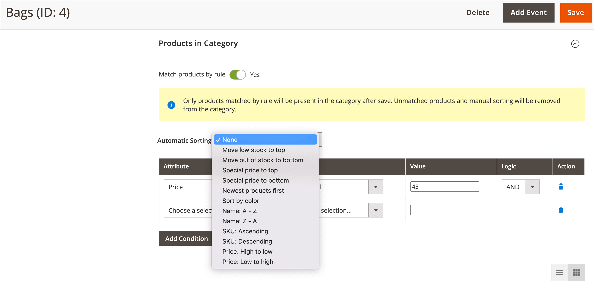

# マーチャンダイジングのカテゴリ ルール

{{ee-feature}}

カテゴリルールは、条件のセットに従って製品の選択を動的に変更します。 各カテゴリには 1 つのカテゴリルールのみを含めることができますが、1 つのルールには複数の条件を含めることができます。 例えば、特定のブランドのカテゴリルールを作成できます。 同じブランドの製品は、同じカテゴリに割り当てられていなくても、自動的にリストに追加されます。 必要な数の条件を式に追加して、含める製品を説明できます。

>[!TIP]
>
>カテゴリルールの設定時に、製品は次のようになります _並べ替え_, _matched_, _割り当て_、および _unassigned_ その規則に従って **_のみ_** このカテゴリの保存時。 例えば、製品をカタログに追加し、ルールに従って製品を割り当てる場合、次の操作を行います **各カテゴリを再保存する必要があります** これは、ルール別に製品を照合するように設定されます。 また、製品の在庫ステータスがに変更された場合 `In Stock` または `Out of Stock` カテゴリのとの製品は、次のようになります _並べ替え_ ～によれば **[!UICONTROL Automatic Sorting]** ルールです。をクリックする必要があります **[!UICONTROL Save Category]**.

各条件は、属性、値、論理演算子で構成されます。 を持つ属性のみ _[[!UICONTROL Use in Product Listing]](../catalog/attribute-product-create.md)_プロパティの設定 `Yes` は、カテゴリルールで使用できます。 製品リストに含まれていない属性を使用する場合は、属性のこのプロパティを設定する必要があります。 日付属性はサポートされていませんが、作成日属性または変更日属性を使用して、日付または日付の範囲を定義できます。 例えば、過去 1 週間に作成された製品のみを含めるには、「作成日」を値 `<7`.

>[!NOTE]
>
>ルールで使用する各属性を、必ず次のように設定します。 [_スマート_ 属性](smart-attributes-configure.md).

{width="600" zoomable="yes"}

カテゴリ製品ルールを使用すると、カテゴリに表示される製品を決定する条件に基づいて、特定の製品をカテゴリに割り当てるプロセスを高速化できます。 カテゴリ製品ルールで使用できる「スマート」属性は、で指定します。 [ビジュアルマーチャンダイザー](visual-merchandiser.md) 設定。

>[!NOTE]
>
>条件を満たさない製品はカテゴリから削除されるので、カテゴリ製品ルールを適用する場合は注意が必要です。 例えば、紫色のタンクトップのみを含むルールを作成すると、他のすべてのタンクトップがカテゴリから削除されます。

## 手順 1：を設定する _スマート_ 属性

1. ルールで使用する各属性について、次の点を確認してください [[!UICONTROL Use in Product Listing]](../catalog/product-attributes.md) storefront プロパティは次のように設定されます： `Yes`.

   >[!NOTE]
   >
   >選択した属性が複数選択でないことを確認します _[!UICONTROL Input Type]_.

1. を完了する [設定](smart-attributes-configure.md) それぞれを識別するには _スマート_ ビジュアルマーチャンダイザーで使用される属性。

## 手順 2：カテゴリルールの作成

1. カテゴリツリーで、編集するカテゴリを開きます。

1. が含まれる **[!UICONTROL Products in Category]** セクション、設定 **[!UICONTROL Match products by rule]** 対象： `Yes`.

   自動並べ替えと条件のオプションが表示されます。

1. クリック **[!UICONTROL Add Condition]**.

1. を選択します。 **[!UICONTROL Attribute]** それが条件の基礎です。

1. を設定 **[!UICONTROL Operator]** を次のいずれかに変更します。

   - `Equal`
   - `Not equal`
   - `Greater than`
   - `Greater than or equal to`
   - `Less than`
   - `Less than or equal to`
   - `Contains`

1. を入力 **[!UICONTROL Value]** それは一致する予定だ。

   {width="500"}

1. 満たす条件を記述するために必要な各属性に対して、このプロセスを繰り返します。

   例えば、7 から 30 日前に作成された製品を照合するには、次の手順を実行します。

   - を設定 **[!UICONTROL Date Created]** 対象： `Less than 30`.

   - を設定 **[!UICONTROL Logic]** 対象： `AND`.

     >[!NOTE]
     >
     >選択する場合 `AND`ルールは、すべての条件が満たされた製品に適用されます。 選択したタイミング `OR`、少なくとも 1 つの条件を満たす製品に適用されます。

   - を設定 **[!UICONTROL Date Modified]** 対象： `Greater than 7`.

1. 動的に生成される製品リストに並べ替え順を自動的に適用するには、次を設定します **[!UICONTROL Automatic Sorting]**.

   {width="600" zoomable="yes"}

   並べ替え順のオプションはグローバルに定義され、現在の条件に基づいて適用されます。 Web サイト、ストア、またはストア表示レベルに異なる並べ替え順を設定することはできません。

   | 並べ替えオプション | 説明 |
   |-----------| -----------|
   | [!UICONTROL Stock quantity] | 在庫に基づいて上または下から並べ替え： `Move low stock to top` または `Move out of stock to bottom` |
   | [!UICONTROL Special price] | 価格に基づいて上または下から並べ替える： `Special price to top` または `Special price to bottom` |
   | [!UICONTROL New Products] | 最新の製品をリストする： `Newest products first` |
   | [!UICONTROL Color] | 色でアルファベット順に並べ替え： `Sort by color` |
   | [!UICONTROL Product Names] | 名前を昇順または降順で並べ替える： `Name A - Z` または `Name Z -A` |
   | [!UICONTROL SKU] | SKU を昇順または降順で並べ替えます。 `SKU: Ascending` または `SKU: Descending` |
   | [!UICONTROL Price] | 価格で昇順または降順に並べ替える： `Price: High to low` または `Price: Low to high` |

   {style="table-layout:auto"}

1. 完了したら、 **[!UICONTROL Save Category]**.

>[!NOTE]
>
>カテゴリルールを設定すると、商品が照合され、カテゴリの保存時にルールに割り当てられます。 カタログに製品を追加し、その製品をルールに含める場合、ルールで製品と一致するように設定された各カテゴリを再度保存する必要があります。 これにより、新しい製品が確実に含まれます。

### メニューオプション

- **[!UICONTROL Match products by rule]** - カテゴリ内の製品のリストがカテゴリルールによって動的に生成されるかどうかを決定します。 オプション： `Yes` / `No`

- **[!UICONTROL Automatic Sorting]** - カテゴリ製品のリストに並べ替え順を自動的に適用します。 オプション： `None`, `Move low stock to top`, `Move low stock to bottom`, `Special price to top`, `Special price to bottom`, `Newest products first`, `Sort by color`, `Name: A - Z`, `Name: Z - A`, `SKU: Ascending`, `SKU: Descending`, `Price: High to Low`、および `Price: Low to High`

  >[!NOTE]
  >
  >子製品を持つ設定可能な製品がある場合、親製品の在庫は、子製品の在庫の合計に基づいて計算されます。 設定可能な製品がある例について考えてみます _Proteus フィットネスシャツ_ それぞれ異なる在庫量を持つオレンジ、赤、黄色の子製品。 親商品の在庫は、オレンジ、赤、黄の子商品の在庫の合計に基づいて計算されます。 （を使用） `Move low stock to top` オプションを選択すると、売れる子製品の在庫をすべて組み合わせて親製品の在庫を計算し、それに応じて並べ替えます。

- **[!UICONTROL Add Condition]** - ルールに別の条件を追加します。

- **[!UICONTROL Attribute]**  – 条件の基礎として使用する属性を決定します。 オプション：

  | オプション | 説明 |
  | ------ | ----------- |
  | `Clone Category ID(s)` | カテゴリ ID に基づいて、複数のカテゴリから、並べ替えや順序を指定せずに、動的に製品のクローンを作成します。 |
  | `Color` | 色に基づいて製品を含めます。 |
  | `Date Created (days ago)` | 商品がカタログに追加されてからの経過日数に基づいて、商品が含まれます。 |
  | `Date Modified (days ago)` | 商品が最後に変更されてからの日数に基づいて商品を含めます。 |
  | `Name` | 製品名に基づいて製品を含めます。 |
  | `Price` | 価格に基づいて製品を含めます。 この属性は、独自の価格を持たないため、設定可能な製品には適用されません。 |
  | `Quantity` | 在庫数に基づいて製品を含めます。 |
  | `SKU` | SKU に基づく製品が含まれます。 |

  {style="table-layout:auto"}

  >[!NOTE]
  >
  >子オプションを持つ設定可能な製品の数量は、すべての販売可能な子製品の数量を組み合わせて計算されます。 設定可能な製品がある例について考えてみます _ベーシックフィットネスタンクトップ_ 紫、赤、黄のカラーオプションとそれぞれの異なる量を使用します。 この場合、親商品（ベーシックフィットネスタンク）の量は、紫色、赤色、黄色の子商品の合計販売可能量です。

- **[!UICONTROL Operator]**  – 条件を満たすために属性値に適用する演算子を指定します。 演算子を指定しない場合、 `Equal` がデフォルトとして使用されます。 オプション： `Equal`, `Not equal`, `Greater than`, `Greater than or equal to`, `Less than`, `Less than or equal to`、および `Contains`

- **[!UICONTROL Value]**  – 属性が条件を満たす必要がある値を指定します。

- **[!UICONTROL Logic]**  – 論理列は、複数の条件を定義するために使用され、別の条件が追加された場合にのみ表示されます。 演算子は、MySQL の優先順位ルールに従います [ブール演算子](https://dev.mysql.com/doc/refman/8.0/en/operator-precedence.html). オプション： `AND` / `OR`
