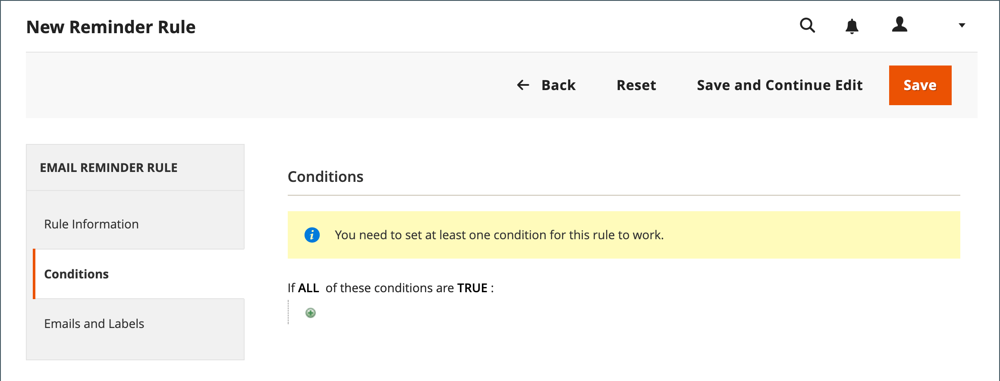
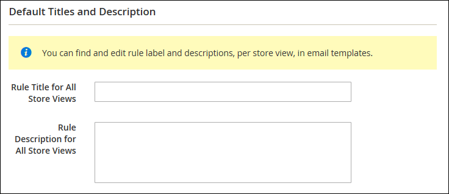

# メールのリマインダーの作成

メールリマインダールールを設定する前に、まず [ 買い物かごの価格ルールを設定 ](price-rules-cart-create.md) して、提供されるプロモーションを定義する必要があります。 メールのリマインダーをトリガーするルール条件を、買い物かごのプロパティ、ウィッシュリストのプロパティ、またはその両方に基づくことができます。

>[!NOTE]
>
>メールのリマインダーでは、クーポンの有無に関わらず、買い物かごの価格ルールを促進する場合があります。 自動生成されたクーポンを定義する買い物かご価格ルールにより、各顧客にランダムクーポンコードが生成されます。

1. _管理者_ サイドバーで、**[!UICONTROL Marketing]**/_[!UICONTROL Communications]_/**[!UICONTROL Email Reminder Rules]**に移動します。

1. 右上隅の「**[!UICONTROL Add New Rule]**」をクリックします。

1. _[!UICONTROL Rule Information]_を次のように入力します。

   {width="700" zoomable="yes"}

   - ルールを内部的に識別する **[!UICONTROL Rule Name]** を入力します。

   - ルールの簡単な **[!UICONTROL Description]** を入力します。

   - このリマインダーがアドバタイズする **[!UICONTROL Cart Price Rule]** プロモーションを選択するには、「**[!UICONTROL Select Rule…]**」をクリックし、ルールを選択します。

     {width="600" zoomable="yes"}

   - ルールをすぐに有効にする場合は、**[!UICONTROL Status]** を `Active` に設定します。

   - ルールをアクティブにする日付範囲を設定するには、**[!UICONTROL From]** と **[!UICONTROL To]** の日付を入力します。

     カレンダー（）から日付を選択することもできます。

   - リマインダーを 2 回以上送信するには、次のメールが送信されるまでの日数を **[!UICONTROL Repeat Schedule]** フィールドに入力します。

1. 左側のパネルで「**[!UICONTROL Conditions]**」を選択します。

   ルールに少なくとも 1 つの条件を定義する必要があります。 このプロセスは、[ カタログ価格ルール ](price-rules-catalog.md) の作成に似ています。

   {width="600" zoomable="yes"}

   _追加_ （）をクリックしてオプションのリストを表示し、次のいずれかの条件を選択します。

   - ウィッシュリスト
   - ショッピングカート

   >[!NOTE]
   >
   >顧客に、一致する放棄された買い物かご、ウィッシュリストまたはその両方の組み合わせが複数ある場合、メールのリマインダーはその顧客に対して 1 回だけトリガーされます。 同じメールのリマインダーを再度トリガーするには、「_[!UICONTROL Repeat Schedule]_」フィールドを使用して、メール間の日数を設定します。 
   >
   >**_新規_** 放棄された買い物かごと **_後_** リストの同じ顧客に対して、同じメールのリマインダーは **_再トリガーされません_**_[!UICONTROL Repeat Schedule]_期間が終了します。

   メールのリマインダーをトリガーするシナリオを示す条件を入力します。

   {width="600" zoomable="yes"}

1. 左側のパネルで「**[!UICONTROL Emails and Labels]**」を選択します。

   {width="600" zoomable="yes"}

1. 「**[!UICONTROL Email Templates]**」セクションでは、各 web サイトと、[ ストア階層 ](../getting-started/websites-stores-views.md) 内のストア表示で使用するメールテンプレートを選択します。

   ストア表示の顧客にリマインダーメールを送信しない場合は、値を `Not Selected` のままにします。

1. _既定のタイトルと説明_ セクションで、次の操作を行います。

   - **[!UICONTROL Rule Title for All Store Views]** を入力します。

     >[!NOTE]
     >
     >この値は、`promotion_name` 変数を使用して、メールテンプレートに組み込むことができます。

   - **[!UICONTROL Rule Description for All Store Views]** を入力します。

     {width="500" zoomable="yes"}

   - 「_[!UICONTROL Titles and Descriptions Per Store View]_」セクションで、「_ デフォルトストア表示 _」の&#x200B;**[!UICONTROL Rule Title]**と&#x200B;**[!UICONTROL Description]**を入力します。 複数のストア表示の場合は、それぞれに適切なタイトルと説明を入力します。

     >[!NOTE]
     >
     >promotion_description 変数を使用すると、説明をメールテンプレートに組み込むことができます。

     {width="500" zoomable="yes"}

1. 完了したら、「**[!UICONTROL Save]**」をクリックします。

## トリガー条件

| Source | トリガー |
|--- |--- |
| [!UICONTROL Wish List] | [!UICONTROL Conditions Combination] [!UICONTROL Sharing] [!UICONTROL Number of Items] [!UICONTROL Items Sub selection] |
| [!UICONTROL Shopping Cart] | [!UICONTROL Conditions Combination] [!UICONTROL Coupon Code] [!UICONTROL Cart Line Items] [!UICONTROL Items Quantity] [!UICONTROL Virtual Only] [!UICONTROL Total Amount] [!UICONTROL Items Subselection] |

{style="table-layout:auto"}

## フィールドの説明

| フィールド | 説明 |
|--- |--- |
| [!UICONTROL Rule Name] | 自動リマインダールールの名前は、ルールを内部的に識別します。 |
| [!UICONTROL Description] | 内部参照用のルールの説明。 |
| [!UICONTROL Shopping Cart Price Rule] | この E メール リマインダーに関連付けられている買い物かごルール。 リマインダーメールでは、クーポンの有無に関わらず、買い物かご価格ルールを促進できます。 買い物かご価格ルールに自動生成されたクーポンが含まれている場合、リマインダールールは顧客ごとにランダムな一意のクーポンコードを生成します。 |
| [!UICONTROL Assigned to Website] | このルールに基づく自動リマインダーメールを受信する Web サイト。 |
| [!UICONTROL Status] | ルールを有効化します。 ステータスが非アクティブの場合、他のすべての設定は無視され、ルールはトリガーされません。 オプション：`Active` / `Inactive` |
| [!UICONTROL From Date] | この自動リマインダールールの開始日。 日付を指定しない場合、ルールは直ちにアクティブになります。 |
| [!UICONTROL To Date] | この自動リマインダールールの終了日。 日付を指定しない場合、ルールは無期限にアクティブになります。 |
| [!UICONTROL Repeat Schedule] | 条件が満たされた場合に、ルールがトリガーされ、リマインダーメールが再度送信されるまでの日数。 ルールを複数回トリガーするには、次のメールブラストまでの日数をコンマで区切って入力します。 例えば、ルールを 7 日後に再度トリガーするには `7` と入力し、7 日後に再度ルールをトリガーするには `7,14` と入力し、14 日後に再度入力します。 |
| [!UICONTROL Email Templates] | 各ストア表示に使用するメールテンプレートを決定します。 |
| [!UICONTROL Rule Title for All Store Views] | 各ストア表示のルールのタイトルを決定します。 |
| [!UICONTROL Rule Description for All Store Views] | 各ストア表示のルールの説明を決定します。 |

{style="table-layout:auto"}
