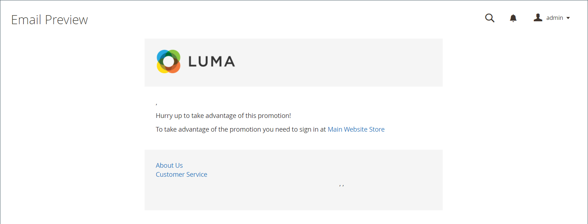

# メールリマインダー

{{ee-feature}}

メールリマインダーの目的は、店舗を訪問した人々にプロモーションを利用して購入するように促すことです。 特定の条件セットが満たされると、メールリマインダーを自動的に顧客に送信できます。 例えば、買い物かごやウィッシュリストに商品を追加したものの、まだ購入に至っていない顧客にリマインダーを送ることができます。 メールリマインダーを使用して、お客様が店舗に戻るように促し、インセンティブとして[ クーポンコード ](price-rules-cart-coupon.md)を含めることができます。 クーポンコードは、メールリマインダーのバッチごとに自動的に生成でき、各バッチに関連付けられたオファーを制御できます。

カートが放棄されてから特定の日数が経過した後、または定義するその他の条件について、メールリマインダーをトリガーできます。 一般的な条件には、カートの合計数、数量、カート内の商品などが含まれます。

>[!NOTE]
>
>顧客が複数のマッチングされたカート放棄、ウィッシュリスト、またはその両方の組み合わせを持っている場合、メールリマインダーはその顧客に対して1回だけトリガーされます。 同じメールリマインダーを再度トリガーするには、_[!UICONTROL Repeat Schedule]_フィールドを使用して、メール間の日数を設定します。

{width="700" zoomable="yes"}

## メールリマインダーを設定

メールリマインダールールは、分、時間、日ごとに定期的に送信できます。 この設定により、バッチで送信されるメールの数と、メッセージの送信者として表示されるストア IDが決まります。

1. _管理者_ サイドバーで、**[!UICONTROL Stores]** > _[!UICONTROL Settings]_>**[!UICONTROL Configuration]**に移動します。

1. 左側のパネルで、**[!UICONTROL Customers]**&#x200B;を展開し、**[!UICONTROL Promotions]**&#x200B;を選択します。

1. **[!UICONTROL Automated Email Reminder Rules]** セクションのを展開し、次の操作を行います。

   {width="600" zoomable="yes"}

   - **[!UICONTROL Enable Reminder Emails]**&#x200B;を`Yes`に設定します。

   - 自動メールリマインダーが適格な新規顧客のチェックを実行する頻度を設定するには、**[!UICONTROL Frequency]**&#x200B;を次のいずれかに設定します。

      - `Minute Intervals`
      - `Hourly`
      - `Daily`

   - _[!UICONTROL Frequency]_設定に基づいて、適切な&#x200B;**[!UICONTROL Interval]**を設定します。

   - **[!UICONTROL Start Time]**&#x200B;を、24時間の時刻に基づいて、電子メールが送信される時間、分、秒に設定します。

   - バッチで送信できるメールの数を制限するには、**[!UICONTROL Maximum Emails per One Run]** フィールドに番号を入力します。

   - 失敗した電子メールの送信を繰り返し試行しないようにするには、**[!UICONTROL Email Send Failure Threshold]** フィールドに最大試行回数を入力します。

   - **[!UICONTROL Reminder Email Sender]**&#x200B;を、リマインダー電子メールの送信者として表示される[ ストア連絡先](../getting-started/store-details.md#store-email-addresses)に設定します。

   これらのオプションの詳細なリストについては、_設定リファレンス_&#x200B;の[自動メールリマインダールール ](../configuration-reference/customers/promotions.md#automated-email-reminder-rules)を参照してください。

1. 完了したら、**[!UICONTROL Save Config]**&#x200B;をクリックします。

## メールリマインダーテンプレート

デフォルトのメールリマインダーテンプレートはカスタマイズでき、別のプロモーション用に追加のテンプレートを作成することもできます。 メールリマインダーには、メッセージに組み込むことができる特定の変数の選択肢があります。 これらの変数の情報は、設定したメールリマインダールールと、クーポンに関連付けられたカート価格ルールによって決まります。 「変数を挿入」ボタンを使用すると、変数を含むマークアップタグをテンプレートに挿入できます。 詳しくは、[電子メール ](../systems/email-templates.md)を参照してください。

{width="600" zoomable="yes"}

### メールリマインダーテンプレートのカスタマイズ

1. _管理者_ サイドバーで、**[!UICONTROL Marketing]** > _[!UICONTROL Communications]_>**[!UICONTROL Email Templates]**に移動します。

1. **[!UICONTROL Add New Template]**&#x200B;をクリックします。

1. `Magento_Reminder`の下の&#x200B;**[!UICONTROL Template]** リストで、**[!UICONTROL Promotion Notification/Reminder]** テンプレートを選択します。

1. **[!UICONTROL Load Template]**&#x200B;をクリックします。

標準の[手順](../systems/email-template-custom.md)に従って、テンプレートをカスタマイズします。

### メールリマインダー変数

#### クーポンコード

```
{{var coupon.getCode()|escape}}
```

#### クーポン使用制限

```
{{var coupon.usage_limit|escape}}
```

#### 顧客あたりのクーポン使用率

```
{{var coupon.usage_per_customer|escape}}
```

#### 顧客アカウント URL

```
{{var this.getUrl($store,'customer/account/',[_nosid:1])}}
```

#### 企業名

```
{{var customer_data.name|escape}}
```

#### メールフッターテンプレート

```
{{template config_path="design/email/footer_template"}}
```

#### メールヘッダーテンプレート

```
{{template config_path="design/email/header_template"}}
```

#### メールロゴ画像Alt

```
{{var logo_alt}}
```

#### 電子メールロゴ画像URL

```
{{var logo_url}}
```

#### プロモーションの説明

```
{{var promotion_description|escape|nl2br}}
```

#### プロモーション名

```
{{var promotion_name|escape}}
```

#### ストア名

```
{{var store.frontend_name}}
```

#### ストア URL

```
{{store url=""}}
```
