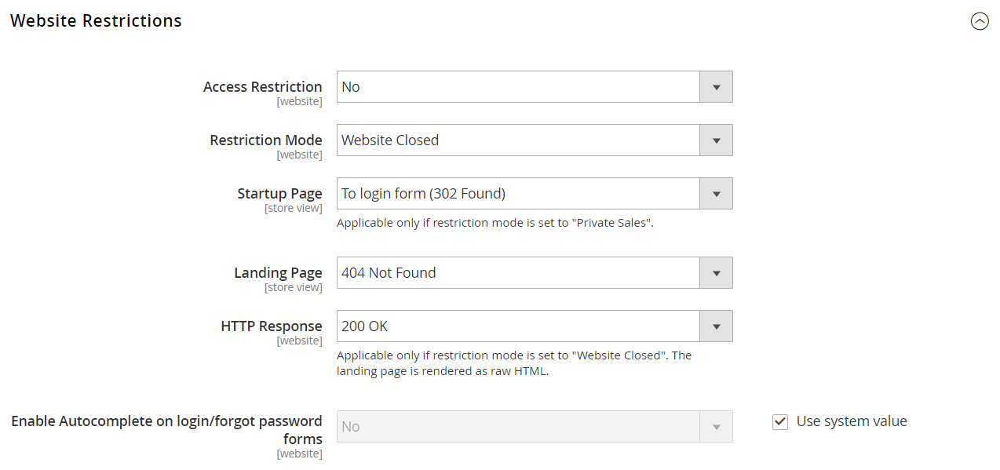

# イベントの設定

{{ee-feature}}

イベントを作成する前に、基本的な設定を完了してイベントを有効にし、サイドバーでイベントブロックを設定する必要があります。

## イベントの有効化と設定

1. _管理者_ サイドバーで、**[!UICONTROL Stores]** > _[!UICONTROL Settings]_>**[!UICONTROL Configuration]**&#x200B;に移動します。

1. 左側のパネルで「**[!UICONTROL Catalog]**」を展開し、下の「**[!UICONTROL Catalog]**」を選択します。

1. **[!UICONTROL Catalog Events]** セクションのを展開し、次の操作を行います。

   {width="600" zoomable="yes"}

   - **[!UICONTROL Enable Catalog Events Functionality]**&#x200B;を`Yes`に設定します。

   - **[!UICONTROL Enable Catalog Event Widget on Storefront]**&#x200B;を`Yes`に設定します。

   - **[!UICONTROL Number of Events to be Displayed in the Event Slider Sidebar Widget]**&#x200B;を入力します。 デフォルトでは、この値は`5`に設定されています。 一度にスライダーに1つのイベントのみを表示する場合は、`1`と入力します。

   - **[!UICONTROL Events to Scroll per Click in Event Slider Sidebar Widget]**&#x200B;の数字を入力してください。 デフォルトでは、この値は`2`に設定されています。 クリック時にスライダーで次のイベントを順番に表示する場合は、`1`と入力します。

1. 完了したら、**[!UICONTROL Save Config]**&#x200B;をクリックします。

## アクセス制限

プライベートセール、イベント、またはサイトへのアクセスは、ログインする登録済みの顧客に限定するか、アクセスを取得する前に登録する必要がある非登録顧客に拡張できます。

{width="600" zoomable="yes"}

### アクセスを制限

プライベートセール、イベント、またはサイトへのアクセスは、ログインする登録済みの顧客に限定するか、アクセスを取得する前に登録する必要がある非登録顧客に拡張できます。

{width="600" zoomable="yes"}

1. _管理者_ サイドバーで、**[!UICONTROL Stores]** > _[!UICONTROL Settings]_>**[!UICONTROL Configuration]**&#x200B;に移動します。

1. 左側のパネルで「**[!UICONTROL General]**」を展開し、下の「**[!UICONTROL General]**」を選択します。

1. **[!UICONTROL Website Restrictions]** セクションのを展開します。

1. **[!UICONTROL Access Restriction]**&#x200B;を`Yes`に設定します。

1. **[!UICONTROL Restriction Mode]**&#x200B;を次のいずれかに設定します：

   - `Website Closed`
   - `Private Sales: Login Only`
   - `Private Sales: Login and Register`

1. **[!UICONTROL Startup Page]**&#x200B;を次のいずれかに設定します：

   - `To login form (302 Found)` - ユーザーは、サイトへのアクセスを取得する前に、ログインフォームにリダイレクトされます。

   - `To landing page (302 Found)` - ユーザーは、ログインするまで、指定されたランディングページにリダイレクトされます。

     >[!IMPORTANT]
     >
     >顧客がログインしてサイトにアクセスできるように、ランディングページからログインページへのリンクを必ず含めてください。

1. 顧客がプライベート販売サイトにログインする前に表示される&#x200B;**[!UICONTROL Landing Page]**&#x200B;を選択します。

1. 検索エンジンのボットとスパイダーに、ランディングページが正しく、インデックスを作成するサイトに他のページがないことを知らせるには、**[!UICONTROL HTTP Response]**&#x200B;を`200 OK`に設定します。

   それ以外のすべての場合は`503 Service Unavailable`に設定されます。

   >[!NOTE]
   >
   >制限モードが&#x200B;_Web サイトが閉じられた_&#x200B;に設定されている場合にのみ適用されます。 ランディングページは生のHTMLとしてレンダリングされます。

1. 顧客ログインのフィールドと、パスワードを忘れたフォームを以前のエントリから自動的に入力する場合は、**[!UICONTROL Enable Autocomplete on login/forgot password forms]**&#x200B;を`Yes`に設定します。

1. 完了したら、**[!UICONTROL Save Config]**&#x200B;をクリックします。

### 販売制限

デフォルトでは、今後のイベントまたはクローズドイベントに表示される製品は一般販売には使用できず、製品リストまたは製品ページに&#x200B;_[!UICONTROL Add to Cart]_&#x200B;ボタンは表示されません。

クローズしたイベントの&#x200B;_[!UICONTROL Add to Cart]_&#x200B;ボタンを復元するには、イベントを削除する必要があります（[&#x200B; イベントの更新](event-create.md#update-events)を参照）。 ただし、製品が販売制限のない別のカテゴリに関連付けられている場合、そのボタンは製品ページで使用できます。 同様に、商品が販売制限のない別のカテゴリに関連付けられている場合、商品ページにティッカーブロックは表示されません。
