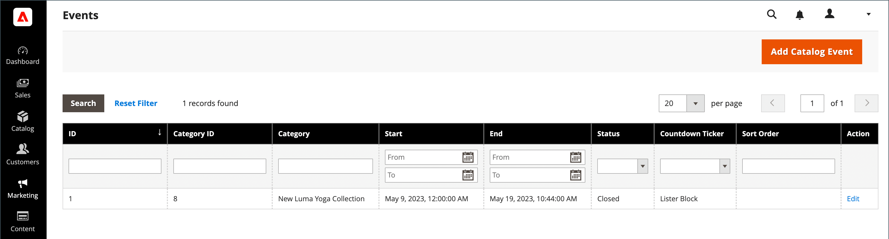
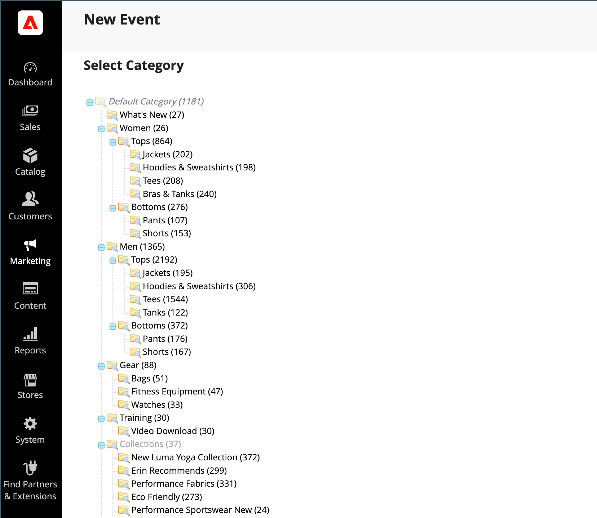

# イベントの作成と更新

{{ee-feature}}

各イベントはカタログのカテゴリに関連付けられており、一度に特定のカテゴリに関連付けることができるイベントは1つだけです。 ストア内の今後のイベントのリストを表示するには、[ カタログイベントカルーセル ](../content-design/widget-event-carousel.md) ウィジェットも設定する必要があります。

{width="700" zoomable="yes"}

## イベントの作成

1. _管理者_ サイドバーで、**[!UICONTROL Marketing]** > _[!UICONTROL Private Sales]_>**[!UICONTROL Events]**に移動します。

1. 右上隅の「**[!UICONTROL Add Catalog Event]**」をクリックします。

1. カテゴリーツリーで、イベントに関連付けるカテゴリを選択します。

   各カテゴリは一度に1つのイベントのみを持つことができるので、既にイベントを持っているカテゴリは無効になります。

   {width="500" zoomable="yes"}

1. **[!UICONTROL Catalog Event Information]**&#x200B;を定義：

   {width="700" zoomable="yes"}

   - イベントの&#x200B;**[!UICONTROL Start Date]**&#x200B;の場合、カレンダー（）を使用して日付を選択します。 **[!UICONTROL Hour]**&#x200B;と&#x200B;**[!UICONTROL Minute]**&#x200B;のスライダーを使用して、イベントの開始時間を設定します。

   - イベントの&#x200B;**[!UICONTROL End Date]**&#x200B;の場合、カレンダー（）を使用して日付を選択します。 **[!UICONTROL Hour]**&#x200B;と&#x200B;**[!UICONTROL Minute]**&#x200B;のスライダーを使用して、イベントの終了時間を設定します。

   - イベントウィジェットの&#x200B;**[!UICONTROL Image]**&#x200B;をアップロードするには、**[!UICONTROL Choose File]**&#x200B;をクリックし、ディレクトリから画像ファイルを選択します。

   - 「**[!UICONTROL Sort Order]**」フィールドに、他のイベントと共にリストされたときに、このイベントが表示されるシーケンスを示す数値を入力します。

   - カウントダウンティッカーを表示する各ページタイプのチェックボックスを選択します。

1. 完了したら、**[!UICONTROL Save]**&#x200B;をクリックします。

## イベントの更新

イベントは、イベントページまたはイベントに関連付けられているカテゴリから編集できます。 カテゴリに関連するイベントがある場合、右上隅に「イベントを編集」ボタンが表示されます。

### 方法1: イベント ページからイベントを編集する

1. _管理者_ サイドバーで、**[!UICONTROL Marketing]** > _[!UICONTROL Private Sales]_>**[!UICONTROL Events]**に移動します。

1. リストでイベントを見つけ、編集モードで開きます。

1. イベントに必要な変更を加えます。

1. 完了したら、**[!UICONTROL Save]**&#x200B;をクリックします。

### 方法2：カテゴリからイベントを編集する

1. _管理者_ サイドバーで、**[!UICONTROL Catalog]** > **[!UICONTROL Categories]**&#x200B;に移動します。

1. 左側のカテゴリーツリーで、イベントに関連付けられているカテゴリを選択します。

1. 右上隅で、**[!UICONTROL Edit Even]t**&#x200B;をクリックします。

1. イベントに必要な変更を加えます。

1. 完了したら、**[!UICONTROL Save]**&#x200B;をクリックします。

## イベントの削除

1. _管理者_ サイドバーで、**[!UICONTROL Marketing]** > _[!UICONTROL Private Sales]_>**[!UICONTROL Events]**に移動します。

1. リストでイベントを見つけ、編集モードで開きます。

1. 右上隅の「**[!UICONTROL Delete]**」をクリックします。

1. アクションを確認するには、**[!UICONTROL OK]**&#x200B;をクリックします。

## フィールドの説明

| フィールド | [範囲](../getting-started/websites-stores-views.md#scope-settings) | 説明 |
|--- |--- |--- |
| [!UICONTROL Category] | グローバル | イベントを作成する場合、このフィールドはカテゴリーツリーにリンクされます。 イベントを編集すると、そのイベントに関連するカテゴリーページにリンクされます。 |
| [!UICONTROL Start Date] | グローバル | イベントの開始日時（`MMDDYYYY HH;MM`形式）。 カレンダーアイコンをクリックして、日付を選択します。 |
| [!DNL End Date] | グローバル | イベントの終了日時（形式：`MMDDYYYY HH;MM`）。 カレンダーアイコンをクリックして、日付を選択します。 |
| [!UICONTROL Image] | ストアビュー | [ カタログイベントカルーセルウィジェット ](../content-design/widget-event-carousel.md)に表示される画像をアップロードします。 |
| [!UICONTROL Sort Order] | グローバル | 他のイベントと共にリストされたときに、このイベントが表示される順序を決定します。 |
| [!UICONTROL Display Countdown Ticker On] | グローバル | 指定した各ページのヘッダーにカウントダウンティッカーを表示します。 オプション：`Category Page` / `Product Page` |
| [!UICONTROL Status] | グローバル | 開始日と終了日の範囲に基づいて、イベントのステータスを示します。 ステータスは読み取り専用の値です。 値：`Open` / `Closed` / `Upcoming` |

{style="table-layout:auto"}

## ボタンバー

| ボタン | 説明 |
|--- |--- |
| **[!UICONTROL Back]** | 新しいイベントまたは既存のイベントの変更を保存せずに、イベントページに戻ります。 |
| **[!UICONTROL Delete]** | イベントを削除します。 |
| **[!UICONTROL Reset]** | 保存されていない変更のフォームを消去し、元のイベント情報を復元します。 |
| **[!UICONTROL Save and Continue Edit]** | すべての変更を保存し、フォームを編集モードで開いたままにします。 |
| **[!UICONTROL Save]** | 変更を保存し、フォームを閉じて、イベントページに戻ります。 |

{style="table-layout:auto"}
