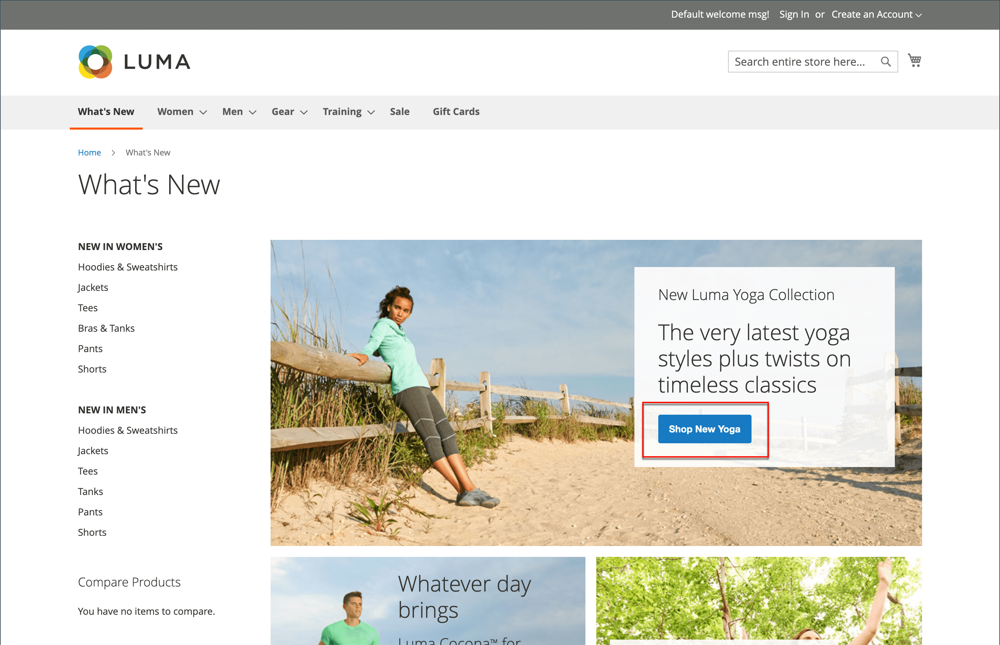

# プライベートセールとイベント

{{ee-feature}}

プライベートセールスやその他のカタログイベントは、既存顧客を活用して話題や新しいリードを生み出したり、余剰在庫をオフロードしたりするための優れた方法です。 期間限定セールの作成、特定のメンバーへのセール制限、スタンドアロンのプライベートセールページの作成を行うことができます。 また、招待とイベントの詳細を定義することもできます。 VIPで提供する優れた顧客体験を通じて、ブランドロイヤルティを高め、注目を集めましょう。 会員限定セールスやプライベートセールスへの限定アクセスを提供して、ブランドロイヤルティを高めます。 また、これらの売上を利用して、過剰な商品を清算することもできます。 お客様グループは、これらの種類のメンバーのみを設定したり、VIPのセールスを設定したりする際に便利です。

{width="700" zoomable="yes"}

## イベント管理コンポーネント

- **カテゴリ** – 各イベントは、カタログの[&#x200B; カテゴリ &#x200B;](../catalog/category-create.md)に関連付けられます。

- **イベント** - イベントの販売は、開始日と終了日に基づいています。 [&#x200B; カウントダウンティッカー](#event-ticker)を使用して、残り時間を表示できます。

- **カタログイベントカルーセル** - [&#x200B; カタログイベントウィジェット &#x200B;](../content-design/widget-event-carousel.md)が設定で有効になっている場合、ストアページに開封イベントと今後のイベントのリストとして、終了日で並べ替えて配置できます。 2つ以上のイベントの終了日が同じ場合、設定で指定された順序に基づいてイベントが並べ替えられます。

- **[!UICONTROL Websites]** - カテゴリの権限は、主に[顧客グループ &#x200B;](../customers/customer-groups.md)に基づいています。

- **カテゴリ権限** - [&#x200B; カテゴリ権限](../catalog/category-permissions.md)を使用すると、特定のカテゴリで実行できる特定のアクティビティを完全に制御できます。

- **アクセス制限** - ランディングページ、ログインページ、または登録ページにリダイレクトして、サイトへのパブリック [&#x200B; アクセス &#x200B;](event-configure.md#restrict-access)を禁止します。

- **招待状** - メール メッセージは、ストアでアカウントを作成するためのリンクとともに送信されます。 アカウントの作成機能は、[招待状](invitations.md)を受け取ったユーザーのみに制限できます。

- **個人向けセールスレポート** - [個人向けセールスレポート &#x200B;](../getting-started/private-sales-reports.md)では、招待の送信先、招待された顧客、コンバージョンに関する情報が提供されます。

## イベントティッカー

ティッカーブロックには、開いているイベントのカウントダウンティッカーが表示され、今後のイベントの開始日と終了日が表示されます。 イベントが終了した場合、ティッカーには開始日と終了日が表示されます。

{width="700" zoomable="yes"}

イベントに対してカテゴリーページティッカーが有効になっている場合は、カテゴリーリストの上部にティッカーブロックが表示されます。 製品ページティッカーが有効になっている場合は、カテゴリに関連付けられている製品の製品ページの上部にもティッカーブロックが表示されます。

イベントティッカーは、[&#x200B; イベントの作成時](event-create.md)に有効にできます。

{width="700" zoomable="yes"}
