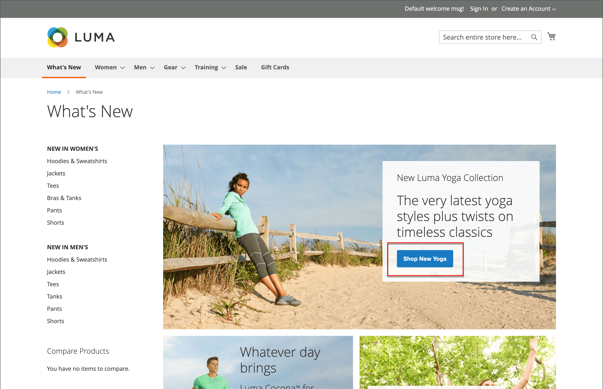

# プライベートセールスとイベント

{{ee-feature}}

プライベートセールスや他のカタログイベントは、既存の顧客ベースを使用してバズや新規リードを生成したり、余剰在庫をオフロードしたりする優れた方法です。 期間限定の販売を作成したり、特定のメンバーに販売を制限したり、スタンドアロンのプライベート販売ページを作成したりできます。 招待状とイベントの詳細を定義することもできます。 最高の顧客にVIPの取り扱いを提供することで、ブランドのロイヤルティを高め、バズを生み出します。 メンバーのみの販売またはプライベート販売に対する排他的なアクセスを提供して、ブランドロイヤルティを向上させます。 また、これらの売り上げを使用して、余分な商品を清算することもできます。 顧客グループは、これらのタイプのメンバーのみとVIPの販売を設定する際に役立ちます。

{width="700" zoomable="yes"}

## イベント管理コンポーネント

- **カテゴリ**  — 各イベントは [カテゴリ](../catalog/category-create.md) カタログから。

- **イベント**  — イベントの販売は開始日と終了日に基づいておこなわれます。 次の項目を使用できます。 [カウントダウンティッカー](#event-ticker) 残り時間を表示します。

- **カタログイベントカルーセル** - [カタログイベントウィジェット](../content-design/widget-event-carousel.md) が設定で有効になっている場合、開封および今後のイベントのリストとしてストアページに配置でき、終了日順に並べ替えられます。 2 つ以上のイベントの終了日が同じ場合、設定で指定された順序に基づいてイベントが並べ替えられます。

- **[!UICONTROL Websites]**  — カテゴリ権限は主に次の項目に基づいています。 [顧客グループ](../customers/customer-groups.md).

- **カテゴリ権限** - [カテゴリ権限](../catalog/category-permissions.md) を使用すると、特定のカテゴリで実行できる特定のアクティビティを完全に制御できます。

- **アクセス制限**  — 公開を禁止 [アクセス](event-configure.md#restrict-access) ランディングページ、ログインページまたは登録ページにリダイレクトしてサイトに移動します。

- **招待**  — 電子メールメッセージは、ストアにアカウントを作成するためのリンクと共に送信されます。 アカウントの作成機能は、 [招待状](invitations.md).

- **プライベート販売レポート** - [プライベートセールスレポート](../getting-started/private-sales-reports.md) 送信された招待状、招待された顧客、コンバージョンに関する情報を提供します。

## イベントティッカー

ティッカーブロックには、オープンイベントのカウントダウンティッカーが表示され、今後のイベントの開始日と終了日が示されます。 イベントが閉じられた場合、開始日と終了日がティッカーに表示されます。

{width="700" zoomable="yes"}

カテゴリページティッカーがイベントに対して有効になっている場合は、カテゴリリストの上部にティッカーブロックが表示されます。 商品ページティッカーが有効になっている場合は、カテゴリに関連付けられている商品の商品ページの上部にもティッカーブロックが表示されます。

イベントティッカーは、 [イベントの作成](event-create.md).

{width="700" zoomable="yes"}
