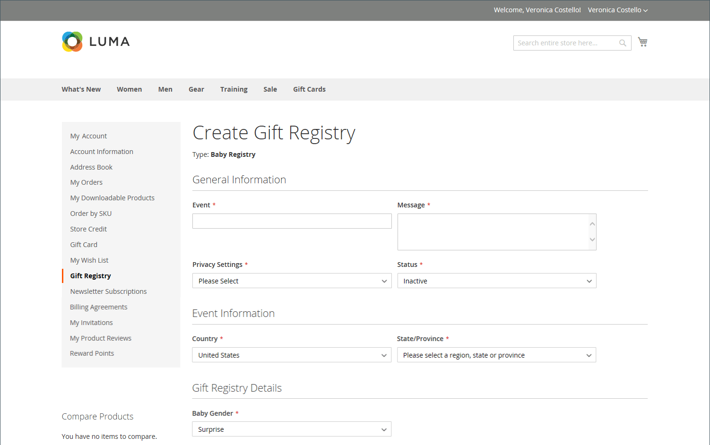

# ギフト登録簿

{{ee-feature}}

Adobe Commerceは、お客様に特別な機会にギフト用レジストリを作成し、友人や家族にギフト用レジストリからギフトを購入するよう勧めます。 Adobe Commerceは、購入した品目と残りの数量を追跡します。

{width="700" zoomable="yes"}

ギフトレジストリ所有者は、製品をレジストリに追加できます。 [顧客ダッシュボード](gift-registry-storefront.md#gift-registry-information). さらに、ウィッシュリストまたは買い物かごから製品を転送できます。 店舗管理者は、顧客のギフト登録を表示および共有できます。 また、顧客の買い物かごからの品目の追加、数量の更新、ギフトレジストリの削除などのメンテナンスを実行することもできます。

ギフトレジストリにアクセスするには、受信者が受け取った電子メールのリンクをクリックするか、受信者の名前、電子メールまたはギフトレジストリ ID で検索します。 ほとんどの店舗では、各ページのフッターにはギフトレジストリへのリンクが含まれますが、場所はテーマによって異なる場合があります。 また、 [Widget](../content-design/widgets.md) ツールを使用して [ギフトレジストリ検索](gift-registry-search.md) ストア内の任意の場所です。

購入を希望するレジストリ訪問者は、ギフトレジストリから直接買い物かごに品目を追加できます。 注文が行われると、ギフトレジストリが更新され、購入が反映されます。

## ギフトレジストリのワークフロー

1. **ストアのギフトレジストリを設定します**. ストア管理者 [ギフトレジストリを有効にします](gift-registry-configure.md)、および [レジストリの種類と属性を設定します](gift-registry-create.md).

1. **お客様が独自のレジストリを作成する**. A [顧客がギフトレジストリを作成する](gift-registry-storefront.md#create-a-new-gift-registry) 次の日の店舗アカウントから、ギフトレジストリの各セクションの必須フィールドに入力します。 レジストリに項目を追加した後、友人や家族と共有できます。

1. **顧客が登録簿を共有する**. ギフトレジストリへのリンクは各 [招待状](gift-registry-storefront.md#share-a-gift-registry). 次の場合 [ギフトレジストリ検索](gift-registry-search.md) はストアで利用でき、顧客は名前、電子メールアドレス、またはギフトレジストリ ID で特定のギフトレジストリを検索できます。

1. **招待状の受信者が注文をします**. 招待状や登録情報を受け取った者は、ギフトレジストリから直接、任意のアイテムの注文を行うことができます。 商品が販売されると、Adobe Commerceはギフトレジストリの商品数を更新し、ギフトレジストリの所有者に通知します。
