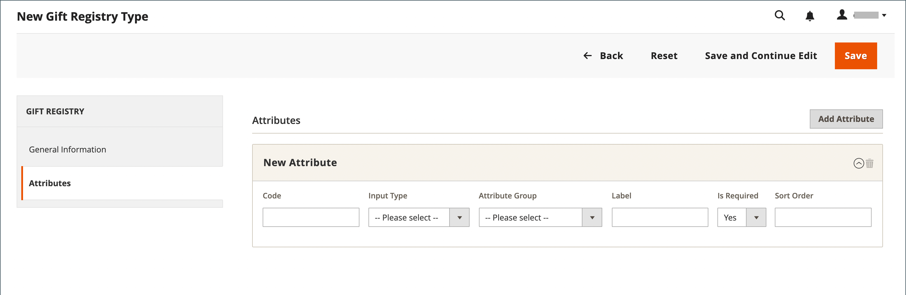

# ギフトレジストリの設定

{{ee-feature}}

ギフトレジストリは、結婚式、誕生日、記念日、新しい赤ちゃん、またはその他の特別な機会など、あらゆる種類のイベント用に作成できます。 デフォルトでは、Adobe Commerceには次の特別なイベントが含まれています。

- ベビー
- 生年月日
- ウェディング

レジストリを作成すると、お客様のアカウントのギフトレジストリタイプのリストにオプションが表示されます。

3つの準備されたギフトレジストリのいずれかを使用するか、独自のカスタムレジストリを作成できます。 各ギフトレジストリタイプには、顧客がギフトレジストリを作成するために入力するデータ入力フィールドである複数の属性が含まれています。 属性には、イベント、時間と場所、または必要なその他の情報に関する追加情報が含まれます。 入力タイプによっては、一部の属性に複数のオプションがあります。 例えば、`Wedding` ギフトレジストリタイプには属性`Role`があり、オプションは`Bride`、`Groom`、および`Partner`です。 属性と入力タイプについて詳しくは、[属性](../customers/attribute-properties.md)を参照してください。

{width="700" zoomable="yes"}

## 準備されたギフトレジストリを使用する

1. _管理者_ サイドバーで、**[!UICONTROL Stores]** > _[!UICONTROL Other Settings]_>**[!UICONTROL Gift Registry]**に移動します。

   誕生日、結婚式、赤ちゃんの登録簿は、顧客がアカウントから使用できるようにする準備ができています。

1. [ メールテンプレート設定](../systems/email-templates.md#configure-email-templates)を完了して、ブランドを反映するようにしてください。

## カスタムギフトレジストリの作成

1. 管理者サイドバーで、**[!UICONTROL Stores]** > _[!UICONTROL Other Settings]_>**[!UICONTROL Gift Registry]**に移動します。

1. 右上隅の「**[!UICONTROL Add Gift Registry Type]**」をクリックします。

1. **[!UICONTROL General Information]**&#x200B;で、次の操作を実行します。

   - 内部でギフトレジストリを識別するために、一意の&#x200B;**[!UICONTROL Code]**&#x200B;を入力します。

     コードは小文字で始める必要があります。 コードの残りの部分は、小文字（a ～ z）、数字（0 ～ 9）、およびアンダースコア （`_`）の任意の組み合わせにすることができます。

   - **[!UICONTROL Label]**&#x200B;には、ストアに表示するギフトレジストリの名前を入力します。

     このラベルは、お客様が利用できるギフトレジストリタイプのリストのオプションです。

   - **[!UICONTROL Sort Order]**&#x200B;に番号を入力して、このギフトレジストリが他の種類と共に表示されるときに表示される順序を決定します。

   - ギフトレジストリを有効にするには、**[!UICONTROL Is Listed]**&#x200B;を`Yes`に設定します。

     {width="600" zoomable="yes"}

1. ギフトレジストリの各セクションを確認して、含める情報の種類を決定します。

1. 左側のパネルで、**[!UICONTROL Attributes]**&#x200B;を選択し、**[!UICONTROL Add Attribute]**&#x200B;をクリックします。

   {width="600" zoomable="yes"}

1. 各属性について、次の操作を行います。

   - 内部で属性を識別するために、一意の&#x200B;**[!UICONTROL Code]**&#x200B;を割り当てます。 コードの長さは最大15文字までで、小文字で始める必要があります。 残りのコードには、小文字（`a`-`z`）、数字（`0`-`9`）、アンダースコア（`_`）を使用して単語を区切ることができます。

   - データ入力に使用する&#x200B;**[!UICONTROL Input Type]**&#x200B;を選択します。 カスタムタイプまたは静的タイプのいずれかを使用できます。

   - 入力タイプに複数のオプションがある場合は、**[!UICONTROL Add New Option]**&#x200B;をクリックし、各オプションの情報を入力します。

     一部の入力タイプには、追加のプロパティがあります。 例えば、イベントの場所には、イベントを検索可能にする追加のプロパティがあり、ストアのギフトレジストリの公開リストに含まれます。

      - **[!UICONTROL Attribute Group]**&#x200B;を、属性を表示するギフトレジストリ内のセクションに設定します。

      - **[!UICONTROL Label]**&#x200B;に、レジストリのデータ入力フィールドを識別する名前を入力します。

      - 顧客が選択するか、フィールドに値を入力する必要がある場合は、**[!UICONTROL Is Required]**&#x200B;を`Yes`に設定します。

      - **[!UICONTROL Sort Order]**&#x200B;の場合、このギフトレジストリがストアで利用可能な他のギフトレジストリと共に表示されるときに、このギフトレジストリが表示される順序を決定する番号を入力します。

1. 別のオプションを追加するには、**新しいオプションを追加**&#x200B;をクリックします。

   追加された新しいオプションは、上部の新しいセクションに表示されます。 新しい属性に対してこのプロセスを繰り返します。

1. 完了したら、**[!UICONTROL Save]**&#x200B;をクリックします。

## フィールドの説明

### [!UICONTROL General Information]

| フィールド | 説明 |
|--- |--- |
| [!UICONTROL Code] | 内部でギフトレジストリタイプを識別するための一意の名前。 コードの最初の文字は小文字にする必要があります。 コードの残りの部分は、小文字（a ～ z）、数字（0 ～ 9）、およびアンダースコア文字（`_`）の任意の組み合わせにすることができます。 |
| [!UICONTROL Label] | ストアに表示されるギフトレジストリタイプの名前。 |
| [!UICONTROL Sort Order] | 他の種類と共に表示されるときに、このギフトレジストリタイプが表示される順序を決定します。 |
| [!UICONTROL Is Listed] | ストア内のお客様がギフトレジストリタイプを利用できるかどうかを判断します。 オプション：`Yes` / `No`。 |

{style="table-layout:auto"}

### [!UICONTROL Attributes]

| フィールド | 説明 |
|--- |--- |
| [!UICONTROL Code] | 内部で属性を識別するための一意の名前。 このコードには、小文字（a ～ z）、数字（0 ～ 9）、アンダースコア文字（`_`）を任意の組み合わせで使用できます。 |
| [!UICONTROL Input Type] | 属性に関連付けられているデータと入力コントロールのタイプを、タイプに応じて決定します。 |
| [!UICONTROL Attribute Group] | 属性がギフトレジストリにリストされているグループを選択します。 |
| [!UICONTROL Label] | 顧客のアカウントダッシュボード内の属性を識別する名前。 |
| [!UICONTROL Is Required] | 属性が必須エントリであるかどうかを示します。 ギフトレジストリは、必要なすべての属性が完了するまで保存できません。 オプション：`Yes` / `No`。 |
| [!UICONTROL Sort Order] | 属性が他の属性と共に表示されるときに表示される順序を指定します。 |

{style="table-layout:auto"}

#### [!UICONTROL Input Type Options]

属性に関連付けられているデータと入力コントロールのタイプを選択します。

**_[!UICONTROL Custom Types]_**

| フィールド | 説明 |
|--- |--- |
| [!UICONTROL Text] | 属性をテキストフィールドとして表示します。 |
| [!UICONTROL Select] | 属性をドロップダウンリストとして表示します。 **[!UICONTROL Add New Option]**&#x200B;をクリックして、ドロップダウンリストに条件を追加します： **[!UICONTROL Code]**– 属性を内部的に識別するための一意の名前。 **[!UICONTROL Label]**  – 顧客のアカウント ダッシュボードの属性を識別する名前。 **[!UICONTROL Is Default]**– このスイッチを設定して、既定の条件を選択します。 **[!UICONTROL Delete Option]** - クリックしてオプションを削除します。 |
| [!UICONTROL Date] | 属性を日付フィールドとして表示します。 オプション：`Short (3/23/2014)` / `Medium (Mar 23, 1914)` / `Long (March 23, 1914)` / `Full (Sunday, March 23, 2014)` |
| [!UICONTROL Country] | 属性を国のドロップダウンリストとして表示します。 **[!UICONTROL Show Region]**&#x200B;を`Yes` / `No`に設定します。 |

{style="table-layout:auto"}

**_[!UICONTROL Static Types]_**

| フィールド | 説明 |
|--- |--- |
| [!UICONTROL Event Date] | ストアでの日付属性の使用方法を指定します。 オプション： **[!UICONTROL Searchable]**– 属性が詳細検索で使用できるかどうかを指定します。 オプション：`Yes` / `No`. **[!UICONTROL Is Listed]** - イベントがストアで利用可能なイベントのリストに含まれているかどうかを判断します。 オプション：`Yes` / `No`。 **[!UICONTROL Date Format]**- イベント日の形式を決定します。 オプション：`Short (3/23/2014)` / `Medium (Mar 23, 1914)` / `Long (March 23, 1914)` / `Full (Sunday, March 23, 2014)` |
| [!UICONTROL Event Country] | 属性を国のリストとして表示します。 オプション： **[!UICONTROL Searchable]**– 属性が詳細検索で使用できるかどうかを指定します。 オプション：`Yes` / `No`. **[!UICONTROL Is Listed]** - イベントがストアで利用可能なイベントのリストに含まれているかどうかを判断します。 オプション：`Yes` / `No`。 **[!UICONTROL Show Region]**- イベントの領域を決定します。 |
| [!UICONTROL Event Location] | ギフトレジストリに関連するイベントの場所。  設定&#x200B;**[!UICONTROL Is Searcheable]**&#x200B;から：`Yes` / `No`  設定&#x200B;**[!UICONTROL Is Listed]**&#x200B;から：`Yes` / `No` |
| [!UICONTROL Role] | ギフトの受信者を特定する役割。 例：`Bride`、`Groom`、または`Partner`。 **[!UICONTROL Is Searcheable]**- `Yes`/ `No` **&#x200B;がリストされています&#x200B;**- `Yes` / `No` **[!UICONTROL Add New Option]**&#x200B;に設定 – クリックしてドロップダウンメニューに条件を追加します： **コード** – 内部で属性を識別するための一意の名前。 **[!UICONTROL Label]**– 顧客のアカウント ダッシュボードの属性を識別する名前。 **[!UICONTROL Is Default]**  – このスイッチを設定して、既定の条件を選択します。 **[!UICONTROL Delete Option]**- クリックしてオプションを削除します。 |

{style="table-layout:auto"}

#### [!UICONTROL Attribute Group Options]

属性がギフトレジストリにリストされているグループを選択します。

| フィールド | 説明 |
|--- |--- |
| [!UICONTROL Event Information] | ギフトレジストリイベント、その時間、場所などの情報を追加するすべてのギフトレジストリ属性をグループ化します。 |
| [!UICONTROL Gift Registry Properties] | ギフトレジストリに関する情報を直接追加するすべての属性を組み合わせます。 |
| [!UICONTROL Privacy Settings] | ギフトレジストリイベントのプライバシーに関する情報を追加する属性を一覧表示します。 |
| [!UICONTROL Recipients Information] | ギフトレジストリを作成するユーザーに関する情報を提供する属性をグループ化します。 |
| [!UICONTROL Shipping Address] | ギフトレジストリイベントの配送先住所に関する情報を追加する属性を組み合わせます。 |

{style="table-layout:auto"}
