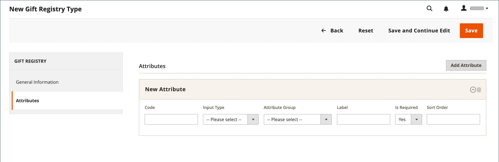

# ギフト レジストリの設定

{{ee-feature}}

ギフトレジストリは、結婚式、誕生日、記念日、新しい赤ちゃん、またはその他の特別な機会など、あらゆる種類のイベントに対して作成できます。 Adobe Commerceには、デフォルトで次のような特別なイベントが含まれています。

- 赤ちゃん
- 誕生日
- 結婚式

レジストリを作成すると、顧客のアカウントにあるギフト レジストリの種類の一覧のオプションになります。

3 つのギフト レジストリのいずれかを使用するか、独自のカスタム レジストリを作成できます。 各ギフトレジストリタイプには、複数の属性が含まれます。これらは、顧客がギフトレジストリを作成するために入力するデータ入力フィールドです。 属性は、イベント、時間、場所に関する追加情報、または必要なその他の情報を提供します。 入力タイプに応じて、一部の属性には複数のオプションがあります。 例えば、`Wedding` のギフトレジストリタイプには、属性 `Role` があり、`Bride`、`Groom`、`Partner` のオプションがあります。 属性と入力タイプについて詳しくは、[ 属性 ](../customers/attribute-properties.md) を参照してください。

{width="700" zoomable="yes"}

## 準備済みギフト レジストリの使用

1. _管理者_ サイドバーで、**[!UICONTROL Stores]**/_[!UICONTROL Other Settings]_/**[!UICONTROL Gift Registry]**に移動します。

   誕生日、結婚式、赤ちゃんのレジストリは、顧客が自分のアカウントから使用する準備ができています。

1. [ メールテンプレートの設定 ](../systems/email-templates.md#configure-email-templates) が完了し、ブランドが反映されていることを確認します。

## カスタムギフトレジストリの作成

1. 管理者サイドバーで、**[!UICONTROL Stores]**/_[!UICONTROL Other Settings]_/**[!UICONTROL Gift Registry]**に移動します。

1. 右上隅の「**[!UICONTROL Add Gift Registry Type]**」をクリックします。

1. 「**[!UICONTROL General Information]**」で、次の操作を実行します。

   - ギフト レジストリを内部で識別するための一意の **[!UICONTROL Code]** を入力します。

     コードは小文字で始める必要があります。 残りのコードは、小文字（a ～ z）、数字（0 ～ 9）、アンダースコア（`_`）の任意の組み合わせにすることができます。

   - **[!UICONTROL Label]** の場合、ストアに表示するギフトレジストリの名前を入力します。

     このラベルは、顧客が利用できるギフト レジストリの種類の一覧のオプションです。

   - **[!UICONTROL Sort Order]**：このギフト レジストリを他の種類と一緒に一覧表示するときの表示順序を決定する番号を入力します。

   - ギフト レジストリをアクティブにするには、**[!UICONTROL Is Listed]** を `Yes` に設定します。

     {width="600" zoomable="yes"}

1. ギフト レジストリの各セクションを調べて、含める情報の種類を決定します。

1. 左パネルで「**[!UICONTROL Attributes]**」を選択し、「**[!UICONTROL Add Attribute]**」をクリックします。

   {width="600" zoomable="yes"}

1. 各属性に対して、次の操作を行います。

   - 属性を内部的に識別する一意の **[!UICONTROL Code]** を割り当てます。 コードは最大 15 文字で、小文字で始める必要があります。 残りのコードには、単語を区切るための小文字（`a`～`z`）、数字（`0`～`9`）、アンダースコア（`_`）文字を含めることができます。

   - データ入力に使用する **[!UICONTROL Input Type]** を選択します。 カスタムタイプまたは静的タイプのいずれかを使用できます。

   - 入力タイプに複数のオプションがある場合は、「**[!UICONTROL Add New Option]**」をクリックして、オプションごとに情報を入力します。

     一部の入力タイプには、追加のプロパティがあります。 例えば、「イベントの場所」には、イベントを検索可能にする追加のプロパティがあり、ストアの公開ギフトレジストリリストに含まれています。

      - 属性を表示するギフトレジストリのセクションに **[!UICONTROL Attribute Group]** を設定します。

      - **[!UICONTROL Label]**：レジストリ内のデータ入力フィールドを識別する名前を入力します。

      - 顧客がフィールドで選択や値の入力を求められている場合は、「**[!UICONTROL Is Required]**」を「`Yes`」に設定します。

      - **[!UICONTROL Sort Order]**：番号を入力して、ストアで利用可能な他のギフト レジストリと一緒に表示されるときにこのギフト レジストリが表示される順序を決定します。

1. 別のオプションを追加するには、「**新しいオプションを追加**」をクリックします。

   追加された新しいオプションはそれぞれ、上部の新しいセクションに表示されます。 新しい属性に対して、このプロセスを繰り返します。

1. 完了したら、「**[!UICONTROL Save]**」をクリックします。

## フィールドの説明

### [!UICONTROL General Information]

| フィールド | 説明 |
|--- |--- |
| [!UICONTROL Code] | ギフト レジストリの種類を内部的に識別する一意の名前。 コードの最初の文字は、小文字にする必要があります。 残りのコードは、小文字（a ～ z）、数字（0 ～ 9）、アンダースコア文字（`_`）の任意の組み合わせにすることができます。 |
| [!UICONTROL Label] | ストアに表示されるギフト レジストリの種類の名前。 |
| [!UICONTROL Sort Order] | このギフト レジストリの種類が他の種類と共に一覧表示されるときに表示される順序を決定します。 |
| [!UICONTROL Is Listed] | ギフト レジストリの種類がストア内の顧客に対して利用可能かどうかを決定します。 オプション：`Yes`/`No`。 |

{style="table-layout:auto"}

### [!UICONTROL Attributes]

| フィールド | 説明 |
|--- |--- |
| [!UICONTROL Code] | 属性を内部的に識別する一意の名前。 コードには、小文字（a ～ z）、数字（0 ～ 9）、アンダースコア文字（`_`）の任意の組み合わせを含めることができます。 |
| [!UICONTROL Input Type] | タイプに従って、属性に関連付けられたデータのタイプと入力コントロールを決定します。 |
| [!UICONTROL Attribute Group] | ギフトレジストリに属性がリストされているグループを選択します。 |
| [!UICONTROL Label] | 顧客のアカウントダッシュボードで属性を識別する名前。 |
| [!UICONTROL Is Required] | 属性が必須エントリかどうかを示します。 ギフト レジストリは、必要な属性がすべて完了するまで保存できません。 オプション：`Yes`/`No`。 |
| [!UICONTROL Sort Order] | 他の属性と一緒にリストされた場合に表示される属性のシーケンスを指定します。 |

{style="table-layout:auto"}

#### [!UICONTROL Input Type Options]

属性に関連付けられているデータの種類と入力コントロールを選択します。

**_[!UICONTROL Custom Types]_**

| フィールド | 説明 |
|--- |--- |
| [!UICONTROL Text] | 属性をテキストフィールドとして表示します。 |
| [!UICONTROL Select] | 属性をドロップダウンリストとして表示します。 「**[!UICONTROL Add New Option]**」をクリックすると、ドロップダウンリストに条件を追加できます。 **[!UICONTROL Code]**– 属性を内部的に識別する一意の名前。 **[!UICONTROL Label]** – 顧客のアカウントダッシュボードで属性を識別する名前。 **[!UICONTROL Is Default]**- デフォルトの条件を選択する場合は、このスイッチを設定します。 **[!UICONTROL Delete Option]** - クリックしてオプションを削除します。 |
| [!UICONTROL Date] | 属性を日付フィールドとして表示します。 オプション：`Short (3/23/2014)`/`Medium (Mar 23, 1914)`/`Long (March 23, 1914)`/`Full (Sunday, March 23, 2014)` |
| [!UICONTROL Country] | 属性を国のドロップダウンリストとして表示します。 **[!UICONTROL Show Region]** を `Yes` / `No` に設定します。 |

{style="table-layout:auto"}

**_[!UICONTROL Static Types]_**

| フィールド | 説明 |
|--- |--- |
| [!UICONTROL Event Date] | ストアでの date 属性の使用方法を決定します。 オプション： **[!UICONTROL Searchable]**– 詳細検索に属性を使用できるかどうかを決定します。 オプション：`Yes`/`No`。 **[!UICONTROL Is Listed]** - ストアで使用可能なイベントのリストにイベントを含めるかどうかを決定します。 オプション：`Yes`/`No`。  **[!UICONTROL Date Format]**- イベントの日付の形式を決定します。 オプション：`Short (3/23/2014)`/`Medium (Mar 23, 1914)`/`Long (March 23, 1914)`/`Full (Sunday, March 23, 2014)` |
| [!UICONTROL Event Country] | 属性を国のリストとして表示します。 オプション： **[!UICONTROL Searchable]**– 詳細検索に属性を使用できるかどうかを決定します。 オプション：`Yes`/`No`。 **[!UICONTROL Is Listed]** - ストアで使用可能なイベントのリストにイベントを含めるかどうかを決定します。 オプション：`Yes`/`No`。  **[!UICONTROL Show Region]**- イベントの地域を決定します。 |
| [!UICONTROL Event Location] | ギフト レジストリに関連するイベントの場所。  **[!UICONTROL Is Searcheable]** を `Yes` / `No`  **[!UICONTROL Is Listed]** を `Yes` / `No` に設定 |
| [!UICONTROL Role] | ギフト受取人を識別する役割。 例えば、`Bride`、`Groom`、`Partner` などです。 **[!UICONTROL Is Searcheable]**- `Yes`/`No` に設定 ** 一覧表示 **- `Yes`/`No` に設定 **[!UICONTROL Add New Option]** - クリックしてドロップダウンメニューに条件を追加： **コード** – 属性を内部的に識別する一意の名前。 **[!UICONTROL Label]**– 顧客のアカウントダッシュボードで属性を識別する名前。 **[!UICONTROL Is Default]** - デフォルトの条件を選択する場合は、このスイッチを設定します。 **[!UICONTROL Delete Option]**- クリックしてオプションを削除します。 |

{style="table-layout:auto"}

#### [!UICONTROL Attribute Group Options]

ギフトレジストリに属性がリストされているグループを選択します。

| フィールド | 説明 |
|--- |--- |
| [!UICONTROL Event Information] | ギフト レジストリ イベント、その時刻、場所などに関する情報を追加するすべてのギフト レジストリ属性をグループ化します。 |
| [!UICONTROL Gift Registry Properties] | ギフトレジストリに関する情報を直接追加するすべての属性を結合します。 |
| [!UICONTROL Privacy Settings] | ギフト レジストリ イベントのプライバシーに関する情報を追加する属性の一覧が表示されます。 |
| [!UICONTROL Recipients Information] | ギフト レジストリを作成する人に関する情報を提供する属性をグループ化します。 |
| [!UICONTROL Shipping Address] | ギフト レジストリ イベントの配送先住所に関する情報を追加する属性を結合します。 |

{style="table-layout:auto"}
