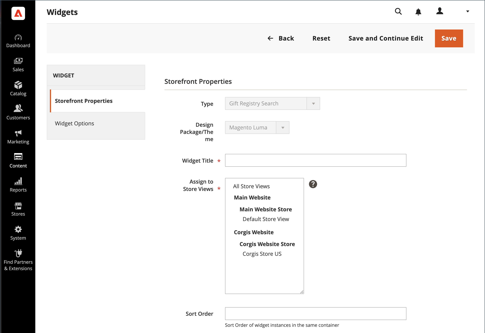

# ギフト レジストリ検索の追加

{{ee-feature}}

この [ウィジェット](../content-design/widgets.md) ツールを使用して、ギフトレジストリ検索ボックスをストア内の最も多くの場所に配置できます。 名前、メールアドレス、ギフトレジストリ ID など、顧客が使用できる検索オプションを指定できます。 顧客が「検索」ボタンをクリックすると、結果が「ギフトレジストリの検索」ページに表示されます。 検索で結果が返されない場合は、他のパラメーターを使用して再試行できます。

{width="700" zoomable="yes"}

## ギフト レジストリ検索の構成

1. 日 _Admin_ サイドバー、に移動 **[!UICONTROL Content]** > _[!UICONTROL Elements]_>**[!UICONTROL Widgets]**.

1. 右上隅のをクリックします。 **[!UICONTROL Add Widget]**.

1. を選択します。 **[!UICONTROL Settings]** tab キーを押して、次の操作を実行します。

   - を設定 **[!UICONTROL Type]** 対象： `Gift Registry Search`.

   - を設定 **[!UICONTROL Design Theme]** をストアが使用するテーマに変更します。

   - クリック **[!UICONTROL Continue]**.

   {width="700" zoomable="yes"}

1. が含まれる _[!UICONTROL Storefront Properties]_セクションで、次の操作を行います。

   - を入力 **[!UICONTROL Widget Title]** 内部参照用。

   - を設定 **[!UICONTROL Assign to Store Views]** ギフトレジストリ検索を使用できるストア表示に移動します。

   - を設定 **[!UICONTROL Sort Order]** ページ上の同じ場所に割り当てられている他のブロックがある場合に、ギフトレジストリ検索ブロックが表示される順序を決定します。

   {width="700" zoomable="yes"}

1. が含まれる **[!UICONTROL Layout Updates]** セクションで、をクリック **[!UICONTROL Add Layout Update]**.

1. ギフト レジストリの検索がストア内のどこに表示されるかを確認するには、次の操作を行います。

   - を設定 **[!UICONTROL Display On]** ギフト レジストリ検索ブロックを表示するストア内のページに移動します。

   - 該当する場合、 **[!UICONTROL Categories]** 目的の場所に挿入します。

   - を設定 **[!UICONTROL Container]** をギフトレジストリ検索ブロックを配置するページ上の場所に移動します。

   {width="500" zoomable="yes"}

1. 左パネルで、を選択します。 **[!UICONTROL Widget Options]**.

1. サイトの訪問者がギフトレジストリを検索する方法を決定するには、次の中から該当するものを選択します。

   - [!UICONTROL All Forms]
   - [!UICONTROL Registrant Name Search]
   - [!UICONTROL Registrant Email Search]
   - [!UICONTROL Gift Registry ID Search]

   {width="700" zoomable="yes"}

1. 完了したら、 **[!UICONTROL Save]**.

1. ページキャッシュを更新するように求めるプロンプトが表示されたら、ワークスペース上部のメッセージに記載されているリンクをクリックし、指示に従います。

## フィールドの説明

### [!UICONTROL Settings]

| フィールド | 説明 |
|--- |--- |
| [!UICONTROL Type] | Identities `Gift Registry Search` ウィジェットのタイプとして設定します。 |
| [!UICONTROL Design Theme] | ギフトレジストリ検索が表示されるストアで使用されるテーマ。 |

{style="table-layout:auto"}

### [!UICONTROL Storefront Properties]

| フィールド | 説明 |
|--- |--- |
| [!UICONTROL Widget Title] | 内部参照の名前。 |
| [!UICONTROL Assign to Store Views] | ギフトレジストリ検索を使用できるストア表示を識別します。 |
| [!UICONTROL Sort Order] | 割り当てられている他のブロックが同じ場所にある場合に、ギフト レジストリ検索ブロックが表示される順序を示します。 |

{style="table-layout:auto"}

### [!UICONTROL Layout Updates]

| フィールド | 説明 |
|--- |--- |
| [!UICONTROL Display On] | ギフトレジストリ検索ブロックが表示される特定のページまたはページの種類を指定します。 |
| [!UICONTROL Categories] | 該当する場合、はギフトレジストリ検索が表示されるカテゴリページを識別します。 |
| [!UICONTROL Container] | ギフト レジストリ検索が配置されるページ レイアウト ブロックを示します。 オプションは、テンプレートとテーマによって異なります。 |

{style="table-layout:auto"}

### [!UICONTROL Widget Options]

| フィールド | 説明 |
|--- |--- |
| [!UICONTROL Quick Search Form Types] | ギフト レジストリ検索で実行できる検索の種類を決定します。 オプション： `All Forms` / `Registrant Name Search` /` Registrant Email Search` / `Gift Registry ID Search` |

{style="table-layout:auto"}
