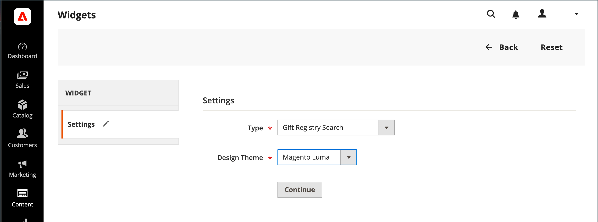
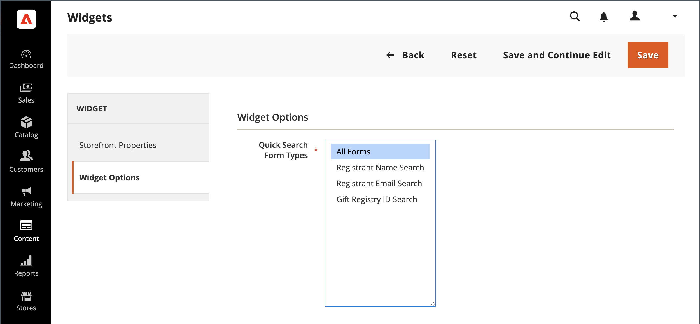

# ギフトレジストリ検索を追加

{{ee-feature}}

[Widget](../content-design/widgets.md) ツールを使用すると、ストア内の任意の場所にギフトレジストリ検索ボックスを配置できます。 名前、メールアドレス、ギフトレジストリ IDなど、顧客が使用できる検索オプションを指定できます。 お客様が「検索」ボタンをクリックすると、結果がギフトレジストリの検索ページに表示されます。 検索結果が返されない場合、顧客は他のパラメーターを使用して再試行できます。

{width="700" zoomable="yes"}

## ギフトレジストリ検索の設定

1. _管理者_ サイドバーで、**[!UICONTROL Content]** > _[!UICONTROL Elements]_>**[!UICONTROL Widgets]**に移動します。

1. 右上隅の「**[!UICONTROL Add Widget]**」をクリックします。

1. 「**[!UICONTROL Settings]**」タブを選択し、次の操作を行います。

   - **[!UICONTROL Type]**&#x200B;を`Gift Registry Search`に設定します。

   - ストアで使用されているテーマに&#x200B;**[!UICONTROL Design Theme]**&#x200B;を設定します。

   - **[!UICONTROL Continue]**&#x200B;をクリックします。

   {width="700" zoomable="yes"}

1. _[!UICONTROL Storefront Properties]_セクションで、次の操作を行います。

   - 内部参照用に&#x200B;**[!UICONTROL Widget Title]**&#x200B;を入力します。

   - **[!UICONTROL Assign to Store Views]**&#x200B;を、ギフトレジストリ検索を利用できるストアビューに設定します。

   - **[!UICONTROL Sort Order]**&#x200B;を設定して、ページ上の同じ場所に割り当てられている他のブロックがある場合に、Gift Registry Search ブロックが表示される順序を決定します。

   {width="700" zoomable="yes"}

1. **[!UICONTROL Layout Updates]** セクションで、**[!UICONTROL Add Layout Update]**&#x200B;をクリックします。

1. ギフトレジストリ検索がストアのどこに表示されるかを判断するには、次の操作を行います。

   - **[!UICONTROL Display On]**&#x200B;を、ギフトレジストリ検索ブロックを表示するストア内のページに設定します。

   - 該当する場合は、表示する&#x200B;**[!UICONTROL Categories]**&#x200B;を選択します。

   - **[!UICONTROL Container]**&#x200B;をページ上の場所に設定して、ギフトレジストリ検索ブロックを配置します。

   {width="500" zoomable="yes"}

1. 左側のパネルで、**[!UICONTROL Widget Options]**&#x200B;を選択します。

1. サイトの訪問者がギフトレジストリを検索する方法を決定するには、次の中から該当する数を選択します。

   - [!UICONTROL All Forms]
   - [!UICONTROL Registrant Name Search]
   - [!UICONTROL Registrant Email Search]
   - [!UICONTROL Gift Registry ID Search]

   {width="700" zoomable="yes"}

1. 完了したら、**[!UICONTROL Save]**&#x200B;をクリックします。

1. ページキャッシュの更新を求めるメッセージが表示されたら、ワークスペースの上部にあるメッセージ内のリンクをクリックし、指示に従います。

## フィールドの説明

### [!UICONTROL Settings]

| フィールド | 説明 |
|--- |--- |
| [!UICONTROL Type] | `Gift Registry Search`をウィジェットの種類として識別します。 |
| [!UICONTROL Design Theme] | ギフトレジストリ検索が表示されるストアで使用されるテーマ。 |

{style="table-layout:auto"}

### [!UICONTROL Storefront Properties]

| フィールド | 説明 |
|--- |--- |
| [!UICONTROL Widget Title] | 内部参照の名前。 |
| [!UICONTROL Assign to Store Views] | ギフトレジストリ検索を使用できるストアビューを特定します。 |
| [!UICONTROL Sort Order] | 同じ場所に表示するように割り当てられている他のブロックがある場合に、ギフトレジストリ検索ブロックが表示される順序を示します。 |

{style="table-layout:auto"}

### [!UICONTROL Layout Updates]

| フィールド | 説明 |
|--- |--- |
| [!UICONTROL Display On] | 特定のページ、またはギフトレジストリ検索ブロックが表示されるページの種類を示します。 |
| [!UICONTROL Categories] | 該当する場合は、ギフトレジストリ検索が表示されるカテゴリーページを特定します。 |
| [!UICONTROL Container] | ギフトレジストリ検索が配置されるページレイアウトブロックを示します。 オプションはテンプレートとテーマによって異なります。 |

{style="table-layout:auto"}

### [!UICONTROL Widget Options]

| フィールド | 説明 |
|--- |--- |
| [!UICONTROL Quick Search Form Types] | Gift Registry Searchで実行できる検索のタイプを指定します。 オプション：`All Forms` / `Registrant Name Search` /` Registrant Email Search` / `Gift Registry ID Search` |

{style="table-layout:auto"}
