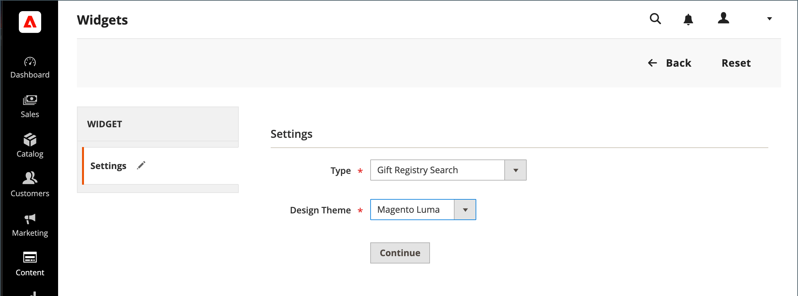

# ギフトレジストリ検索を追加

{{ee-feature}}

The [Widget](../content-design/widgets.md) ツールを使用して、お客様のストア内の最も多くの場所にギフトレジストリ検索ボックスを配置できます。 名前、電子メールアドレス、ギフトレジストリ ID など、顧客が使用できる検索オプションを指定できます。 顧客が「検索」ボタンをクリックすると、結果が「ギフトレジストリの検索」ページに表示されます。 検索で結果が返されない場合、顧客は他のパラメーターを使用して再試行できます。

{width="700" zoomable="yes"}

## ギフトレジストリ検索の設定

1. 次の日： _管理者_ サイドバー、移動 **[!UICONTROL Content]** > _[!UICONTROL Elements]_>**[!UICONTROL Widgets]**.

1. 右上隅で、 **[!UICONTROL Add Widget]**.

1. を選択します。 **[!UICONTROL Settings]** 」タブをクリックし、次の操作を実行します。

   - 設定 **[!UICONTROL Type]** から `Gift Registry Search`.

   - 設定 **[!UICONTROL Design Theme]** を、ストアで使用されるテーマに追加します。

   - クリック **[!UICONTROL Continue]**.

   {width="700" zoomable="yes"}

1. Adobe Analytics の _[!UICONTROL Storefront Properties]_セクションで、以下の操作を実行します。

   - を入力します。 **[!UICONTROL Widget Title]** 内部参照用。

   - 設定 **[!UICONTROL Assign to Store Views]** を追加します。

   - 設定 **[!UICONTROL Sort Order]** を使用して、ページ上の同じ場所に割り当てられた他のブロックがある場合に、ギフトレジストリ検索ブロックが表示される順序を決定します。

   {width="700" zoomable="yes"}

1. Adobe Analytics の **[!UICONTROL Layout Updates]** セクションで、 **[!UICONTROL Add Layout Update]**.

1. ギフトレジストリ検索がストア内で表示される場所を確認するには、次の手順を実行します。

   - 設定 **[!UICONTROL Display On]** を、ギフトレジストリ検索ブロックを表示するストア内のページに追加します。

   - 該当する場合は、 **[!UICONTROL Categories]** 表示する場所

   - 設定 **[!UICONTROL Container]** を、ギフトレジストリ検索ブロックを配置するページ上の場所に追加します。

   {width="500" zoomable="yes"}

1. 左側のパネルで、を選択します。 **[!UICONTROL Widget Options]**.

1. サイトの訪問者がギフトレジストリを検索する方法を決定するには、次の中から該当するものを選択します。

   - [!UICONTROL All Forms]
   - [!UICONTROL Registrant Name Search]
   - [!UICONTROL Registrant Email Search]
   - [!UICONTROL Gift Registry ID Search]

   {width="700" zoomable="yes"}

1. 完了したら、「 **[!UICONTROL Save]**.

1. ページキャッシュを更新するよう求められたら、ワークスペースの上部にあるメッセージ内のリンクをクリックし、指示に従います。

## フィールドの説明

### [!UICONTROL Settings]

| フィールド | 説明 |
|--- |--- |
| [!UICONTROL Type] | 識別子 `Gift Registry Search` をウィジェットのタイプとして追加します。 |
| [!UICONTROL Design Theme] | ギフトレジストリ検索を表示するストアで使用されるテーマ。 |

{style="table-layout:auto"}

### [!UICONTROL Storefront Properties]

| フィールド | 説明 |
|--- |--- |
| [!UICONTROL Widget Title] | 内部参照の名前。 |
| [!UICONTROL Assign to Store Views] | ギフトレジストリ検索を使用できるストア表示を識別します。 |
| [!UICONTROL Sort Order] | 同じ場所に他のブロックが割り当てられている場合に、ギフトレジストリ検索ブロックが表示される順序を示します。 |

{style="table-layout:auto"}

### [!UICONTROL Layout Updates]

| フィールド | 説明 |
|--- |--- |
| [!UICONTROL Display On] | ギフトレジストリ検索ブロックが表示される特定のページまたはページの種類を示します。 |
| [!UICONTROL Categories] | 該当する場合は、ギフトレジストリ検索が表示されるカテゴリページを識別します。 |
| [!UICONTROL Container] | ギフトレジストリ検索が配置されるページレイアウトブロックを示します。 オプションは、テンプレートとテーマによって異なります。 |

{style="table-layout:auto"}

### [!UICONTROL Widget Options]

| フィールド | 説明 |
|--- |--- |
| [!UICONTROL Quick Search Form Types] | ギフトレジストリ検索で実行できる検索の種類を決定します。 オプション： `All Forms` / `Registrant Name Search` /` Registrant Email Search` / `Gift Registry ID Search` |

{style="table-layout:auto"}
