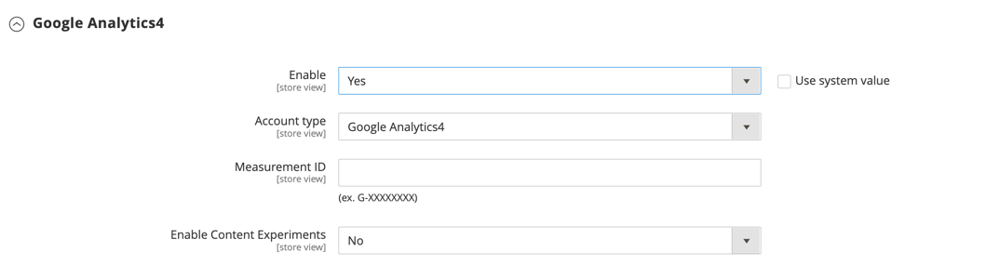
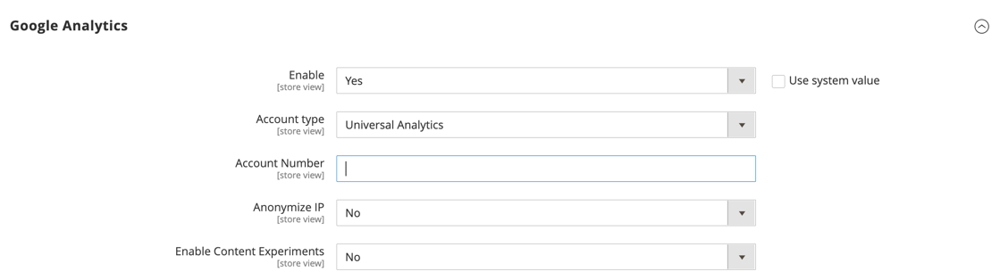

# [!DNL Google Analytics]

[!DNL Google Analytics] を使用すると、オフラインおよびモバイルアプリのインタラクションをサポートし、継続的な更新にアクセスできるので、トラッキング用に追加のカスタムディメンションと指標を定義できます。 [!DNL Google Analytics]4 は、Googleの次世代型計測ソリューションで、[!DNL Universal Analytics] に代わるものです。 2023 年 7 月 1 日（PT）に、標準の Universal Analytics プロパティは、新しいヒットの処理を停止します。

>[!NOTE]
>
>[EU 一般データ保護規則 ](../getting-started/compliance-gdpr.md) や [ カリフォルニア州消費者プライバシー法 ](../getting-started/compliance-ccpa.md) などのプライバシー規制の対象となるビジネスの場合は、[Googleのプライバシー設定 ](google-tools.md#google-privacy-settings) を参照してください。

>[!IMPORTANT]
>
>[Cookie 制限モード ](../getting-started/compliance-cookie-law.md) を有効にすると、訪問者が Cookie を受け入 [!DNL Google Analytics] ていない限り、訪問者に関するデータは収集されません。

## [!DNL Google Analytics] 4

{{gtag-api-note}}

### 手順 1:[!UICONTROL Google Analytics] 4 の設定

サイトの [!DNL Google Analytics] 4 設定がまだない場合は、次のいずれかの方法に従います。

- [ 初めて Analytics データ収集を設定する ](https://support.google.com/analytics/answer/9304153)
- [ サイトへのGoogle Analytics 4 の追加  [!DNL Universal Analytics]](https://support.google.com/analytics/answer/9744165)

### 手順 2:Commerceの設定を完了する

1. Commerce ストアの管理者にログインします。

1. _管理者_ サイドバーで、**[!UICONTROL Stores]**/_[!UICONTROL Settings]_/**[!UICONTROL Configuration]**&#x200B;に移動します。

1. 左側のパネルで「**[!UICONTROL Sales]**」を展開し、「**[!UICONTROL Google API]**」を選択します。

1. 「」を展開し、「**[!UICONTROL Google GTag]**」セクションを展開します。

1. **[!UICONTROL Google Analytics4]** のサブセクションの  を展開し、次の操作を実行します。

   - **[!UICONTROL Enable]** を `Yes` に設定します。

   - **[!UICONTROL Account type]** は `Google Analytics4` のままにしておきます。

   - **[!UICONTROL Measurement ID]** を入力します。 詳しくは、[Google Analyticsのヘルプ ](https://support.google.com/analytics/answer/9539598) を参照してください。

   - A/B テストやその他のパフォーマンステストをコンテンツに対して実行する場合は、「**コンテンツ実験**」を `Yes` に設定します。

   {width="600" zoomable="yes"}

1. 完了したら、「**[!UICONTROL Save Config]**」をクリックします。

## Google Universal Analytics

>[!IMPORTANT]
>
>2023 年 7 月 1 日（PT）をもって、標準のユニバーサルアナリティクス プロパティはデータを処理しなくなります。 それでも [!DNL Universal Analytics] に依存している場合は、今後 [Google Analytics 4 の使用準備 ](https://support.google.com/analytics/answer/10759417) をすることをお勧めします。

### 手順 1:Google Universal Analytics の設定

Googleの Web サイトにアクセスして、[Google Universal Analytics][1] アカウントに新規登録します。

### 手順 2:Commerceの設定を完了する

1. Commerce ストアの管理者にログインします。

1. _管理者_ サイドバーで、**[!UICONTROL Stores]**/_[!UICONTROL Settings]_/**[!UICONTROL Configuration]**&#x200B;に移動します。

1. 左側のパネルで「**[!UICONTROL Sales]**」を展開し、「**[!UICONTROL Google API]**」を選択します。

1. **[!UICONTROL Google Analytics]** のセクションの  を展開し、以下を実行します。

   - **[!UICONTROL Enable]** を `Yes` に設定します。

   - [!DNL Google Analytics] **[!UICONTROL Account Number]** を入力します。

   - A/B テストやその他のパフォーマンステストをコンテンツに対して実行する場合は、**[!UICONTROL Content Experiments]** を `Yes` に設定します。

   {width="600" zoomable="yes"}

1. 完了したら、「**[!UICONTROL Save Config]**」をクリックします。

## E コマースの強化

Enhanced Ecommerce は、顧客の買い物や購入行動に関するインサイトを提供する [!DNL Google Universal Analytics] のプラグインです。 E コマースの強化機能を使用すると、顧客が買い物かごに商品を追加したタイミング、チェックアウトプロセスを開始したタイミング、購入を完了したタイミングなど、顧客の主要なアクティビティに関するレポートを作成できます。 また、購入せずに買い物かごを放棄した買い物客のパターンを特定し、分析することもできます。

以下の手順は、[!DNL Universal Analytics] を使用して [!DNL Google Tag Manager] を設定し、拡張 E コマースデータとレポートを生成する方法を示しています。

### 手順 1. Google アカウントへの新規登録

1. [Google タグマネージャー ](google-tag-manager.md) アカウントに新規登録し、Commerceの設定を完了します。

1. 新しい [Google Universal Analytics][1] アカウントに新規登録します。

### 手順 2. Enhanced Ecommerce の設定

1. Google Universal Analytics アカウントにログインします。

1. 次の設定を使用して、Enhanced Ecommerce Analytics のプロパティを作成します。

   - 状態：オン
   - 関連製品：オン
   - E コマースレポートの強化機能を有効にする：オン
   - チェックアウトラベル：（必須ではありません）

1. 完了したら、「**[!UICONTROL Submit]**」をクリックします。

### 手順 3. タグとトリガーの作成

1. [!DNL Google Tag Manager] アカウントにログインし、次のトリガーを作成します。

   | 名前 | イベントタイプ | フィルター |
   |--- |--- |--- |
   | `addToCart` | カスタムイベント |  |
   | `checkout` | カスタムイベント |  |
   | `checkout only` | ページビュー | ページ URL が正規表現/checkout/に一致します。* |
   | `checkoutOption` | カスタムイベント |  |
   | `gtm.dom` | カスタムイベント |  |
   | `productClick` | カスタムイベント |  |
   | `promotionClick` | カスタムイベント |  |
   | `removeFromCart` | カスタムイベント |  |

   >[!NOTE]
   >
   >[!UICONTROL Checkout] イベントは、組み込みのCommerceの基本的な支払い方法（`Check / Money Order` や `Cash On Delivery Payment` など）に対してのみトリガーされます。 このイベントは、外部リソースからチェックアウトへのリダイレクトを使用する `PayPal checkout` やその他の外部支払い方法では実行されません。

1. 同じ基本設定で次の Universal Analytics タグを作成します。

   - Universal Analytics タグ

     | 名前 | タイプ | トリガーの実行 |
     |--- |--- |--- |
     | `Add to cart tracking` | ユニバーサルアナリティクス | addToCart |
     | `Checkout option tracking` | ユニバーサルアナリティクス | checkoutOption |
     | `Checkout tracking` | ユニバーサルアナリティクス | チェックアウト |
     | `Pageview tracking` | ユニバーサルアナリティクス | gtm.dom |
     | `Product click tracking` | ユニバーサルアナリティクス | productClick |
     | `Promo click tracking` | ユニバーサルアナリティクス | promotionClick |
     | `Remove from cart tracking` | ユニバーサルアナリティクス | removeFromCart |

   - タグの基本設定

     | 設定 | 値 |
     |--- |--- |
     | [!UICONTROL Product] | Google Analytics |
     | [!UICONTROL Tag Type] | ユニバーサルアナリティクス |
     | [!UICONTROL Tracking ID] | UA-XXX （ユニバーサルアナリティクスアカウントのトラッキング ID） |
     | [!UICONTROL Enable Enhanced Ecommerce Features] | True |
     | [!UICONTROL Use data layer] | True |
     | [!UICONTROL Use Debug version] | True |

1. 個々のトラッキング設定を完了します。

   - 次の **[!UICONTROL Add to Cart]** トラッキング設定を入力します。

     | 設定 | 値 |
     |--- |--- |
     | [!UICONTROL Track Type] | イベント |
     | [!UICONTROL Category] | E コマース |
     | [!UICONTROL Action] | カートに追加 |
     | [!UICONTROL Trigger] | addToCart |

   - 次の **[!UICONTROL Checkout option]** トラッキング設定を入力します。

     | 設定 | 値 |
     |--- |--- |
     | [!UICONTROL Track Type] | イベント |
     | [!UICONTROL Category] | E コマース |
     | [!UICONTROL Action] | チェックアウトオプション |
     | [!UICONTROL Trigger] | checkoutOption |

   - 次の **[!UICONTROL PageView]** トラッキング設定を入力します。

     | 設定 | 値 |
     |--- |--- |
     | [!UICONTROL Track Type] | ページビュー |
     | [!UICONTROL Trigger] | gtm.dom |

   - 次の **[!UICONTROL Product Click]** トラッキング設定を行います。

     | 設定 | 値 |
     |--- |--- |
     | [!UICONTROL Track Type] | イベント |
     | [!UICONTROL Category] | E コマース |
     | [!UICONTROL Action] | 製品クリック |
     | [!UICONTROL Trigger] | productClick |

   - 次の **[!UICONTROL Promotion Click]** トラッキング設定を行います。

     | 設定 | 値 |
     |--- |--- |
     | [!UICONTROL Track Type] | イベント |
     | [!UICONTROL Category] | E コマース |
     | [!UICONTROL Action] | プロモーションをクリック |
     | [!UICONTROL Trigger] | promotionClick |

   - 次の **[!UICONTROL Remove from Cart]** トラッキング設定を行います。

     | 設定 | 値 |
     |--- |--- |
     | [!UICONTROL Track Type] | イベント |
     | [!UICONTROL Category] | E コマース |
     | [!UICONTROL Action] | カートから削除 |
     | [!UICONTROL Trigger] | removeFromCart |

1. 完了したら、「**[!UICONTROL Preview]**」をクリックして、タグが正しく機能することを確認します。

1. 設定を確認したら、「**[!UICONTROL Publish]**」をクリックします。

[1]: https://support.google.com/analytics/answer/2817075?hl=en
