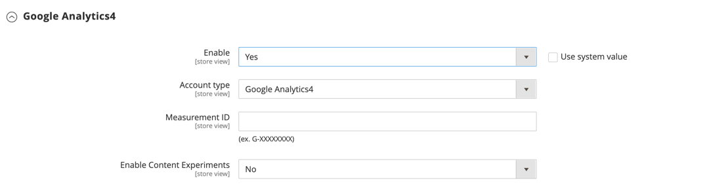
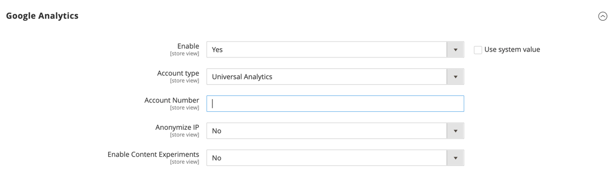

# [!DNL Google Analytics]

[!DNL Google Analytics]では、オフラインおよびモバイルアプリのインタラクションをサポートし、継続的な更新にアクセスできるため、トラッキング用の追加のカスタムディメンションと指標を定義できます。[!DNL Google Analytics] 4はGoogleの次世代測定ソリューションであり、[!DNL Universal Analytics]に代わるものです。 2023年7月1日（PT）に、標準のUniversal Analytics プロパティで新しいヒットの処理が停止されます。

>[!NOTE]
>
>ビジネスが[一般データ保護規則](../getting-started/compliance-gdpr.md)や[Google州消費者プライバシー法](../getting-started/compliance-ccpa.md)などのプライバシー規制の対象となる場合は、[&#x200B; カリフォルニア州プライバシー設定](google-tools.md#google-privacy-settings)を参照してください。

>[!IMPORTANT]
>
>[Cookie制限モード &#x200B;](../getting-started/compliance-cookie-law.md)を有効にした場合、[!DNL Google Analytics]はCookieを受け入れない限り、訪問者に関するデータを収集しません。

## [!DNL Google Analytics] 4

{{gtag-api-note}}

### 手順1: [!UICONTROL Google Analytics]を設定する4

サイトの[!DNL Google Analytics] 4のセットアップがまだ行われていない場合は、次のいずれかの方法に従います。

- [Analytics データ収集を初めて設定する](https://support.google.com/analytics/answer/9304153)
- [&#x200B; [!DNL Universal Analytics]を持つサイトにGoogle Analytics 4を追加](https://support.google.com/analytics/answer/9744165)

### 手順2:Commerceの設定を完了する

1. Commerce ストアの管理者にログインします。

1. _管理者_ サイドバーで、**[!UICONTROL Stores]** > _[!UICONTROL Settings]_>**[!UICONTROL Configuration]**&#x200B;に移動します。

1. 左側のパネルで、**[!UICONTROL Sales]**&#x200B;を展開し、**[!UICONTROL Google API]**&#x200B;を選択します。

1. **[!UICONTROL Google GTag]** セクションのを展開します。

1. **[!UICONTROL Google Analytics4]** サブセクションのを展開し、次の操作を行います。

   - **[!UICONTROL Enable]**&#x200B;を`Yes`に設定します。

   - **[!UICONTROL Account type]**&#x200B;を`Google Analytics4`のままにします。

   - **[!UICONTROL Measurement ID]**&#x200B;を入力します。 詳しくは、[Google Analytics ヘルプ &#x200B;](https://support.google.com/analytics/answer/9539598)を参照してください。

   - コンテンツに対してA/B テストやその他のパフォーマンステストを実施する場合は、**コンテンツ実験**&#x200B;を`Yes`に設定します。

   {width="600" zoomable="yes"}用Google API

1. 完了したら、**[!UICONTROL Save Config]**&#x200B;をクリックします。

## Google Universal Analytics

>[!IMPORTANT]
>
>2023年7月1日（PT）に、標準のユニバーサル分析プロパティでデータが処理されなくなります。 まだ[!DNL Universal Analytics]に依存している場合は、[今後Google Analytics 4](https://support.google.com/analytics/answer/10759417)を使用する準備をすることをお勧めします。

### 手順1:Google Universal Analyticsの設定

Googleのweb サイトにアクセスし、[Google Universal Analytics](https://support.google.com/analytics/answer/2817075?hl=en) アカウントにサインアップします。

### 手順2:Commerceの設定を完了する

1. Commerce ストアの管理者にログインします。

1. _管理者_ サイドバーで、**[!UICONTROL Stores]** > _[!UICONTROL Settings]_>**[!UICONTROL Configuration]**&#x200B;に移動します。

1. 左側のパネルで、**[!UICONTROL Sales]**&#x200B;を展開し、**[!UICONTROL Google API]**&#x200B;を選択します。

1. **[!UICONTROL Google Analytics]** セクションのを展開し、次の操作を行います。

   - **[!UICONTROL Enable]**&#x200B;を`Yes`に設定します。

   - [!DNL Google Analytics] **[!UICONTROL Account Number]**&#x200B;を入力します。

   - コンテンツに対してA/B テストやその他のパフォーマンステストを実施する場合は、**[!UICONTROL Content Experiments]**&#x200B;を`Yes`に設定します。

   {width="600" zoomable="yes"}

1. 完了したら、**[!UICONTROL Save Config]**&#x200B;をクリックします。

## E コマースの強化

Enhanced E コマースは、[!DNL Google Universal Analytics]のプラグインで、insightを利用して、お客様のショッピングおよび購買行動を把握することができます。 拡張e コマース機能を使用すれば、顧客がいつ商品をカートに入れたり、チェックアウトプロセスを開始したり、購入を完了したかなど、顧客の重要な行動に関するレポートを作成できます。 また、購入することなくカートを放棄した買い物客のパターンを特定し、分析することもできます。

次の手順は、拡張E コマースデータとレポートを生成するために[!DNL Google Tag Manager]を[!DNL Universal Analytics]で設定する方法を示しています。

### 手順1: Google アカウントの登録

1. [Google Tag Manager](google-tag-manager.md) アカウントにサインアップし、Commerceの設定を完了します。

1. 新しい[Google Universal Analytics](https://support.google.com/analytics/answer/2817075?hl=en) アカウントにサインアップします。

### 手順2: 強化されたE コマースの設定

1. Google Universal Analytics アカウントにログインします。

1. 次の設定を使用して、拡張E コマース分析用のプロパティを作成します。

   - ステータス：オン
   - 関連製品：オン
   - 強化されたE コマースレポートを有効にする：オン
   - チェックアウトのラベル：（必須ではありません）

1. 完了したら、**[!UICONTROL Submit]**&#x200B;をクリックします。

### 手順3: タグとトリガーの作成

1. [!DNL Google Tag Manager] アカウントにログインし、次のトリガーを作成します。

   | 名前 | イベントタイプ | フィルター |
   |--- |--- |--- |
   | `addToCart` | カスタムイベント |  |
   | `checkout` | カスタムイベント |  |
   | `checkout only` | ページビュー | ページ URLがRegEx /checkout/.*に一致 |
   | `checkoutOption` | カスタムイベント |  |
   | `gtm.dom` | カスタムイベント |  |
   | `productClick` | カスタムイベント |  |
   | `promotionClick` | カスタムイベント |  |
   | `removeFromCart` | カスタムイベント |  |

   >[!NOTE]
   >
   >[!UICONTROL Checkout] イベントは、組み込みのCommerce基本支払い方法（`Check / Money Order`や`Cash On Delivery Payment`など）でのみトリガーされます。 このイベントは、外部リソースからのチェックアウトへのリダイレクトを使用する`PayPal checkout`およびその他の外部支払い方法に対しては実行されません。

1. 同じ基本設定で次のUniversal Analytics タグを作成します。

   - ユニバーサル分析タグ

     | 名前 | タイプ | トリガーの実行 |
     |--- |--- |--- |
     | `Add to cart tracking` | ユニバーサル分析 | addToCart |
     | `Checkout option tracking` | ユニバーサル分析 | checkoutOption |
     | `Checkout tracking` | ユニバーサル分析 | チェックアウト |
     | `Pageview tracking` | ユニバーサル分析 | gtm.dom |
     | `Product click tracking` | ユニバーサル分析 | productClick |
     | `Promo click tracking` | ユニバーサル分析 | promotionClick |
     | `Remove from cart tracking` | ユニバーサル分析 | removeFromCart |

   - 基本的なタグ設定

     | 設定 | 値 |
     |--- |--- |
     | [!UICONTROL Product] | Google Analytics |
     | [!UICONTROL Tag Type] | ユニバーサル分析 |
     | [!UICONTROL Tracking ID] | UA-XXX （ユニバーサルアナリティクスアカウントのトラッキング ID） |
     | [!UICONTROL Enable Enhanced Ecommerce Features] | True |
     | [!UICONTROL Use data layer] | True |
     | [!UICONTROL Use Debug version] | True |

1. 個々のトラッキング設定を完了します。

   - 次の&#x200B;**[!UICONTROL Add to Cart]**&#x200B;のトラッキング設定を入力します。

     | 設定 | 値 |
     |--- |--- |
     | [!UICONTROL Track Type] | イベント |
     | [!UICONTROL Category] | e コマース |
     | [!UICONTROL Action] | カートに追加 |
     | [!UICONTROL Trigger] | addToCart |

   - 次の&#x200B;**[!UICONTROL Checkout option]**&#x200B;のトラッキング設定を入力します。

     | 設定 | 値 |
     |--- |--- |
     | [!UICONTROL Track Type] | イベント |
     | [!UICONTROL Category] | e コマース |
     | [!UICONTROL Action] | チェックアウトオプション |
     | [!UICONTROL Trigger] | checkoutOption |

   - 次の&#x200B;**[!UICONTROL PageView]**&#x200B;のトラッキング設定を入力します。

     | 設定 | 値 |
     |--- |--- |
     | [!UICONTROL Track Type] | PageView |
     | [!UICONTROL Trigger] | gtm.dom |

   - 次の&#x200B;**[!UICONTROL Product Click]** トラッキング設定を完了します。

     | 設定 | 値 |
     |--- |--- |
     | [!UICONTROL Track Type] | イベント |
     | [!UICONTROL Category] | e コマース |
     | [!UICONTROL Action] | 製品クリック |
     | [!UICONTROL Trigger] | productClick |

   - 次の&#x200B;**[!UICONTROL Promotion Click]** トラッキング設定を完了します。

     | 設定 | 値 |
     |--- |--- |
     | [!UICONTROL Track Type] | イベント |
     | [!UICONTROL Category] | e コマース |
     | [!UICONTROL Action] | プロモーションクリック |
     | [!UICONTROL Trigger] | promotionClick |

   - 次の&#x200B;**[!UICONTROL Remove from Cart]** トラッキング設定を完了します。

     | 設定 | 値 |
     |--- |--- |
     | [!UICONTROL Track Type] | イベント |
     | [!UICONTROL Category] | e コマース |
     | [!UICONTROL Action] | 買い物かごから削除 |
     | [!UICONTROL Trigger] | removeFromCart |

1. 完了したら、**[!UICONTROL Preview]**&#x200B;をクリックし、タグが正しく機能することを確認します。

1. 設定を確認したら、**[!UICONTROL Publish]**&#x200B;をクリックします。
