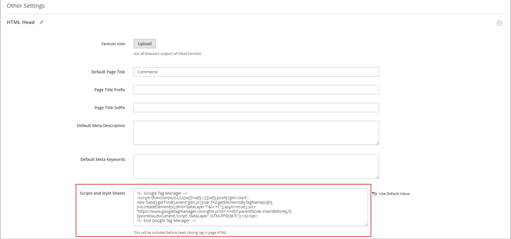

# [!DNL Google Tag Manager]

{{ee-feature}}

[!DNL Google Tag Manager] は、マーケティングキャンペーンイベントに関連する多数のタグ（コードスニペット）を管理するのに役立ちます。 [!DNL Google Tag Manager] を使用すると、サイトにトラッキングタグを追加し、オーディエンスを測定したり、検索エンジンのマーケティング戦略をパーソナライズ、リターゲティング、実施したりできます。

[!DNL Google Tag Manager] は、データとイベントを [!DNL Google Analytics]、Enhanced Ecommerce、その他のサードパーティの分析ソリューションに直接転送して、サイト、製品、プロモーションのパフォーマンスを明確に把握します。

このプロセスを続行するには、[!DNL Google Analytics] と [!DNL Tag Manager] アカウントが必要です。 以下の手順に従って、Google アカウントの設定、Commerce ストアの設定およびタグの作成を行います。

>[!NOTE]
>
>[EU 一般データ保護規則 ](../getting-started/compliance-gdpr.md) や [ カリフォルニア州消費者プライバシー法 ](../getting-started/compliance-ccpa.md) などのプライバシー規制の対象となるビジネスの場合は、[Googleのプライバシー設定 ](google-tools.md#google-privacy-settings) を参照してください。

## 手順 1. [!DNL Google Analytics] アカウントの設定

開始するために必要な基本については、Google ヘルプの [ サイト検索の設定 ](https://support.google.com/analytics/answer/1012264) を参照してください。 [Google Analytics](https://support.google.com/analytics/answer/9304153) および [Google Tag Manager} のGoogle ガイドも参照してくだ ](https://support.google.com/tagmanager/answer/6102821) い。

1. [!DNL Google Analytics] アカウントにログインします。

1. **[!UICONTROL Internal Site Search Tracking]** を有効にするには、次の手順を実行します。

   - **[!UICONTROL Select View]**/**[!UICONTROL View Settings]** に移動します。

   - **[!UICONTROL Site Search Tracking]** を `On` に設定します。

   - パラメ **[!UICONTROL Query]** ターを `q` に設定します。

   - 完了したら、設定を **[!UICONTROL Save]** 定します。

1. 表示機能を有効にするには、次の手順を実行します。

   - 「**[!UICONTROL Property Settings]**」を選択します。

   - _[!UICONTROL Advertising Features]_で、**[!UICONTROL Enable Demographics and Interest Reports]**を `On` に設定します。

   - 設定を **[!UICONTROL Save]** 定します。

1. E コマーストラッキングを有効にするには、以下を行います。

   - **[!UICONTROL Select View]**/**[!UICONTROL Ecommerce Settings]** に移動します。

   - **[!UICONTROL Enable Ecommerce]** を `On` に設定します。

   - **[!UICONTROL Enable Enhanced Ecommerce Reporting]** を `On` に設定します。

   - 設定を **[!UICONTROL Save]** 定します。

1. ページを再読み込みし、すべての設定が `On` しいことを確認します。

   >[!NOTE]
   >
   >すべての設定が `On` 定されていない場合は、前の手順を繰り返し、ページを保存してリロードします。 すべての設定が `On` に設定されるまで、この手順を繰り返します。

## 手順 2. [!DNL Google Tag Manager] アカウントの設定

次の手順は、基本設定を使用して新しいコンテナを設定する方法を示しています。 サンプルの [Composer](https://developer.adobe.com/commerce/php/development/composer/) 設定（.json）ファイルを使用してプロセスを簡略化し、読み込んで新しいコンテナにタグを生成します。 この例では、既存のコンテナを変更するのではなく、コンテナを作成することをお勧めします。

>[!NOTE]
>
>詳しくは、Googleの [ コンテナのエクスポートとインポート ](https://support.google.com/tagmanager/answer/6106997) を参照してください。 これらの手順では、サンプル JSON を新しいコンテナに読み込む手順を説明します。

1. リンクされたファイル [GTM_M2_Config_json.txt](./assets/GTM_M2_Config_json.txt) をダウンロードし、エディターでファイルを開いて、`GTM_M2_Config.json` として保存します。

   JSON ファイルは [!DNL Google Tag Manager] に直接アップロードされます。

1. **[!UICONTROL Admin]**/**[!UICONTROL Container]**/**[!UICONTROL Import Container]** に移動します。

1. 「**[!UICONTROL Choose container file]**」をクリックし、json ファイルを選択します。

1. [**[!UICONTROL Choose workspace]**] で、[**[!UICONTROL New]**] をクリックします。

1. タイトルと説明を入力し、「**[!UICONTROL Save]**」をクリックします。

1. ファイルをインポートするには、次のいずれかのアクションを選択します。

   - 新しいコンテナには、「**[!UICONTROL Overwrite]**」オプションを選択する必要があります。

   - 既存のコンテナを使用している場合は、「**[!UICONTROL Merge]**」オプションを選択する必要があります。

1. 「**[!UICONTROL Preview]**」をクリックして、タグ、トリガー、変数を確認します。

1. 変数で参照される **[!UICONTROL Google Analytics ID]** を編集するには、次の手順を実行します。

   - **[!UICONTROL Variables]**/**[!UICONTROL User-Defined Variables]** に移動します。

   - **[!UICONTROL Google Analytics]** を選択し、独自の **[!UICONTROL GA ID]** でプレースホルダー（`UA-xxxxxx-x`）を更新します。

1. タグ、トリガーおよび変数を新しいコンテナに追加するには、Googleの手順に従います。

   別のコンテナ内に使用する設定がある場合は、それらを新しいコンテナに移動できます。

1. 完了したら「**[!UICONTROL Confirm]**」をクリックします。

1. 新しいコンテナを公開するには、Googleの手順に従います。

## 手順 3. ストアの設定

{{gtag-api-note}}

1. Commerce ストアの管理者にログインします。

1. _管理者_ サイドバーで、**[!UICONTROL Stores]**/_[!UICONTROL Settings]_/**[!UICONTROL Configuration]**に移動します。

1. 左側のパネルで「**[!UICONTROL Sales]**」を展開し、「**[!UICONTROL Google API]**」を選択します。

1. **[!UICONTROL Google Analytics]** のセクションの  を展開し、以下を設定します。

   {width="600" zoomable="yes"}

   - **[!UICONTROL Enable]** を `Yes` に設定します。

   - **[!UICONTROL Account type]** を `Google Tag Manager` に設定します。

   - 「**[!UICONTROL Container ID]**」フィールドに GTM ID （`GTM-xxxxxx`）を入力します。

   - Google Analyticsを使用してコンテンツ実験も行う場合は、「**コンテンツ実験を有効にする**」を「`Yes`」に設定します。

   - 残りのフィールドにはデフォルト値を使用します。

1. 完了したら、「**[!UICONTROL Save Config]**」をクリックします。

1. [!DNL Google Tag Manager] 設定をテストし、すべてが正しく動作することを確認します。

>[!NOTE]
>
>各コンテナは 1 つの web サイトに関連付けられ、アカウントごとに必要なコンテナは 1 つだけです。 マルチサイト Commerce インスタンスがある場合は、個別のコンテナが必要です。

## 手順 4. Adobe Commerce ストアに GTM コードを追加します。

1. GTM コードをコピーするには、**[!UICONTROL Admin]**/**[!UICONTROL Install Google Tag Manager]** に移動します。

   Commerce サイトに追加する GTM コードスニペットは 2 つあります。1 つ目は `<head>` タグ用であり、2 つ目は `<body>` タグ用です。

1. Commerce管理者で、**[!UICONTROL Content]** / _[!UICONTROL Design]_/**[!UICONTROL Configuration]**に移動し、ストアビューを編集モードで開きます。

1. 「_[!UICONTROL Other Settings]_」の下で「**[!UICONTROL HTML Head]**」を展開し、`<head>` タグ用の GTM からコピーしたコードを「**[!UICONTROL Scripts and Style Sheets]**」フィールドに貼り付けます。

   {width="600" zoomable="yes"}

1. 「**[!UICONTROL Footer]**」を展開し、`<body>` の GTM コードを「**[!UICONTROL Miscellaneous HTML]**」フィールドにペーストします。

   {width="600" zoomable="yes"}

1. 完了したら、「**[!UICONTROL Save Configuration]**」をクリックします。

## フィールドの説明

| フィールド | 範囲 | 説明 |
|--- |--- |--- |
| [!UICONTROL Enable] | ストア表示 | Google Analyticsの E コマース強化機能を使用して、ストア内のアクティビティを分析できるかどうかを決定します。 オプション：`Yes` / `No` |
| [!UICONTROL Account type] | ストア表示 | ストアのアクティビティとトラフィックを監視するために使用されるGoogle トラッキングコードを決定します。 オプション：`Google Analytics` / `Google Tag Manager` |
| [!UICONTROL Anonymize IP] | ストア表示 | Google Analyticsの結果に表示される IP アドレスから識別情報を削除するかどうかを指定します。 |
| [!UICONTROL Enable Content Experiments] | ストア表示 | Google コンテンツ実験をアクティブ化します。同じページの異なる 10 バージョンまでテストするために使用できます。 オプション：`Yes` / `No` |
| [!UICONTROL Container Id] | ストア表示 | [!DNL Google Tag Manager] が既にストアにインストールされて設定されている場合は、このフィールドにコンテナ ID が自動的に表示されます。 |
| [!UICONTROL List property for the catalog page] | ストア表示 | カタログページに関連付けられているタグマネージャープロパティを識別します。 デフォルト値：`Catalog Page` |
| [!UICONTROL List property for the cross-sell block] | ストア表示 | クロスセルブロックに関連付けられたタグマネージャープロパティを識別します。 デフォルト値：`Cross-sell` |
| [!UICONTROL List property for the up-sell block] | ストア表示 | アップセル ブロックに関連付けられたタグ マネージャ プロパティを識別します。 デフォルト値：`Up-sell` |
| [!UICONTROL List property for the related products block] | ストア表示 | 関連する製品ブロックに関連付けられているタグマネージャープロパティを識別します。 デフォルト値：`Related Products` |
| [!UICONTROL List property for the search results page] | ストア表示 | 検索結果ページに関連付けられたタグマネージャープロパティを識別します。 デフォルト値：`Search Results` |
| [!UICONTROL "Internal Promotions" for promotions field "Label"] | ストア表示 | 内部プロモーションのラベルに関連付けられたタグマネージャープロパティを識別します。 デフォルト値：`Label` |

{style="table-layout:auto"}

## コンバージョンを追跡するためのタグの作成

Google AdWords アカウントをお持ちの場合は、コンバージョンを追跡するタグを作成できます。 次の例では、[!DNL Google Tag Manager] と [!DNL Google Analytics] の両方を使用して、ストアのコンバージョン _成功_ ページで実行されるタグを作成する方法を示しています。

### 手順 1. タグの作成

1. [!DNL Google Tag Manager] アカウントにログインし、ストア用に作成したコンテナのリンクをクリックします。

1. [**[!UICONTROL New Tag]**] ボックスの [**[!UICONTROL Add a new tag]**] をクリックします。

1. AdWords アカウントから次の情報を取得します。

   - コンバージョン ID
   - コンバージョンラベル

   サポートが必要な場合は、Google[ サポートサイト ](https://support.google.com/tagmanager/answer/6105160) を参照してください。

1. [!DNL Google Tag Manager] ダッシュボードで「**[!UICONTROL Google AdWords]**」をクリックし、次の手順を実行します。

   - タイトルプレースホルダーをクリックして、新しいタグの名前を入力します。

   - 「**[!UICONTROL Choose Product]**」で、「**[!UICONTROL Google AdWords]**」を選択します。

   - 「_[!UICONTROL Choose a Tag Type]_」で「**[!UICONTROL AdWords Conversion Tracking]**」を選択し、「**[!UICONTROL Continue]**」をクリックします。

1. AdWords アカウントの **[!UICONTROL Conversion ID]** と **[!UICONTROL Conversion Label]** を入力し、「**[!UICONTROL Continue]**」をクリックします。

### 手順 2. ルールの作成

[!DNL Google Tag Manager] ダッシュボードから続いて、次の手順では、コンバージョンページでタグを実行するルールを作成します。

1. [**[!UICONTROL Fire On]**] で、[**[!UICONTROL Some Pages]**] をクリックします。

1. _[!UICONTROL Choose Pages]_セクションで、次の設定を行います。

   - **[!UICONTROL Name]** - ページの説明の名前を入力します。

   - **[!UICONTROL Variable]** `url`

   - **操作** - `matches RegEx`

     詳しくは、Google Tag Manager ヘルプの [ 正規表現と CSS セレクターの演算子 ](https://support.google.com/tagmanager/answer/7679109) を参照してください。

   - **[!UICONTROL Value]** - `checkout/success.*`

1. 「緑」チェックボックスをオンにして、「**[!UICONTROL Save]**」をクリックします。

   設定したトリガーは、[ 火の種 ] セクションに青いボタンとして表示されます。

1. 完了したら、「**[!UICONTROL Save Tag]**」をクリックします。

### 手順 3. プレビューと公開

プロセスの次の手順では、タグをプレビューします。 タグをプレビューするたびに、バージョンのスナップショットが保存されます。 結果に満足したら、使用するバージョンに移動し、[**[!UICONTROL Publish]**] をクリックします。
