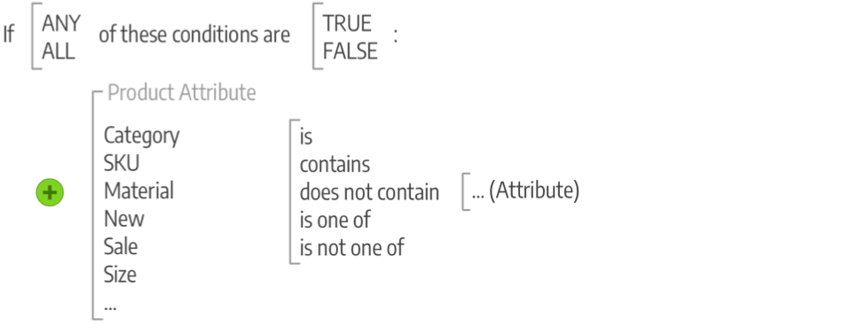

# Commerce マーチャンダイジングとプロモーションの概要

プロモーションのターゲティングや顧客エンゲージメントの機会の構築、買い物客のバイヤー化を実現できます。 購入後のアクティビティをサポートし、リピーターに特別割引を提供することで、顧客との関係を管理します。 SEO施策をサポートするためのベストプラクティスとテクニックを学びましょう。

## マーチャンダイジング

_マーチャンダイジング_&#x200B;は、平面図の開発と製品のプレゼンテーションのアートと科学を説明するために小売で使用される用語です。 [&#x200B; カテゴリーベースのナビゲーション &#x200B;](../catalog/navigation-top.md)は、ストアのフロアプランと考えることができ、ストア内の商品のリストに適用できる条件として、商品の動的なプレゼンテーションを考えることができます。 また、商品の売上を増加させるためのプログラムを導入することもできます。

- [!BADGE PaaSのみ]{type=Informative url="https://experienceleague.adobe.com/ja/docs/commerce/user-guides/product-solutions" tooltip="Adobe Commerce on Cloud プロジェクト（Adobeで管理されるPaaS インフラストラクチャ）とオンプレミス プロジェクトにのみ適用されます。"} [Visual Merchandiser](visual-merchandiser.md) – 製品を配置し、カテゴリ リストに表示される製品を決定する条件を適用できる高度なツールのセット。

- [&#x200B; ギフト レジストリ &#x200B;](gift-registries.md) – 特別な機会にギフト レジストリを作成し、友人や家族を招待してギフト レジストリからギフトを購入する機能をお客様に提供します。

- [報酬とロイヤルティ &#x200B;](rewards-loyalty.md) - ポイント システムを使用して、顧客エンゲージメントを促進し、顧客ロイヤルティを促進する独自のプログラムを実装します。 幅広い取引や顧客の行動に対してポイントを付与し、ポイントの割り当て、残高、有効期限を制御できます。

- [&#x200B; プライベートセールスとイベント &#x200B;](events-private-sales.md) – 既存の顧客基盤を利用して、話題や新しいリードを生み出したり、プライベートセールスやその他のカタログイベントを通じて余剰在庫をオフロードしたりすることができます。

>[!TIP]
>
>商品レコメンデーションと、購入者に最適なエクスペリエンスを構築するために必要なinsightとコントロールを提供する方法について詳しくは、[商品レコメンデーションユーザーガイド &#x200B;](https://experienceleague.adobe.com/docs/commerce/product-recommendations/guide-overview.html?lang=ja)を参照してください。

## プロモーション

Adobe Commerceでは、プロモーション機能を利用して商品との関係を設定し、価格規則を利用して様々な条件に基づく割引をトリガーします。 価格ルールをもとに、顧客に対するインセンティブを提供できます。

- 優良顧客に特定の商品の割引クーポンを送る
- 一定額を超える購入に対して送料無料を提供する
- 特定の期間のプロモーションのスケジュール

ルールとは、1つ以上の条件を満たした場合に価格の変更を製品に適用する条件のコレクションです。 各ルールには複数の条件を設定でき、すべてのステートメントまたは任意のステートメント（1つ以上ですが、すべてではない）がtrueまたはfalseの場合に適用されます。

### 条件

条件は、ルールを適用するための製品と状況のリストを絞り込むステートメントです。 条件の属性とオプションは、使用可能なルールのタイプによって異なります。 達成すると、割引、BUY-ONE-GET-ONE （BOGO）、その他のオプションなどのアクションが完了します。 ルールは、ビジネスニーズ、季節ごとの割引やプロモーション、1年間の機会などに合わせて、必要に応じてシンプルにしたり複雑にしたりすることができます。 例えば、カートの小計が高い場合に、年間を通じて送料無料を提供しながら、ホリデーシーズンにはさらにオプションをいくつか追加することができます。

>[!NOTE]
>
>特定の製品属性に基づいて条件を定義する場合は、[&#x200B; ストアフロントプロパティ &#x200B;](../catalog/attribute-product-create.md)の属性に&#x200B;**[!UICONTROL Use for Promo Rule Conditions]**&#x200B;を`Yes`に設定する必要があります。

### 価格ルール

[&#x200B; カタログ価格ルール &#x200B;](price-rules-catalog.md)の場合、カタログ、比較関数、選択した属性の[属性セット &#x200B;](../catalog/attribute-sets.md)に基づいて条件を作成します。 文章などの条件を作成するには、いくつかステートメントを選択します。 例えば、子供服と紳士服/婦人服のカテゴリに基づいて割引を適用するために、2つの価格規則を作成できます。

{width="500"}

[買い物かごの価格ルール &#x200B;](price-rules-cart.md)条件は、ストア [&#x200B; ルート &#x200B;](../catalog/category-root.md)の子である任意のカテゴリに基づいて指定できます。 価格ルールは事前に設定されており、必要な条件が満たされるたびに行動に移ります。 これらのルールでは、商品属性を使用してカート内のSKUを照合するなど、商品属性の組み合わせを含む属性を使用します。 これらのルールでは、商品選択数量の条件、複雑なルールの条件の組み合わせ、小計などのカート属性も使用できます。

{width="500"}

## コミュニケーションとSEO

潜在的な購入者を呼び込むには、[検索エンジン最適化（SEO） &#x200B;](seo-overview.md)を習得することが非常に重要です。 検索エンジンの最適化と、サイトのコンテンツとプレゼンテーションの調整について説明し、検索エンジンによるページのインデックス作成方法を改善します。

ストアを立ち上げる前に完了すべきタスクの1つは、ストアから送信されるすべてのコミュニケーションに使用されるメールテンプレートを確認して、ブランドを反映していることを確認することです。 しかし、さらに一歩進めて、自社と製品を既存顧客に宣伝するコミュニケーションを開発する必要があります。 変数やマークアップタグを使用して、コンテンツをパーソナライズできます。

>[!NOTE]
>
>Adobe CommerceおよびMagento Open Source リリース 2.4.0 ～ 2.4.3には、dotdigital Engagement Cloudとの統合に使用するdotdigital ベンダー開発の拡張機能が含まれています。 2.4.4 リリース以降、この拡張機能はコアリリースにバンドルされなくなり、Commerce Marketplaceからインストールして更新する必要があります。 Marketplaceでは、拡張機能の開発者が提供する最新のドキュメントにもアクセスできます。
>  >バンドル拡張機能を有効にして設定している場合は、2.4.4 アップグレードプロセスの一環としてcomposer.json ファイルを更新し、拡張機能の更新を今後も管理する必要があります。 詳しくは、_アップグレードガイド_&#x200B;の[&#x200B; アップグレードモジュール &#x200B;](https://experienceleague.adobe.com/docs/commerce-operations/upgrade-guide/modules/upgrade.html?lang=ja)を参照してください。

- [&#x200B; ニュースレター](newsletters.md) - ニュースレターを作成し、購読者リストを管理し、コンテンツを開発し、ストアへのトラフィックを促進します。

- [RSS フィード &#x200B;](social-rss.md#rss-feeds) - RSS フィードを使用して、商品情報をショッピング集計サイトに公開したり、ニュースレターに掲載したりできます。 顧客はRSS フィードを購読して、新製品やプロモーションについて学習できます。

- [&#x200B; ソーシャルネットワーク &#x200B;](social-rss.md#social-networks) - Marketplace拡張機能をインストールするか、コンテンツページにプラグインを追加して、ストアをソーシャルネットワークと統合します。

## Googleのマーケティングツール

ストア設定は、次のGoogleツールと統合されています。これにより、コンテンツの最適化、トラフィックの分析、カタログとショッピングアグリゲーターやマーケットプレイスの連携が可能になります。

>[!NOTE]
>
>2.4.5 リリース以降、Google サービス統合が更新され、GTag APIの使用がサポートされるようになりました。 GTagは、web ページのGoogle機能と統合するための統合メカニズムであり、Google サービスを通じてコンテンツをトラッキングおよび管理する最新の機能と機会をサポートします。 詳しくは、[Google Analytics開発者向けドキュメント &#x200B;](https://developers.google.com/analytics/devguides/collection/gtagjs)を参照してください。

- [Google Analytics](google-analytics.md) - Google Universal Analyticsを使用して、オフラインおよびモバイルアプリのインタラクションのサポート、継続的な更新へのアクセスを含む、トラッキング用の追加のカスタムディメンションと指標を定義します。

- [Google Tag Manager](google-tag-manager.md) -  （Adobe Commerceのみ） Google Tag Managerを使用して、マーケティングキャンペーンイベントに関連する多くのタグを管理します。

- [Google AdWords](google-adwords.md) - Google AdWords キャンペーンを作成し、ストアのコンバージョンを追跡します。
