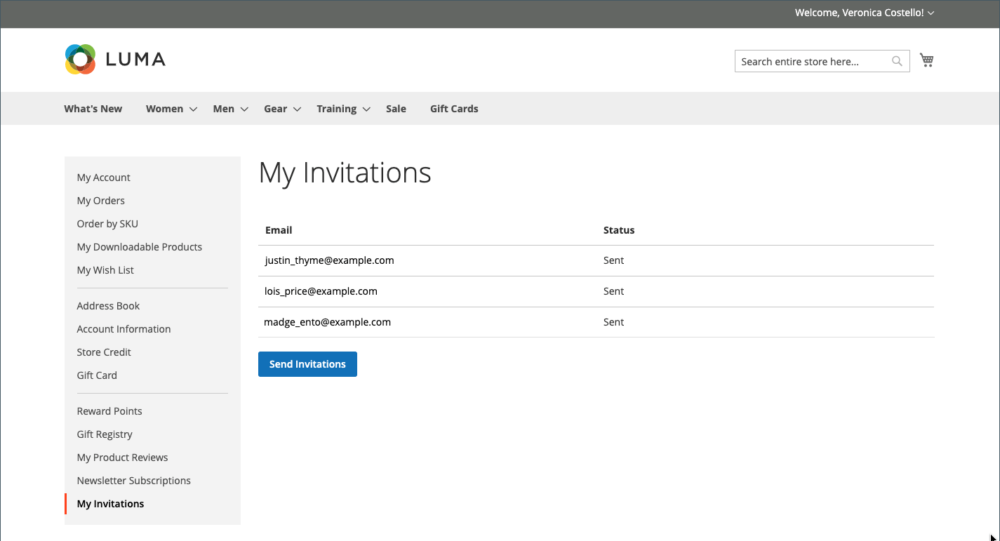
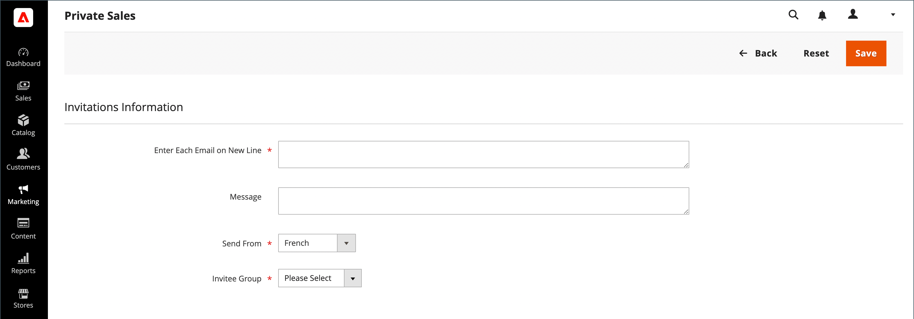

# イベントへの招待

{{ee-feature}}

招待が有効になっている場合、顧客は顧客アカウントのダッシュボードから招待を送信および表示できます。 招待状のメールには、ストアの顧客ログインページへのリンクが含まれています。

## 自分の招待

顧客アカウントの&#x200B;_[!UICONTROL My Invitations]_&#x200B;セクションには、顧客から送信されたすべての招待が一覧表示されます。 顧客は、店舗イベント、ギフトレジストリ、ウィッシュリストなどの招待を友人や家族に送信できます。

{width="700" zoomable="yes"}

### 招待ワークフロー

1. **お客様が招待状を準備**: アカウントダッシュボードから、お客様が受信者のリストを準備し、招待を完了します。 設定に応じて、カスタムメッセージを含めることができます。
1. **お客様が招待を送信する**：準備ができたら、お客様は&#x200B;_[!UICONTROL Send Invitations]_&#x200B;ボタンをクリックします。
1. **システムは送信を管理します**: システムは、設定で設定された番号に従って、一括で招待を送信します。
1. **お客様は応答を監視します**：お客様は、アカウントダッシュボードの各招待のステータスを`Sent`、`Accepted`、または`Canceled`として監視します。

### 招待状を送信

1. ストアフロントのアカウントのサイドバーで、顧客は&#x200B;**[!UICONTROL My Invitations]**&#x200B;を選択します。

1. _自分の招待_ ページで、**[!UICONTROL Send Invitation]**&#x200B;をクリックします。

1. 新しい招待アイテムを定義します。

   - 電子メール情報を入力します。

   - （オプション）「**+**」をクリックし、別の電子メールアドレスを追加して、複数アドレスの招待を作成します。

     1回の招待には、5つの電子メールアドレスの制限があります。

   - （オプション）添付メッセージを入力します。

1. 完了したら、**[!UICONTROL Send Invitation]**&#x200B;をクリックします。

招待の通知は、アカウントを設定するための手順リンクを含む招待ユーザーの電子メールアドレスに送信されます。

>[!NOTE]
>
>ユーザーは、特定の電子メールアドレスに1つの招待状のみを送信できます。 同じ電子メールアドレスに招待状を再送信しようとすると、エラーメッセージが表示され、招待状は送信されません。

## ストアの招待を有効にする

招待の設定により、ストアの招待が有効になり、その送信方法が決まります。

1. _管理者_ サイドバーで、**[!UICONTROL Stores]** > _[!UICONTROL Settings]_>**[!UICONTROL Configuration]**&#x200B;に移動します。

1. 左側のパネルで、**[!UICONTROL Customers]**&#x200B;を展開し、**[!UICONTROL Invitations]**&#x200B;を選択します。

1. **[!UICONTROL General]** セクションのを展開します。

   {width="600" zoomable="yes"}

1. **[!UICONTROL Enable Invitations Functionality]**&#x200B;を`Yes`に設定します。

1. お客様がストアフロントから招待を管理できるようにするには、**ストアフロントで招待を有効にする**&#x200B;から`Yes`に設定します。

1. **[!UICONTROL Referred Customer Group]**&#x200B;を次のいずれかに設定します：

   - `Same as Inviter`
   - `Default Customer Group from Configuration`

1. **[!UICONTROL New Accounts Registration]**&#x200B;を次のいずれかに設定します：

   - `By Invitation Only`
   - `Available to All`

1. **[!UICONTROL Allow Customers to Add Custom Message to Invitation Email]**&#x200B;に対して、`Yes`を選択します。

1. 一度に送信できる招待状の数を制限するには、**[!UICONTROL Max Invitations Allowed to be Sent at One Time]** フィールドに番号を入力します。

1. **[!UICONTROL Email]** セクションのを展開し、次の操作を行います。

   {width="600" zoomable="yes"}

   - **[!UICONTROL Customer Invitation Email Sender]**&#x200B;として使用するストア IDを選択してください。

   - 招待の送信に使用する&#x200B;**[!UICONTROL Customer Invitation Email Template]**&#x200B;を選択します。

1. 完了したら、**[!UICONTROL Save Config]**&#x200B;をクリックします。

## 管理者での招待の送信と管理

[個人向けセールスレポート &#x200B;](../getting-started/private-sales-reports.md) セクションでは、指定した期間に送信された招待状の数、または招待状を送信した顧客の数を確認できます。

### 管理者に招待を作成する

1. _管理者_ サイドバーで、**[!UICONTROL Marketing]** > _[!UICONTROL Private Sales]_>**[!UICONTROL Invitations]**&#x200B;に移動します。

1. 右上隅の「**[!UICONTROL Add Invitations]**」をクリックします。

1. 次の画面で、メールアドレスを入力して新規顧客を招待し、カスタムメッセージを追加して送信者を選択し、招待グループを選択します。

   複数のストアビューがある場合は、**[!UICONTROL Send From]** オプションを使用して、招待の送信元となるストアビューを指定します。

   {width="700" zoomable="yes"}

1. 完了したら、**[!UICONTROL Save]**&#x200B;をクリックします。

### 単一エンティティの招待を破棄する

1. _管理者_ サイドバーで、**[!UICONTROL Marketing]** > _[!UICONTROL Private Sales]_>**[!UICONTROL Invitations]**&#x200B;に移動します。

1. フィルターを使用して必要な招待を見つけ、編集モードで開きます。

1. 右上隅の「**[!UICONTROL Discard Invitation]**」をクリックします。

1. アクションを確認するには、**[!UICONTROL OK]**&#x200B;をクリックします。

### 複数のエンティティの招待を破棄する

1. _管理者_ サイドバーで、**[!UICONTROL Marketing]** > _[!UICONTROL Private Sales]_>**[!UICONTROL Invitations]**&#x200B;に移動します。

1. 破棄する招待を検索して選択します。

1. 左上の&#x200B;**[!UICONTROL Actions]** メニューを使用して&#x200B;**[!UICONTROL Discard Selected]**&#x200B;を選択し、**[!UICONTROL Submit]**&#x200B;をクリックします。

1. アクションを確認するには、**[!UICONTROL OK]**&#x200B;をクリックします。

### フィールドの説明

| フィールド | 説明 |
|--- |--- |
| [!UICONTROL Select] | チェックボックスを選択して、アクションの対象となる招待を選択するか、列ヘッダーの選択コントロールを使用します。 オプション：`Select All` /` Deselect All` / `Select Visible` / `Unselect Visible` |
| [!UICONTROL ID] | 招待の内部ID番号 |
| [!UICONTROL Email] | 対応する顧客のメールアドレス |
| [!UICONTROL Invitee] | 招待されたユーザーのメール |
| [!UICONTROL Sent] | 招待状が送信された日時 |
| [!UICONTROL Registered] | 顧客が登録された時間とデータ |
| [!UICONTROL Status] | 招待ステータス： オプション：`Sent` / `Not Sent` / `Accepted` / `Discarded` |
| [!UICONTROL Valid Website] | 対応サイト |
| [!UICONTROL Invitee Group] | 招待者の顧客グループ |

{style="table-layout:auto"}
