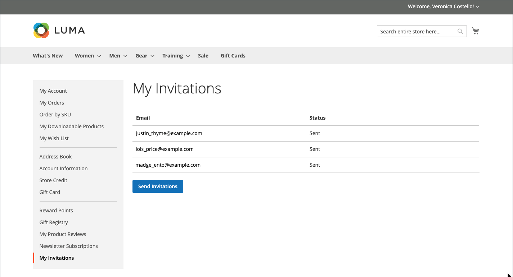
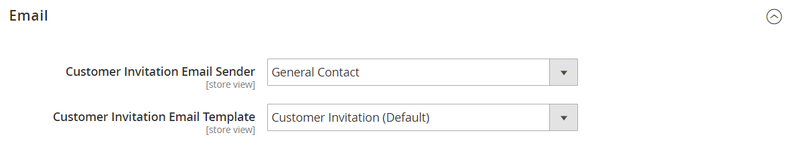

# イベントの招待

{{ee-feature}}

招待を有効にすると、ユーザーは、自分の顧客アカウントのダッシュボードから招待を送信したり、表示したりできます。 招待メールには、ストアの顧客ログインページへのリンクが含まれています。

## 招待状

The _[!UICONTROL My Invitations]_顧客アカウントの「 」セクションには、顧客から送信されるすべての招待が一覧表示されます。 お客様は、お店のイベント、ギフトレジストリー、ウィッシュリストなどに招待状を友人や家族に送ることができます。

{width="700" zoomable="yes"}

### 招待ワークフロー

1. **顧客が招待を準備する**：顧客はアカウントダッシュボードから受信者のリストを準備し、招待を完了します。 設定に応じて、カスタムメッセージを含めることができます。
1. **顧客が招待を送信する**：準備が整ったら、顧客は _[!UICONTROL Send Invitations]_」ボタンをクリックします。
1. **システムが送信を管理**：設定で設定された数に従って、招待がバッチで送信されます。
1. **お客様が応答を監視**：顧客はアカウントダッシュボードからの各招待のステータスを監視します。 `Sent`, `Accepted`または `Canceled`.

### 招待状の送信

1. ストアフロントのアカウントのサイドバーで、顧客が選択します **[!UICONTROL My Invitations]**.

1. 次の日： _招待状_ ページ、クリック数 **[!UICONTROL Send Invitation]**.

1. 新しい招待状項目を定義します。

   - 電子メール情報を入力します。

   - （オプション）複数アドレスの招待状を作成する場合は、「 **+** さらに別の電子メールアドレスを追加します。

     1 つの招待状には、5 つの電子メールアドレスの制限があります。

   - （オプション）付属のメッセージを入力します。

1. 完了したら、「 」をクリックします **[!UICONTROL Send Invitation]**.

招待の通知が、招待ユーザーの電子メールアドレスに送信され、アカウントの設定方法のリンクが記載されています。

>[!NOTE]
>
>1 人のユーザーは、特定の電子メールアドレスに 1 つの招待メールのみを送信できます。 同じ電子メールアドレスに招待状を再送信しようとすると、エラーメッセージが表示され、招待状が送信されません。

## ストアへの招待を有効にする

招待の設定により、ストアへの招待が有効になり、送信方法が決まります。

1. 次の日： _管理者_ サイドバー、移動 **[!UICONTROL Stores]** > _[!UICONTROL Settings]_>**[!UICONTROL Configuration]**.

1. 左側のパネルで、を展開します。 **[!UICONTROL Customers]** を選択します。 **[!UICONTROL Invitations]**.

1. 展開  の **[!UICONTROL General]** 」セクションに入力します。

   {width="600" zoomable="yes"}

1. 設定 **[!UICONTROL Enable Invitations Functionality]** から `Yes`.

1. ストアフロントからの招待の管理をユーザーに許可するには、 **ストアフロントでの招待を有効にする** から `Yes`.

1. 設定 **[!UICONTROL Referred Customer Group]** を次のいずれかに変更します。

   - `Same as Inviter`
   - `Default Customer Group from Configuration`

1. 設定 **[!UICONTROL New Accounts Registration]** を次のいずれかに変更します。

   - `By Invitation Only`
   - `Available to All`

1. 宛先 **[!UICONTROL Allow Customers to Add Custom Message to Invitation Email]**&#x200B;を選択します。 `Yes`.

1. 一度に送信できる招待の数を制限するには、 **[!UICONTROL Max Invitations Allowed to be Sent at One Time]** フィールドに入力します。

1. 展開  の **[!UICONTROL Email]** 」セクションで次の操作を実行します。

   {width="600" zoomable="yes"}

   - として使用するストア ID を選択 **[!UICONTROL Customer Invitation Email Sender]**.

   - を選択します。 **[!UICONTROL Customer Invitation Email Template]** 送信された招待に使用されます。

1. 完了したら、「 **[!UICONTROL Save Config]**.

## 管理者での招待の送信と管理

Adobe Analytics の [プライベートセールスレポート](../getting-started/private-sales-reports.md) 「 」セクションには、指定した期間に送信された招待の数、または招待を送信した顧客の数を表示できます。

### 管理者での招待の作成

1. 次の日： _管理者_ サイドバー、移動 **[!UICONTROL Marketing]** > _[!UICONTROL Private Sales]_>**[!UICONTROL Invitations]**.

1. 右上隅で、 **[!UICONTROL Add Invitations]**.

1. 次の画面で、新しい顧客を招待する電子メールアドレスを入力し、カスタムメッセージを追加し、送信者を選択し、招待者グループを選択します。

   複数のストアビューがある場合、 **[!UICONTROL Send From]** オプションを使用して、招待の送信元となるストア表示を指定します。

   {width="700" zoomable="yes"}

1. 完了したら、「 **[!UICONTROL Save]**.

### 単一エンティティへの招待の破棄

1. 次の日： _管理者_ サイドバー、移動 **[!UICONTROL Marketing]** > _[!UICONTROL Private Sales]_>**[!UICONTROL Invitations]**.

1. フィルターを使用して必要な招待状を見つけ、編集モードで開きます。

1. 右上隅で、 **[!UICONTROL Discard Invitation]**.

1. アクションを確定するには、 **[!UICONTROL OK]**.

### 複数のエンティティへの招待の破棄

1. 次の日： _管理者_ サイドバー、移動 **[!UICONTROL Marketing]** > _[!UICONTROL Private Sales]_>**[!UICONTROL Invitations]**.

1. 破棄する招待を見つけて選択します。

1. 左上に、 **[!UICONTROL Actions]** 選択するメニュー **[!UICONTROL Discard Selected]** をクリックします。 **[!UICONTROL Submit]**.

1. アクションを確定するには、 **[!UICONTROL OK]**.

### フィールドの説明

| フィールド | 説明 |
|--- |--- |
| [!UICONTROL Select] | チェックボックスを選択してアクションの対象となる招待を選択するか、列ヘッダーの選択コントロールを使用します。 オプション： `Select All` /` Deselect All` / `Select Visible` / `Unselect Visible` |
| [!UICONTROL ID] | 招待の内部 ID 番号 |
| [!UICONTROL Email] | 対応する顧客の電子メールアドレス |
| [!UICONTROL Invitee] | 招待ユーザーの電子メール |
| [!UICONTROL Sent] | 招待メールが送信された日時 |
| [!UICONTROL Registered] | 顧客が登録された時刻とデータ |
| [!UICONTROL Status] | 招待のステータス。 オプション： `Sent` / `Not Sent` / `Accepted` / `Discarded` |
| [!UICONTROL Valid Website] | 対応する Web サイト |
| [!UICONTROL Invitee Group] | 招待者の顧客グループ |

{style="table-layout:auto"}
