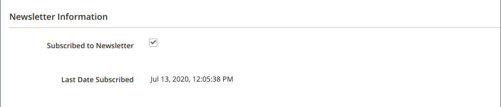

# ニュースレター購読者の管理

ベストプラクティスとして、購読リストを定期的に管理し、購読解除のリクエストを確実に処理する必要があります。 一部の法域では、登録解除の申請は特定の期間内に処理することが法律で義務付けられています。

アクティブなサブスクリプションの簡単なリストを使用して、購読者を簡単に管理できます。 お客様が購読解除リクエストを送信すると、選択した1つ以上の購読に&#x200B;_購読解除_ アクションを簡単に適用できます。

複数のストアビューを持つシングルサイト設定では、顧客アカウントのサブスクリプションを特定のストアビューに関連付けることができます。

グローバルな[顧客アカウントスコープ &#x200B;](../customers/customer-account-scope.md)を持つマルチストアおよびマルチサイト設定では、顧客アカウントを複数のサイト/ストアのニュースレターに購読できます。 この場合、顧客アカウントを編集して購読グループを管理したり、特定のサイト/ストアの購読をキャンセルしてリクエストを尊重したりすることができます。

サードパーティのサービスを使用してニュースレターを送信する場合は、サブスクリプションリストをCSVまたはXML ファイルとして書き出すことができます。

## 顧客のサブスクリプションの管理

1. _管理者_ サイドバーで、**[!UICONTROL Customers]** > **[!UICONTROL All Customers]**&#x200B;に移動します。

1. グリッドで顧客を見つけ、_[!UICONTROL Action]_&#x200B;列の&#x200B;**[!UICONTROL Edit]**&#x200B;をクリックします。

1. 左側のパネルで「**[!UICONTROL Newsletter]**」をクリックします。

1. サイト/ストアの設定に従って、お客様のサブスクリプションを変更します。

   単一サイト/単一ストアの設定の場合は、「**[!UICONTROL Subscribed to Newsletter]**」チェックボックスを選択またはクリアするだけです。

   {width="500" zoomable="yes"}

   単一サイト/マルチストアの設定の場合、**[!UICONTROL Subscribed to Newsletter]** チェックボックスを選択またはクリアし、**[!UICONTROL Subscribed on Store View]**&#x200B;をサブスクリプションの正しいストアビューに設定できます。

   {width="500" zoomable="yes"}

   グローバル顧客アカウントスコープを持つマルチサイト/マルチストア設定の場合、ページにはすべてのサイトのサブスクリプションステータスが表示されます。 **[!UICONTROL Subscribed]** チェックボックスを選択またはクリアするか、サブスクリプションの&#x200B;**[!UICONTROL Store View]**&#x200B;を変更できます。

   {width="500" zoomable="yes"}

1. **[!UICONTROL Save Customer]**&#x200B;をクリックします。

## 購読者リストから購読をキャンセル

1. _管理者_ サイドバーで、**[!UICONTROL Marketing]** > _[!UICONTROL Communications]_>**[!UICONTROL Newsletter Subscribers]**&#x200B;に移動します。

   一部の顧客が複数のサイトのサブスクリプションを持つマルチサイト設定の場合、各サブスクリプションはグリッドに行項目として表示されます。

1. グリッド内の加入者を見つけて、最初の列のチェックボックスを選択します。

   >[!NOTE]
   >
   >一括購読解除の場合は、キャンセルする各購読者のチェックボックスを選択します。

1. _[!UICONTROL Action]_&#x200B;コントロールを&#x200B;**[!UICONTROL Unsubscribe]**&#x200B;に設定し、**[!UICONTROL Submit]**&#x200B;をクリックします。

   {width="600" zoomable="yes"}

   レコードのステータスが`Unsubscribed`に変更されます。

## 購読者リストの書き出し

1. _[!UICONTROL Newsletter Subscribers]_&#x200B;リストから、フィルター制御を使用して、_ ステータス _/`Subscribed`のレコードのみを含め、適切なweb サイト、ストア、またはストアビューを表示します。

1. **[!UICONTROL Export to]** コントロールを次のいずれかに設定します。

   - `CSV`
   - `XML`

1. **[!UICONTROL Export]**&#x200B;をクリックし、画面の下部にあるプロンプトを探して、ファイルを保存します。

   {width="600" zoomable="yes"}

## 購読者リストから購読者を削除

1. _管理者_ サイドバーで、**[!UICONTROL Marketing]** > _[!UICONTROL Communications]_>**[!UICONTROL Newsletter Subscribers]**&#x200B;に移動します。

1. グリッド内の加入者を見つけて、最初の列のチェックボックスを選択します。

1. _[!UICONTROL Action]_&#x200B;コントロールを&#x200B;**[!UICONTROL Delete]**&#x200B;に設定し、**[!UICONTROL Submit]**&#x200B;をクリックします。

1. 確認を求められたら、**[!UICONTROL OK]**&#x200B;をクリックします。
