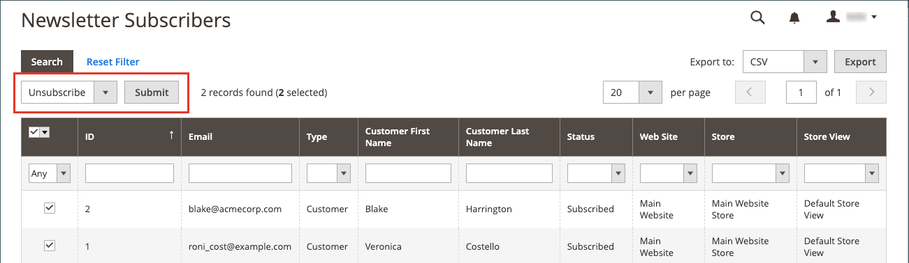

# ニュースレター購読者の管理

ベストプラクティスとして、購読リストを定期的に管理し、購読解除のリクエストを必ず処理してください。 一部の管轄区域では、登録解除のリクエストが特定の期間内に処理されることが法律で義務付けられています。

アクティブな購読の単純なリストを使用して、購読者を簡単に管理できます。 顧客が購読解除リクエストを送信した場合、選択した 1 つ以上の購読に _購読解除_ アクションを適用するだけです。

複数のストア表示を使用した単一サイトの設定では、顧客アカウントの購読を特定のストア表示に関連付けることができます。

グローバルな [ 顧客アカウント範囲 ](../customers/customer-account-scope.md) を使用したマルチストアおよびマルチサイト設定では、顧客アカウントは複数のサイト/ストアのニュースレターを購読できます。 この場合、顧客アカウントを編集して購読のグループを管理したり、特定のサイト/ストアの購読をキャンセルしてリクエストに応じることができます。

サードパーティのサービスを使用してニュースレターを送信する場合は、購読リストを CSV または XML ファイルとして書き出すことができます。

## 顧客の購読の管理

1. _管理者_ サイドバーで、**[!UICONTROL Customers]**/**[!UICONTROL All Customers]** に移動します。

1. グリッドで顧客を見つけ、_[!UICONTROL Action]_&#x200B;列の&#x200B;**[!UICONTROL Edit]**&#x200B;をクリックします。

1. 左側のパネルで「**[!UICONTROL Newsletter]**」をクリックします。

1. サイト/ストアの設定に応じて、顧客の購読を変更します。

   単一サイト/単一ストアを設定する場合は、「**[!UICONTROL Subscribed to Newsletter]**」チェックボックスをオンまたはオフにするだけです。

   {width="500" zoomable="yes"}

   単一サイト/マルチストアを設定する場合は、「**[!UICONTROL Subscribed to Newsletter]**」チェックボックスをオンまたはオフにして、サブスクリプションに対して適切 **[!UICONTROL Subscribed on Store View]** ストア表示に設定します。

   {width="500" zoomable="yes"}

   グローバル顧客アカウント範囲を使用したマルチサイト/マルチストア設定の場合、ページには、すべてのサイトの購読ステータスが表示されます。 「**[!UICONTROL Subscribed]**」チェックボックスをオンまたはオフにしたり、購読の **[!UICONTROL Store View]** を変更したりできます。

   {width="500" zoomable="yes"}

1. 「**[!UICONTROL Save Customer]**」をクリックします。

## サブスクライバーリストからのサブスクリプションのキャンセル

1. _管理者_ サイドバーで、**[!UICONTROL Marketing]**/_[!UICONTROL Communications]_/**[!UICONTROL Newsletter Subscribers]**&#x200B;に移動します。

   一部の顧客が複数のサイトの購読を持っているマルチサイト設定の場合、各購読はグリッドに行項目として表示されます。

1. グリッドで購読者を見つけ、最初の列のチェックボックスを選択します。

   >[!NOTE]
   >
   >一括登録解除の場合は、キャンセルする各購読者のチェックボックスを選択します。

1. _[!UICONTROL Action]_&#x200B;コントロールを&#x200B;**[!UICONTROL Unsubscribe]**&#x200B;に設定し、**[!UICONTROL Submit]**&#x200B;をクリックします。

   {width="600" zoomable="yes"}

   レコードのステータスが「`Unsubscribed`」に変わります。

## サブスクライバーのリストのエクスポート

1. _[!UICONTROL Newsletter Subscribers]_&#x200B;リストから、フィルターコントロールを使用して、`Subscribed` の_ ステータス _を持つレコードと、適切な web サイト、ストアまたはストア表示のレコードのみを含めます。

1. **[!UICONTROL Export to]** コントロールを次のいずれかに設定します。

   - `CSV`
   - `XML`

1. 「**[!UICONTROL Export]**」をクリックして画面の下部に表示されるプロンプトを探し、ファイルを保存します。

   {width="600" zoomable="yes"}

## サブスクライバーリストからサブスクライバーを削除します

1. _管理者_ サイドバーで、**[!UICONTROL Marketing]**/_[!UICONTROL Communications]_/**[!UICONTROL Newsletter Subscribers]**&#x200B;に移動します。

1. グリッドで購読者を見つけ、最初の列のチェックボックスを選択します。

1. _[!UICONTROL Action]_&#x200B;コントロールを&#x200B;**[!UICONTROL Delete]**&#x200B;に設定し、**[!UICONTROL Submit]**&#x200B;をクリックします。

1. 確認を求めるメッセージが表示されたら、「**[!UICONTROL OK]**」をクリックします。
