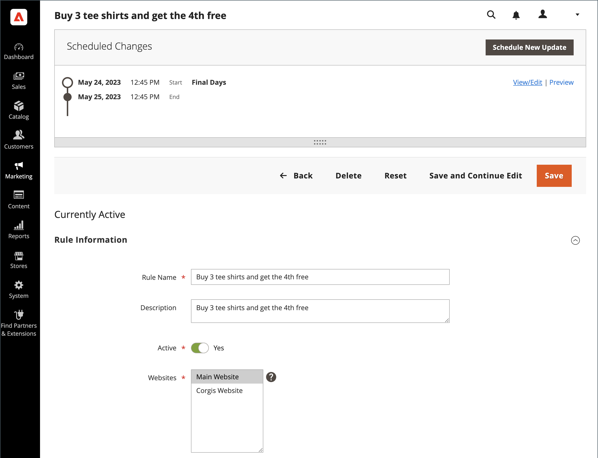

# カート価格ルールの予定変更

{{ee-feature}}

カートの価格ルールは、施策の一環としてスケジュール通りに適用し、他のコンテンツの変更とグループ化することができます。 価格ルールに対する予定された変更に基づいてキャンペーンを作成したり、既存のキャンペーンに変更を適用したりできます。

>[!NOTE]
>
>[!UICONTROL From]と[!UICONTROL To] フィールドは Adobe Commerceで削除されました。カート価格ルールで直接変更することはできません。 これらのアクティベーションのスケジュールされた更新を作成する必要があります。

{width="700" zoomable="yes"}

>[!NOTE]
>
>スケジュールされた更新はすべて連続して適用されます。 つまり、任意のエンティティは、1つの時点で1つのスケジュールされた更新のみを持つことができます。 スケジュールされた更新は、その時間枠内のすべてのストアビューに適用されます。 その結果、エンティティは、異なるストアビューに対して異なるスケジュールされた更新を同時に行うことはできません。 現在のスケジュールされた更新の影響を受けない、すべてのストアビュー内のすべてのエンティティ属性値は、以前のスケジュールされた更新の値ではなく、デフォルト値から取得されます。

同じキャンペーンで複数の価格ルールが実行されている場合、価格ルールの&#x200B;_[!UICONTROL Priority]_設定によって、どのルールが優先されるかが決まります。 詳しくは、[ コンテンツのステージング ](../content-design/content-staging.md)を参照してください。

>[!NOTE]
>
>アクティブなキャンペーンが最初に終了日なしで作成された場合、そのキャンペーンを後で編集して終了日を含めることはできません。 この場合、重複する施策を作成し、必要な終了日を入力する必要があります。

>[!NOTE]
>
>キャンペーンが複数のカート価格ルールにリンクされている場合、キャンペーンは[ コンテンツステージングダッシュボード ](../content-design/content-staging-dashboard.md)からのみ編集できます。

次の点に注意してください。

- 価格ルールを含むキャンペーンを最初に終了日なしで作成した場合、そのキャンペーンを後で編集して終了日を含めることはできません。 キャンペーンの作成時に終了日を追加するか、既存のキャンペーンの複製バージョンを作成し、必要に応じて複製に終了日を追加することをお勧めします。
- スケジュールされた更新を使用して、終了日を含むカート価格ルールを有効にする場合は、必ずルールを最初は無効に設定してください。 既にアクティブなルールは、終了日を尊重しません。
- クーポンはカート価格ルールと関連付けられていません。 スケジュールされた更新では、_[!UICONTROL Rule Information]_タブの_[!UICONTROL Coupon]_、_[!UICONTROL Coupon Code]_、_[!UICONTROL Uses per Coupon]_、および&#x200B;_[!UICONTROL Uses per Customer]_フィールドへのアクセスが提供されません。 また、_[!UICONTROL Manage Coupon Codes]_ タブのすべての設定は使用できません。

>[!IMPORTANT]
>
>キャンペーン **[!UICONTROL Start Date]**&#x200B;と&#x200B;**[!UICONTROL End Date]**&#x200B;は、各web サイトのローカルタイムゾーンから変換される&#x200B;**_default_**&#x200B;管理者タイムゾーンを使用して定義する必要があります。 複数のタイムゾーンに複数のweb サイトを持ち、米国のタイムゾーンにもとづいて施策を開始したい場合の例を考えてみましょう。 この場合、ローカルのタイムゾーンごとに個別の更新をスケジュールし、各ローカル web サイトのタイムゾーンから変換された&#x200B;**[!UICONTROL Start Date]**&#x200B;と&#x200B;**[!UICONTROL End Date]**&#x200B;をデフォルトの管理者タイムゾーンに設定する必要があります。
