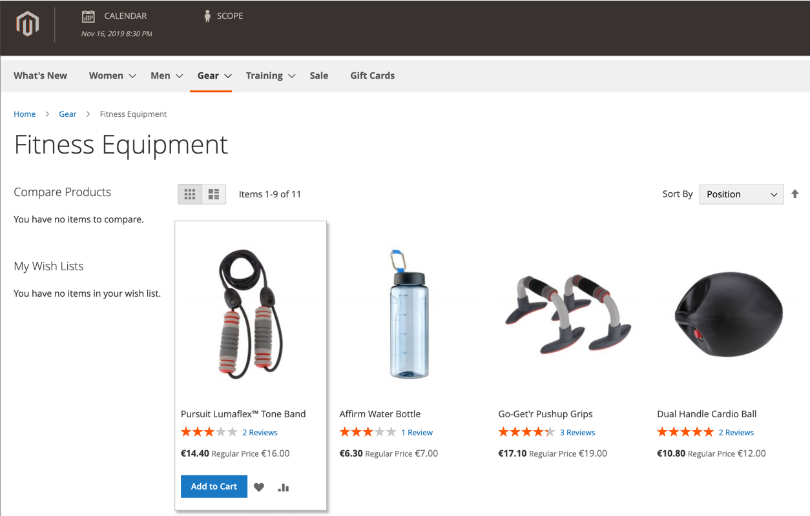
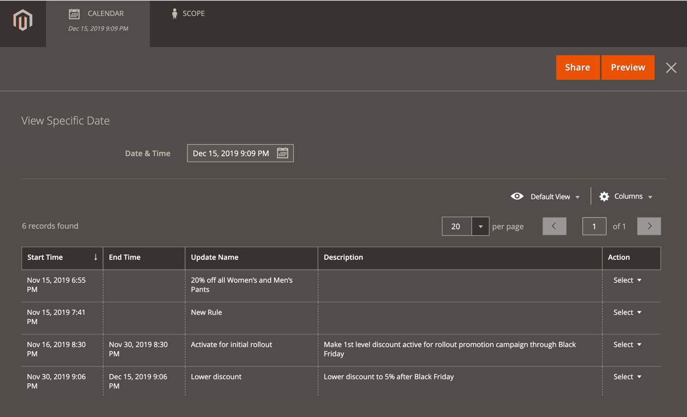

# カタログ価格ルールのスケジュールされた変更

{{ee-feature}}

新規価格ルールが保存または更新されると、「予定変更」ボックスがページ上部に表示されます。 カタログ価格ルールは、キャンペーンの一部としてスケジュールに従って適用でき、他のコンテンツ変更とグループ化できます。 価格ルールに対してスケジュールされた変更に基づいてキャンペーンを作成したり、既存のキャンペーンに変更を適用したりできます。

>[!NOTE]
>
>[!UICONTROL From] および [!UICONTROL To] フィールドは、 Adobe Commerceで削除されており、カタログ価格ルールで直接変更することはできません。 これらのアクティベーションに対して、スケジュールされた更新を作成する必要があります。

>[!NOTE]
>
>スケジュールされたすべての更新は、連続して適用されます。 つまり、どのエンティティも、1 つの時点でスケジュールされた更新を 1 つのみ持つことができます。 スケジュールされた更新は、その期間内のすべてのストアビューに適用されます。 その結果、1 つのエンティティに対して、異なるストア表示の異なるスケジュールされた更新を同時に行うことはできません。 現在スケジュールされている更新の影響を受けないすべてのストアビュー内のすべてのエンティティ属性値は、前回スケジュールされた更新ではなく、デフォルト値から取得されます。

同じキャンペーンで複数の価格ルールが実行されている場合は、価格ルールの「優先度」設定によって、優先されるルールが決まります。 詳しくは、[ コンテンツのステージング ](../content-design/content-staging.md) を参照してください。

>[!IMPORTANT]
>
>アクティブなキャンペーンが最初に終了日なしで作成された場合、後でキャンペーンを編集して終了日を含めることはできません。 この場合、重複するキャンペーンを作成し、必要な終了日を入力する必要があります。

{width="600" zoomable="yes"}

## カタログ価格ルールの更新をスケジュール

1. _管理者_ サイドバーで、**[!UICONTROL Marketing]**/_[!UICONTROL Promotions]_/**カタログ価格ルール**&#x200B;に移動します。

1. ルールを編集モードで開きます。

1. ページ上部の **[!UICONTROL Scheduled Changes]** ボックスで、[**[!UICONTROL Schedule New Update]**] をクリックします。

1. **[!UICONTROL Save as a New Update]** オプションを選択した状態で、次の操作を行います。

   - **[!UICONTROL Update Name]**：ルールの更新の名前を入力します。

   - 適用方法や理由など、更新の簡単な **[!UICONTROL Description]** を入力します。

   - _カレンダー_ （）を使用して、スケジュールされた変更を有効にする **[!DNL Start Date]** と **[!UICONTROL End Date]** を選択します。 無期限の変更を作成するには、終了日を空白のままにします。

   {width="600" zoomable="yes"}

   >[!NOTE]
   >
   >開始日と終了日の日付と時刻は、特定の web サイトのタイムゾーンではなく、デフォルトの管理パネルの日付と時刻とタイムゾーンによって決定されます。 Web サイトのタイムゾーンを考慮して、開始時刻と終了時刻を適切に決定します。 特定のローカル時間に開始または停止する必要がある様々なタイムゾーンの web サイトに対して、個別のルールを作成します。

1. **[!UICONTROL Rule Information]** セクションまでスクロールし、必要に応じてルールを変更します。

   ルールの web サイト（範囲）/顧客グループ、ルールの条件、ルールで適用されるアクションなど、任意のルールパラメーターの変更をスケジュールできます。 詳細は、「[ カタログ価格ルールの作成 ](price-rules-catalog-create.md)」を参照してください。

   >[!NOTE]
   >
   >いずれかのルール情報パラメーターに変更する場合は、ルー _[!UICONTROL Status]_&#x200B;が正しく設定されていることを確認してください。 変更によってルールがアクティブに適用されるようにするには、ステータスを `Active` にします。

1. 完了したら、「**[!UICONTROL Save]**」をクリックします。

   スケジュールされた変更が、キャンペーンの開始日と終了日と共にページの上部に表示されます。

## スケジュールされたルールの変更の編集

1. ページ上部の **[!UICONTROL Scheduled Changes]** ボックスで、[**[!UICONTROL View/Edit]**] をクリックします。

1. スケジュールされている更新に必要な変更を加えます。

   >[!NOTE]
   >
   >キャンペーンが複数のカタログ価格ルールにリンクされている場合、キャンペーンは、「コンテンツのステージングダッシュボード [ からのみ編集でき ](../content-design/content-staging-dashboard.md) す。

1. 「**[!UICONTROL Save]**」をクリックします。

## スケジュールされたルールの変更のプレビュー

1. ページ上部の **[!UICONTROL Scheduled Changes]** ボックスで、[**[!UICONTROL Preview]**] をクリックします。

   プレビューをクリックすると、新しいブラウザータブが開き、適用されたスケジュール済みの変更がストアフロントに読み込まれます。 変更の影響を受ける製品に移動します。

   {width="600" zoomable="yes"}

1. プレビューウィンドウの左上隅にある [**[!UICONTROL Calendar]**] をクリックします。

   カレンダーの詳細には、同じ日にスケジュールされた他のキャンペーンが表示されます。 リスト内の各レコードは、個別のルールの更新です。

   {width="600" zoomable="yes"}

1. 別の日時をプレビューするには、**[!UICONTROL Date & Time]** のカレンダー  をクリックし、次の手順を実行します。

   - 別の日付や時刻を選択してください。

   - 「**[!UICONTROL Preview]**」をクリックします。

1. カレンダーに戻るには、プレビューページのヘッダーにある「**[!UICONTROL Calendar]**」をクリックします。

   ここから、次の操作を実行できます。

   **プレビューへのリンクの共有**

   ストアのプレビューへのリンクを仕事仲間と共有するには、[**[!UICONTROL Share]**] をクリックします。 リンクをクリップボードにコピーし、メールメッセージの本文に貼り付けます。

   >[!NOTE]
   >
   >共有プレビューを表示するには、管理者ユーザーアカウントが必要です。 [ 役割にアクセス ](../systems/permissions-user-roles.md) できる場合、管理者ユーザーアカウントを作成するには、共有する前に新しいユーザーのアカウントを作成する必要があります。

   **プレビューの範囲の変更**

   様々なストアビューでスケジュールされた変更を表示するには、プレビューページのヘッダーの **[!UICONTROL Scope]** をクリックします。 プレビューする web サイト、ストア、またはストア表示を選択します。

1. 必要に応じて、カレンダーに戻り、_[!UICONTROL Action]_&#x200B;列の&#x200B;**[!UICONTROL View/Edit]**&#x200B;をクリックして、別のスケジュールされた更新を開きます。
