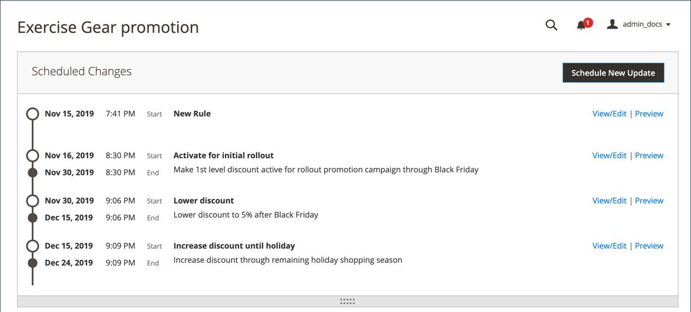
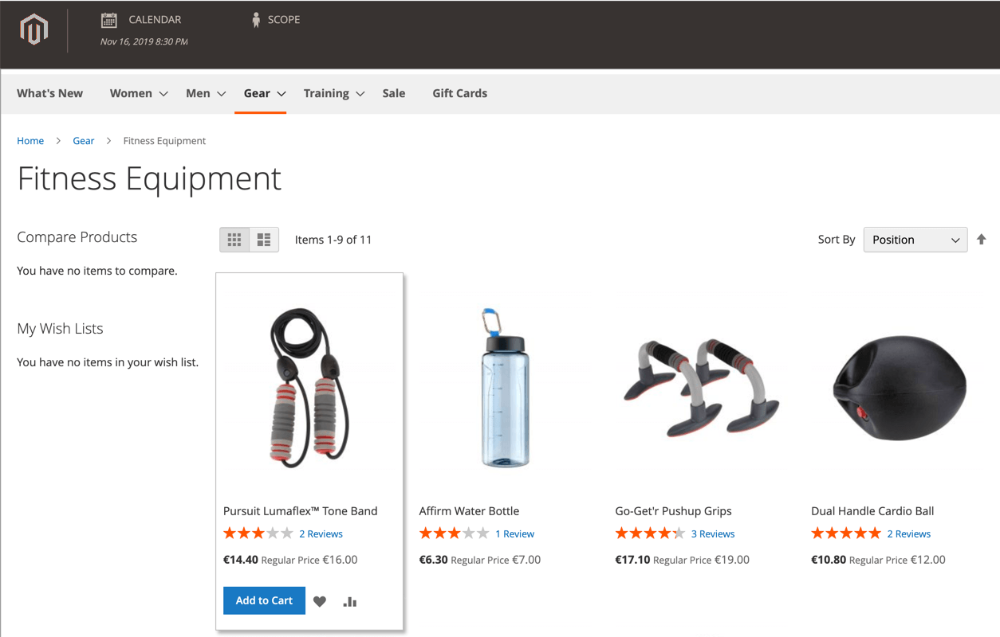
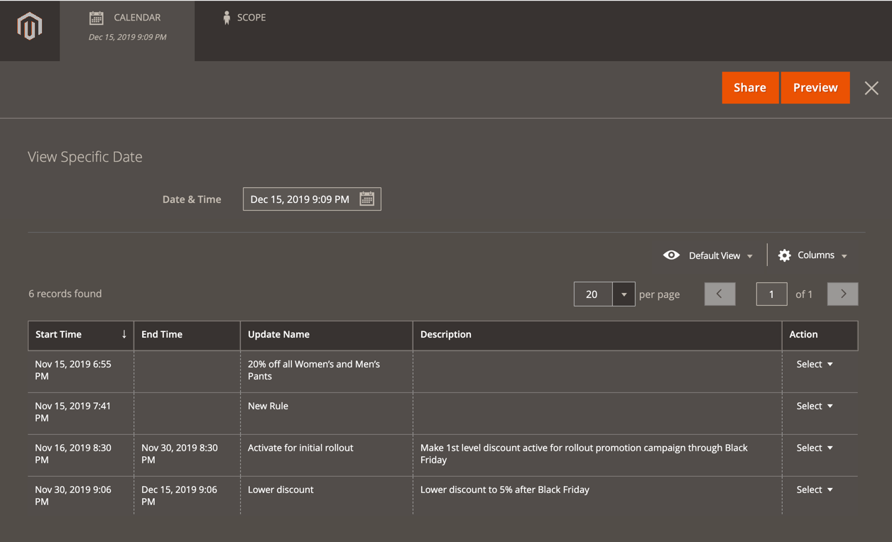

# カタログ価格ルールの予定変更

{{ee-feature}}

新しい価格ルールを保存または更新すると、「予定変更」ボックスがページの上部に表示されます。 カタログの価格ルールは、施策の一環としてスケジュールどおりに適用し、他のコンテンツの変更とグループ化することができます。 価格ルールに対する予定された変更に基づいてキャンペーンを作成したり、既存のキャンペーンに変更を適用したりできます。

{width="600" zoomable="yes"}

## スケジュールされた価格ルールの更新方法

- スケジュールされた更新はすべて連続して適用されます。 つまり、どのエンティティも一度に1つのスケジュールされた更新のみを持つことができます。

- スケジュールされた更新は、その時間枠内のすべてのストアビューに適用されます。 その結果、エンティティは、異なるストアビューに対して異なるスケジュールされた更新を同時に行うことはできません。 現在のスケジュールされた更新の影響を受けない、すべてのストアビュー内のすべてのエンティティ属性値は、以前のスケジュールされた更新の値ではなく、デフォルト値から取得されます。

- 同じキャンペーンで複数の価格ルールが実行されている場合、価格ルールの「優先度」設定によって、どのルールが優先されるかが決定されます。 詳しくは、[&#x200B; コンテンツのステージング &#x200B;](../content-design/content-staging.md)を参照してください。

## 特定の時間での価格ルール販売の終了

終了日なしでアクティブな価格ルールが作成され、特定の時間に終了する必要がある場合は、既存のスケジュールされた更新を編集して終了日を追加することはできません。 代わりに、ルールのステータスを`Inactive`に変更する、新しいスケジュール済み更新プログラムを作成する必要があります。 この新しい更新の開始日を、販売を終了する日時に設定します。

## カタログ価格ルールの更新をスケジュール

1. _管理者_ サイドバーで、**[!UICONTROL Marketing]** > _[!UICONTROL Promotions]_>**カタログ価格ルール**&#x200B;に移動します。

1. ルールを編集モードで開きます。

1. ページ上部の&#x200B;**[!UICONTROL Scheduled Changes]** ボックスで、**[!UICONTROL Schedule New Update]**&#x200B;をクリックします。

1. **[!UICONTROL Save as a New Update]** オプションを選択した状態で、次の操作を行います。

   - 「**[!UICONTROL Update Name]**」に、ルールの更新名を入力します。

   - 更新内容の概要&#x200B;**[!UICONTROL Description]**&#x200B;を入力します。これには、更新方法や適用理由が含まれます。

   - _カレンダー_ （）を使用して、スケジュールされた変更が有効になるように&#x200B;**[!DNL Start Date]**&#x200B;と&#x200B;**[!UICONTROL End Date]**&#x200B;を選択します。 オープンエンド変更を作成するには、終了日を空白のままにします。

   {width="600" zoomable="yes"}

   >[!NOTE]
   >
   >開始日時と終了日時は、特定のweb サイトのタイムゾーンではなく、デフォルトの管理者パネルの日時とタイムゾーンによって決まります。 web サイトのタイムゾーンを考慮して、開始時間と終了時間を適切に決定しましょう。 特定の現地時間に開始または停止する必要がある、異なるタイムゾーンのweb サイトに対して個別のルールを作成します。

1. **[!UICONTROL Rule Information]** セクションまでスクロールし、必要に応じてルールを変更します。

   ルールのweb サイト（スコープ）/顧客グループ、ルールの条件、ルールによって適用されるアクションなど、任意のルールパラメーターの変更をスケジュールできます。 詳しくは、[&#x200B; カタログ価格ルールの作成](price-rules-catalog-create.md)を参照してください。

   >[!NOTE]
   >
   >ルール情報パラメーターを更新するたびに、_[!UICONTROL Status]_&#x200B;が正しく設定されていることを確認してください。 変更を実行してアクティブに適用されたルールにする場合は、ステータスを`Active`に設定します。

1. 完了したら、**[!UICONTROL Save]**&#x200B;をクリックします。

   スケジュールされた変更は、キャンペーンの開始日と終了日とともに、ページの上部に表示されます。

## スケジュールされたルール変更の編集

>[!NOTE]
>
>キャンペーンが複数のカタログ価格ルールにリンクされている場合、[&#x200B; コンテンツステージングダッシュボード &#x200B;](../content-design/content-staging-dashboard.md)からのみキャンペーンを編集できます。

1. ページ上部の&#x200B;**[!UICONTROL Scheduled Changes]** ボックスで、**[!UICONTROL View/Edit]**&#x200B;をクリックします。

1. スケジュールされた更新に必要な変更を加えます。

1. **[!UICONTROL Save]**&#x200B;をクリックします。

## スケジュールされたルール変更のプレビュー

1. ページ上部の&#x200B;**[!UICONTROL Scheduled Changes]** ボックスで、**[!UICONTROL Preview]**&#x200B;をクリックします。

   「プレビュー」で新しいブラウザータブが開き、適用されたスケジュール変更がストアフロントに読み込まれます。 変更の影響を受ける製品に移動します。

   {width="600" zoomable="yes"}

1. プレビューウィンドウの左上隅にある「**[!UICONTROL Calendar]**」をクリックします。

   カレンダーの詳細には、同じ日にスケジュールされているその他のキャンペーンが表示されます。 リスト内の各レコードは、個別のルール更新です。

   {width="600" zoomable="yes"}

1. 別の曜日または時刻をプレビューするには、**[!UICONTROL Date & Time]** カレンダーをクリックし、次の操作を行います。

   - 別の日付や時刻を選択してください。

   - **[!UICONTROL Preview]**&#x200B;をクリックします。

1. カレンダーに戻るには、プレビューページのヘッダーにある「**[!UICONTROL Calendar]**」をクリックします。

   ここから、次の操作を実行できます。

   **プレビューへのリンクを共有**

   ストアのプレビューへのリンクを他の管理者ユーザーと共有するには、**[!UICONTROL Share]**&#x200B;をクリックします。 リンクをクリップボードにコピーし、メールメッセージの本文に貼り付けます。

   >[!NOTE]
   >
   >[の役割に管理者ユーザーアカウントを管理するためのアクセス権](../systems/permissions-user-roles.md)がある場合、プレビューリンクを共有できるように、管理者権限を持つ既存のユーザーアカウントを作成または更新できます。

   **プレビューの範囲を変更**

   異なるストアビューのスケジュールされた変更を表示するには、プレビューページのヘッダーの「**[!UICONTROL Scope]**」をクリックします。 プレビューするweb サイト、ストアビューまたはストアビューを選択します。

1. 必要に応じて、カレンダーに戻り、_[!UICONTROL Action]_&#x200B;列の&#x200B;**[!UICONTROL View/Edit]**&#x200B;をクリックして、別のスケジュール済み更新プログラムを開きます。
