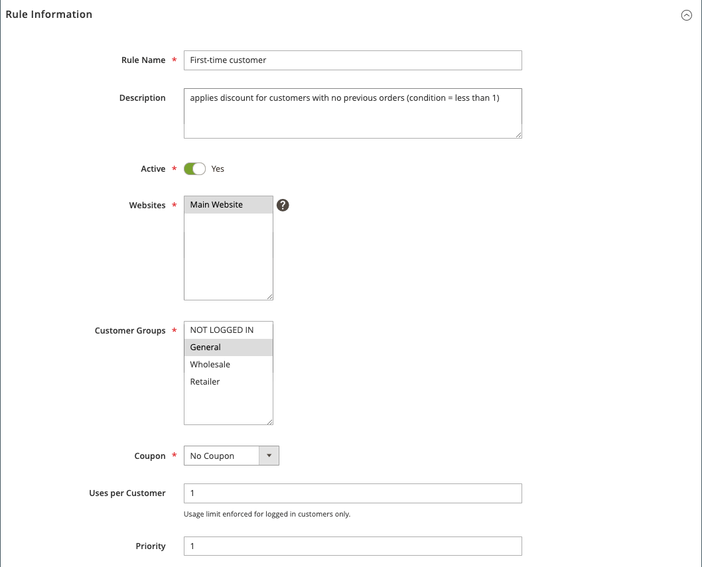
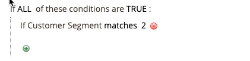

# カートの価格ルールの例 – 初回購入時の割引

{{ee-feature}}

カートの価格ルールを利用すれば、最初の購入時に、クーポンなしで顧客に割引を自動的に提供することができます。

初回訪問者向けの割引を提供するには、次のことをおこないます。

- 注文を持たない&#x200B;_購入者_&#x200B;として定義された顧客セグメントを作成してから
- 新規顧客セグメントをターゲットとするカート価格ルールを作成します。

>[!NOTE]
>
>顧客セグメント機能が有効になっていることを確認します。 [顧客セグメントの作成](../customers/customer-segment-create.md)を参照してください。

## 手順1: 顧客セグメントの作成

1. _管理者_ サイドバーで、**[!UICONTROL Customers]** > **[!UICONTROL Segments]**&#x200B;に移動します。

1. 右上隅の「**[!UICONTROL Add Segment]**」をクリックします。

1. **[!UICONTROL General Properties]**&#x200B;を定義します。

   - 顧客セグメントを識別するために&#x200B;**[!UICONTROL Segment Name]**&#x200B;を入力します（例：_初回顧客_）。

   - **[!UICONTROL Assigned to Website]**&#x200B;で、顧客セグメントを使用できるweb サイトを選択します。

   - **[!UICONTROL Status]**&#x200B;に対して、`Active`を選択します。

   - **[!UICONTROL Apply to]**&#x200B;に対して、`Visitors and Registered Customers`を選択します。

   - 完了したら、**[!UICONTROL Save and Continue Edit]**&#x200B;をクリックします。

     左側のパネルで追加のオプションが使用できるようになります。

   {width="600" zoomable="yes"}

1. **[!UICONTROL Conditions]**&#x200B;を定義します。

   この例では、条件は&#x200B;_合計注文数が1_&#x200B;未満の顧客をターゲットにします。

   - 左側のパネルで、**[!UICONTROL Conditions]**&#x200B;を選択します。

     デフォルトの条件は、「これらの条件がすべてTRUEの場合」から始まります。

   - _追加_ （）をクリックし、`Number of Orders`を選択します。

   - **[!UICONTROL is]**&#x200B;をクリックし、`less than`を選択します。

   - 「**...**」をクリックし、フィールドに「`1`」と入力します。

   - 緑のチェックマーク（）をクリックして、条件設定を保存します。

   {width="600" zoomable="yes"}

1. **[!UICONTROL Save]**&#x200B;をクリックします。

顧客セグメントが作成され、_[!UICONTROL Customer Segments]_&#x200B;グリッドに表示されます。

>[!TIP]
>
>セグメント IDをメモします。 このID番号を使用して、買い物かごの価格ルールを作成します。

## 手順2: 買い物かごの価格ルールの作成

1. _管理者_ サイドバーで、**[!UICONTROL Marketing]** > _[!UICONTROL Promotions]_>**[!UICONTROL Cart Price Rule]**&#x200B;に移動します。

1. 右上隅の「**[!UICONTROL Add New Rule]**」をクリックします。

   **[!UICONTROL Rule Information]** セクションはデフォルトで表示され、**[!UICONTROL Conditions]**&#x200B;と&#x200B;**[!UICONTROL Conditions]**&#x200B;の拡張可能なセクションがあります。

1. **[!UICONTROL Rule Information]**&#x200B;を定義します。

   - **[!UICONTROL Rule Name]**&#x200B;と&#x200B;**[!UICONTROL Description]**&#x200B;のフィールドに入力します。 これらのフィールドは内部参照用です。

   - **[!UICONTROL Websites]**&#x200B;で、ルールを使用できるWeb サイトを選択します。

   - **[!UICONTROL Customer Groups]**&#x200B;の場合、このルールが適用される顧客グループを選択します。

     複数のグループを選択するには、Ctrl キー（PC）またはCommand キー（Mac）を押しながら、各オプションをクリックします。

     >[!NOTE]
     >
     >このリストのオプションは、**[!UICONTROL Customers]** > **[!UICONTROL Customer Groups]**&#x200B;で作成および管理された顧客グループによって異なります。

   - **[!UICONTROL Coupon]**&#x200B;に対して、`No Coupon`を選択します。

   - **[!UICONTROL Uses per Customer]**&#x200B;に対して、`1`と入力します。

   - **[!UICONTROL Priority]**&#x200B;に、他のルールに対してこのルールの優先度を確立する番号を入力します。

     >[!NOTE]
     >
     >優先度設定は、同じカタログ製品が複数の価格ルールに設定された条件を満たす場合に重要です。 優先度が最も高い設定を持つルールは、お客様に対してアクティブになります。 最優先事項は1です。 この例では、`1`と入力すると、このルールが他の価格ルールよりも前に適用されます。 この値は、**[!UICONTROL Action]** セクションの&#x200B;**[!UICONTROL Discard Subsequent Rules]**&#x200B;設定で使用されます。

   - 完了したら、**[!UICONTROL Save and Continue Edit]**&#x200B;をクリックします。

     左側のパネルで追加のオプションが使用できるようになります。

   {width="600" zoomable="yes"}

1. **[!UICONTROL Conditions]**&#x200B;を定義します。

   - 下にスクロールして、**[!UICONTROL Conditions]** セクションのを展開します。

     デフォルトのルールは、「これらの条件がすべてTRUEの場合：」から始まります。

   - _追加_ （）をクリックし、`Customer Segment`を選択します。

     修飾子フィールドのデフォルトは`matches`です。

   - 「**...**」をクリックし、ターゲットにする顧客セグメントのセグメント IDを入力します。

     この例では、手順1で作成された新しいセグメントのセグメント IDは`2`です。

     >[!NOTE]
     >
     >セグメント IDがわからない場合は、選択アイコン（）をクリックして、顧客セグメントリストを表示します。 フィールドにIDを手動で入力するか、目的のセグメントのチェックボックスを選択してフィールドを自動入力できます。

   - 緑のチェックマーク（）をクリックして、条件設定を保存します。

   - 完了したら、**[!UICONTROL Save and Continue Edit]**&#x200B;をクリックします。

     このルール行は、顧客セグメント ID 2に一致するすべての顧客に適用されます。

   {width="400"}

1. 下にスクロールして 「**[!UICONTROL Conditions]**」セクションを展開し、ルールのアクションを定義します。

   このセクションでは、初回訪問客に適用する割引の種類と価値/額を定義します。 この例では、定義された条件を満たすすべての顧客に対して10%の割引を定義します。 その他の利用可能なオプションについて詳しくは、[&#x200B; カート価格ルールの作成](price-rules-cart-create.md)を参照してください。

   - **[!UICONTROL Apply]**&#x200B;の場合は、「製品価格割引の割合」を選択します。

   - **[!UICONTROL Discount Amount]**&#x200B;に対して、`10`と入力します。

   - この価格ルールを製品金額にのみ適用するには、**[!UICONTROL Apply to Shipping Amount]**&#x200B;を`No`に設定します。

   - 同じ製品に複数の価格ルールを適用できないようにするには、**[!UICONTROL Discard Subsequent Rules]**&#x200B;を`Yes`に設定します。

   - 完了したら、**[!UICONTROL Save]**&#x200B;をクリックします。

   {width="600" zoomable="yes"}

新しいルールは通常、1時間以内に利用できます。 ルールをテストして、ルールが定義したとおりに動作することを確認します。

## 手順3：ルールの保存とテスト

{{new-price-rule}}

1. ルールが完了したら、**[!UICONTROL Save Rule]**&#x200B;をクリックします。

1. ルールをテストして、正しく動作することを確認します。
