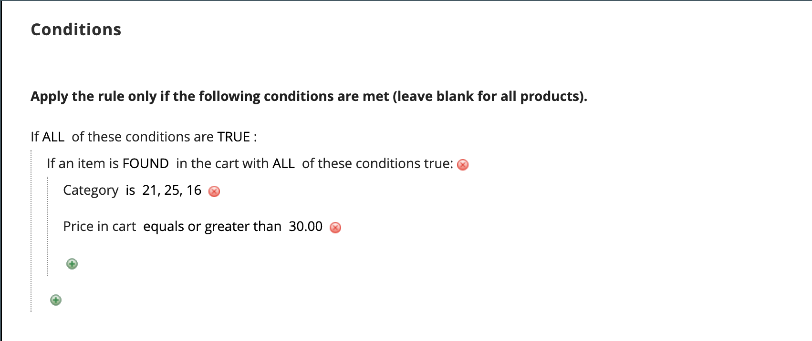

# カートの価格ルールの例 – 最低商品価格での割引

カートの価格ルールを利用して、カート内の最低商品価格に基づいて、パーセンテージ割引を提供することができます。 次の例では、指定したカテゴリの価格が30.00 ドルを超える少なくとも1つの商品がカートに追加された場合、カート全体のすべての商品に10%の割引が適用されます。 割引の形式は次のとおりです。

少なくとも1つの商品がY カテゴリーのもので、価格がZ ドルを超える場合、買い物客全体のX%がオフになります。

## 手順1: 買い物かごルールの作成

基本的な[手順](price-rules-cart.md)に従って、買い物かごルールを作成します。

## 手順2: 条件の定義

1. 下にスクロールして、**[!UICONTROL Conditions]** セクションのを展開します。

1. _追加_ （）をクリックし、**[!UICONTROL Product Attribute Combination]**&#x200B;を選択します。

   {width="500" zoomable="yes"}

1. 次の行の先頭にある&#x200B;_追加_ （）をクリックし、**[!UICONTROL Product Attribute]**&#x200B;の下のリストで「**[!UICONTROL Category]**」を選択します。

   - 「（**...**） _more_」リンクをクリックして、追加のオプションを表示します。

     {width="600" zoomable="yes"}

   - _Chooser_ （）アイコンをクリックすると、使用可能なカテゴリが表示されます。 カテゴリーツリーで、含める各カテゴリのチェックボックスを選択します。 チェックアイコンをクリックして、カテゴリの選択を確定します。

     {width="600" zoomable="yes"}

1. 次の行の先頭にある「_追加_」（）をクリックし、次の操作を行います。

   - **[!UICONTROL Cart Item Attribute]**&#x200B;の下のリストで、**[!UICONTROL Price in cart]**&#x200B;を選択します。

     {width="500"}

   - **is**&#x200B;をクリックし、`equals or greater than`を選択します。

   - 「**...**」をクリックし、条件を満たすためにカート内の価格が必要な金額を入力します。 例えば、`30`と入力します。

     {width="500"}

1. **[!UICONTROL Save and Continue Edit]**&#x200B;をクリックします。

## 手順3: アクションの定義

1. **[!UICONTROL Actions]** セクションのを展開し、次の操作を行います。

   {width="600" zoomable="yes"}

   - **[!UICONTROL Apply]**&#x200B;を`Percent of product price discount`に設定します。

   - **[!UICONTROL Discount Amount]**&#x200B;を入力します。 例えば、10%割引の場合は`10`と入力します。

   - 購入に追加のプロモーションが適用されないようにするには、**[!UICONTROL Discard subsequent rules]**&#x200B;を`Yes`に設定します。

1. **[!UICONTROL Save and Continue Edit]**&#x200B;をクリックし、必要に応じてルールを完了します。

## 手順4: ラベルを記入してください

チェックアウト時に表示されるラベルを入力するには、カート価格ルール手順の[手順4](price-rules-cart.md)を完了します。

## 手順5：ルールの保存とテスト

{{new-price-rule}}

1. ルールが完了したら、**[!UICONTROL Save Rule]**&#x200B;をクリックします。
1. ルールをテストして、正しく動作することを確認します。
