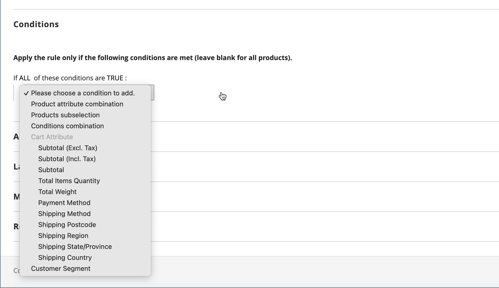

# 買い物かご価格ルールの例 – 最小購入による割引

買い物かご価格ルールを使用すると、最小購入に基づいてパーセンテージの割引を提供できます。 次の例では、特定のカテゴリで 200.00 ドルを超えるすべての購入に 25% の割引が適用されます。 割引の形式は次のとおりです。

Y （カテゴリ）全体の X% 割引（$Z ドルを超える）

## 手順 1. 買い物かごルールの作成

基本に従う [指示](price-rules-cart.md) で買い物かごルールを作成します。

## 手順 2. 条件の定義

1. 下にスクロールして展開  この **[!UICONTROL Conditions]** セクション。

1. クリック _追加_ （）を選択して、 **[!UICONTROL Product Attribute Combination]**.

   {width="500" zoomable="yes"}

1. クリック _追加_ （）を次の行の先頭に追加し、の下のリストに追加します **[!UICONTROL Product Attribute]**、を選択 **[!UICONTROL Category]**.

   - 「」（**...**） _詳細_ 追加のオプションを表示するリンク。

     {width="600" zoomable="yes"}

   - 「」をクリックします _選択_ （）アイコンをクリックして、使用可能なカテゴリを確認します。 カテゴリツリーで、含める各カテゴリのチェックボックスを選択します。 チェックアイコンをクリックして、カテゴリの選択を確定します。

     {width="600" zoomable="yes"}

1. クリック _追加_ （）を選択し、次の手順を実行します。

   - の下のリスト **[!UICONTROL Cart Item Attribute]**、を選択 **[!UICONTROL Price in cart]**.

     {width="500"}

   - クリック **等しい** を選択します `equals or greater than`.

   - クリック **...** そして、買い物かごの価格が条件を満たす必要がある金額を入力します。 例えば、 `30`.

     {width="500"}

1. クリック **[!UICONTROL Save and Continue Edit]**.

## 手順 3. アクションの定義

1. を展開  この **[!UICONTROL Actions]** を選択し、次の操作を実行します。

   {width="600" zoomable="yes"}

   - を設定 **[!UICONTROL Apply]** 対象： `Percent of product price discount`.

   - を入力 **[!UICONTROL Discount Amount]**. 例えば、 `10` 10% 引きで。

   - 追加のプロモーションが購入に適用されないようにするには、を設定します **[!UICONTROL Discard subsequent rules]** 対象： `Yes`.

1. クリック **[!UICONTROL Save and Continue Edit]** 必要に応じてルールを完成させます。

## 手順 4. ラベルを完成させる

完了 [手順 4](price-rules-cart.md) （チェックアウト時に表示されるラベルを入力するための買い物かご価格ルール手順）。

## 手順 5：ルールを保存してテストする

{{new-price-rule}}

1. ルールが完了したら、 **[!UICONTROL Save Rule]**.

1. ルールをテストして、正しく動作することを確認します。
