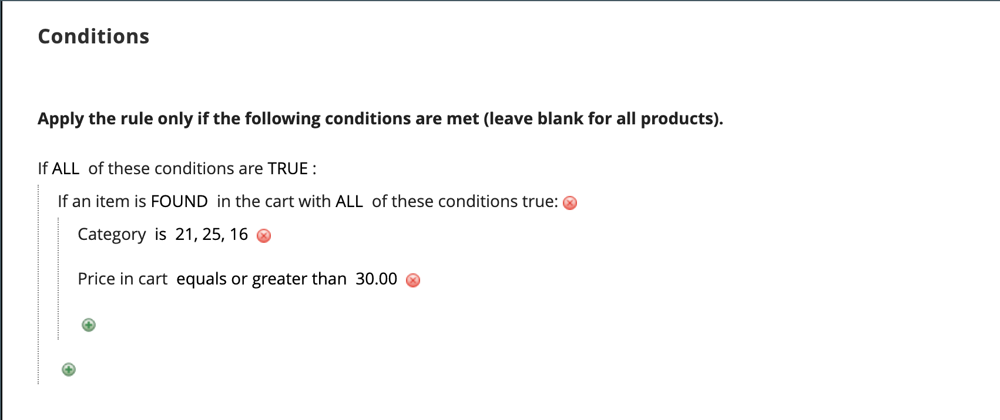

# 買い物かごの価格ルールの例 — 最小購入による割引

買い物かごの価格ルールを使用して、最小購入に基づいて割引率をオファーできます。 次の例では、特定のカテゴリの$200.00 を超えるすべての購入に 25%の割引が適用されています。 割引の形式は次のとおりです。

$Z ドルを超えるすべての Y（カテゴリ）の X%オフ

## 手順 1. 買い物かごルールの作成

基本の [instructions](price-rules-cart.md) をクリックして、買い物かごルールを作成します。

## 手順 2. 条件の定義

1. 下にスクロールして展開  の **[!UICONTROL Conditions]** 」セクションに入力します。

1. クリック _追加_ () をクリックし、を選択します。 **[!UICONTROL Product Attribute Combination]**.

   {width="500" zoomable="yes"}

1. クリック _追加_ () を次の行の先頭に配置し、リスト内の **[!UICONTROL Product Attribute]**&#x200B;を選択します。 **[!UICONTROL Category]**.

   - (**...**) _その他_ リンクをクリックして、追加のオプションを表示します。

     {width="600" zoomable="yes"}

   - 次をクリック： _選択_ () アイコンをクリックして、使用可能なカテゴリを表示します。 カテゴリツリーで、含める各カテゴリのチェックボックスをオンにします。 チェックアイコンをクリックして、カテゴリの選択を受け入れます。

     {width="600" zoomable="yes"}

1. クリック _追加_ () を次の行の先頭に配置し、次の操作を実行します。

   - の下のリストで **[!UICONTROL Cart Item Attribute]**&#x200B;を選択します。 **[!UICONTROL Price in cart]**.

     {width="500"}

   - クリック **次に該当** を選択します。 `equals or greater than`.

   - クリック **...** 「買い物かご内の価格」が条件を満たすために必要な金額を入力します。 例えば、 `30`.

     {width="500"}

1. クリック **[!UICONTROL Save and Continue Edit]**.

## 手順 3. アクションの定義

1. 展開  の **[!UICONTROL Actions]** 」セクションで次の操作を実行します。

   {width="600" zoomable="yes"}

   - 設定 **[!UICONTROL Apply]** から `Percent of product price discount`.

   - 次を入力します。 **[!UICONTROL Discount Amount]**. 例えば、 `10` 10%の割引を受ける場合。

   - 追加のプロモーションが購入に適用されないようにするには、 **[!UICONTROL Discard subsequent rules]** から `Yes`.

1. クリック **[!UICONTROL Save and Continue Edit]** 必要に応じて、ルールを完了します。

## 手順 4. ラベルを完成させます。

完了 [手順 4](price-rules-cart.md) を使用して、チェックアウト時に表示されるラベルを入力します。

## 手順 5：ルールを保存してテストする

{{new-price-rule}}

1. ルールが完了したら、「 **[!UICONTROL Save Rule]**.

1. ルールをテストして、正しく動作することを確認します。
