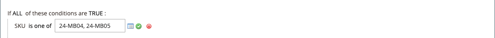

# 複数の SKU を持つカタログ価格ルール

1 つのカタログ価格ルールを複数の SKU に適用して、製品、ブランド、カテゴリに基づいて様々なプロモーションを作成できます。 このルールを作成する際には、選択した SKU に一致する条件を設定します。 ルールを作成する際に、グリッドから SKU を簡単に参照して選択できます。

## 手順 1. 製品属性のストアフロントのプロパティの確認

開始する前に、`sku` 属性の [Storefront プロパティ &#x200B;](../catalog/attribute-product-create.md#step-4-describe-the-storefront-properties) が `Use in Promo Rules` に設定されていることを確認します。

1. _管理者_ サイドバーで、**[!UICONTROL Stores]**/_[!UICONTROL Attributes]_/**[!UICONTROL Product]**&#x200B;に移動します。

1. 「_[!UICONTROL Attribute Code]_」列の上部にある検索フィルターで、「`sku`」と入力して「**[!UICONTROL Search]**」をクリックします。

1. クリックすると、`sku` 属性が編集モードで開きます。

1. 左側のパネルで、「**[!UICONTROL Storefront Properties]**」をクリックし、「**[!UICONTROL Use for Promo Rule Conditions]**」が「`Yes`」に設定されていることを確認します。

1. プロパティの値を変更した場合は、「変 **[!UICONTROL Save Attribute]**」をクリックします。

## 手順 2. 複数の SKU への価格ルールの適用

1. _管理者_ サイドバーで、**[!UICONTROL Marketing]**/_[!UICONTROL Promotions]_/**[!UICONTROL Catalog Price Rules]**&#x200B;に移動します。

1. 次のいずれかの操作を行います。

   - 手順に従って [&#x200B; カタログ価格ルール &#x200B;](price-rules-catalog.md) を作成します。
   - 既存のカタログ価格ルールを開きます。

1. **[!UICONTROL Conditions]** のセクションの  を展開し、以下の操作を実行します。

   - 最初の行で、最初のパラメーターを `ANY` に設定します。

     {width="600" zoomable="yes"}

   - 次の行の先頭にある _追加_ （）をクリックし、**[!UICONTROL Product Attribute]** の下のリストで「追 `SKU`」をクリックします。

     {width="600" zoomable="yes"}

   - 比較のために、オプションがあります。 SKU のリストから少なくとも 1 つを見つける場合は、`select is one of` を参照してください。 適用するすべての SKU を見つける必要がある場合は、「`is`」を選択します。 `is one of` を選択することをお勧めします。

     {width="600" zoomable="yes"}

   - 条件を完了するには、その他（**...**）リンクをクリックし、_選択_ （）アイコンをクリックして、使用可能な製品のリストを表示します。

     {width="600" zoomable="yes"}

   - 参照、フィルターまたは検索して、追加する SKU を見つけます。 リストで、含める各製品のチェックボックスを選択します。

   - 「**[!UICONTROL Save and Apply]**」をクリックして、SKU を条件に追加します。

     {width="600" zoomable="yes"}

1. 条件が満たされたときに実行される [&#x200B; アクション &#x200B;](price-rules-catalog.md) を含め、ルールを完了します。

1. ルールが完成したら、「**[!UICONTROL Save]**」をクリックします。

{{new-price-rule}}
