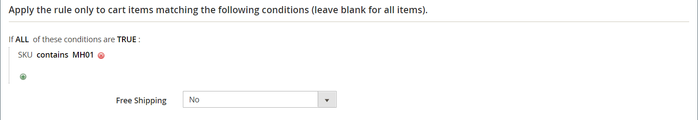

# 買い物かごの価格ルールの例 – 購入する

この例では、_買い物かご価格ルール [&#128279;](price-rules-cart.md)を設定して、無料で_&#x200B;のプロモーションを取得する方法を示します。 割引の形式は次のとおりです。

_商品のX数量を購入し、Y数量を無料で取得_

## 手順1: 買い物かごの価格ルールの作成

カート価格ルール手順の[手順1](price-rules-cart.md)を完了して、ルール情報を完了します。

## 手順2: 条件の定義

カートの手順の[手順2](price-rules-cart.md)を完了して、価格ルールの条件を定義します。 これは、ルールに追加できる2つの条件の最初のもので、ルールがトリガーされるタイミングを決定します。 以下の組み合わせに基づいて行うことができます。

- 製品属性
- 特定可能
- カート属性
-  （Adobe Commerceのみ）お客様のセグメント

空白のままにすると、カートごとにルールがトリガーされます。

{width="600" zoomable="yes"}

## 手順3: アクションの定義

1. **[!UICONTROL Actions]** セクションのを展開し、次の操作を行います。

   - **[!UICONTROL Apply]**&#x200B;を`Buy X get Y free (_[!UICONTROL _[!UICONTROL Discount Amount]_]_ is Y)`に設定します。

   - **[!UICONTROL Discount Amount]**&#x200B;を`1`に設定します。 これは、顧客が無料で受け取る量です。

   - 条件が満たされたときに適用できる割引の数を制限するには、**[!UICONTROL Maximum Qty Discount is Applied To]** フィールドに番号を入力します。 これは、この[式](#maximum-quantity-discount)を使用して計算されます。

   - **[!UICONTROL Discount Qty Step (Buy X)]**&#x200B;の場合、お客様が購入する必要がある数量を入力して、割引を受けることができます。 この例では、顧客は3つ購入する必要があります。

   - 他の割引が購入に適用されないようにする場合は、**[!UICONTROL Discard subsequent rules]**&#x200B;を`Yes`に設定します。

   {width="600" zoomable="yes"}

1. ルールをカート内の特定のアイテムにのみ適用するには、プロモーションに必要なカートのアイテムや製品属性を記述する条件を完了します。

   次の例では、SKUを使用して、設定可能な製品のすべての関連するバリエーションにルールを適用します。

   {width="600" zoomable="yes"}

1. **[!UICONTROL Free Shipping]**&#x200B;を含めるには、`For matching items only`を選択します。

1. **[!UICONTROL Save and Continue Edit]**&#x200B;をクリックし、必要に応じてルールの残りの部分を完了します。

## 手順4: ラベルを完成させる

チェックアウト時に表示されるラベルを入力するには、カート価格ルール手順の[手順4](price-rules-cart.md)を完了します。

## 手順5：ルールの保存とテスト

{{new-price-rule}}

1. ルールが完了したら、**[!UICONTROL Save Rule]**&#x200B;をクリックします。

1. ルールをテストして、正しく動作することを確認します。

## バリエーション

購入X Get Y Freeは、_行の合計_&#x200B;依存関係を持つ単一のアクションとして処理されます。 プロモーションの対象となるすべてのアイテムが同じSKUに属している必要があります。 例：

商品のX数量をカテゴリ Aから購入し、同じ商品のY数量を無料で取得します。

無料の商品をカテゴリーA、B、Cに制限するには、次のアクションを設定します。

これらの条件がすべてTRUEの場合：
カテゴリーはA、B、Cのいずれかです

任意のカテゴリ（A、B、またはC）の無料アイテムを制限し、SKU （D123、E123、またはF123）からYを受け取るには、次のアクションを設定します。

これらの条件がすべてTRUEの場合：
SKUはD123、E123、F123の1つです

## 最大数量割引

次の式を使用して、最大数量ディスカウントの正しい値を決定します。

数式= `(X+Y) * (M/Y)`
どこで
`X` =購入済みアイテム数
`Y` =無料アイテムの数
`M` =許可される無料項目の最大数

例：

5つ購入して、最大4つの無料アイテムで2つを無料で入手できます。

    Where
    X = 5
    Y = 2
    M = 4
    最大数量割引= （5+2）*（4/2）=（7）*（2）=14

5つ購入すると、最大9つの無料アイテムを使用して3つの無料アイテムを取得できます。

    Where
    X = 5
    Y = 3
    M = 9
    最大数量割引= （5+3）*（9/3）=24

20個を購入すると、最大20個の無料アイテムを使用して2個の無料アイテムを獲得できます。

    Where
    X = 20
    Y = 2
    M = 20
    最大数量割引= （20+2）*（20/2）=（22）*（10）=220
