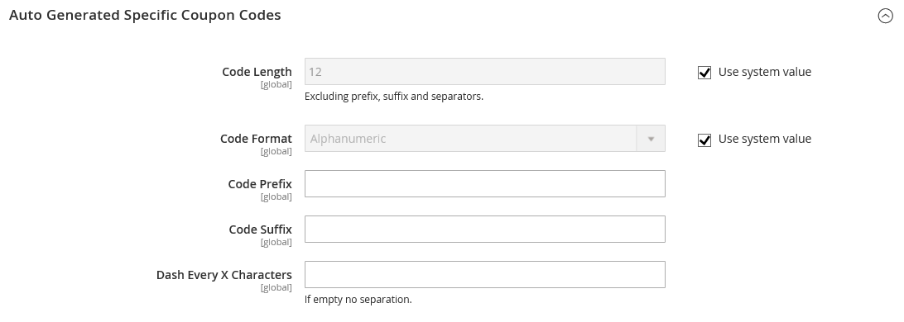
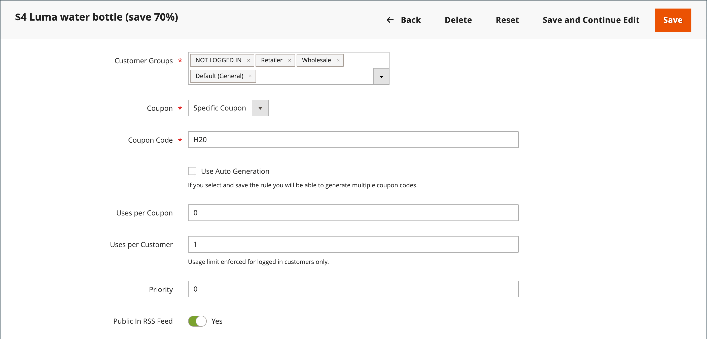
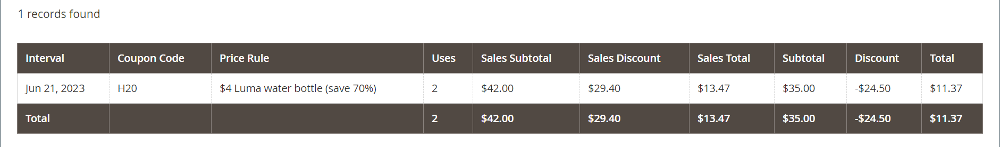
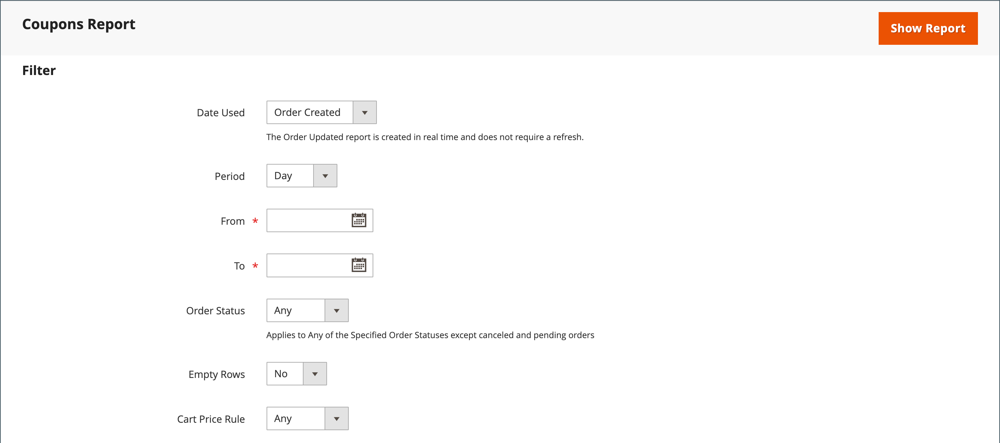

# クーポンコード

クーポンコードは、一連の条件が満たされたときに割引を適用するために[&#x200B; カート価格ルール &#x200B;](price-rules-cart.md)と共に使用されます。 例えば、特定の顧客グループや一定額の買い物をした人向けにクーポンコードを作成することができます。 クーポンを購入に適用するには、お客様はクーポンコードをカートに入力するか、_実店舗_&#x200B;のレジで入力します。 店舗でクーポンを使用する方法をいくつか紹介します。

- 顧客にクーポンをメールで送信
- 印刷されたクーポンの作成
- モバイルユーザー向けの店舗内クーポンの作成

クーポンコードは、電子メールで送信するか、ニュースレター、カタログ、広告に含めることができます。 クーポンコードのリストを書き出して、商用プリンターに送信できます。 また、買い物客がスマートフォンでスキャンできるクイックレスポンスコードを使用して、実店舗のクーポンを作成することもできます。 QR コードは、プロモーションに関する詳細を記載したサイト上のページにリンクできます。

Commerce 2.4.7では、買い物客は複数のクーポンをカートに入れることができます。 また、ショッピング支援を利用して、複数のクーポンを適用することもできます。

>[!NOTE]
>
>同じ優先度を持つカート価格ルールは、複合割引にはなりません。 データベース内のカート価格ルール IDに従って、各規則（クーポン）が一対一で対応する商品に個別に適用されます。 割引が適用される順序を制御するために、Adobeでは、追加されたカート価格ルールごとに異なる優先度を設定することをお勧めします。

## クーポンコードの設定

>[!BEGINSHADEBOX]

Commerceでは、デフォルトで、クーポンコードを作成するための2つの方法をサポートしています。

1. 単一の特定クーポンコードの作成
1. 複数の&#x200B;_random_ クーポンコードを生成しています

カート価格ルールをインポートして関連付けるクーポンコードのリストが既にある場合は、[Commerce Marketplace](https://marketplace.magento.com/)の拡張機能を使用することを検討してください。

>[!ENDSHADEBOX]

自動生成されたクーポンコードの長さと形式は、設定によって制御されます。 文字は、すべての数字、すべての文字、または組み合わせに設定できます。 一定の間隔でダッシュを挿入して読みやすくし、接頭辞と接尾辞を追加して、コードを特定のキャンペーンまたはイニシアチブに関連付けることができます。

1. _管理者_ サイドバーで、**[!UICONTROL Stores]** > _[!UICONTROL Settings]_>**[!UICONTROL Configuration]**&#x200B;に移動します。

1. 左側のパネルで、**[!UICONTROL Customers]**&#x200B;を展開し、**[!UICONTROL Promotions]**&#x200B;を選択します。

   {width="600" zoomable="yes"}

1. **[!UICONTROL Auto Generated Specific Coupon Codes]** セクションを展開します。

   {width="600" zoomable="yes"}

1. 接頭辞、接尾辞、区切り記号を含む&#x200B;**[!UICONTROL Code Length]**&#x200B;を入力します。

1. **[!UICONTROL Code Format]**&#x200B;を次のいずれかに設定します。

   - `Alphanumeric`
   - `Alphabetical`
   - `Numeric`

1. **[!UICONTROL Code Prefix]**&#x200B;には、すべてのクーポンコードの先頭に表示する値を入力します。

1. 「**[!UICONTROL Code Suffix]**」に、すべてのクーポンコードの最後に表示する値を入力します。

1. **[!UICONTROL Dash Every X Characters]**&#x200B;に、各ダッシュの間の文字数を入力します。

   数字が同じであっても、ダッシュパターンが異なるクーポンコードは、異なるコードとみなされます。

1. 完了したら、**[!UICONTROL Save Config]**&#x200B;をクリックします。

## クーポンの作成

>[!NOTE]
>
>[!BADGE PaaSのみ]{type=Informative url="https://experienceleague.adobe.com/en/docs/commerce/user-guides/product-solutions" tooltip="Adobe Commerce on Cloud プロジェクト（Adobeで管理されるPaaS インフラストラクチャ）とオンプレミス プロジェクトにのみ適用されます。"} クーポンを作成する前に、`bin/magento cron:run` コマンドを使用して、cronが実行されていることを確認します。 詳しくは、_設定ガイド_&#x200B;の「[&#x200B; コマンドラインからcronを実行する](https://experienceleague.adobe.com/docs/commerce-operations/configuration-guide/cli/configure-cron-jobs.html#run-cron-from-the-command-line)」を参照してください。

### 方法1：特定のクーポンを作成する

1. 手順に従って、[&#x200B; カート価格ルール &#x200B;](price-rules-cart.md)を作成します。

1. **[!UICONTROL Rule Information]** セクションで、**[!UICONTROL Coupon]**&#x200B;を`Specific Coupon`に設定します。

1. プロモーションで使用する&#x200B;**[!UICONTROL Coupon Code]**&#x200B;を入力してください。

   コードの形式（数値、英数字、またはアルファベット）は、[設定](#configure-coupon-codes)によって決まります。

1. クーポンを使用できる回数を制限するには、次の操作を行います。

   - **[!UICONTROL Uses per Coupon]**&#x200B;の数字を入力してください。
   - **[!UICONTROL Uses per Customer]**&#x200B;の数字を入力してください。

   無制限に使用するには、これらのフィールドを空白のままにします。

   {width="600" zoomable="yes"}

   >[!NOTE]
   >
   >複数のお客様が同時に同じクーポンを同時に利用する場合、クーポン処理の遅れにより、設定された利用制限を超える可能性があります。

1. クーポンを一定期間有効にするには、次の操作を行います。

   -  （Magento Open Sourceのみ） **開始**&#x200B;および&#x200B;**開始**&#x200B;の日付を完了します。 日付を選択するには、各フィールドの横にある&#x200B;**カレンダー** （）アイコンをクリックします。 日付範囲を空のままにすると、ルールの有効期限は切れません。

   -  （Adobe Commerceのみ）次のいずれかの操作を行います。

     **オプション 1:**&#x200B;新しい更新をスケジュールする

      - ページの右上隅にある「**[!UICONTROL Schedule New Update]**」をクリックします。

        {width="600" zoomable="yes"}

      - **[!UICONTROL Update Name]**&#x200B;と&#x200B;**[!UICONTROL Description]**&#x200B;を入力します。

      - カレンダー（）から&#x200B;**開始日**&#x200B;と&#x200B;**[!UICONTROL End Date]**&#x200B;を選択します。 日付範囲を空のままにすると、ルールの有効期限は切れません。

      - 完了したら、**[!UICONTROL Save]**&#x200B;をクリックします。

        {width="600" zoomable="yes"}

     **オプション 2:**&#x200B;既存の更新プログラムに割り当てる：

      - **[!UICONTROL Assign to Another Update]**&#x200B;を選択します。

      - リストで更新プログラムを見つけて、**[!UICONTROL Select]**&#x200B;をクリックします。

1. 必要に応じて[&#x200B; カート価格ルール &#x200B;](price-rules-cart.md)を完了します。

### 方法2：クーポンのバッチを生成する

割引クーポンの生成は非同期操作で、バックグラウンドで実行されるため、操作が完了するのを待たずに管理者で作業を続けることができます。 タスクが完了すると、メッセージが表示されます。

1. 手順に従って、[&#x200B; カート価格ルール &#x200B;](price-rules-cart.md)を作成します。

1. 「**[!UICONTROL Coupon Code]**」で、「**[!UICONTROL Use Auto Generation]**」チェックボックスを選択します。

1. 各顧客がクーポンを使用できる回数を制限するには、数&#x200B;**[!UICONTROL Uses per Customer]**&#x200B;を入力します。

   {width="600" zoomable="yes"}

   >[!NOTE]
   >
   >複数のお客様が同時に同じクーポンを同時に利用する場合、クーポン処理の遅れにより、設定された利用制限を超える可能性があります。

1. 下にスクロールして、**[!UICONTROL Manage Coupon Codes]** セクションのを展開し、次の操作を行います。

   {width="600" zoomable="yes"}

   - **[!UICONTROL Coupons Qty]**&#x200B;に、生成するクーポンの数を入力します。

   - 接頭辞、接尾辞、区切り記号を含めずに&#x200B;**[!UICONTROL Code Length]**&#x200B;を入力します。

   - **[!UICONTROL Code Format]**&#x200B;を次のいずれかに設定します。

      - `Alphanumeric`
      - `Alphabetical`
      - `Numeric`

   - （オプション）コードの先頭に追加する&#x200B;**[!UICONTROL Code Prefix]**&#x200B;を入力します。

   - （オプション）コードの最後に追加する&#x200B;**[!UICONTROL Code Suffix]**&#x200B;を入力します。

   - （オプション） **[!UICONTROL Dash Every X Characters]**&#x200B;の場合、各ダッシュの間の文字数を入力します。 例えば、コードの長さが12文字で、4文字ごとにダッシュがある場合、`xxxx-xxxx-xxxx`のようになります。 ダッシュ記号を使用すると、コードの読み取りと入力が容易になります。

1. 完了したら、**[!UICONTROL Generate]**&#x200B;をクリックします。

   システムに`Message is added to queue, wait to get your coupons soon`が表示されます。

   cron ジョブが完了すると、生成されたコードのリストが表示されます。

   | フィールド | 説明 |
   |-------------|-------------|
   | [!UICONTROL Coupon Code] | 作成されたクーポンの一意のコード。特別な条件を受け取るために使用できます。 |
   | [!UICONTROL Created] | クーポンコードが作成された日付。 |
   | [!UICONTROL Used] | クーポンが使用されたかどうかを示します。 |
   | [!UICONTROL Times Used] | クーポンコードが使用された回数を示します。 |

   {style="table-layout:auto"}

ファイル形式を選択して&#x200B;**[!UICONTROL Export]**&#x200B;をクリックすると、クーポンコードをCSVまたはExcel XML ファイルに書き出すことができます。

クーポンコードを削除するには、リストから1つ以上のコードを選択します。 **[!UICONTROL Actions]** セレクターから`Delete`を選択し、**[!UICONTROL Submit]**&#x200B;をクリックします。

### 方法3：カスタムクーポンコード

[!BADGE SaaSのみ]{type=Positive url="https://experienceleague.adobe.com/en/docs/commerce/user-guides/product-solutions" tooltip="Adobe Commerce as a Cloud ServiceおよびAdobe Commerce Optimizer プロジェクト（Adobeが管理するSaaS インフラストラクチャ）にのみ適用されます。"}

[&#x200B; カート価格ルール &#x200B;](price-rules-cart.md)を作成した後、ルールにカスタムクーポンコードを手動で追加できます。

1. _管理者_ サイドバーで、**[!UICONTROL Marketing]** > _[!UICONTROL Promotions]_>**[!UICONTROL Cart Price Rules]**&#x200B;に移動し、カスタムクーポンコードを追加するルールを選択します。

1. **[!UICONTROL Manage Coupon Codes]** セクションを展開し、**[!UICONTROL Add Coupon Code]**&#x200B;をクリックします。

   {width="600" zoomable="yes"}

1. **[!UICONTROL Add Custom Coupon]** ダイアログで、カート価格ルールに使用するクーポンコードを入力し、**[!UICONTROL Save]**&#x200B;をクリックします。

   {width="600" zoomable="yes"}

1. **[!UICONTROL Save]**&#x200B;をクリックして、買い物かごの価格ルールを更新します。

カスタムクーポンコードを削除するには、グリッドで削除するコードを選択し、**[!UICONTROL Actions]** セレクターから&#x200B;**[!UICONTROL Delete]**&#x200B;を選択します。

カスタムクーポンコードを編集したり、使用状況の詳細を確認したりするには、**[!UICONTROL Actions]**&#x200B;列の&#x200B;**[!UICONTROL Edit]**&#x200B;をクリックします。

&lt;InlineAlert variant="info" slots="text"/>

カート価格ルールに属するメインのクーポンコードは、編集または削除できません。

{width="600" zoomable="yes"}

#### カスタムクーポンコードの一括インポート

あらかじめ定義されたクーポンコードのリストがある場合は、各コードを個別に追加するのではなく、CSV ファイルからカート価格ルールに添付することができます。 CSV ファイルは、クーポンコードを含む1つの列で構成する必要があります。

1. _管理者_ サイドバーで、**[!UICONTROL Marketing]** > _[!UICONTROL Promotions]_>**[!UICONTROL Cart Price Rules]**&#x200B;に移動し、カスタムクーポンコードを読み込むルールを選択します。

1. **[!UICONTROL Manage Coupon Codes]** セクションを展開し、**[!UICONTROL Import]**&#x200B;をクリックします。

   >[!NOTE]
   >
   >**[!UICONTROL Import]** ボタンは、**[!UICONTROL Coupon]**&#x200B;が`Specific Coupon`に設定され、**[!UICONTROL Use Auto Generation]**&#x200B;がオフになっている保存されたカート価格ルールで使用できます。

1. **[!UICONTROL Import Coupons]** ダイアログで、**[!UICONTROL Choose File]**&#x200B;をクリックし、読み込むクーポンコードを含むCSV ファイルを選択します。

   CSV ファイルは、次の要件を満たす必要があります。

   | 要件 | 値 |
   |-------------|-------|
   | ファイルあたりの最大コード数 | 1,000 |
   | 最大ファイルサイズ | 512 KB |
   | コードの最大長 | 255文字/コード |
   | 重複したコード | 同じファイル内では許可されていません |

   {style="table-layout:auto"}

   ファイルを選択すると、読み込む準備ができているコードの数と、ファイルの最初のコードのサンプルを示す&#x200B;**[!UICONTROL Preview]**&#x200B;がダイアログに表示されます。

   {width="600" zoomable="yes"}

1. **[!UICONTROL Import]**&#x200B;をクリックします。 このダイアログには、インポート用にキューに入れられたコードの数と、スキップされた既存のコードのリストが表示されます。

   {width="600" zoomable="yes"}

インポートの進行状況と詳細な結果を監視するには、**[!UICONTROL View progress in Bulk Actions Log]**&#x200B;をクリックするか、**[!UICONTROL System]** > _[!UICONTROL Action Log]_>**[!UICONTROL Bulk Actions]**&#x200B;に移動します。 各インポートは、**[!UICONTROL Bulk Actions]**&#x200B;に1つのエントリとして表示され、エントリを選択します。

## クーポンレポート

_クーポン_ レポートは、特定の日付範囲内に使用された各クーポンのデータを集計します。 クーポンはショッピングカートから適用されるため、レポートには、[注文状況](../stores-purchase/order-status.md)に関係なく、引き換えられたすべてのクーポンのデータが含まれます。 その結果、レポートには予測された合計と実際の合計の両方が含まれる場合があります。 レポートは、特定のストアビュー、期間、注文状況、カート価格ルールに対してフィルタリングできます。

次の例では、2人の顧客がクーポンコード「H20」を使用しました。 一方の注文は請求済みですが、もう一方は&#x200B;_保留中_&#x200B;です。 「予測される販売小計」、「販売割引」、「販売合計」の各列には、両方の注文の合計金額が表示されますが、「小計」、「割引」、「合計」の各列には、実際の請求済み注文のみが表示されます。 レポートの各行は、1つのクーポンプロモーションを表します。

{width="600" zoomable="yes"}

### レポートの実行

1. _管理者_ サイドバーで、**[!UICONTROL Reports]** > _[!UICONTROL Sales]_>**[!UICONTROL Coupons]**&#x200B;に移動します。

1. 複数のストアビューがある場合は、左上隅に&#x200B;**[!DNL Store View]**&#x200B;を設定して、レポートの範囲を確立します。

1. その日の売上[統計](../getting-started/sales-reports.md#refresh-statistics)を更新するには、ワークスペースの上部にある「_最終更新日_」メッセージをクリックします。

   次に、「**[!UICONTROL Coupons]**」チェックボックスをクリックして「**[!UICONTROL Refresh]**」をクリックします。

   {width="600" zoomable="yes"}

1. データをフィルタリングするには、次の操作を行います。

   {width="600" zoomable="yes"}

   - **[!UICONTROL Date Used]**&#x200B;を次のいずれかに設定します：

      - `Order Created`
      - `Order Updated`

     _注文更新済み_ レポートはリアルタイムで作成されるので、更新は必要ありません。

   - レポートの対象となる期間を定義するには、**[!UICONTROL Period]**&#x200B;を次のいずれかに設定します。

      - `Day`
      - `Month`
      - `Year`

   - レポートの日付範囲を定義するには、**開始日**&#x200B;および&#x200B;**終了日**&#x200B;をM/D/YY形式で入力します。

   - 特定の[注文ステータス &#x200B;](../stores-purchase/order-status.md)のレポートを印刷するには、**[!UICONTROL Order Status]**&#x200B;を`Specified`に設定し、リストから注文ステータスを選択します。

   - レポートからデータを含まない行を省略するには、**[!UICONTROL Empty Rows]**&#x200B;を`No`に設定します。

   - レポートに含まれるクーポンアクティビティを定義するには、次のいずれかの操作を行います。

      - すべての価格ルールのすべてのクーポンアクティビティを含めるには、**[!UICONTROL Cart Price Rule]**&#x200B;を`Any`に設定します。
      - 特定の価格ルールに関連するアクティビティのみを含めるには、**[!UICONTROL Cart Price Rule]**&#x200B;を`Specified`に設定し、リストからカート価格ルールを選択します。

1. レポートを実行する準備ができたら、**[!UICONTROL Show Report]**&#x200B;をクリックします。

   レポートはページの下部に表示されます。

### フィルターオプション

| フィールド | 説明 |
|--- |--- |
| [!UICONTROL Date Used] | レポートの基礎として使用される日付フィールドを識別します。 オプション： **[!UICONTROL Order Created]**：お客様が注文を行った日付に基づいてレポートを生成します。 最新のデータが含まれていることを確認するには、メッセージ内のリンクをクリックして統計を更新します。 **[!UICONTROL Order Updated]**：注文が最後に更新された日付に基づいてレポートを生成します。 このレポートはリアルタイム データを使用するため、統計の更新は必要ありません。 |
| [!UICONTROL Period] | レポートに使用する日付範囲のタイプを指定します。 オプション：`Day` / `Month` / `Year` |
| [!UICONTROL From] | レポートに含まれる注文データの範囲の最初の日付を示します。 |
| [!UICONTROL To] | レポートに含まれる注文データの範囲の最後の日付を示します。 |
| [!UICONTROL Order Status] | レポートを注文ステータス別にフィルタリングします。 レポートは、すべての注文に対して生成することも、特定の注文ステータスに制限することもできます。 オプション： **[!UICONTROL Any]**：ステータスに関係なくすべての注文が含まれます。 **[!UICONTROL Specified]**：指定されたステータスの注文のみが含まれます。 キャンセル済みの注文はレポートに含まれません。 |
| [!UICONTROL Empty Rows] | 取得できる空のデータ行がレポートに含まれているかどうかを判断します。 オプション：`Yes` / `No` |
| [!UICONTROL Cart Price Rules] | レポートに含めるクーポンプロモーションを決定します。 オプション： **[!UICONTROL Any]**：指定された日付範囲内に使用されたクーポンプロモーションの注文情報を含みます。 **[!UICONTROL Specified]**：指定された日付範囲内に、選択したクーポンプロモーションの注文情報のみを含めます。 |

{style="table-layout:auto"}

### レポート列

| 列 | 説明 |
|--- |--- |
| [!UICONTROL Interval] | レポートに含めるクーポン使用の日付範囲を示します。 間隔には、特定の日、月、年、または日付の範囲を指定できます。 間隔の日付は、**[!UICONTROL Period]**&#x200B;設定で設定された値 `Day`: 6/21/19 `Month`: 6/2019 `Year`: 2019に従って、次の例のようにフォーマットされます |
| [!UICONTROL Coupon Code] | 割引を受け取るためにショッピングカートに顧客が入力する割引コード。 |
| [!UICONTROL Price Rule] | クーポンに関連付けられている価格ルールの名前。 |
| [!UICONTROL Uses] | レポートに指定された日付範囲内にクーポンが使用された回数。 |
| [!UICONTROL Sales Subtotal] | クーポンと一緒に配置されたすべての注文からの予定小計。  販売小計は、すべての適格な注文からの集計された小計を表し、まだ請求されていない`Pending`件の販売注文を含みます。 |
| [!UICONTROL Sales Discount] | クーポンと一緒に配置されたすべての注文からの予測される割引金額。  割引は、すべての対象となる注文の合計割引額を表し、まだ請求されていない`Pending`件の販売注文を含みます。 |
| [!UICONTROL Sales Total] | クーポンと一緒に配置されたすべての注文からの予定総計。 売上合計には、割引額を除いた送料と処理手数料が含まれます。  売上合計は、すべての適格な注文から集計された合計金額を表し、まだ請求されていない`Pending`件の販売注文を含みます。 この値には、小計+配送と処理、割引を除く、税金が含まれます。  計算者：`((Subtotal + Shipping & Handling) - Discount) + Tax` |
| [!UICONTROL Subtotal] | クーポンを使用したすべての請求済み注文の集計された小計。 |
| [!UICONTROL Discount] | クーポンを使用したすべての請求済み注文から集約された割引。 |
| [!UICONTROL Total] | クーポンを使用したすべての請求済み注文の合計注文数。 |

{style="table-layout:auto"}
