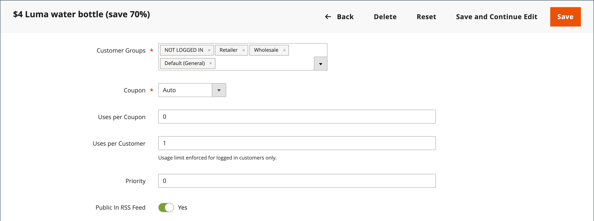
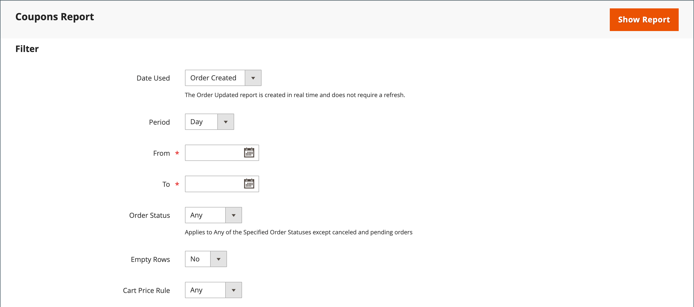

# クーポンコード

クーポンコードは、[ 買い物かご価格ルール ](price-rules-cart.md) で使用され、一連の条件を満たした場合に割引を適用します。 例えば、特定の顧客グループ向けに、または特定の金額を超えて購入するユーザー向けに、クーポンコードを作成できます。 クーポンを購入に適用するには、お客様はカートにクーポンコードを入力するか、場合によっては _brick and mortal_ 店舗のレジに入力できます。 ストアでクーポンを使用する方法はいくつかあります。

- 顧客へのメールクーポン
- 印刷されたクーポンを作成する
- モバイルユーザー用の店舗内クーポンの作成

クーポンコードは、メールで送信することも、ニュースレター、カタログ、広告に含めることもできます。 クーポンコードのリストをエクスポートして、商用プリンターに送信できます。 また、買い物客がスマートフォンでスキャンできるクイックレスポンスコードを含んだ店舗内クーポンを作成することもできます。 QR コードは、プロモーションに関する詳細を含むサイトのページにリンクできます。

Commerce 2.4.7 以降では、買い物客は 1 つの買い物かごに複数のクーポンを適用できます。 マーチャントは、買い物の支援を使用して複数のクーポンを適用することもできます。

>[!NOTE]
>
>優先度が同じ買い物かご価格ルールでは、組み合わせた割引は発生しません。 各ルール（クーポン）は、データベース内の買い物かご価格ルール ID に従って、一致する製品に 1 つずつ個別に適用されます。 割引が適用される順序を制御するために、Adobeでは、追加された買い物かごの価格ルールごとに異なる優先度を設定することをお勧めします。

## クーポンコードの設定

自動生成されたクーポンコードの長さと形式は、この構成によって制御されます。 文字は、すべての数字、すべての文字、またはそれらの組み合わせに設定できます。 設定した間隔でダッシュを挿入して読みやすくしたり、プレフィックスとサフィックスを追加してコードを特定のキャンペーンやイニシアチブに関連付けたりできます。

1. _管理者_ サイドバーで、**[!UICONTROL Stores]**/_[!UICONTROL Settings]_/**[!UICONTROL Configuration]**&#x200B;に移動します。

1. 左側のパネルで「**[!UICONTROL Customers]**」を展開し、「**[!UICONTROL Promotions]**」を選択します。

   {width="600" zoomable="yes"}

1. 「**[!UICONTROL Auto Generated Specific Coupon Codes]**」セクションを展開します。

   {width="600" zoomable="yes"}

1. 接頭辞、接尾辞、区切り文字を含む **[!UICONTROL Code Length]** を入力します。

1. **[!UICONTROL Code Format]** を次のいずれかに設定します。

   - `Alphanumeric`
   - `Alphabetical`
   - `Numeric`

1. **[!UICONTROL Code Prefix]**：すべてのクーポン コードの先頭に表示する値を入力します。

1. **[!UICONTROL Code Suffix]**：すべてのクーポン コードの末尾に表示する値を入力します。

1. **[!UICONTROL Dash Every X Characters]**：各ダッシュ間の文字数を入力します。

   異なるダッシュパターンを持つクーポンコードは、番号が同じであっても、異なるコードと見なされます。

1. 完了したら、「**[!UICONTROL Save Config]**」をクリックします。

## クーポンの作成

>[!NOTE]
>
>[!BADGE PaaS のみ &#x200B;]{type=Informative url="https://experienceleague.adobe.com/en/docs/commerce/user-guides/product-solutions" tooltip="Adobe Commerce on Cloud プロジェクト（Adobeが管理する PaaS インフラストラクチャ）およびオンプレミスプロジェクトにのみ適用されます。"} クーポンを作成する前に、`bin/magento cron:run` コマンドを使用して cron が実行されていることを確認します。 詳しくは、『 _設定ガイド_ の [ コマンドラインからの cron の実行 ](https://experienceleague.adobe.com/docs/commerce-operations/configuration-guide/cli/configure-cron-jobs.html#run-cron-from-the-command-line) を参照してください。

### 方法 1：特定のクーポンの作成

1. 指示に従って、[ 買い物かご価格ルール ](price-rules-cart.md) を作成します。

1. **[!UICONTROL Rule Information]** セクションで、**[!UICONTROL Coupon]** を `Specific Coupon` に設定します。

1. プロモーションで使用する **[!UICONTROL Coupon Code]** を入力します。

   コードの形式（数値、英数字、アルファベット）は、[ 設定 ](#configure-coupon-codes) によって決まります。

1. クーポンの使用回数を制限するには、次の操作を行います。

   - **[!UICONTROL Uses per Coupon]** の数を入力します。
   - **[!UICONTROL Uses per Customer]** の数を入力します。

   無制限に使用するには、これらのフィールドを空白のままにします。

   {width="600" zoomable="yes"}

   >[!NOTE]
   >
   >複数の顧客が同時に同じクーポンを使用している場合、クーポン処理の遅延により、設定されている使用制限を超える可能性があります。

1. クーポンを一定期間有効にするには、次の操作を行います。

   -  （Magento Open Sourceのみ） **開始日** および **終了日** を入力します。 日付を選択するには、各フィールドの横にある **カレンダー** （）アイコンをクリックします。 日付範囲を空のままにすると、ルールは期限切れになりません。

   -  （Adobe Commerceのみ）次のいずれかの操作をおこないます。

     **オプション 1:** 新しい更新をスケジュールする

      - ページの右上隅にある「**[!UICONTROL Schedule New Update]**」をクリックします。

        {width="600" zoomable="yes"}

      - **[!UICONTROL Update Name]** と **[!UICONTROL Description]** を入力します。

      - **開始日** と **[!UICONTROL End Date]** をカレンダー（）から選択します。 日付範囲を空のままにすると、ルールは期限切れになりません。

      - 完了したら、「**[!UICONTROL Save]**」をクリックします。

        {width="600" zoomable="yes"}

     **オプション 2:** 既存の更新に割り当て：

      - 「**[!UICONTROL Assign to Another Update]**」を選択します。

      - リストで更新を探し、「**[!UICONTROL Select]**」をクリックします。

1. 必要に応じて [ 買い物かご価格ルール ](price-rules-cart.md) を入力します。

### 方法 2：クーポンのバッチを生成する

割引クーポンの生成は非同期操作であり、バックグラウンドで実行されるので、操作が完了するのを待たずに管理者で作業を続行できます。 タスクが完了すると、メッセージが表示されます。

1. 指示に従って、[ 買い物かご価格ルール ](price-rules-cart.md) を作成します。

1. 「**[!UICONTROL Coupon Code]**」で、「**[!UICONTROL Use Auto Generation]**」チェックボックスをオンにします。

1. 各顧客がクーポンを使用できる回数を制限するには、**[!UICONTROL Uses per Customer]** 数を入力します。

   {width="600" zoomable="yes"}

   >[!NOTE]
   >
   >複数の顧客が同時に同じクーポンを使用している場合、クーポン処理の遅延により、設定されている使用制限を超える可能性があります。

1. 下にスクロールして、「**[!UICONTROL Manage Coupon Codes]**」セクションの  を展開し、次の操作を行います。

   {width="600" zoomable="yes"}

   - **[!UICONTROL Coupons Qty]**：生成するクーポンの数を入力します。

   - 接頭辞、接尾辞または区切り記号を含まない **[!UICONTROL Code Length]** を入力します。

   - **[!UICONTROL Code Format]** を次のいずれかに設定します。

      - `Alphanumeric`
      - `Alphabetical`
      - `Numeric`

   - （任意）コードの先頭に追加する **[!UICONTROL Code Prefix]** を入力します。

   - （任意） コードの末尾に追加する **[!UICONTROL Code Suffix]** を入力します。

   - （任意） **[!UICONTROL Dash Every X Characters]** の場合は、各ダッシュの間の文字数を入力します。 例えば、コードの長さが 12 文字で、4 文字ごとにダッシュがある場合は、`xxxx-xxxx-xxxx` のようになります。 点線を使用すると、コードを読みやすく、入力しやすくなります。

1. 完了したら、「**[!UICONTROL Generate]**」をクリックします。

   `Message is added to queue, wait to get your coupons soon` と表示されます。

   Cron ジョブが完了すると、生成されたコードのリストが表示されます。

   | フィールド | 説明 |
   |-------------|-------------|
   | [!UICONTROL Coupon Code] | 作成され、特別な条件を受け取るために使用できるクーポンコード。 |
   | [!UICONTROL Created] | クーポンコードが作成された日付。 |
   | [!UICONTROL Used] | クーポンが使用されたかどうかを示します。 |
   | [!UICONTROL Times Used] | クーポンコードが使用された回数を示します。 |

   {style="table-layout:auto"}

ファイル形式を選択して **[!UICONTROL Export]** をクリックすると、クーポンコードを CSV または Excel XML ファイルに書き出すことができます。

クーポンコードを削除するには、リストから 1 つ以上のコードを選択します。 **[!UICONTROL Actions]** セレクターから「`Delete`」を選択し、「**[!UICONTROL Submit]**」をクリックします。

>[!NOTE]
>
>Commerceでは複数のクーポンコードを設定できますが、買い物かごで使用できるクーポンコードは 1 つだけです。 買い物かごに複数のクーポンコードを同時に使用できるようにするには、[Commerce Marketplace](https://marketplace.magento.com/) から対応する拡張機能を使用することを検討してください。

## クーポンレポート

_クーポン_ レポートは、特定の日付範囲内で使用される各クーポンからデータを集計します。 クーポンは買い物かごから適用されるので、レポートには [ 注文ステータス ](../stores-purchase/order-status.md) に関係なく、すべての引き換え済みクーポンのデータが含まれます。 その結果、レポートには見込み合計と実際の合計の両方が含まれる場合があります。 レポートは、特定のストア表示、期間、注文ステータス、買い物かご価格ルールに合わせてフィルタリングできます。

次の例では、クーポンコード「H20」を 2 人の顧客が使用しています。 注文の 1 つが請求されていますが、もう 1 つはまだ _保留中_ です。 見込み売上小計、売上割引、および売上合計の列には、両方の注文の集計金額が表示されますが、小計、割引、および合計の列には、実際の請求済み注文のみが表示されます。 レポートの各行は、1 つのクーポンプロモーションを表します。

{width="600" zoomable="yes"}

### レポートの実行

1. _管理者_ サイドバーで、**[!UICONTROL Reports]**/_[!UICONTROL Sales]_/**[!UICONTROL Coupons]**&#x200B;に移動します。

1. 複数のストア表示がある場合は、左上隅の **[!DNL Store View]** を設定して、レポートの範囲を確定します。

1. その日の売上 [ 統計 ](../getting-started/sales-reports.md#refresh-statistics) を更新するには、ワークスペースの上部にある _最終更新日_ メッセージをクリックします。

   次に、「**[!UICONTROL Coupons]**」チェックボックスをクリックして選択し、「**[!UICONTROL Refresh]**」をクリックします。

   {width="600" zoomable="yes"}

1. データをフィルターするには、次の手順を実行します。

   {width="600" zoomable="yes"}

   - **[!UICONTROL Date Used]** を次のいずれかに設定します。

      - `Order Created`
      - `Order Updated`

     _更新された注文_ レポートはリアルタイムで作成されるので、更新の必要はありません。

   - レポートでカバーされる期間を定義するには、**[!UICONTROL Period]** を次のいずれかに設定します。

      - `Day`
      - `Month`
      - `Year`

   - レポートの日付範囲を定義するには、**開始日** および **終了日** を M/D/YY 形式で入力します。

   - 特定の [ 注文ステータス ](../stores-purchase/order-status.md) のレポートを印刷するには、**[!UICONTROL Order Status]** を `Specified` に設定し、リストから注文ステータスを選択します。

   - レポートからデータのない行を削除するには、**[!UICONTROL Empty Rows]** を `No` に設定します。

   - レポートに含まれるクーポンアクティビティを定義するには、次のいずれかの操作を行います。

      - すべての価格ルールからすべてのクーポンアクティビティを含めるには、**[!UICONTROL Cart Price Rule]** を `Any` に設定します。
      - 特定の価格ルールに関連するアクティビティのみを含めるには、「**[!UICONTROL Cart Price Rule]**」を「`Specified`」に設定し、リストで買い物かご価格ルールを選択します。

1. レポートを実行する準備ができたら、「**[!UICONTROL Show Report]**」をクリックします。

   レポートがページの下部に表示されます。

### フィルターオプション

| フィールド | 説明 |
|--- |--- |
| [!UICONTROL Date Used] | レポートの基礎として使用される日付フィールドを識別します。 オプション： **[!UICONTROL Order Created]**：顧客の注文日に基づいてレポートを生成します。 最新のデータが含まれていることを確認するには、メッセージ内のリンクをクリックして統計を更新します。 **[!UICONTROL Order Updated]**：注文の最終更新日に基づいてレポートを生成します。 このレポートは、リアルタイムデータを使用するので、統計を更新する必要はありません。 |
| [!UICONTROL Period] | レポートに使用する日付範囲のタイプを決定します。 オプション：`Day`/`Month`/`Year` |
| [!UICONTROL From] | レポートに含まれる注文データ範囲の最初の日付を示します。 |
| [!UICONTROL To] | レポートに含まれる注文データの範囲の最終日を示します。 |
| [!UICONTROL Order Status] | 注文ステータスでレポートをフィルタリングします。 レポートは、すべての注文に対して生成することも、特定の注文ステータスに制限することもできます。 オプション： **[!UICONTROL Any]**: ステータスに関係なく、すべての注文を含みます。 **[!UICONTROL Specified]**：指定されたステータスの注文のみを含めます。 キャンセルされた注文はレポートに含まれません。 |
| [!UICONTROL Empty Rows] | 取得される可能性のある空のデータ行がレポートに含まれているかどうかを判断します。 オプション：`Yes` / `No` |
| [!UICONTROL Cart Price Rules] | レポートに含めるクーポンプロモーションを決定します。 オプション： **[!UICONTROL Any]**：指定した日付範囲内に使用されたクーポンプロモーションの注文情報が含まれます。 **[!UICONTROL Specified]**：選択したクーポン プロモーションに関する、指定した日付範囲内の注文情報のみを含めます。 |

{style="table-layout:auto"}

### レポート列

| 列 | 説明 |
|--- |--- |
| [!UICONTROL Interval] | レポートに含めるクーポン使用の日付範囲を示します。 間隔には、特定の日、月、年、または日付の範囲を指定できます。 インターバルの日付は、設定で設定された値に従って、次の例のようにフォーマット **[!UICONTROL Period]** れます。 `Day`:6/21/19 `Month`:6/2019 `Year`:2019 |
| [!UICONTROL Coupon Code] | 買い物かごに顧客が入力して割引を受ける割引コード。 |
| [!UICONTROL Price Rule] | クーポンに関連付けられている価格ルールの名前。 |
| [!UICONTROL Uses] | レポートに指定された日付範囲でクーポンが使用された回数。 |
| [!UICONTROL Sales Subtotal] | クーポンで行われたすべての注文の予測小計。   売上小計は、すべての対象オーダーから集計された小計を表し、まだ請求されていない `Pending` のオーダーが含まれます。 |
| [!UICONTROL Sales Discount] | クーポンで行われたすべての注文の予測割引金額。   割引は、対象となるすべての注文の割引額の集計値を表し、まだ請求 `Pending` れていない注文が含まれます。 |
| [!UICONTROL Sales Total] | クーポンで行われたすべての注文から予測される総計。 売上合計には、送料と手数料から割引額を差し引いた金額が含まれます。   売上合計は、該当するすべての注文の総計の集計値を表し、まだ請求 `Pending` れていない注文が含まれています。 値には、小計に配送料と手数料を加えた値から、ディスカウントと税金を差し引いた値が含まれます。   計算者：`((Subtotal + Shipping & Handling) - Discount) + Tax` |
| [!UICONTROL Subtotal] | クーポンを使用したすべての請求済み注文から集計された小計。 |
| [!UICONTROL Discount] | クーポンを使用したすべての請求済み注文からの集計割引。 |
| [!UICONTROL Total] | クーポンを使用したすべての請求済み注文の集計注文合計。 |

{style="table-layout:auto"}
