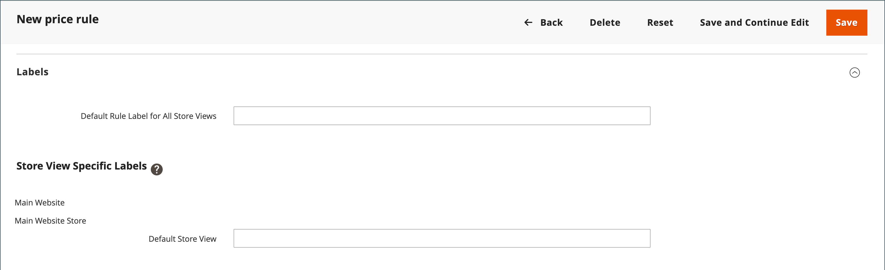
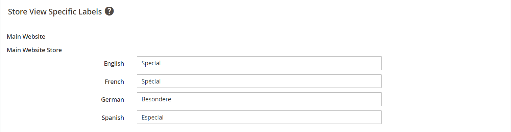

# 買い物かご価格ルールの作成

ルールの追加、条件の説明、アクションの定義を行うには、次の手順を実行します。 また、ラベルを完成させ、ルールをテストします。 価格ルールの条件は、買い物かごまたは [製品属性](../catalog/product-attributes.md) または [Real-Time CDP オーディエンス](#use-real-time-cdp-audiences-to-set-a-condition)ではなく、 [カスタマイズ可能なオプション](../catalog/settings-advanced-custom-options.md).

## 手順 1：ルールを追加

1. 日 _Admin_ サイドバー、に移動 **[!UICONTROL Marketing]** > _[!UICONTROL Promotions]_>**[!UICONTROL Cart Price Rules]**.

1. クリック **[!UICONTROL Add New Rule]** 次の手順を実行します。

   - 次の下 _[!UICONTROL Rule Information]_、を完了させます。**[!UICONTROL Rule Name]**および&#x200B;**[!UICONTROL Description]**.

   - ルールをすぐに適用しない場合は、次のように設定します **[!UICONTROL Active]** 対象： `No`.

   {width="600" zoomable="yes"}

1. を確立するには [範囲](../getting-started/websites-stores-views.md#scope-settings) このルールの次の操作を行います。

   - 「」を選択します **[!UICONTROL Websites]** プロモーションを利用できる場所。

   - 「」を選択します **[!UICONTROL Customer Groups]** プロモーションが適用される。

     登録されたお客様のみがプロモーションを利用できるようにする場合は、 **_実行しない_** を選択します。 `NOT LOGGED IN` オプション。

1. 適用するルールの設定（の有無） [クーポン](price-rules-cart-coupon.md) 次のように設定します。

   - クーポンコードを使用せずに買い物かごルールを適用するには、次のように設定します **[!UICONTROL Coupon]** 対象： `No Coupon` 手順 5 に進みます。

   - クーポンを価格ルールに関連付けるには、次のように設定します **[!UICONTROL Coupon]** 対象： `Specific Coupon` 次の手順を実行します。

      - フリーテキストを入力 **[!UICONTROL Coupon Code]** 割引を受けるために顧客が入力する必要があること。

      - クーポンを使用できる回数の制限を設定するには、次のオプションを入力します。

     | オプション | 説明 |
     |------|-----------|
     | `Uses per Coupon` | クーポンコードを使用できる回数を決定します。 制限がない場合は、フィールドを空白のままにします。 |
     | `Uses per Customer` | 選択されたいずれかの顧客グループに属する同じ登録済み顧客が、買い物かご価格ルールを使用できる回数を決定します。 この設定は、ログインしていない顧客グループのメンバーであるゲスト買い物客や、アカウントにログインせずに買い物をしたお客様には適用されません。 制限がない場合は、フィールドを空白のままにします。 |

     {style="table-layout:auto"}

     詳しくは、 [クーポンコード](price-rules-cart-coupon.md).

     {width="600" zoomable="yes"}

   -  （Magento Open Sourceのみ）を使用する _カレンダー_ （）を選択して、 **[!UICONTROL From]** および **[!UICONTROL To]** プロモーションの日付範囲。

1. を定義する数値を入力 **[!UICONTROL Priority]** 同時にアクティブな他の価格ルールのアクション設定に関連するこの価格ルールの。

   >[!NOTE]
   >
   >同じ商品に対して同時に 2 つの買い物かごルール/クーポンコードが有効な場合、優先度設定は重要です。 優先順位が最も高いルール（`1` 最も高い）は、買い物かごのアクションを制御します。 参照： _後続の価格ルールを破棄_ が含まれる _アクションの定義_ ステップ。

   >[!NOTE]
   >
   >優先度が同じ買い物かご価格ルールでは、組み合わせた割引は発生しません。 一致する製品に対して、1 つずつ各ルールが適用されます。

1. ルールを公開済みに適用するには [RSS フィード](social-rss.md#rss-feeds)、設定 **RSS フィードで公開** 対象： `Yes`.

1. クリック **[!UICONTROL Save and Continue Edit]**.

   -  （Magento Open Sourceのみ）ルールが保存されると、買い物かごの価格ルールの名前がページの上部に表示されます。

   -  （Adobe Commerceのみ）ルールが保存された後、買い物かごの価格ルールの名前と [スケジュールされた変更](price-rule-cart-scheduled-changes.md) ページの上部にボックスが表示されます。

     {width="600" zoomable="yes"}

## 手順 2：条件の説明

このステップでは、プロモーションの対象となる注文が満たされる必要がある条件を説明します。 このルールは、一連の条件が満たされた場合に常に実行されます。

Real-Time CDPのオーディエンスを使用している場合は、にスキップします。 [この節](#use-real-time-cdp-audiences-to-set-a-condition).

>[!NOTE]
>
>買い物かご価格ルールの適用先 **_それぞれ_** 商品が買い物かごに入っている場合、の一連の条件 _[!UICONTROL Conditions]_タブが満たされました。 での条件の追加_[!UICONTROL Actions]_ tab キーを押すと、買い物かごの価格ルールの影響を受ける製品の数を制限できます。

>[!NOTE]
>
>少なくとも 1 つの条件付き製品属性の値が空の場合、買い物かごの価格ルールが製品に適用されません。

1. 左パネルで、を選択します。 **[!UICONTROL Conditions]**.

   {width="600" zoomable="yes"}

   デフォルトでは、最初の条件が表示され、次の状態になります。

   `If **ALL** of these conditions are **TRUE**:`

   ステートメントには 2 つの太字のリンクがあり、クリックすると、ステートメントのその部分のオプションの選択が表示されます。 これらの値の組み合わせを変更することで、様々な条件を作成できます。 次のいずれかの操作をおこないます。

   - クリック **[!UICONTROL ALL]** を選択して、 `ALL` または `ANY`.
   - クリック **[!UICONTROL TRUE]** を選択して、 `TRUE` または `FALSE`.
   - すべての製品にルールを適用する場合は、条件を変更しません。

1. クリック _追加_ （）を選択し、条件のオプション（買い物かご属性、製品の副選択、組み合わせなど）を選択します。

   この例では、条件の次の部分を次のように完了します。

   - 次のプロンプトが表示されたら、 **[!UICONTROL Choose the condition to add]**、を選択 `Products Subselection`.

     {width="600" zoomable="yes"}

   - 条件ステートメントで、 **[!UICONTROL total quantity]** を選択して、 `total quantity` または `total amount`.

   >[!IMPORTANT]
   >
   >[!UICONTROL Total amount] は行の合計なので、に税金は含まれません `total amount` の場合 [!UICONTROL Products Subselection] 買い物かご価格ルールの条件。 の使用 [!UICONTROL Subtotal (Incl. Tax)] 税金を含めるための条件。

   - 条件ステートメントで、 **[!UICONTROL is]** を選択して、 `greater than`.

1. 条件の次の部分が表示されたら、ステートメントの要素をクリックして、変数値を含む各リンクの場所を確認します。

1. 「その他」（...）リンクをクリックし、と入力します。 `100`.

   この条件では、買い物かごの合計数量が次のようになっている必要があります `101` 以上。

   {width="600" zoomable="yes"}

1. クリック **追加** （）を選択し、に基づいて条件を追加します。 **カテゴリ**.

   {width="600" zoomable="yes"}

1. 条件の次の部分で、 _詳細_ （**...**）リンクして入力フィールドを表示し、 _選択_ （）、カテゴリツリーを表示します。

1. 価格ルールの条件として使用するカテゴリのチェックボックスを選択し、  アイコンをクリックして、カテゴリの選択を受け入れます。

   条件は、ストアの子であるすべてのカテゴリに基づくことができます。 [ルートカテゴリ](../catalog/category-root.md).

   {width="600" zoomable="yes"}

1. 条件を追加するには、をクリックします _追加_ （）を選択して、別の条件を定義します。

   このプロセスを必要な回数だけ繰り返して、価格ルールで満たす必要がある条件を記述できます。 次に例を示します。

   **例 1:** 地域別価格ルール

   地域価格ルールを作成するには、次の買い物かご属性のいずれかを使用します。

   - `Shipping Postcode`
   - `Shipping Region`
   - `Shipping State/Province`
   - `Shipping Country`

   **例 2:** 買い物かごの合計

   買い物かごの合計に基づいて条件を設定するには、次のいずれかの買い物かご属性を使用します。

   - `Subtotal`
   - `Total Items Quantity`
   - `Total Weight`

>[!NOTE]
>
>複数の並列プロモーションの場合、 _小計_ 条件がに適用されます _ベース_ 買い物かごの小計 **_次の前_** 割引。

>[!IMPORTANT]
>
>**発注書のみ**:1 つ以上の特定の支払方法に基づいて買い物かごの価格ルールが設定されると、発注書の作成時に合計に割引が適用されます。 発注書が作成された後も、支払い方法が買い物かご価格ルールでカバーされないものに変更された場合は、割引が合計に適用されたままになります。

### 製品属性を買い物かごの価格ルールに追加

1. に移動 **[!UICONTROL Stores]** > _[!UICONTROL Attributes]_>**[!UICONTROL Product]**製品属性を開きます。

1. 左パネルで、を選択します。 **[!UICONTROL Storefront Properties]**.

1. を設定 **[!UICONTROL Use for Promo Rule Conditions]** 対象： `Yes`.

1. クリック **[!UICONTROL Save Attribute]**.

1. に移動 **[!UICONTROL Marketing]** > **[!UICONTROL Cart Price Rules]** 必要な買い物かご価格ルールを開きます。

1. を展開  この **[!UICONTROL Condition]** セクションと選択 **[!UICONTROL Product attribute combination]**.

1. この条件を次のいずれかの値に設定します。

   - クリック **[!UICONTROL FOUND]** を選択して、 `FOUND` または `NOT FOUND`.

   - クリック **[!UICONTROL ALL]** を選択して、 `ALL` または `ANY`.

1. 「」をクリックします _追加_ （） アイコンをクリックし、 **[!UICONTROL Product Attribute]** 販促ルール条件に対して設定した項目。

1. クリック **[!UICONTROL Save]**.

>[!NOTE]
>
>使用する場合 `is not one of` を含む条件 _SKU_ 製品属性と設定可能な製品については、親と子の両方の製品 SKU を選択する必要があります。 ルール内のすべての子 SKU がリストされないようにするには、 `does not contain` 設定可能な製品とその子製品の共通 SKU 部分を持つ条件。

### Real-Time CDP オーディエンスを使用した条件の設定

Real-Time CDPに基づいて、買い物かごの価格ルールの条件を設定できます [対象読者](../customers/audience-activation.md).

1. を展開 **[!UICONTROL Conditions]**&#x200B;を選択し、「+」アイコンをクリックして **[!UICONTROL Real-Time CDP Audience]** リストから。

   {width="300"}

1. 「」を選択します _詳細_ （**...**） アイコン、クリック **[!UICONTROL Open Chooser]**&#x200B;使用可能なすべてのReal-Time CDP オーディエンスを表示します。

   {width="600" zoomable="yes"}

1. 買い物かごの価格ルールに使用するReal-Time CDP オーディエンスを選択します。

   | オプション | 説明 |
   |------|-----------|
   | `ID` | 管理内で使用されるオーディエンスの内部識別子 |
   | `Real-Time CDP Audience ID` | Experience Platformで作成された際のオーディエンスの一意の ID |
   | `Name` | オーディエンスの名前（例：） `Orders over $50` |
   | `Description` | オーディエンスの説明（など） `People who placed an order over $50 in the last month.`. |
   | `Source` | オーディエンスの元の場所を示します（例：） `Experience Platform`. |
   | `Website` | オーディエンスを含むデータストリームにリンクした web サイトを示します。 このリンクは、を使用してCommerce インスタンスをExperience Platformに接続する際に作成します [[!DNL Data Connection]](https://experienceleague.adobe.com/docs/commerce-merchant-services/data-connection/fundamentals/connect-data.html) 拡張機能。 |

   {style="table-layout:auto"}

次の手順では、条件が満たされた場合に実行するアクションを定義します。

## 手順 3：アクションの定義

買い物かご価格ルールのアクションは、条件が満たされたときに価格がどのように更新されるかを説明します。

1. Scroll down to **[!UICONTROL Actions]**、を展開します  セクション。

   {width="600" zoomable="yes"}

1. を設定 **[!UICONTROL Apply]** 次のいずれかの割引オプションに割り当てます。

   | オプション | 説明 |
   |------|-----------|
   | `Percent of product price discount` | 元の価格からパーセンテージを引いて品目を値引きします。 割引は、買い物かごに含まれる条件を満たす各品目に適用されます。 入力例： `10` 。対象： [!UICONTROL Discount Amount] 元の価格より 10% 少ない更新価格の場合。 |
   | `Fixed amount discount` | 買い物かごの中で、条件を満たす各品目の元の価格から固定金額を引いて品目を値引きします。 入力例： `10` 。対象： [!UICONTROL Discount Amount] 元の価格より 10 ドル安い更新価格の場合。 |
   | 買い物かご全体に対する固定金額割引 | 買い物かごの合計から固定金額を引いて、買い物かご全体を割引します。 例：10 in [!UICONTROL Discount Amount] 買い物かごの合計から$10 を減算します。 デフォルトでは、割引は買い物かごの小計にのみ適用されます。 小計と送料に個別に割引を適用するには、 _[!UICONTROL Apply to Shipping Amount]_オプション。 |
   | `Buy X get Y free` | 数量 Y を受け入れるために顧客が購入する必要がある数量 X を定義します。 **同じ製品/バリエーションの** 無料で。 （ [!UICONTROL Discount Amount] （Y）割引を適用するには、同じ品目の X+Y の合計数量が買い物かごに存在するか、買い物かごに追加されている必要があります。 |

   {style="table-layout:auto"}

   - を入力 **[!UICONTROL Discount Amount]** 記号を含まない数値として指定します。 例えば、選択した割引オプションに応じて、数値 10 は、割合、固定金額、または品目の数量を示す場合があります。

   - の場合 _X を購入して Y を無料にする_ 割引、数量の入力 **[!UICONTROL Discount Qty Step (Buy X)]** y 数量の割引を受けるために顧客が購入する必要がある単一の製品/ SKU /品目のフィールド。 X と Y は両方とも同じ SKU の数量を指し、品目の特定の数量（設定可能な製品のバリエーションは個別にカウントされます）は買い物かごに手動で追加する必要があります。

   - が含まれる **[!UICONTROL Maximum Qty Discount is Applied To]** フィールドに、同じ購入の割引の対象となる同じ製品の最大数量を入力します。

   - を設定 **[!UICONTROL Apply to Shipping Amount]** （）に設定する必要があります。

     | オプション | 説明 |
     |------|-----------|
     | `Yes` | 小計と出荷金額に割引額を個別に適用します。 |
     | `No` | 小計にのみ割引額を適用します。 |

     {style="table-layout:auto"}

   - このルールを適用した後に他のルールの処理を停止するには、次のように設定します： **[!UICONTROL Discard Subsequent Rules]** （） ～ `Yes`. この設定により、同じ製品に複数の割引が適用されるのを防ぎます。

     | オプション | 説明 |
     |------|-----------|
     | `Yes` | 製品に適用される可能性のある他の価格ルールが適用されないようにします。 複数の価格設定ルールが同じ製品に適用される場合は、（ルール内で）優先度が最も定義されている価格設定ルールのみ [!UICONTROL Priority] フィールド）が選定された製品に適用されます。 これにより、複数の価格ルールが積み重なって、意図しない追加割引が提供されるのを防ぎます。 |
     | `No` | 同じ製品に複数の価格ルールを適用できます。 その結果、リスト価格に適用される複数の割引を積み重ねて提供する可能性があります。 |

     {style="table-layout:auto"}

     >[!IMPORTANT]
     >
     >後続のルールを破棄するには、価格設定ルールでは各ルールの「優先度」フィールドに定義された定義済みの優先度を使用する必要があります。また、複数のルールに同じ優先度が定義されていてはいけません。 参照： **[!UICONTROL Priority]** が含まれる _新しいルールを追加_ ステップ。

1. を定義します **_exact_** 買い物かご価格ルールの影響を受ける買い物かご内の製品は、を追加します。 **_追加_** アクションに必要な条件。

   条件を満たす注文に送料無料が適用されるかどうかを判断するには、次のように設定します **[!UICONTROL Free Shipping]** を次のいずれかに変更します。

   | オプション | 説明 |
   |------|-----------|
   | `No` | 送料無料ではご利用いただけません。 |
   | `For matching items only` | 送料無料は、ルールの条件に一致する項目に対してのみ利用可能です。 |
   | `For shipment with matching items` | 一致するアイテムを含むすべての出荷に対して送料無料が利用できます。 この [送料無料](../stores-purchase/shipping-free.md) このオプションを使用するには、配信方法を有効にする必要があります。 |

   {style="table-layout:auto"}

1.  （Adobe Commerceのみ） **[!UICONTROL Add Rewards Points]**、顧客が獲得する固定ポイント数を入力します **_1 回_** 買い物かごの価格ルールが適用される場合は常に注文ごと。

   報酬ポイントが有効になっていない場合は、このフィールドを空白のままにします。

1. 完了したら、 **[!UICONTROL Save and Continue Edit]**.

## 手順 4：ラベルを完成させる

ラベルは、注文の合計セクションに表示され、割引を識別します。 ラベル テキストは、単語の後に括弧で囲まれています `Discount`. すべてのストアビューにデフォルトのラベルを入力することも、ビューごとに異なるラベルを入力することもできます。

{width="600"}

1. Scroll down to **[!UICONTROL Labels]**、を展開します セクション。

1. として使用するテキストを入力します **[!UICONTROL Default Rule Label for All Store Views]**.

   {width="600" zoomable="yes"}

1. ストアに複数のビューがある場合、または複数のビューを持つ複数の web サイトがある場合は、それぞれに適切なラベルテキストを入力します。

   例えば、各店舗表示が異なる言語の場合は、各表示のラベルの翻訳を入力します。

   {width="600" zoomable="yes"}

## 手順 5：関連するダイナミックブロックの追加（オプション）

{{ee-feature}}

[ダイナミック ブロック](../content-design/dynamic-blocks.md) ルールに関連付けられているプロパティは、条件が満たされると常にストアフロントに表示されます。

1. を展開  この **[!UICONTROL Related Dynamic Blocks]** セクション。

1. の使用 [フィルターを検索](../getting-started/admin-workspace.md) 規則に関連付けるブロックを検索します。

1. 最初の列のチェックボックスを選択して、ブロックをルールに関連付けます。

   詳しくは、 [価格ルールの動的ブロック](../content-design/dynamic-blocks-price-rules.md).

## 手順 6：ルールを保存してテストする

1. 完了したら、 **[!UICONTROL Save Rule]**.

1. ルールをテストして、正しく動作することを確認します。

   価格ルールは他のシステムルールと共に毎晩自動的に処理されます。 価格ルールを作成する場合は、システムに入るのに十分な時間を確保します。 また、ルールをテストして、正しく機能することを確認します。 新しいルールが追加されると、Commerceは価格と優先度をそれに応じて再計算します。

## 買い物かご価格ルールデモ

買い物かご価格ルールの作成については、次のビデオをご覧ください。

>[!VIDEO](https://video.tv.adobe.com/v/343835?quality=12)

## フィールドの説明

### [!UICONTROL Rule Information]

| フィールド | 説明 |
|--- |--- |
| [!UICONTROL Rule Name] | （必須） ルールの名前は内部参照用です。 |
| [!UICONTROL Description] | ルールの説明には、ルールの目的を含め、ルールの使用方法を説明する必要があります。 |
| [!UICONTROL Active] | （必須）ルールがストア内でアクティブかどうかを判断します。 オプション： `Yes` / `No` |
| [!UICONTROL Websites] | （必須） ルールを使用できる web サイトを識別します。 |
| [!UICONTROL Customer Groups] | （必須）ルールが適用される顧客グループを識別します。 |
| [!UICONTROL Coupon] | （必須）クーポンがルールに関連付けられているかどうかを示します。 オプション：  **[!UICONTROL No Coupon]**- ルールにクーポンが関連付けられていません。 **[!UICONTROL Specific Coupon]**  – 特定のクーポンがルールに関連付けられています。  **[!UICONTROL Coupon Code]**- プロンプトが表示されたら、プロモーションを利用するために顧客が入力する必要があるクーポンコードを入力します。 **[!UICONTROL Use Auto Generation]** - プロモーションで使用できる複数のクーポンコードを自動的に生成するには、このチェックボックスを選択します。  **[!UICONTROL Auto]**– が表示されます _[!UICONTROL Manage Coupon Codes]_生成するクーポンコードの形式を定義するセクション。 |
| [!UICONTROL Uses per Coupon] | クーポンコードを使用できる回数を決定します。 制限がない場合は、フィールドを空白のままにします。 |
| [!UICONTROL Uses per Customer] | 選択した顧客グループに属する同じ登録済み顧客が、買い物かご価格ルールを使用できる回数を決定します。 ログインしていない顧客グループのメンバーであるゲストの買い物客、またはアカウントにログインせずに買い物をしたお客様には適用されません。 無制限の場合は、空白のままにします。 |
| [!UICONTROL Priority] | このルールの優先度を他のルールと比較して示す数値。 最優先されるのは数値です `1`. |
| [!UICONTROL Public in RSS Feed] | プロモーションがストアのパブリック RSS フィードに含まれるかどうかを決定します。 オプション：  `Yes` / `No` |
| [!UICONTROL From] |  （Magento Open Sourceのみ）クーポンを使用できる最初の日付。 |
| [!UICONTROL To] |  （Magento Open Sourceのみ）クーポンを使用できる最終日。 |

{style="table-layout:auto"}

### [!UICONTROL Conditions]

買い物かごの価格ルールが実行される前に満たす必要がある条件を指定します。 空白にした場合、ルールは買い物かごに入っているすべての製品に適用されます。 条件は、買い物かごと製品属性の任意の組み合わせに基づくことができます。 ただし、 [カスタマイズ可能なオプション](../catalog/settings-advanced-custom-options.md) 買い物かご価格ルールの条件では参照できません。

| フィールド | 説明 |
|--- |--- |
| [!UICONTROL **買い物かご品目属性**] |  |
| [!UICONTROL Price in cart] | 製品価格。 このルールは、買い物かごの製品価格の条件が満たされた場合に適用されます。 |
| [!UICONTROL Quantity in cart] | 製品数量。 このルールは、買い物かごの製品数量の条件が満たされた場合に適用されます。 |
| [!UICONTROL Row total in cart] | 製品行の合計。 このルールは、買い物かごの条件の製品行の合計が満たされた場合に適用されます。 |
| [!UICONTROL **製品属性**] |  |
| [!UICONTROL Attribute Set] | 製品属性が設定されました。 製品が製品属性条件を満たす場合、ルールが適用されます。 |
| [!UICONTROL Category] | 商品カテゴリ。 製品自体またはその子製品がカテゴリ条件を満たす場合は、ルールが適用されます。 |
| [!UICONTROL Category (Children Only)] | 子製品カテゴリ。 このルールは、製品の子のみがカテゴリ条件を満たす場合に適用されます（製品自体はここではチェックされません）。 |
| [!UICONTROL Category (Parent Only)] | 親製品カテゴリ。 製品自体がカテゴリ条件を満たす場合にのみ、ルールが適用されます（子製品はここではチェックされません）。 |
| [!UICONTROL **買い物かご属性**] |  |
| [!UICONTROL Subtotal (Excl. Tax)] | 買い物かごの小計（税抜き）。 買い物かごが小計（税抜き）条件を満たす場合にルールが適用されます。 |
| [!UICONTROL Subtotal (Incl. Tax)] | 買い物かごの小計（税込）。 このルールは、買い物かごが小計（税込）条件を満たす場合に適用されます。 |
| [!UICONTROL Subtotal] | 買い物かごの小計。 買い物かごが小計条件を満たす場合、ルールが適用されます。 現在の税金設定に従って税金を含めるか除外するかをチェックします。 |
| [!UICONTROL Total Items Quantity] | 買い物かごに入っているすべての商品の合計数量。 買い物かごが合計品目数条件を満たす場合、ルールが適用されます。 |
| [!UICONTROL Total Weight] | 買い物かご内のすべての製品の合計重量。 買い物かごが合計重量条件を満たす場合、ルールが適用されます。 |
| [!UICONTROL Payment Method] | チェックアウト時に選択された支払方法。 支払方法の条件が満たされた場合にルールが適用されます。 |
| [!UICONTROL Shipping Method] | チェックアウト時に選択された発送方法。 このルールは、発送方法の条件が満たされた場合に適用されます。 |
| [!UICONTROL Shipping Postcode] | 発送先住所の郵便番号。 ルールは、配送先住所が郵便番号の条件を満たす場合に適用されます。 |
| [!UICONTROL Shipping Region] | 「出荷先所在地」リージョン。 ルールは、配送先住所が地域の条件を満たす場合に適用されます。 |
| [!UICONTROL Shipping State/Province] | 発送先住所（都道府県）。 このルールは、配送先住所が都道府県の条件を満たす場合に適用されます。 |
| [!UICONTROL Shipping Country] | 発送先住所（国）。 ルールは、配送先住所が国の条件を満たす場合に適用されます。 |
| [!UICONTROL Customer Segment] | 登録またはゲストのお客様が顧客セグメントの条件を満たしている場合にルールが適用されます。 |

### [!UICONTROL Actions]

| フィールド | 説明 |
|--- |--- |
| [!UICONTROL Apply] | 購入に適用される計算のタイプを決定します。 オプション：  **[!UICONTROL Percent of product price discount]**– 元の価格からパーセンテージを引いて品目を値引きします。 入力例： `10` 。対象： _[!UICONTROL Discount Amount]_元の価格より 10% 少ない更新価格の場合。 **[!UICONTROL Fixed amount discount]**– 買い物かごの中で、条件を満たす各品目の元の価格から固定金額を引いて品目を値引きします。 入力例： `10` 。対象：_[!UICONTROL Discount Amount]_ 元の価格より 10 ドル安い更新価格の場合。  **[!UICONTROL Fixed amount discount for whole cart]**– 買い物かごの小計から固定金額を引いて、買い物かご全体を割引します。 入力例： `10` 。対象： _[!UICONTROL Discount Amount]_カートの小計から$10 を減算する手順は、次のとおりです。 デフォルトでは、割引は買い物かごの小計にのみ適用されます。 小計と送料に割引を適用する方法は、次を参照してください_出荷金額に適用&#x200B;_. **[!UICONTROL Buy X Get Y Free (discount amount is Y)]**– 無料で数量を受け取るために顧客が購入する必要がある数量を定義します。 （_[!UICONTROL Discount Amount]_ は Y.） |
| [!UICONTROL Discount Amount] | （必須）提供される割引の金額。 |
| [!UICONTROL Maximum Qty Discount is Applied To] | 同じ購入に対して割引を適用できる商品の最大数を設定します。 |
| [!UICONTROL Discount Qty Step (Buy X)] | によって表される製品の数を設定します `X` in a `Buy X Get Y Free` プロモーション。 |
| [!UICONTROL Apply to Shipping Amount] | 小計と出荷金額に割引が個別に適用されるかどうかを決定します。 それ以外の場合は、小計にのみ適用されます。 オプション： `Yes` / `No` |
| [!UICONTROL Discard Subsequent Rules] | この買い物かご価格ルールが一致する場合に、優先度の低いルール （1 が最も優先度が高い）を製品に適用できるかどうかを決定します。 このオプションを有効にすると、同じ製品に複数の割引が適用されなくなります。 オプション： `Yes` / `No` |
| [!UICONTROL Free Shipping] | プロモーションに送料無料が含まれているかどうか、含まれている場合はどのアイテムに使用するかを決定します。 オプション：  **[!UICONTROL No]**– 現在のルールでは送料無料は利用できません。 **[!UICONTROL For matching items only]**  – 送料無料は、ルールに一致するカート内の特定の項目に対してのみ使用できます。  **[!UICONTROL For shipment with matching items]**– カートに入っているすべての商品は送料無料です。 この [送料無料](../stores-purchase/shipping-free.md) このオプションを使用するには、配信方法を有効にする必要があります。 |
| [!UICONTROL Add Reward Points] |  （Adobe Commerceのみ）の数を指定します [報酬ポイント](rewards-loyalty.md) 価格ルールが適用されるたびに顧客が獲得します。 |

{style="table-layout:auto"}

### [!UICONTROL Labels]

| フィールド | 説明 |
|--- |--- |
| [!UICONTROL Default Rule Label for All Store Views] | 割引を識別するデフォルトのラベルで、すべてのストアビューで使用できます。 |
| [!UICONTROL Store View Specific Labels] | 該当する場合、異なるラベルを指定して、各店舗表示の割引を識別します。 |

{style="table-layout:auto"}

### [!UICONTROL Related Dynamic Blocks]

{{ee-feature}}

いずれかを識別 [ダイナミック ブロック](../content-design/dynamic-blocks.md) ルールに関連付けられている。
