# 買い物かごの価格ルールの作成

ルールを追加し、条件を記述し、アクションを定義するには、次の手順を実行します。 また、ラベルを完成させ、ルールをテストします。 価格ルールの条件は、買い物かごまたは[商品属性](../catalog/product-attributes.md)または[Real-Time CDP オーディエンス &#x200B;](#use-real-time-cdp-audiences-to-set-a-condition)に基づいて設定できますが、[&#x200B; カスタマイズ可能なオプション &#x200B;](../catalog/settings-advanced-custom-options.md)には基づきません。

## 手順1：ルールの追加

1. _管理者_ サイドバーで、**[!UICONTROL Marketing]** > _[!UICONTROL Promotions]_>**[!UICONTROL Cart Price Rules]**&#x200B;に移動します。

1. **[!UICONTROL Add New Rule]**&#x200B;をクリックし、次の操作を行います。

   - _[!UICONTROL Rule Information]_&#x200B;で、**[!UICONTROL Rule Name]**&#x200B;と&#x200B;**[!UICONTROL Description]**&#x200B;を完了します。

   - ルールをすぐに有効にしない場合は、**[!UICONTROL Active]**&#x200B;を`No`に設定します。

   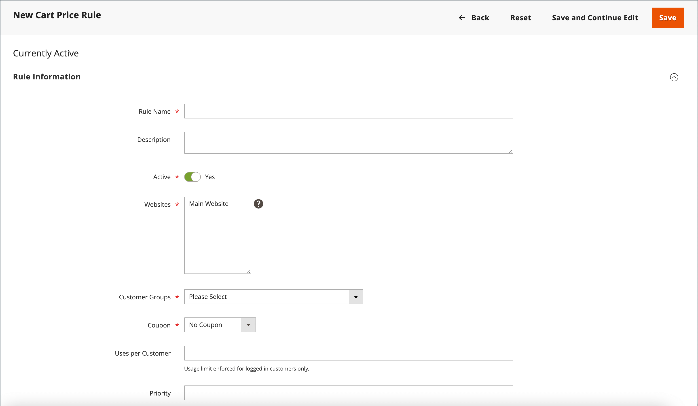{width="600" zoomable="yes"}

1. ルールの[&#x200B; スコープ &#x200B;](../getting-started/websites-stores-views.md#scope-settings)を確立するには、次の操作を行います。

   - プロモーションを利用できる&#x200B;**[!UICONTROL Websites]**&#x200B;を選択します。

   - プロモーションが適用される&#x200B;**[!UICONTROL Customer Groups]**&#x200B;を選択します。

     登録済みの顧客のみがプロモーションを利用できるようにしたい場合は、**_は_**&#x200B;を選択せず、`NOT LOGGED IN` オプションを選択します。

1. [&#x200B; クーポン &#x200B;](price-rules-cart-coupon.md)の有無に関わらず、ルールを次のように適用するように設定します。

   - クーポンコードを使用せずにカートルールを適用するには、**[!UICONTROL Coupon]**&#x200B;を`No Coupon`に設定し、手順5にスキップします。

   - クーポンを価格ルールに関連付けるには、**[!UICONTROL Coupon]**&#x200B;を`Specific Coupon`に設定し、次の操作を行います。

      - お客様が割引を受け取るために入力する必要があるフリーテキスト **[!UICONTROL Coupon Code]**&#x200B;を入力します。

      - クーポンを使用できる回数の制限を設定するには、次のオプションを実行します。

     | オプション | 説明 |
     |------|-----------|
     | `Uses per Coupon` | クーポンコードを使用できる回数を決定します。 制限がない場合は、フィールドを空白のままにします。 |
     | `Uses per Customer` | 選択した顧客グループのいずれかに属する同じ登録顧客が、カート価格ルールを使用できる回数を決定します。 この設定は、ログインしていない顧客グループのメンバーであるゲストショッパーや、アカウントにログインせずに買い物をする顧客には適用されません。 制限がない場合は、フィールドを空白のままにします。 |

     {style="table-layout:auto"}

     詳しくは、[&#x200B; クーポンコード &#x200B;](price-rules-cart-coupon.md)を参照してください。

     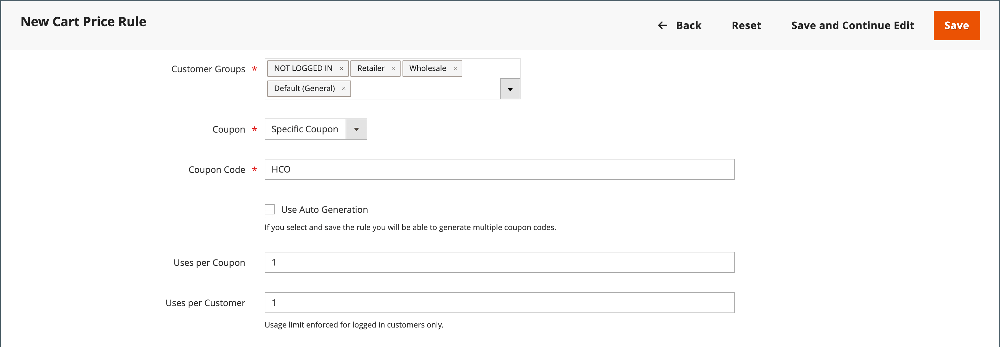{width="600" zoomable="yes"}

   -  （Magento Open Sourceのみ） _カレンダー_ （）を使用して、プロモーションの日付範囲&#x200B;**[!UICONTROL From]**&#x200B;と&#x200B;**[!UICONTROL To]**&#x200B;を選択します。

1. 同時にアクティブになっている他の価格ルールのアクション設定に関連して、この価格ルールの&#x200B;**[!UICONTROL Priority]**&#x200B;を定義する数値を入力します。

   同じ商品に複数のカートルールまたはクーポンが適用される場合は、優先度が最も高い（最小数）ルールが最初に適用されます。 同じ優先度のルールは組み合わせられません。ルール IDに基づいて個別に適用されます。 割引が適用される順序を制御するには、固有の優先順位を割り当て、「[後続の価格ルールを破棄](#step-3-define-the-actions)」をアクションステップで使用して、割引の積み重ねを防ぐことを検討します。

1. ルールを公開した[RSS フィード &#x200B;](social-rss.md#rss-feeds)に適用するには、**RSS フィードで公開**&#x200B;を`Yes`に設定します。

1. **[!UICONTROL Save and Continue Edit]**&#x200B;をクリックします。

   -  （Magento Open Sourceのみ）ルールを保存すると、カート価格ルールの名前がページの上部に表示されます。

   -  （Adobe Commerceのみ）ルールを保存すると、カート価格ルールの名前と[変更予定](price-rule-cart-scheduled-changes.md) ボックスがページの上部に表示されます。

     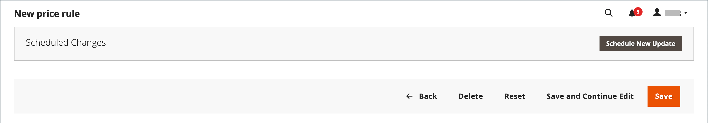{width="600" zoomable="yes"}

## ステップ 2：条件の記述

>[!NOTE]
>
>Real-Time CDPのオーディエンスを使用している場合は、[このセクション &#x200B;](#use-real-time-cdp-audiences-to-set-a-condition)にスキップしてください。

このステップでは、プロモーションの対象となる注文に対して満たす必要がある条件について説明します。 条件は、以下の方法でカート価格ルールに影響します。

- 買い物かご内の&#x200B;**_各_**&#x200B;商品に対して、_[!UICONTROL Conditions]_&#x200B;タブの条件が満たされるたびに、カート価格ルールが適用されます。 カート価格ルールの影響を受ける商品数を制限するには、_[!UICONTROL Actions]_ タブに条件を追加して、カート価格ルールの影響を受ける商品数を制限します。

- 少なくとも1つの条件付き製品属性に空の値がある場合、買い物かご価格ルールは製品に適用されません。

1. 左側のパネルで、**[!UICONTROL Conditions]**&#x200B;を選択します。

   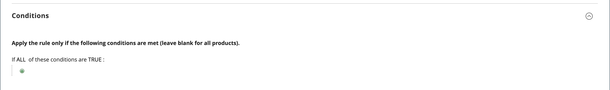{width="600" zoomable="yes"}

   最初の条件はデフォルトで表示され、次のように表示されます。

   `If **ALL** of these conditions are **TRUE**:`

   ステートメントには2つの太字のリンクがあり、クリックすると、ステートメントのその部分のオプションの選択範囲を表示できます。 これらの値の組み合わせを変更することで、異なる条件を作成できます。 次のいずれかの操作を行います。

   - **[!UICONTROL ALL]**&#x200B;をクリックし、`ALL`または`ANY`を選択します。
   - **[!UICONTROL TRUE]**&#x200B;をクリックし、`TRUE`または`FALSE`を選択します。
   - すべての製品にルールを適用するには、条件を変更しないでください。

1. 次の行の先頭にある&#x200B;_追加_ （）をクリックし、カート属性、製品のサブセレクション、組み合わせなどの条件のオプションを選択します。

   この例では、条件の次の部分を次のように完了します。

   - **[!UICONTROL Choose the condition to add]**&#x200B;への入力を求められたら、`Products Subselection`を選択します。

     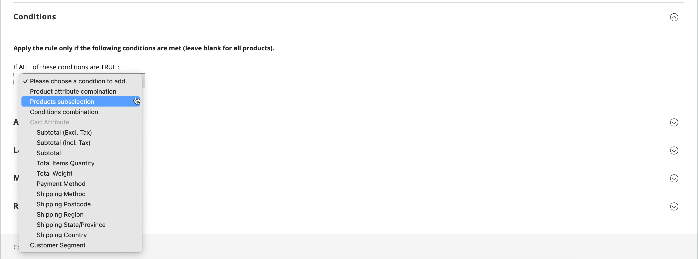{width="600" zoomable="yes"}

   - 条件ステートメントで、**[!UICONTROL total quantity]**&#x200B;をクリックし、`total quantity`または`total amount`を選択します。

   >[!IMPORTANT]
   >
   >[!UICONTROL Total amount]は行合計であるため、[!UICONTROL Products Subselection] カート価格ルール条件の`total amount`には税金が含まれていません。 税金を含めるには、[!UICONTROL Subtotal (Incl. Tax)]条件を使用します。

   - 条件ステートメントで、**[!UICONTROL is]**&#x200B;をクリックし、`greater than`を選択します。

1. 条件の次の部分が表示されたら、ステートメントの要素をクリックして、変数値を持つ各リンクの位置を確認できます。

1. 「詳細」をクリックします（。..） リンクして、`100`と入力します。

   この条件では、買い物かごの合計数量が`101`以上である必要があります。

   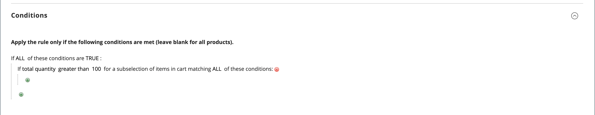{width="600" zoomable="yes"}

1. 次の行の先頭にある&#x200B;**追加** （）をクリックし、**カテゴリ**&#x200B;に基づく条件を追加します。

   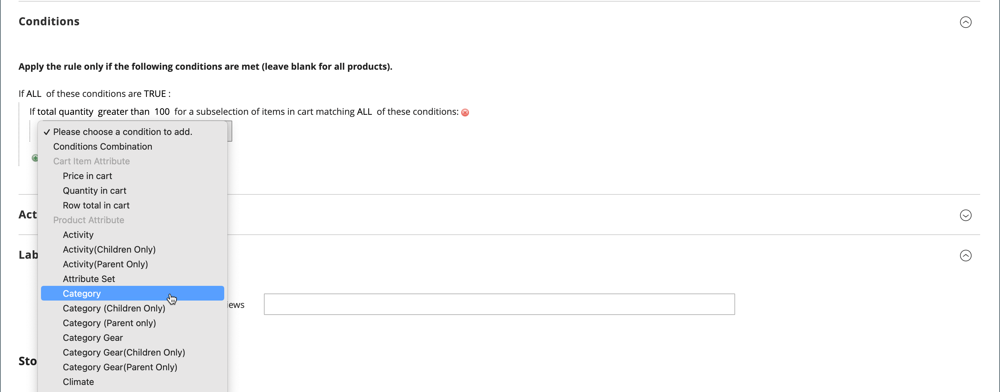{width="600" zoomable="yes"}

1. 条件の次の部分で、_more_ （**...**）をクリックします 入力フィールドを表示するリンクをクリックし、_Chooser_ （）を開いて、カテゴリーツリーを表示します。

1. 価格ルールの条件として使用するカテゴリのチェックボックスを選択し、 アイコンをクリックして、カテゴリの選択を受け入れます。

   条件は、ストアの[&#x200B; ルートカテゴリ &#x200B;](../catalog/category-root.md)の子である任意のカテゴリに基づいて指定できます。

   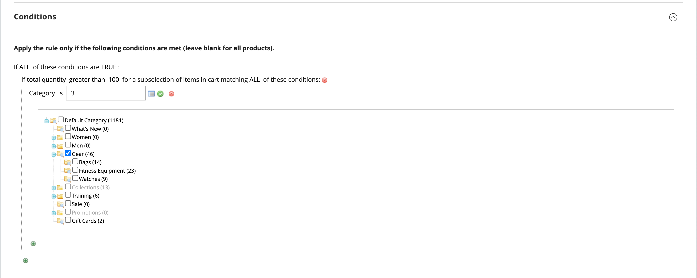{width="600" zoomable="yes"}

1. さらに条件を追加するには、_Add_ （）をクリックし、別の条件を定義します。

   このプロセスを必要に応じて何度でも繰り返して、価格ルールで満たす必要がある条件を記述できます。 例をいくつか紹介します。

   **例1:**&#x200B;地域の価格ルール

   地域別価格ルールを作成するには、次のいずれかのカート属性を使用します。

   - `Shipping Postcode`
   - `Shipping Region`
   - `Shipping State/Province`
   - `Shipping Country`

   **例2:**&#x200B;買い物かご合計

   買い物かごの合計に基づいて条件を設定するには、次のいずれかの買い物かごの属性を使用します。

   - `Subtotal`
   - `Total Items Quantity`
   - `Total Weight`

>[!NOTE]
>
>複数の並行プロモーションの場合、_小計_&#x200B;条件は、割引が適用される&#x200B;_&#x200B;**前の&#x200B;_ベース_のショッピングカート小計**&#x200B;_&#x200B;に適用されます。

>[!IMPORTANT]
>
>**発注書のみ**: カートの価格ルールが1つ以上の特定の支払い方法に基づいて設定されている場合、発注書の作成時に合計に割引が適用されます。 発注が作成された後、支払い方法がカート価格ルールの対象外の方法に変更された場合、割引は合計に適用されたままになります。

### 買い物かごの価格ルールへの商品属性の追加

1. **[!UICONTROL Stores]** > _[!UICONTROL Attributes]_>**[!UICONTROL Product]**&#x200B;に移動し、製品属性を開きます。

1. 左側のパネルで、**[!UICONTROL Storefront Properties]**&#x200B;を選択します。

1. **[!UICONTROL Use for Promo Rule Conditions]**&#x200B;を`Yes`に設定します。

1. **[!UICONTROL Save Attribute]**&#x200B;をクリックします。

1. **[!UICONTROL Marketing]** > **[!UICONTROL Cart Price Rules]**&#x200B;に移動し、必要なカート価格ルールを開きます。

1. **[!UICONTROL Condition]** セクションのを展開し、**[!UICONTROL Product attribute combination]**&#x200B;を選択します。

1. この条件を次のいずれかの値に設定します。

   - **[!UICONTROL FOUND]**&#x200B;をクリックし、`FOUND`または`NOT FOUND`を選択します。

   - **[!UICONTROL ALL]**&#x200B;をクリックし、`ALL`または`ANY`を選択します。

1. _追加_ （）アイコンをクリックし、プロモーションルール条件に設定した&#x200B;**[!UICONTROL Product Attribute]**&#x200B;を選択します。

1. **[!UICONTROL Save]**&#x200B;をクリックします。

>[!NOTE]
>
>`is not one of`条件を&#x200B;_SKU_&#x200B;製品属性と設定可能な製品で使用する場合、親製品と子製品の両方のSKUを選択する必要があります。 ルール内のすべての子SKUをリストしないようにするには、設定可能な製品とその子製品の共通SKU部分で`does not contain`条件を使用できます。

### Real-Time CDPオーディエンスを使用した条件の設定

Real-Time CDP [&#x200B; オーディエンス &#x200B;](../customers/audience-activation.md)に基づいて、カート価格ルールの条件を設定できます。

1. **[!UICONTROL Conditions]**&#x200B;を展開し、「+」アイコンをクリックして、リストから「**[!UICONTROL Real-Time CDP Audience]**」を選択します。

   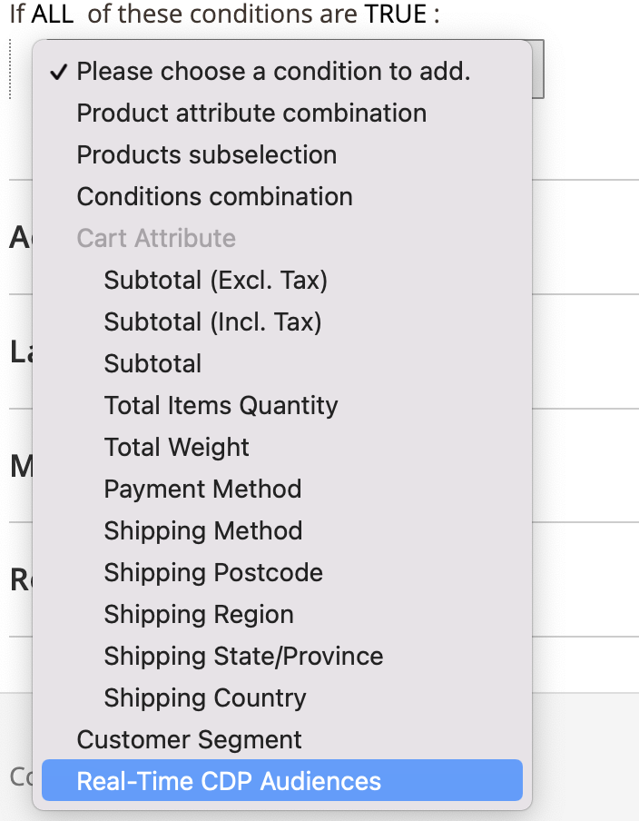{width="300"}

1. _詳細_ （**...**）を選択します アイコンをクリックし、**[!UICONTROL Open Chooser]**&#x200B;をクリックして、利用可能なすべてのReal-Time CDP オーディエンスを表示します。

   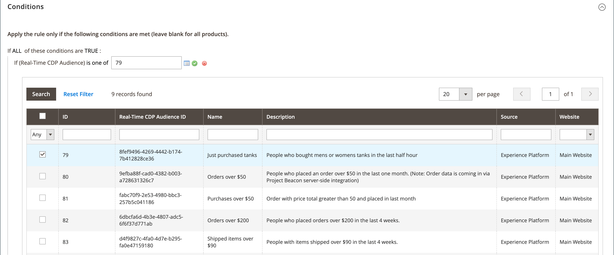{width="600" zoomable="yes"}

1. 買い物かごの価格ルールに使用するReal-Time CDP オーディエンスを選択します。

   | オプション | 説明 |
   |------|-----------|
   | `ID` | 管理者内で使用されるオーディエンスの内部識別子 |
   | `Real-Time CDP Audience ID` | Experience Platformで作成されたオーディエンスの一意のID |
   | `Name` | オーディエンスの名前（`Orders over $50`など） |
   | `Description` | オーディエンスの説明（`People who placed an order over $50 in the last month.`など）。 |
   | `Source` | オーディエンスがどこから来たのかを示します（`Experience Platform`）。 |
   | `Website` | オーディエンスを含むデータストリームにリンクしているweb サイトを示します。 このリンクは、[[!DNL Data Connection]](https://experienceleague.adobe.com/docs/commerce/data-connection/fundamentals/connect-data.html?lang=ja)拡張機能を使用してCommerce インスタンスをExperience Platformに接続するときに作成します。 |

   {style="table-layout:auto"}

次のステップでは、条件が満たされたときに発生するアクションを定義します。

## 手順3：アクションの定義

買い物かごの価格ルールアクションは、条件が満たされたときに価格がどのように更新されるかを説明します。

1. **[!UICONTROL Actions]**&#x200B;まで下にスクロールし、セクションのを展開します。

   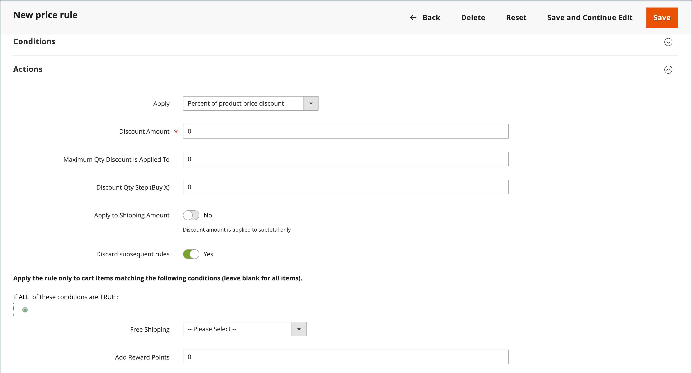{width="600" zoomable="yes"}

1. **[!UICONTROL Apply]**&#x200B;を次のいずれかの割引オプションに設定します：

   | オプション | 説明 |
   |------|-----------|
   | `Percent of product price discount` | 元の価格から割合を引いて商品を割引します。 割引は、カート内の各対象商品に適用されます。 例：[!UICONTROL Discount Amount]に`10`と入力すると、元の価格より10%少ない価格で更新されます。 |
   | `Fixed amount discount` | カート内の対象となる各商品の元の価格から固定額を引いて、商品を割引します。 例：[!UICONTROL Discount Amount]に`10`と入力すると、元の価格より$10少ない価格で更新されます。 |
   | カート全体の固定金額割引 | カートの合計から固定額を差し引くことで、カート全体を割引します。 例：[!UICONTROL Discount Amount]に10と入力して、買い物かごの合計から$10を差し引きます。 デフォルトでは、割引はカートの小計にのみ適用されます。 小計と配送を個別に割引を適用するには、_[!UICONTROL Apply to Shipping Amount]_&#x200B;オプションを使用します。 |
   | `Buy X get Y free` | 顧客が同じ製品/バリエーション **の数量Y**&#x200B;を無料で受け取るために購入する必要がある数量Xを定義します。 （[!UICONTROL Discount Amount]はYです） ディスカウントを適用するには、同じ商品のX+Yの合計数量がカートに存在するか、カートに追加されている必要があります。 |

   {style="table-layout:auto"}

   - 異なる通貨を持つweb サイト全体で固定額の割引を一貫して適用するには、**[!UICONTROL Catalog Price Scope]** オプションを`Website`に設定し、各サイトの基本通貨を定義します。

   - 記号なしで&#x200B;**[!UICONTROL Discount Amount]**&#x200B;を数値として入力します。 例えば、選択した割引オプションに応じて、10という数字は、パーセント、固定金額、または品目の数量を示します。

   - _購入X get Y Free_&#x200B;の割引の場合、お客様が購入する必要がある単一の製品/SKU/ライン項目の&#x200B;**[!UICONTROL Discount Qty Step (Buy X)]** フィールドに数量を入力して、Y数量の割引を受け取ります。 XとYの両方が同じSKUの数量を指しており、特定の数量（設定可能な製品のバリエーションは個別にカウントされます）の商品を手動でカートに追加する必要があります。

   - 「**[!UICONTROL Maximum Qty Discount is Applied To]**」フィールドに、同じ購入時に割引の対象となる同じ製品の最大数量を入力します。

   - **[!UICONTROL Apply to Shipping Amount]** （）を次のように設定します。

     | オプション | 説明 |
     |------|-----------|
     | `Yes` | 割引額を小計と送料に個別に適用します。 |
     | `No` | 割引額は小計にのみ適用されます。 |

     {style="table-layout:auto"}

   - このルールが適用された後に他のルールの処理を停止するには、**[!UICONTROL Discard Subsequent Rules]** （）を`Yes`に設定します。 この設定は、同じ製品に複数の割引が適用されないようにします。

     | オプション | 説明 |
     |------|-----------|
     | `Yes` | 製品に適用されるその他の価格設定ルールが適用されないようにします。 同じ製品に複数の価格ルールが適用される場合、対象となる製品に対して最も高い優先度が定義された価格ルール （ルール [!UICONTROL Priority] フィールド）のみが適用されます。 これにより、複数の価格ルールが積み重ねられ、意図しない追加割引が提供されるのを防ぎます。 |
     | `No` | 複数の価格設定ルールを同じ製品に適用できます。 これにより、上場価格に適用された複数の割引を積み重ねて提供する可能性があります。 |

     {style="table-layout:auto"}

     >[!IMPORTANT]
     >
     >後続のルールを破棄するには、価格ルールで各ルールの「優先度」フィールドに設定されている定義された優先度を使用する必要があります。複数のルールで同じ優先度を定義することはできません。 「_新しいルールを追加_」ステップの「**[!UICONTROL Priority]**」を参照してください。

1. カート価格ルールの影響を受けるショッピングカート内の&#x200B;**_exact_**&#x200B;商品を定義するには、アクションに必要な&#x200B;**_追加_**&#x200B;条件を追加します。

   条件を満たす注文に送料無料が適用されているかどうかを判断するには、**[!UICONTROL Free Shipping]**&#x200B;を次のいずれかに設定します。

   | オプション | 説明 |
   |------|-----------|
   | `No` | 送料無料は利用できません。 |
   | `For matching items only` | 送料無料は、ルールの条件に一致する商品でのみ利用できます。 |
   | `For shipment with matching items` | 送料無料は、一致するアイテムを含む任意の配送で利用できます。 このオプションを使用するには、[送料無料](../stores-purchase/shipping-free.md)の配達方法を有効にする必要があります。 |

   {style="table-layout:auto"}

1.  （Adobe Commerceのみ） **[!UICONTROL Add Rewards Points]**&#x200B;の場合、買い物かごの価格ルールが適用されるたびに、お客様が注文ごとに&#x200B;**_回_**&#x200B;獲得するポイント数を固定で入力します。

   報酬ポイントが有効になっていない場合は、このフィールドを空白のままにします。

1. 完了したら、**[!UICONTROL Save and Continue Edit]**&#x200B;をクリックします。

## ステップ 4：ラベルを完成させる

割引を識別するために、注文の合計セクションにラベルが表示されます。 ラベルテキストは、単語`Discount`の後の括弧で囲まれます。 すべてのストアビューにデフォルトのラベルを入力するか、各ビューに異なるラベルを入力できます。

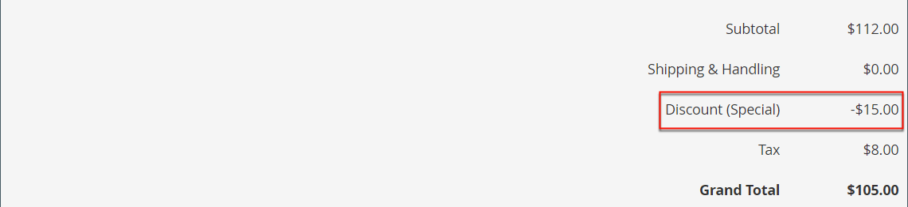{width="600"}

1. **[!UICONTROL Labels]**&#x200B;までスクロールし、 セクションを展開します。

1. **[!UICONTROL Default Rule Label for All Store Views]**&#x200B;として使用するテキストを入力します。

   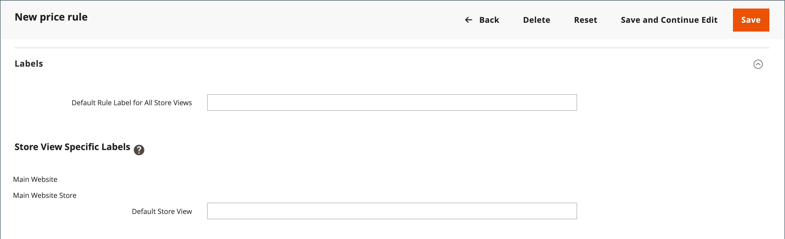{width="600" zoomable="yes"}

1. ストアに複数のビューがある場合、または複数のビューを持つ複数のweb サイトがある場合は、それぞれに適切なラベルテキストを入力します。

   例えば、各ストアビューの言語が異なる場合は、各ビューのラベルの翻訳を入力します。

   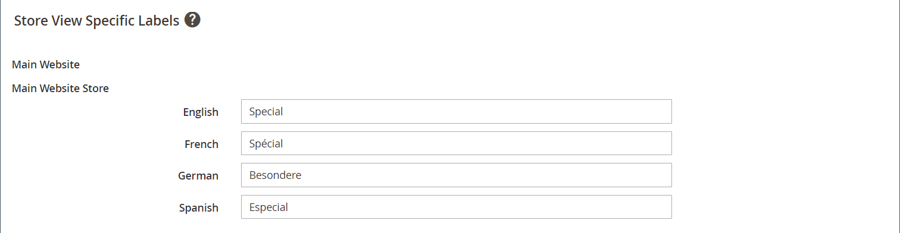{width="600" zoomable="yes"}

## 手順5：関連する動的ブロックの追加（オプション）

{{ee-feature}}

条件が満たされるたびに、ルールに関連付けられている[動的ブロック &#x200B;](../content-design/dynamic-blocks.md)がストアフロントに表示されます。

1. **[!UICONTROL Related Dynamic Blocks]** セクションのを展開します。

1. [検索フィルター](../getting-started/admin-workspace.md)を使用して、ルールに関連付けるブロックを見つけます。

1. 最初の列のチェックボックスを選択して、ブロックをルールに関連付けます。

   詳しくは、価格規則[&#128279;](../content-design/dynamic-blocks-price-rules.md)の動的ブロックを参照してください。

## 手順6：ルールの保存とテスト

1. 完了したら、**[!UICONTROL Save Rule]**&#x200B;をクリックします。

1. ルールをテストして、正しく動作することを確認します。

   価格ルールは、毎晩他のシステムルールで自動的に処理されます。 プライスルールを作成するときは、システムに入れるための十分な時間を確保しましょう。 また、ルールをテストして、正しく動作することを確認します。 新しいルールが追加されると、Commerceでは、それに応じて価格と優先順位が再計算されます。

## カート価格ルールのデモ

この動画では、カートの価格ルールの作成について説明しています。

>[!VIDEO](https://video.tv.adobe.com/v/343835?quality=12&learn=on)

## フィールドの説明

### [!UICONTROL Rule Information]

| フィールド | 説明 |
|--- |--- |
| [!UICONTROL Rule Name] | （必須）ルールの名前は内部参照用です。 |
| [!UICONTROL Description] | ルールの説明には、ルールの目的を含め、その使用方法を説明する必要があります。 |
| [!UICONTROL Active] | （必須）ルールがストアでアクティブかどうかを指定します。 オプション：`Yes` / `No` |
| [!UICONTROL Websites] | （必須）ルールを使用できるWeb サイトを識別します。 |
| [!UICONTROL Customer Groups] | （必須）ルールが適用される顧客グループを識別します。 |
| [!UICONTROL Coupon] | （必須）クーポンがルールに関連付けられているかどうかを示します。 オプション： **[!UICONTROL No Coupon]**- ルールに関連付けられているクーポンはありません。 **[!UICONTROL Specific Coupon]** – 特定のクーポンがルールに関連付けられています。 **[!UICONTROL Coupon Code]**- プロンプトが表示されたら、お客様がプロモーションを利用するために入力する必要があるクーポンコードを入力します。 **[!UICONTROL Use Auto Generation]** - チェックボックスを選択して、プロモーションで使用できる複数のクーポンコードを自動的に生成します。 **[!UICONTROL Auto]**– 生成するクーポンコードの形式を定義する&#x200B;_[!UICONTROL Manage Coupon Codes]_&#x200B;セクションを表示します。 |
| [!UICONTROL Uses per Coupon] | クーポンコードを使用できる回数を決定します。 制限がない場合は、フィールドを空白のままにします。 |
| [!UICONTROL Uses per Customer] | 選択した顧客グループに属する同じ登録顧客がカート価格ルールを使用できる回数を指定します。 ログインしていない顧客グループのメンバーであるゲストショッパー、またはアカウントにログインせずに買い物をする顧客には適用されません。 制限がないので、空白のままにします。 |
| [!UICONTROL Priority] | このルールの他のルールに対する優先度を示す数値。 最上位から最下位までの優先度は`0,1,2,3...`です |
| [!UICONTROL Public in RSS Feed] | プロモーションがストアのパブリック RSS フィードに含まれているかどうかを判断します。 オプション：`Yes` / `No` |
| [!UICONTROL From] |  （Magento Open Sourceのみ） クーポンを使用できる最初の日付。 |
| [!UICONTROL To] |  （Magento Open Sourceのみ）クーポンを使用できる最後の日付。 |

{style="table-layout:auto"}

### [!UICONTROL Conditions]

カート価格ルールを実行する前に満たす必要がある条件を指定します。 空白のままにすると、このルールはカート内のすべての商品に適用されます。 条件は、カートと商品の属性を任意に組み合わせることで設定できます。 ただし、[&#x200B; カスタマイズ可能なオプション &#x200B;](../catalog/settings-advanced-custom-options.md)は、カート価格ルール条件では参照できません。

| フィールド | 説明 |
|--- |--- |
| [!UICONTROL **買い物かご品目属性**] |  |
| [!UICONTROL Price in cart] | 商品の価格。 このルールは、買い物かごの状態の商品価格が満たされた場合に適用されます。 |
| [!UICONTROL Quantity in cart] | 商品の数量： このルールは、買い物かごの状態の製品数量が満たされた場合に適用されます。 |
| [!UICONTROL Row total in cart] | 製品行の合計。 このルールは、買い物かご条件の商品行の合計が満たされている場合に適用されます。 |
| [!UICONTROL **製品属性**] |  |
| [!UICONTROL Attribute Set] | 製品属性セット： このルールは、製品が製品属性条件を満たす場合に適用されます。 |
| [!UICONTROL Category/Other attribute] | 製品カテゴリ/その他の属性。 このルールは、製品自体または子のいずれかがカテゴリ/その他の属性条件を満たす場合に適用されます。 属性には[!UICONTROL Use for Promo Rule Conditions]を`Yes`に設定する必要があります。 |
| [!UICONTROL Category/Other attribute (Children Only)] | 子製品カテゴリ/その他の属性。 このルールは、製品の子のみがカテゴリ/その他の属性条件を満たす場合にのみ適用されます（製品自体はここではチェックされません）。 属性には[!UICONTROL Use for Promo Rule Conditions]から`Yes`までが必要です。 |
| [!UICONTROL Category/Other attribute (Parent Only)] | 親製品カテゴリ/他の属性。 このルールは、製品自体がカテゴリ/その他の属性条件を満たす場合にのみ適用されます（ここでは子の製品はチェックされません）。 属性には[!UICONTROL Use for Promo Rule Conditions]を`Yes`に設定する必要があります。 |
| [!UICONTROL **カート属性**] |  |
| [!UICONTROL Subtotal (Excl. Tax)] | カートの小計（税抜き）。 このルールは、ショッピングカートが小計（税抜き）条件を満たしている場合に適用されます。 |
| [!UICONTROL Subtotal (Incl. Tax)] | カートの小計（税込み）。 このルールは、ショッピングカートが小計（税込）条件を満たしている場合に適用されます。 |
| [!UICONTROL Subtotal] | 買い物かごの小計： このルールは、ショッピングカートが小計の条件を満たしている場合に適用されます。 現在の税金設定に従って、税金を含めるか除外するかをチェックします。 |
| [!UICONTROL Total Items Quantity] | ショッピングカート内のすべての商品の合計数量。 このルールは、ショッピングカートが合計商品数量の条件を満たしている場合に適用されます。 |
| [!UICONTROL Total Weight] | ショッピングカート内の全商品の総重量。 このルールは、ショッピングカートが総重量条件を満たしている場合に適用されます。 |
| [!UICONTROL Payment Method] | チェックアウト時にお支払い方法を選択しました。 支払い方法の条件が満たされている場合、ルールが適用されます。 |
| [!UICONTROL Shipping Method] | チェックアウト時に配送方法を選択しました。 このルールは、出荷方法の条件が満たされた場合に適用されます。 |
| [!UICONTROL Shipping Postcode] | 輸送先住所の郵便番号。 このルールは、配送先住所が郵便番号の条件を満たしている場合に適用されます。 |
| [!UICONTROL Shipping Region] | 配送先住所の地域： このルールは、配送先住所が地域の条件を満たしている場合に適用されます。 |
| [!UICONTROL Shipping State/Province] | 配送先住所の都道府県。 このルールは、配送先住所が州/都道府県の条件を満たしている場合に適用されます。 |
| [!UICONTROL Shipping Country] | 配送先国： このルールは、配送先住所が国の条件を満たしている場合に適用されます。 |
| [!UICONTROL Customer Segment] | このルールは、登録済みまたはゲストのお客様が顧客セグメントの条件を満たしている場合に適用されます。 |

### [!UICONTROL Actions]

| フィールド | 説明 |
|--- |--- |
| [!UICONTROL Apply] | 購入に適用される計算のタイプを指定します。 オプション： **[!UICONTROL Percent of product price discount]**– 元の価格から割合を引いてアイテムを割引します。 例：_[!UICONTROL Discount Amount]_&#x200B;に`10`と入力すると、元の価格より10%少ない価格で更新されます。 **[!UICONTROL Fixed amount discount]**- カート内の対象となる各商品の元の価格から固定額を引いて商品を割引します。 例：_[!UICONTROL Discount Amount]_&#x200B;に`10`と入力すると、元の価格より$10少ない価格で更新されます。 **[!UICONTROL Fixed amount discount for whole cart]**- カートの小計から固定額を引いて、カート全体を割引します。 例：_[!UICONTROL Discount Amount]_&#x200B;に`10`と入力して、買い物かごの小計から$10を差し引きます。 デフォルトでは、割引はカートの小計にのみ適用されます。 小計と配送を別々に適用するには、_配送金額に適用&#x200B;_を参照してください。 **[!UICONTROL Buy X Get Y Free (discount amount is Y)]**– お客様が無料で数量を受け取るために購入する必要がある数量を定義します。 （_[!UICONTROL Discount Amount]_&#x200B;はYです） |
| [!UICONTROL Discount Amount] | （必須）提供される割引の金額。 |
| [!UICONTROL Maximum Qty Discount is Applied To] | 同じ購入時に割引を適用できる商品の最大数を設定します。 |
| [!UICONTROL Discount Qty Step (Buy X)] | `Buy X Get Y Free` プロモーションで`X`が表す製品数を設定します。 また、`Fixed amount discount`および`Percent of product price discount`件のプロモーションを適用するために、カートに追加する必要のある商品数を一括で定義します。 |
| [!UICONTROL Apply to Shipping Amount] | 小計と配送金額に対して割引を個別に適用するかどうかを指定します。 それ以外の場合は、小計にのみ適用されます。 オプション：`Yes` / `No` |
| [!UICONTROL Discard Subsequent Rules] | このカート価格ルールが一致する場合に、優先度の低いルール（1が最も高い優先度）を製品に適用できるかどうかを決定します。 このオプションを有効にすると、同じ商品に複数の割引が適用されないようにします。 オプション：`Yes` / `No` |
| [!UICONTROL Free Shipping] | プロモーションに送料無料が含まれているかどうか、含まれている場合は、どの商品に含まれているかを判断します。 オプション： **[!UICONTROL No]**– 現在のルールでは送料無料は利用できません。 **[!UICONTROL For matching items only]** – 送料無料は、ルールに一致するカート内の特定のアイテムでのみ利用できます。 **[!UICONTROL For shipment with matching items]**- カート内のすべての商品で送料無料が利用可能です。 このオプションを使用するには、[送料無料](../stores-purchase/shipping-free.md)の配達方法を有効にする必要があります。 |
| [!UICONTROL Add Reward Points] |  （Adobe Commerceのみ）価格ルールが適用されるたびに顧客が獲得する[報酬ポイント &#x200B;](rewards-loyalty.md)の数を指定します。 |

{style="table-layout:auto"}

### [!UICONTROL Labels]

| フィールド | 説明 |
|--- |--- |
| [!UICONTROL Default Rule Label for All Store Views] | 割引を識別し、すべてのストアビューに使用できるデフォルトのラベル。 |
| [!UICONTROL Store View Specific Labels] | 該当する場合は、各店舗ビューの割引を識別するために、別のラベルを指定します。 |

{style="table-layout:auto"}

### [!UICONTROL Related Dynamic Blocks]

{{ee-feature}}

ルールに関連付けられている[動的ブロック &#x200B;](../content-design/dynamic-blocks.md)を識別します。
