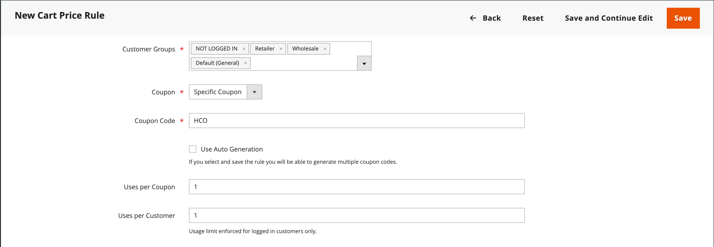

# 買い物かご価格ルールの作成

ルールの追加、条件の説明、アクションの定義を行うには、次の手順を実行します。 また、ラベルを完成させ、ルールをテストします。 価格ルールの条件は、買い物かごや [ 製品属性 ](../catalog/product-attributes.md)、[Real-Time CDP オーディエンス ](#use-real-time-cdp-audiences-to-set-a-condition) に基づくことはできますが、[ カスタマイズ可能なオプション ](../catalog/settings-advanced-custom-options.md) に基づくことはできません。

## 手順 1：ルールを追加

1. _管理者_ サイドバーで、**[!UICONTROL Marketing]**/_[!UICONTROL Promotions]_/**[!UICONTROL Cart Price Rules]**&#x200B;に移動します。

1. 「**[!UICONTROL Add New Rule]**」をクリックして、次の操作を実行します。

   - _[!UICONTROL Rule Information]_&#x200B;の下で、**[!UICONTROL Rule Name]**&#x200B;と&#x200B;**[!UICONTROL Description]**&#x200B;を入力します。

   - ルールをすぐに有効にしない場合は、**[!UICONTROL Active]** を `No` に設定します。

   {width="600" zoomable="yes"}

1. ルールの [ 範囲 ](../getting-started/websites-stores-views.md#scope-settings) を確立するには、次の手順を実行します。

   - プロモーションを使用できる **[!UICONTROL Websites]** を選択します。

   - プロモーションを適用する **[!UICONTROL Customer Groups]** を選択します。

     登録した顧客のみがプロモーションを利用できるようにする場合は、**_使用しない_**、「`NOT LOGGED IN`」オプションを選択します。

1. [ クーポン ](price-rules-cart-coupon.md) の有無に適用するルールを次のように設定します。

   - クーポンコードを使用せずに買い物かごルールを適用するには、**[!UICONTROL Coupon]** を `No Coupon` に設定して、手順 5 にスキップします。

   - クーポンを価格ルールに関連付けるには、**[!UICONTROL Coupon]** を `Specific Coupon` に設定し、次の手順を実行します。

      - 割引を受け取るために顧客が入力する必要があるフリーテキスト **[!UICONTROL Coupon Code]** を入力します。

      - クーポンを使用できる回数の制限を設定するには、次のオプションを入力します。

     | オプション | 説明 |
     |------|-----------|
     | `Uses per Coupon` | クーポンコードを使用できる回数を決定します。 制限がない場合は、フィールドを空白のままにします。 |
     | `Uses per Customer` | 選択されたいずれかの顧客グループに属する同じ登録済み顧客が、買い物かご価格ルールを使用できる回数を決定します。 この設定は、ログインしていない顧客グループのメンバーであるゲスト買い物客や、アカウントにログインせずに買い物をしたお客様には適用されません。 制限がない場合は、フィールドを空白のままにします。 |

     {style="table-layout:auto"}

     詳しくは、[ クーポンコード ](price-rules-cart-coupon.md) を参照してください。

     {width="600" zoomable="yes"}

   -  （Magento Open Sourceのみ） _カレンダー_ （）を使用して、プロモーションの **[!UICONTROL From]** と **[!UICONTROL To]** の日付範囲を選択します。

1. 同時にアクティブな他の価格ルールのアクション設定に関連するこの価格ルールの **[!UICONTROL Priority]** を定義する数値を入力します。

   同じ製品に複数の買い物かごルールまたはクーポンが適用される場合、優先度が最も高い（最も低い数値）ルールが最初に適用されます。 優先度が同じルールは結合されず、ルール ID に基づいて別々に適用されます。 割引が適用される順序を制御するには、一意の優先度を割り当て、「アクション」ステップの [ 後続の価格ルールを破棄 ](#step-3-define-the-actions) の使用を検討して、割引の積み重ねを防ぎます。

1. 公開された [RSS フィード ](social-rss.md#rss-feeds) にルールを適用するには、**RSS フィードで公開** を `Yes` に設定します。

1. 「**[!UICONTROL Save and Continue Edit]**」をクリックします。

   -  （Magento Open Sourceのみ）ルールが保存されると、買い物かごの価格ルールの名前がページの上部に表示されます。

   -  （Adobe Commerceのみ）ルールが保存されると、買い物かごの価格ルールの名前と [ スケジュールされた変更 ](price-rule-cart-scheduled-changes.md) ボックスがページの上部に表示されます。

     {width="600" zoomable="yes"}

## 手順 2：条件の説明

>[!NOTE]
>
>Real-Time CDPのオーディエンスを使用している場合は、[ この節 ](#use-real-time-cdp-audiences-to-set-a-condition) にスキップしてください。

このステップでは、プロモーションの対象となる注文が満たされる必要がある条件を説明します。 条件は、次のような方法で買い物かごの価格ルールに影響を与えます。

- 買い物かごの価格ルールは、買い物かご内の **_各_** 製品に対して、買い物かごの「_[!UICONTROL Conditions]_」タブの一連の条件が満たされた場合に常に適用されます。 買い物かごの価格ルールの影響を受ける製品の数を制限するには、「_[!UICONTROL Actions]_」タブで条件を追加して、買い物かごの価格ルールの影響を受ける製品の数を制限します。

- 少なくとも 1 つの条件付き製品属性の値が空の場合、買い物かごの価格ルールが製品に適用されません。

1. 左側のパネルで「**[!UICONTROL Conditions]**」を選択します。

   {width="600" zoomable="yes"}

   デフォルトでは、最初の条件が表示され、次の状態になります。

   `If **ALL** of these conditions are **TRUE**:`

   ステートメントには 2 つの太字のリンクがあり、クリックすると、ステートメントのその部分のオプションの選択が表示されます。 これらの値の組み合わせを変更することで、様々な条件を作成できます。 次のいずれかの操作をおこないます。

   - 「**[!UICONTROL ALL]**」をクリックし、「`ALL`」または「`ANY`」を選択します。
   - 「**[!UICONTROL TRUE]**」をクリックし、「`TRUE`」または「`FALSE`」を選択します。
   - すべての製品にルールを適用する場合は、条件を変更しません。

1. 次の行の先頭にある「_追加_」（）をクリックし、条件のオプション（買い物かご属性、製品の副選択、組み合わせなど）を選択します。

   この例では、条件の次の部分を次のように完了します。

   - **[!UICONTROL Choose the condition to add]** を要求するプロンプトが表示されたら、`Products Subselection` を選択します。

     {width="600" zoomable="yes"}

   - 条件ステートメントで、「**[!UICONTROL total quantity]**」をクリックし、「`total quantity`」または「`total amount`」を選択します。

   >[!IMPORTANT]
   >
   >[!UICONTROL Total amount] は行の合計なので、[!UICONTROL Products Subselection] 買い物かご価格ルール条件の `total amount` には税金は含まれません。 税金を含めるには、[!UICONTROL Subtotal (Incl. Tax)] の条件を使用します。

   - 条件ステートメントで、**[!UICONTROL is]** をクリックし、`greater than` を選択します。

1. 条件の次の部分が表示されたら、ステートメントの要素をクリックして、変数値を含む各リンクの場所を確認します。

1. 「その他」（...）リンクをクリックし、`100` と入力します。

   この条件では、買い物かごの合計数量を `101` 以上にする必要があります。

   {width="600" zoomable="yes"}

1. 次の行の先頭にある **追加** （）をクリックし、**カテゴリ** に基づく条件を追加します。

   {width="600" zoomable="yes"}

1. 条件の次の部分で、_その他_ （**...**） リンクをクリックして入力フィールドを表示し、_選択_ （）を開いてカテゴリツリーを表示します。

1. 価格ルールの条件として使用するカテゴリのチェックボックスをオンにし、「」アイコンをクリックして、カテゴリの選択を受け入れます。

   条件は、ストアの [ ルートカテゴリ ](../catalog/category-root.md) の子である任意のカテゴリに基づくことができます。

   {width="600" zoomable="yes"}

1. 条件を追加するには、「_追加_ （）をクリックして、別の条件を定義します。

   このプロセスを必要な回数だけ繰り返して、価格ルールで満たす必要がある条件を記述できます。 次に例を示します。

   **例 1:** 地域の価格ルール

   地域価格ルールを作成するには、次の買い物かご属性のいずれかを使用します。

   - `Shipping Postcode`
   - `Shipping Region`
   - `Shipping State/Province`
   - `Shipping Country`

   **例 2：買い物かごの合計**

   買い物かごの合計に基づいて条件を設定するには、次のいずれかの買い物かご属性を使用します。

   - `Subtotal`
   - `Total Items Quantity`
   - `Total Weight`

>[!NOTE]
>
>複数の並列プロモーションの場合、_小計_ 条件が _基本_ 買い物かごの小計 **_前_** の割引に適用されます。

>[!IMPORTANT]
>
>**発注書のみ**:1 つ以上の特定の支払方法に基づいて買い物かごの価格ルールが設定されると、発注書の作成時に合計に割引が適用されます。 発注書が作成された後も、支払い方法が買い物かご価格ルールでカバーされないものに変更された場合は、割引が合計に適用されたままになります。

### 製品属性を買い物かごの価格ルールに追加

1. **[!UICONTROL Stores]**/_[!UICONTROL Attributes]_/**[!UICONTROL Product]**&#x200B;に移動し、製品属性を開きます。

1. 左側のパネルで「**[!UICONTROL Storefront Properties]**」を選択します。

1. **[!UICONTROL Use for Promo Rule Conditions]** を `Yes` に設定します。

1. 「**[!UICONTROL Save Attribute]**」をクリックします。

1. **[!UICONTROL Marketing]**/**[!UICONTROL Cart Price Rules]** に移動し、必要な買い物かご価格ルールを開きます。

1. 「 「**[!UICONTROL Condition]**」セクションを展開し、「**[!UICONTROL Product attribute combination]**」を選択します。

1. この条件を次のいずれかの値に設定します。

   - 「**[!UICONTROL FOUND]**」をクリックし、「`FOUND`」または「`NOT FOUND`」を選択します。

   - 「**[!UICONTROL ALL]**」をクリックし、「`ALL`」または「`ANY`」を選択します。

1. _追加_ （）アイコンをクリックし、プロモーションルールの条件に設定した **[!UICONTROL Product Attribute]** を選択します。

1. 「**[!UICONTROL Save]**」をクリックします。

>[!NOTE]
>
>_SKU_ 製品属性と設定可能な製品で `is not one of` 条件を使用する場合は、親と子の両方の製品 SKU を選択する必要があります。 ルール内のすべての子 SKU がリストされないようにするには、設定可能な製品とその子製品の共通 SKU 部分で `does not contain` の条件を使用できます。

### Real-Time CDP オーディエンスを使用した条件の設定

Real-Time CDP[ オーディエンス ](../customers/audience-activation.md) に基づいて、買い物かごの価格ルールの条件を設定できます。

1. 「**[!UICONTROL Conditions]**」を展開し、「+」アイコンをクリックし、リストから「**[!UICONTROL Real-Time CDP Audience]**」を選択します。

   {width="300"}

1. _詳細_ （**...**）アイコンを選択して「**[!UICONTROL Open Chooser]**」をクリックし、使用可能なすべてのReal-Time CDP オーディエンスを表示します。

   {width="600" zoomable="yes"}

1. 買い物かごの価格ルールに使用するReal-Time CDP オーディエンスを選択します。

   | オプション | 説明 |
   |------|-----------|
   | `ID` | 管理内で使用されるオーディエンスの内部識別子 |
   | `Real-Time CDP Audience ID` | Experience Platformで作成されたときのオーディエンスの一意の ID |
   | `Name` | オーディエンスの名前（`Orders over $50` など） |
   | `Description` | オーディエンスの説明（`People who placed an order over $50 in the last month.` など）。 |
   | `Source` | オーディエンスの元の場所を示します（`Experience Platform` など）。 |
   | `Website` | オーディエンスを含むデータストリームにリンクした web サイトを示します。 このリンクは、[[!DNL Data Connection]](https://experienceleague.adobe.com/docs/commerce/data-connection/fundamentals/connect-data.html) 拡張機能を使用してCommerce インスタンスをExperience Platformに接続する際に作成します。 |

   {style="table-layout:auto"}

次の手順では、条件が満たされた場合に実行するアクションを定義します。

## 手順 3：アクションの定義

買い物かご価格ルールのアクションは、条件が満たされたときに価格がどのように更新されるかを説明します。

1. **[!UICONTROL Actions]** までスクロールし、「」セクションの  を展開します。

   {width="600" zoomable="yes"}

1. **[!UICONTROL Apply]** を次のいずれかの割引オプションに設定します。

   | オプション | 説明 |
   |------|-----------|
   | `Percent of product price discount` | 元の価格からパーセンテージを引いて品目を値引きします。 割引は、買い物かごに含まれる条件を満たす各品目に適用されます。 例：元の価格より 10% 少ない更新価格の場合は、[!UICONTROL Discount Amount] に `10` を入力します。 |
   | `Fixed amount discount` | 買い物かごの中で、条件を満たす各品目の元の価格から固定金額を引いて品目を値引きします。 例：元の価格より 10 ドル安い更新価格の場合は、[!UICONTROL Discount Amount] に `10` を入力します。 |
   | 買い物かご全体に対する固定金額割引 | 買い物かごの合計から固定金額を引いて、買い物かご全体を割引します。 例：買い物かごの合計から$10 を減算するには、[!UICONTROL Discount Amount] に 10 を入力します。 デフォルトでは、割引は買い物かごの小計にのみ適用されます。 小計と送料に個別に割引を適用するには、「_[!UICONTROL Apply to Shipping Amount]_」オプションを使用します。 |
   | `Buy X get Y free` | 顧客が（同じ商品/バリエーションの **数量 Y を無料で受け取るために購入する必要がある数量 X を定義** ます。 （[!UICONTROL Discount Amount] は Y）割引を適用するには、同じ商品の X+Y の合計数量がカートに存在またはカートに追加されている必要があります。 |

   {style="table-layout:auto"}

   - （グローバルの基本通貨から変換せずに）異なる通貨の Web サイト間で一貫して固定金額の割引を適用するには、「**[!UICONTROL Catalog Price Scope]**」オプションを「`Website`」に設定して、各サイトの基本通貨を定義します。

   - **[!UICONTROL Discount Amount]** を記号を付けずに数字で入力します。 例えば、選択した割引オプションに応じて、数値 10 は、割合、固定金額、または品目の数量を示す場合があります。

   - _購入 X に Y 割引_ 割引の場合、Y 数量の割引を受けるために顧客が購入する必要がある単一の製品/SKU/明細品目の **[!UICONTROL Discount Qty Step (Buy X)]** フィールドに数量を入力します。 X と Y は両方とも同じ SKU の数量を指し、品目の特定の数量（設定可能な製品のバリエーションは個別にカウントされます）は買い物かごに手動で追加する必要があります。

   - 「**[!UICONTROL Maximum Qty Discount is Applied To]**」フィールドに、同じ購入で割引の対象となる同じ製品の最大数量を入力します。

   - **[!UICONTROL Apply to Shipping Amount]** （）を次のように設定します。

     | オプション | 説明 |
     |------|-----------|
     | `Yes` | 小計と出荷金額に割引額を個別に適用します。 |
     | `No` | 小計にのみ割引額を適用します。 |

     {style="table-layout:auto"}

   - このルールが適用された後に他のルールの処理を停止するには、**[!UICONTROL Discard Subsequent Rules]** （）を `Yes` に設定します。 この設定により、同じ製品に複数の割引が適用されるのを防ぎます。

     | オプション | 説明 |
     |------|-----------|
     | `Yes` | 製品に適用される可能性のある他の価格ルールが適用されないようにします。 複数の価格設定ルールが同じ製品に適用される場合、（ルール [!UICONTROL Priority] フィールドで）優先度が最も定義されている価格設定ルールのみが該当する製品に適用されます。 これにより、複数の価格ルールが積み重なって、意図しない追加割引が提供されるのを防ぎます。 |
     | `No` | 同じ製品に複数の価格ルールを適用できます。 その結果、リスト価格に適用される複数の割引を積み重ねて提供する可能性があります。 |

     {style="table-layout:auto"}

     >[!IMPORTANT]
     >
     >後続のルールを破棄するには、価格設定ルールでは各ルールの「優先度」フィールドに定義された定義済みの優先度を使用する必要があります。また、複数のルールに同じ優先度が定義されていてはいけません。 _新しいルールの追加_ 手順の **[!UICONTROL Priority]** を参照してください。

1. 買い物かご価格ルールの影響を受ける買い物かご内の **_exact_** 製品を定義するには、アクションに必要な **_追加_** 条件を追加します。

   条件を満たす注文に送料無料が適用されるかどうかを判断するには、**[!UICONTROL Free Shipping]** を次のいずれかに設定します。

   | オプション | 説明 |
   |------|-----------|
   | `No` | 送料無料ではご利用いただけません。 |
   | `For matching items only` | 送料無料は、ルールの条件に一致する項目に対してのみ利用可能です。 |
   | `For shipment with matching items` | 一致するアイテムを含むすべての出荷に対して送料無料が利用できます。 このオプションを使用するには、[ 送料無料 ](../stores-purchase/shipping-free.md) 配信方法を有効にする必要があります。 |

   {style="table-layout:auto"}

1.  （Adobe Commerceのみ） **[!UICONTROL Add Rewards Points]** の場合、買い物かごの価格ルールが適用されるたびに、お客様が注文ごとに獲得する固定数 **_1 回_** を入力します。

   報酬ポイントが有効になっていない場合は、このフィールドを空白のままにします。

1. 完了したら、「**[!UICONTROL Save and Continue Edit]**」をクリックします。

## 手順 4：ラベルを完成させる

ラベルは、注文の合計セクションに表示され、割引を識別します。 ラベル テキストは、`Discount` という単語の後に括弧で囲まれています。 すべてのストアビューにデフォルトのラベルを入力することも、ビューごとに異なるラベルを入力することもできます。

{width="600"}

1. **[!UICONTROL Labels]** までスクロールダウンし、「拡張セレクター  を展開します。

1. **[!UICONTROL Default Rule Label for All Store Views]** として使用するテキストを入力します。

   {width="600" zoomable="yes"}

1. ストアに複数のビューがある場合、または複数のビューを持つ複数の web サイトがある場合は、それぞれに適切なラベルテキストを入力します。

   例えば、各店舗表示が異なる言語の場合は、各表示のラベルの翻訳を入力します。

   {width="600" zoomable="yes"}

## 手順 5：関連するダイナミックブロックの追加（オプション）

{{ee-feature}}

条件が満たされた場合は常に、ルールに関連付けられた [ 動的ブロック ](../content-design/dynamic-blocks.md) がストアフロントに表示されます。

1. 「」を展開し、「**[!UICONTROL Related Dynamic Blocks]**」セクションを展開します。

1. [ 検索フィルター ](../getting-started/admin-workspace.md) を使用して、ルールに関連付けるブロックを見つけます。

1. 最初の列のチェックボックスを選択して、ブロックをルールに関連付けます。

   詳しくは、[ 価格ルールのダイナミックブロック ](../content-design/dynamic-blocks-price-rules.md) を参照してください。

## 手順 6：ルールを保存してテストする

1. 完了したら、「**[!UICONTROL Save Rule]**」をクリックします。

1. ルールをテストして、正しく動作することを確認します。

   価格ルールは他のシステムルールと共に毎晩自動的に処理されます。 価格ルールを作成する場合は、システムに入るのに十分な時間を確保します。 また、ルールをテストして、正しく機能することを確認します。 新しいルールが追加されると、Commerceは価格と優先度をそれに応じて再計算します。

## 買い物かご価格ルールデモ

買い物かご価格ルールの作成については、次のビデオをご覧ください。

>[!VIDEO](https://video.tv.adobe.com/v/343835?quality=12&learn=on)

## フィールドの説明

### [!UICONTROL Rule Information]

| フィールド | 説明 |
|--- |--- |
| [!UICONTROL Rule Name] | （必須） ルールの名前は内部参照用です。 |
| [!UICONTROL Description] | ルールの説明には、ルールの目的を含め、ルールの使用方法を説明する必要があります。 |
| [!UICONTROL Active] | （必須）ルールがストア内でアクティブかどうかを判断します。 オプション：`Yes` / `No` |
| [!UICONTROL Websites] | （必須） ルールを使用できる web サイトを識別します。 |
| [!UICONTROL Customer Groups] | （必須）ルールが適用される顧客グループを識別します。 |
| [!UICONTROL Coupon] | （必須）クーポンがルールに関連付けられているかどうかを示します。 オプション： **[!UICONTROL No Coupon]**- ルールにクーポンが関連付けられていません。 **[!UICONTROL Specific Coupon]** – 特定のクーポンがルールに関連付けられています。  **[!UICONTROL Coupon Code]**- プロンプトが表示されたら、プロモーションを利用するために顧客が入力する必要があるクーポンコードを入力します。 **[!UICONTROL Use Auto Generation]** - プロモーションで使用できる複数のクーポンコードを自動的に生成するには、このチェックボックスを選択します。  **[!UICONTROL Auto]**– 生成するクーポンコードの形式を定義する「_[!UICONTROL Manage Coupon Codes]_」セクションを表示します。 |
| [!UICONTROL Uses per Coupon] | クーポンコードを使用できる回数を決定します。 制限がない場合は、フィールドを空白のままにします。 |
| [!UICONTROL Uses per Customer] | 選択した顧客グループに属する同じ登録済み顧客が、買い物かご価格ルールを使用できる回数を決定します。 ログインしていない顧客グループのメンバーであるゲストの買い物客、またはアカウントにログインせずに買い物をしたお客様には適用されません。 無制限の場合は、空白のままにします。 |
| [!UICONTROL Priority] | このルールの優先度を他のルールと比較して示す数値。 優先順位は高い順に `0,1,2,3...` まります |
| [!UICONTROL Public in RSS Feed] | プロモーションがストアのパブリック RSS フィードに含まれるかどうかを決定します。 オプション：  `Yes` / `No` |
| [!UICONTROL From] |  （Magento Open Sourceのみ）クーポンを使用できる最初の日付。 |
| [!UICONTROL To] |  （Magento Open Sourceのみ） クーポンを使用できる最終日。 |

{style="table-layout:auto"}

### [!UICONTROL Conditions]

買い物かごの価格ルールが実行される前に満たす必要がある条件を指定します。 空白にした場合、ルールは買い物かごに入っているすべての製品に適用されます。 条件は、買い物かごと製品属性の任意の組み合わせに基づくことができます。 ただし、買い物かごの価格ルール条件では [ カスタマイズ可能なオプション ](../catalog/settings-advanced-custom-options.md) を参照できません。

| フィールド | 説明 |
|--- |--- |
| [!UICONTROL **Cart Item Attribute**] |  |
| [!UICONTROL Price in cart] | 製品価格。 このルールは、買い物かごの製品価格の条件が満たされた場合に適用されます。 |
| [!UICONTROL Quantity in cart] | 製品数量。 このルールは、買い物かごの製品数量の条件が満たされた場合に適用されます。 |
| [!UICONTROL Row total in cart] | 製品行の合計。 このルールは、買い物かごの条件の製品行の合計が満たされた場合に適用されます。 |
| [!UICONTROL **製品属性**] |  |
| [!UICONTROL Attribute Set] | 製品属性が設定されました。 製品が製品属性条件を満たす場合、ルールが適用されます。 |
| [!UICONTROL Category/Other attribute] | 製品カテゴリ /その他の属性。 製品自体または子のいずれかがカテゴリ/その他の属性条件を満たす場合に、ルールが適用されます。 属性を `Yes` に設定 [!UICONTROL Use for Promo Rule Conditions] る必要があります。 |
| [!UICONTROL Category/Other attribute (Children Only)] | 子製品カテゴリ /その他の属性。 製品の子のみがカテゴリ/その他の属性条件を満たす場合、ルールは適用されます（製品自体はここではチェックされません）。 属性は [!UICONTROL Use for Promo Rule Conditions] から `Yes` である必要があります。 |
| [!UICONTROL Category/Other attribute (Parent Only)] | 親商品カテゴリ /その他の属性。 製品自体がカテゴリ/その他の属性条件を満たしている場合にのみルールが適用されます（子製品はここではチェックされません）。 属性を `Yes` に設定 [!UICONTROL Use for Promo Rule Conditions] る必要があります。 |
| [!UICONTROL **買い物かご属性**] |  |
| [!UICONTROL Subtotal (Excl. Tax)] | 買い物かごの小計（税抜き）。 買い物かごが小計（税抜き）条件を満たす場合にルールが適用されます。 |
| [!UICONTROL Subtotal (Incl. Tax)] | 買い物かごの小計（税込）。 このルールは、買い物かごが小計（税込）条件を満たす場合に適用されます。 |
| [!UICONTROL Subtotal] | 買い物かごの小計。 買い物かごが小計条件を満たす場合、ルールが適用されます。 現在の税金設定に従って税金を含めるか除外するかをチェックします。 |
| [!UICONTROL Total Items Quantity] | 買い物かごに入っているすべての商品の合計数量。 買い物かごが合計品目数条件を満たす場合、ルールが適用されます。 |
| [!UICONTROL Total Weight] | 買い物かご内のすべての製品の合計重量。 買い物かごが合計重量条件を満たす場合、ルールが適用されます。 |
| [!UICONTROL Payment Method] | チェックアウト時に選択された支払方法。 支払方法の条件が満たされた場合にルールが適用されます。 |
| [!UICONTROL Shipping Method] | チェックアウト時に選択された発送方法。 このルールは、発送方法の条件が満たされた場合に適用されます。 |
| [!UICONTROL Shipping Postcode] | 発送先住所の郵便番号。 ルールは、配送先住所が郵便番号の条件を満たす場合に適用されます。 |
| [!UICONTROL Shipping Region] | 「出荷先所在地」リージョン。 ルールは、配送先住所が地域の条件を満たす場合に適用されます。 |
| [!UICONTROL Shipping State/Province] | 発送先住所（都道府県）。 このルールは、配送先住所が都道府県の条件を満たす場合に適用されます。 |
| [!UICONTROL Shipping Country] | 発送先住所（国）。 ルールは、配送先住所が国の条件を満たす場合に適用されます。 |
| [!UICONTROL Customer Segment] | 登録またはゲストのお客様が顧客セグメントの条件を満たしている場合にルールが適用されます。 |

### [!UICONTROL Actions]

| フィールド | 説明 |
|--- |--- |
| [!UICONTROL Apply] | 購入に適用される計算のタイプを決定します。 オプション： **[!UICONTROL Percent of product price discount]**– 元の価格からパーセンテージを引いて品目を値引きします。 例：元の価格より 10% 少ない更新価格の場合は、_[!UICONTROL Discount Amount]_&#x200B;に `10` を入力します。 **[!UICONTROL Fixed amount discount]**– 買い物かごで適格な各品目の元の価格から固定金額を減算して品目を値引きします。 例：元の価格より 10 ドル安い更新価格の場合は、_[!UICONTROL Discount Amount]_ に `10` を入力します。  **[!UICONTROL Fixed amount discount for whole cart]**– 買い物かごの小計から固定金額を引いて、買い物かご全体を割引します。 例：買い物かごの小計から$10 を減算するには、_[!UICONTROL Discount Amount]_&#x200B;に `10` と入力します。 デフォルトでは、割引は買い物かごの小計にのみ適用されます。 小計と個別の出荷に割引を適用するには、_ 出荷金額に適用 _を参照してください。 **[!UICONTROL Buy X Get Y Free (discount amount is Y)]**– 無料で数量を受け取るために顧客が購入する必要がある数量を定義します。 （_[!UICONTROL Discount Amount]_ は Y）。 |
| [!UICONTROL Discount Amount] | （必須）提供される割引の金額。 |
| [!UICONTROL Maximum Qty Discount is Applied To] | 同じ購入に対して割引を適用できる商品の最大数を設定します。 |
| [!UICONTROL Discount Qty Step (Buy X)] | `Buy X Get Y Free` しいプロモーションで `X` によって表される製品の数を設定します。 また、は、`Fixed amount discount` ールと `Percent of product price discount` のプロモーションを適用するために、一括で買い物かごに追加する必要がある製品の数を定義します。 |
| [!UICONTROL Apply to Shipping Amount] | 小計と出荷金額に割引が個別に適用されるかどうかを決定します。 それ以外の場合は、小計にのみ適用されます。 オプション：`Yes` / `No` |
| [!UICONTROL Discard Subsequent Rules] | この買い物かご価格ルールが一致する場合に、優先度の低いルール （1 が最も優先度が高い）を製品に適用できるかどうかを決定します。 このオプションを有効にすると、同じ製品に複数の割引が適用されなくなります。 オプション：`Yes` / `No` |
| [!UICONTROL Free Shipping] | プロモーションに送料無料が含まれているかどうか、含まれている場合はどのアイテムに使用するかを決定します。 オプション： **[!UICONTROL No]**– 現在のルールでは送料無料は利用できません。 **[!UICONTROL For matching items only]** – 送料無料は、ルールに一致するカート内の特定の項目に対してのみ使用できます。  **[!UICONTROL For shipment with matching items]**- カート内のすべての商品は送料無料です。 このオプションを使用するには、[ 送料無料 ](../stores-purchase/shipping-free.md) 配信方法を有効にする必要があります。 |
| [!UICONTROL Add Reward Points] |  （Adobe Commerceのみ）価格ルールが適用されるたびに、お客様が獲得した [ 報酬ポイント ](rewards-loyalty.md) の数を指定します。 |

{style="table-layout:auto"}

### [!UICONTROL Labels]

| フィールド | 説明 |
|--- |--- |
| [!UICONTROL Default Rule Label for All Store Views] | 割引を識別するデフォルトのラベルで、すべてのストアビューで使用できます。 |
| [!UICONTROL Store View Specific Labels] | 該当する場合、異なるラベルを指定して、各店舗表示の割引を識別します。 |

{style="table-layout:auto"}

### [!UICONTROL Related Dynamic Blocks]

{{ee-feature}}

ルールに関連付けられているすべての [ ダイナミック ブロック ](../content-design/dynamic-blocks.md) を識別します。
