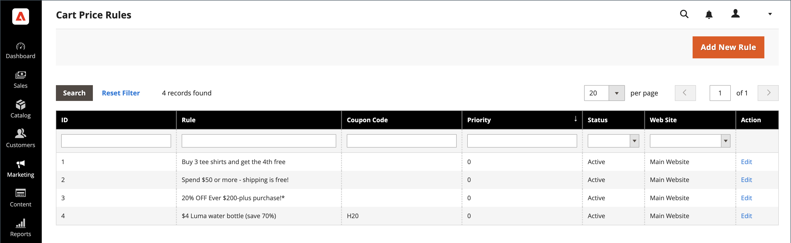

# 買い物かご価格ルール

買い物かご価格ルールは、一連の条件に基づいて、買い物かご内の項目に割引を適用します。 割引は、条件が満たされたとき、または顧客が有効なクーポンコードを入力したときに自動的に適用できます。 適用されると、割引が小計の下の買い物かごに表示されます。 買い物かご価格ルールは、ステータスと日付範囲を変更することで、シーズンやプロモーションで必要に応じて使用できます。

>[!NOTE]
>
>クーポン買い物かごルールに、特定の配送方法や支払い方法など、チェックアウトオプションを指定する条件がある場合、条件は、特定の配送方法または支払い方法が選択された後のチェックアウトでのみ満たされます。 この場合、クーポンは最後の手順のチェックアウト時に適用できます。

{width="600" zoomable="yes"}

## 買い物かご価格ルールへのアクセス

1. 日 _Admin_ サイドバー、に移動 **[!UICONTROL Marketing]** > _[!UICONTROL Promotions]_>**[!UICONTROL Cart Price Rules]**.

   {width="700" zoomable="yes"}

1. ルール数が多い場合は、各列の上部にあるフィルターオプションを使用してリストを整理し、をクリックします **[!UICONTROL Search]** をクリックしてフィルターを適用します。

1. すべてのフィルタ オプションをクリアして完全な一覧を表示するには、 **[!UICONTROL Reset Filter]**.

1. ルールのプロパティを更新します。

   -  （Adobe Commerceのみ）クリック **[!UICONTROL Edit]** をクリックして、ルール情報ページを表示します。

   -  （Magento Open Sourceのみ）リスト内のルールをクリックして、[Rule Information] ページを表示します。

   ここで、（ルールの作成と同様に）ルールの設定を変更できます。

## 列でオプションをフィルター

| 列 | 説明 |
|--- |--- |
| [!UICONTROL ID] | 特定のルール ID 番号のリストをフィルタリングするためのテキストを入力します。 |
| [!UICONTROL Rule] | ルールの作成時に定義したルール名に基づいてリストをフィルタリングするためのテキストを入力します。 |
| [!UICONTROL Coupon Code] | ルールの作成時に定義したコード名に基づいてリストをフィルタリングするためのテキストを入力します。 |
| [!UICONTROL Priority] | ルールに定義されている優先度に基づいてリストをフィルタリングするフリーテキストフィールド。 |
| [!UICONTROL Status] | このオプションを使用して、ルールのステータス（`Active` または `Inactive`）に設定します。 |
| [!UICONTROL Web Site] | このオプションを使用して、ルールに定義された web サイトに基づいてリストをフィルタリングします。 |
| [!UICONTROL Action] |  （Adobe Commerceのみ）クリック **[!UICONTROL Edit]** を表示するには _[!UICONTROL Rule Information]_ルール設定をページして更新します（ルールの作成と同様）。 |
| [!UICONTROL Start] |  （Magento Open Sourceのみ）動的カレンダーフィールドの使用（_[!UICONTROL To:]_および_[!UICONTROL From:]_）を選択し、ルールの作成時に定義したルールの開始日に基づいてリストをフィルタリングします。 |
| [!UICONTROL End] |  （Magento Open Sourceのみ）動的カレンダーフィールドの使用（_[!UICONTROL To:]_および_[!UICONTROL From:]_）を選択し、ルールの作成時に定義したルールの終了日に基づいてリストをフィルタリングします。 |

{style="table-layout:auto"}

## Real-Time CDP オーディエンスを使用した買い物かごの価格ルールの通知

方法を学ぶ [アクティベート](../customers/audience-activation.md) Adobe Commerce インスタンスにオーディエンスをReal-Time CDPし、買い物かごの価格ルールを通知します。
